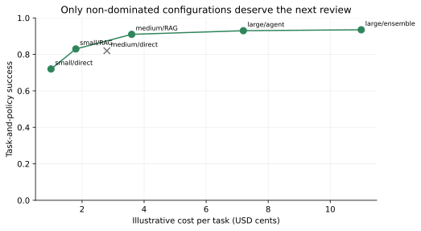

# The Bridge: Math, Decisions, Planning, RL, Control, and Systems {#app-a}

This appendix is a bridge, not a compressed degree program. Each section gives you the vocabulary, one calculation, and the engineering question needed by later chapters. Read it when a chapter points here. Stop when the consuming chapter becomes readable again.

## Contents

- [The bridge contract and consumption map](#app-a-map)
- [Probability and information theory](#app-a-probability)
- [Statistical decision theory](#app-a-decisions)
- [Causal inference for evaluation](#app-a-causal)
- [Constrained and multi-objective optimization](#app-a-optimization)
- [Classical search, planning, and symbolic reasoning](#app-a-planning)
- [Sequential decisions and reinforcement-learning vocabulary](#app-a-sequential)
- [A control-theory lens on agent loops](#app-a-control)
- [Distributed systems: partial failure, idempotency, and backpressure](#app-a-distributed)
- [Threat modeling: assets, boundaries, and attack trees](#app-a-threats)
- [Build: break the worker twice](#app-a-build)
- [What endures, what changes](#app-a-endures)
- [Exercises](#app-a-exercises)
- [Notes and sources](#app-a-sources)

## The bridge contract and consumption map {#app-a-map}

The main book assumes neural-network fundamentals. Agent engineering also borrows ideas from probability, decision theory, causal inference, optimization, planning, reinforcement learning, control, distributed systems, and security. Re-teaching each field inside every chapter would make the spine repetitive; omitting them would turn ordinary terms into hidden prerequisites.

Use this map to find only the bridge you need.

| Bridge section | Consumed by | What stalls if skipped |
|---|---|---|
| probability and information | Chapters 2, 7, 9, 22 | cross-entropy, KL, entropy, calibration |
| decision theory | Chapters 9, 16, 22, 28 | abstention, clarifying questions, asymmetric harm |
| causal inference | Chapters 22, 27 | logged-policy evaluation, canaries, confounding |
| constrained optimization | Chapters 1, 22, 26, 28 | safety constraints, Pareto choices, agency budgets |
| search and symbolic planning | Chapters 8, 16, 21, 31 | A*, MCTS, verifiers, explicit plans |
| sequential decisions / RL | Chapters 16, 23, 28, 31 | MDP, POMDP, belief, regret, exploration |
| control theory | Chapters 16, 17, 26, 27 | feedback, lag, instability, deadbands |
| distributed systems | Chapters 17, 26, 27 | partial failure, idempotency, queues, retries |
| threat modeling | Chapters 17, 24, 26 | assets, trust boundaries, attack paths |

The target depth is “can perform one worked calculation and ask the right design-review question.” The canonical chapter owns deeper application. For example, this appendix defines an MDP; Chapter 23 teaches agent training. It does not derive policy gradients: Chapter 7 owns the Route A derivation, and Chapter 23 carries the Route B primer.

## Probability and information theory {#app-a-probability}

Probability represents uncertainty about events. For event $A$, $P(A)$ lies between zero and one. Conditional probability

$$
P(A\mid B)=\frac{P(A\cap B)}{P(B)}
$$

asks how belief about $A$ changes after observing $B$, assuming $P(B)>0$. Bayes' rule reverses a conditional:

$$
P(A\mid B)=\frac{P(B\mid A)P(A)}{P(B)}.
$$

Suppose 2 percent of requests contain abuse and a detector has 90 percent sensitivity with a 5 percent false-positive rate. For detector positive $+$,

$$
P(\text{abuse}\mid +)
=\frac{0.90(0.02)}{0.90(0.02)+0.05(0.98)}
\approx0.269.
$$

A positive raises risk from 2 percent to about 27 percent, but it is not proof. Base rates matter. This same pattern appears in anomaly detection, guardrails, and alert triage.

For a discrete distribution $p$, **entropy** measures expected surprise:

$$
H(p)=-\sum_x p(x)\log p(x).
$$

Entropy is highest when mass is spread evenly and lower when one outcome dominates. In language-model sampling, the model supplies a next-token distribution; temperature reshapes it, but entropy remains a distribution property, not a factuality score.

**Cross-entropy** scores predictions $q$ under data distribution $p$:

$$
H(p,q)=-\sum_x p(x)\log q(x).
$$

For one observed target token, this becomes negative log probability. Averaging it over training tokens produces the familiar language-model loss from Chapter 2.

**Kullback–Leibler divergence** measures the extra coding cost of using $q$ when data follow $p$:

$$
D_{\mathrm{KL}}(p\lVert q)=\sum_x p(x)\log\frac{p(x)}{q(x)}.
$$

KL is nonnegative, but it is not symmetric and does not satisfy all distance axioms. $D_{\mathrm{KL}}(p\lVert q)$ heavily penalizes assigning tiny $q$ probability where $p$ has mass; reversing arguments changes the behavior. Chapter 7 uses KL as a leash between a post-trained policy and a reference policy.

**Mutual information** measures how much observing one variable reduces uncertainty about another:

$$
I(X;Y)=D_{\mathrm{KL}}(p(x,y)\lVert p(x)p(y)).
$$

It is zero when $X$ and $Y$ are independent. In representation learning it can describe dependence; in a product decision, it does not by itself say whether collecting $Y$ is worth its cost or privacy risk. Decision theory supplies that step.

A probabilistic predictor is **calibrated** when events assigned probability $p$ occur about fraction $p$ over a defined population. Calibration is population- and slice-dependent. A predictor can be calibrated and inaccurate if its probabilities stay near the base rate; it can be accurate and overconfident. Chapters 9 and 22 turn this distinction into abstention and evaluation practice.

## Statistical decision theory {#app-a-decisions}

A probability describes belief; a decision combines belief with consequences. Let state $s$, action $a$, and loss $L(a,s)$. The Bayes action minimizes expected loss:

$$
a^*=\arg\min_a\mathbb{E}_{s\sim P(s\mid x)}[L(a,s)].
$$

This is why one confidence threshold cannot serve every action. A false negative in an urgent medical triage task may cost much more than a false positive escalation. In a low-stakes suggestion, interruption cost may dominate.

Consider an urgent-ticket probability of 0.2. Escalating an ordinary ticket costs 1 unit; failing to escalate an urgent ticket costs 10. Expected loss is

$$
\begin{aligned}
R(\text{escalate}) &= (1-0.2)(1)=0.8,\\
R(\text{do not}) &= 0.2(10)=2.0.
\end{aligned}
$$

Escalation is rational despite the lower urgent probability because loss is asymmetric.

An observation has **value of information** (VOI) when it can change the action and reduce expected loss. In utility form,

$$
\operatorname{VOI}(Y)
=\mathbb{E}_Y\left[\max_a\mathbb{E}[U(a,S)\mid Y]\right]
-\max_a\mathbb{E}[U(a,S)].
$$

The value before observation cost is nonnegative because the decision-maker can ignore $Y$. Collect the observation only when VOI exceeds money, latency, privacy, and user-friction cost.

[`voi_triage.py`](../code/appa/voi_triage.py) evaluates one binary signal with sensitivity and specificity. For prior urgent probability 0.2, sensitivity 0.85, specificity 0.9, false-negative loss 10, and false-positive loss 1, the signal avoids 0.42 expected loss units. Asking or testing is negative-value if its total cost exceeds 0.42.

VOI gives clarifying questions a precise role. An agent should ask when the answer can alter a consequential decision enough to justify interruption. It should not ask because “more context is always good.”

A **proper scoring rule** rewards honest probabilities in expectation. For binary outcome $y\in\{0,1\}$ and predicted probability $p$, the Brier loss is

$$
(p-y)^2,
$$

and log loss is

$$
-\big[y\log p+(1-y)\log(1-p)\big].
$$

Both are strictly proper under their assumptions: reporting the true belief minimizes expected score. Accuracy after thresholding is not proper; it can reward a forecaster for hiding useful uncertainty. Chapter 22 uses proper scores to evaluate judges and risk estimates.

**Aleatoric uncertainty** comes from irreducible outcome variability under available variables. **Epistemic uncertainty** comes from limited knowledge or model/data coverage and may shrink with evidence. The boundary depends on representation: collecting a missing feature can turn apparent randomness into explainable variation. For engineering, ask whether another observation can change the decision; VOI answers its practical worth.

## Causal inference for evaluation {#app-a-causal}

Prediction asks what co-occurs. Causal inference asks what would change under an intervention. The distinction matters whenever deployed policy affects which data are observed.

A directed acyclic graph (DAG) represents assumed causal direction. Suppose traffic difficulty $D$ affects both routing to a new agent $A$ and resolution $Y$. Observed success $P(Y\mid A)$ mixes the agent effect with difficulty. $D$ is a **confounder**: a common cause of treatment and outcome.

Pearl's intervention notation $P(Y\mid do(A=a))$ means set $A$ to $a$, breaking its usual causes. It differs from merely observing $A=a$. Randomization makes treatment independent of prior confounders in expectation; without it, adjustment requires explicit assumptions.

The **backdoor criterion** asks for a set of observed variables that blocks every noncausal path entering treatment. Adjusting for such a set can identify an effect. Do not adjust mechanically for every available variable: conditioning on a collider or a variable caused by treatment can introduce bias. Draw the assumed graph first.

Logged agent traces create an off-policy problem. A behavior policy $\mu(a\mid x)$ chose action $a$ in context $x$; we want value under target policy $\pi(a\mid x)$. **Inverse propensity scoring** reweights rewards:

$$
\hat V_{\mathrm{IPS}}(\pi)
=\frac{1}{n}\sum_{i=1}^n
\frac{\pi(a_i\mid x_i)}{\mu(a_i\mid x_i)}r_i.
$$

Here $n$ is logged samples and $r_i$ is observed reward. The estimator requires **overlap**: if $\mu$ never chose an action that $\pi$ would choose, logged data cannot reveal its outcome. Large weights create high variance.

A **doubly robust** estimator combines importance weighting with a learned outcome estimate $\hat q(x,a)$:

$$
\hat V_{\mathrm{DR}}
=\frac{1}{n}\sum_i
\left[
\sum_a\pi(a\mid x_i)\hat q(x_i,a)
+\frac{\pi(a_i\mid x_i)}{\mu(a_i\mid x_i)}
\big(r_i-\hat q(x_i,a_i)\big)
\right].
$$

Under standard conditions it remains consistent if either the propensity or outcome model is correct, not necessarily both. It does not rescue unmeasured confounding or missing overlap.

For canaries, compare randomized contemporaneous cohorts when possible. If capacity, region, tenant, or risk routing changes exposure, record propensities and check balance. Chapter 27 owns operational rollout; this bridge supplies the reason naive before/after comparisons can lie.

## Constrained and multi-objective optimization {#app-a-optimization}

Agent systems optimize several objectives: task quality, policy compliance, latency, cost, energy, and operator load. Reducing them immediately to one blended score hides important structure.

A constrained problem has objective $f(\theta)$ and constraints $g_j(\theta)\le0$:

$$
\min_\theta f(\theta)
\quad\text{subject to}\quad
g_j(\theta)\le0\quad\forall j.
$$

A **hard constraint** declares an infeasible region. A penalty such as

$$
f(\theta)+\lambda\max(0,g(\theta))
$$

allows violation at a price governed by $\lambda$. Penalties are useful during optimization but do not automatically enforce a launch invariant. If cross-tenant disclosure is forbidden, an excellent average score cannot compensate for one leak.

With multiple objectives, configuration $a$ **dominates** $b$ if $a$ is no worse on every objective and strictly better on at least one. The **Pareto frontier** contains non-dominated candidates. Points behind it should leave consideration before subjective preference enters.

{#fig-appa-pareto fig-cap="Which configurations are candidates before preference weights are applied? Values are illustrative and generated by code."}

[`render_pareto.py`](../code/appa/render_pareto.py) computes dominance rather than drawing a preferred curve by hand. `medium/direct` is excluded because `small/RAG` costs less and succeeds more often.

A weighted sum $\sum_jw_jf_j(\theta)$ is convenient but has two limits. Weights hide units and stakeholder judgments, and weighted sums may miss points on a non-convex frontier. Use explicit constraints for non-negotiable limits, Pareto analysis for genuine tradeoffs, and **lexicographic ordering** when one objective has priority: first discard every configuration that violates safety; among the rest meet quality; then minimize cost.

The design-review question is not “what is our AI score?” It is “which constraints define feasibility, which points are dominated, and who owns preference among the remaining tradeoffs?”

## Classical search, planning, and symbolic reasoning {#app-a-planning}

Language models can propose plans, but classical methods still provide useful representations and guarantees.

**A\*** searches a graph using

$$
f(n)=g(n)+h(n),
$$

where $g(n)$ is cost from start to node $n$ and $h(n)$ estimates remaining cost. If $h$ never overestimates the true remaining cost—an **admissible heuristic**—A* tree search finds an optimal path under standard assumptions. Models can propose heuristics or successors, while deterministic code preserves legality and cost accounting.

**Monte Carlo tree search** (MCTS) repeats four phases:

1. select a promising child from the current tree;
2. expand one or more unexplored actions;
3. estimate value by rollout or learned evaluator;
4. backpropagate the result to visited nodes.

A UCB-style selection score balances estimated value and exploration:

$$
\operatorname{UCB}(i)=\bar X_i+c\sqrt{\frac{\ln N}{n_i}},
$$

where $\bar X_i$ is child mean value, $n_i$ its visits, $N$ parent visits, and $c$ an exploration coefficient. Chapter 31 uses planning with learned world models. Chapter 8 connects search to test-time computation.

**SAT** solvers decide whether Boolean constraints have a satisfying assignment. **SMT** solvers extend satisfiability with theories such as integer arithmetic, arrays, and bit vectors. An agent can propose a schedule or configuration, while a solver verifies hard constraints or returns a counterexample. The model supplies flexibility; the solver supplies a crisp contract within its formalized domain.

**PDDL** represents actions with preconditions and effects for domain-independent planning. **Hierarchical task networks** decompose abstract tasks through explicit methods. **Behavior trees** compose selectors, sequences, and conditions into reactive control. These representations are more inspectable than free-text plans and can encode which transitions are legal.

| Technique | Useful guarantee or property | Agent-system role |
|---|---|---|
| A* | optimality with admissible heuristic under stated assumptions | route or tool-sequence search |
| MCTS | budgeted exploration guided by value estimates | test-time planning in large branching spaces |
| SAT/SMT | satisfying assignment or proof of unsatisfiability in encoded theory | verify schedules, permissions, resource constraints |
| PDDL/HTN | explicit preconditions, effects, and decompositions | auditable workflow planning |
| behavior tree | reactive priority and fallback structure | robotics and bounded runtime control |

The 2026 pattern is hybrid, not replacement: models interpret and propose; search allocates computation; formal or deterministic components check what they can actually guarantee.

## Sequential decisions and reinforcement-learning vocabulary {#app-a-sequential}

A **Markov decision process** (MDP) is a tuple $(\mathcal S,\mathcal A,P,R,\gamma)$: states, actions, transition distribution, reward, and discount factor. At time $t$, the agent observes state $s_t$, chooses $a_t$, receives reward $r_t$, and transitions to $s_{t+1}\sim P(\cdot\mid s_t,a_t)$. The return is

$$
G_t=\sum_{k=0}^{\infty}\gamma^k r_{t+k+1},
$$

For an infinite discounted horizon, the discount factor is at least zero and less than one.

The Markov assumption says the current state contains everything from history needed to predict the next transition and reward. Real agent contexts rarely satisfy it exactly. A **partially observable MDP** (POMDP) distinguishes latent state $s_t$ from observation $o_t$. A **belief state** is a probability distribution over latent states conditioned on history.

An LLM agent's context is a lossy belief proxy. It contains selected messages, tool results, summaries, and memory—not the environment itself. Compaction, retrieval, and observation freshness decide what the controller believes. This is why “the model saw it earlier” is not a state invariant.

A **bandit** removes state transition: choose an arm, observe reward, and learn. Cumulative **regret** compares reward with the best action in hindsight or under the model:

$$
\mathcal R_T=T\mu^*-\sum_{t=1}^{T}\mathbb{E}[r_t],
$$

where $T$ is rounds and $\mu^*$ is best arm mean. Exploration collects information; exploitation uses current knowledge. Online prompt or model selection can resemble a contextual bandit, but only when interference, delayed effects, and policy constraints are handled.

A clarifying question is a one-step information action. It consumes time and user attention but may improve the next task action. Decision theory prices it by VOI; a sequential model accounts for future consequences.

Vocabulary you will meet later:

- **offline RL:** learn from fixed logged behavior without new environment interaction;
- **inverse RL:** infer a reward or preference model from behavior;
- **constrained RL:** optimize return while satisfying expected or hard safety/cost limits;
- **hierarchical RL:** choose temporally extended skills or subgoals at multiple levels;
- **model-based RL:** learn or use a transition model for planning;
- **policy evaluation:** estimate value of a fixed policy;
- **policy improvement:** change the policy to obtain higher value.

RL is the study of sequential decisions under feedback, not a synonym for one gradient estimator. Chapter 23 supplies the route-appropriate training machinery.

## A control-theory lens on agent loops {#app-a-control}

Control theory asks how a controller drives a dynamic system toward a desired state using observations and actions.

| Control term | Agent-system counterpart |
|---|---|
| setpoint/reference | goal, target state, or SLO |
| controller | model plus deterministic harness |
| plant | external software or physical environment |
| actuator | tool/action interface |
| sensor | observation, tool result, telemetry |
| disturbance | user change, outage, adversary, stochastic environment |

An **open-loop** controller acts without measuring the result. A fixed generated plan executed end to end is open-loop after planning. A **closed-loop** controller observes outcomes and corrects. Agent loops are closed-loop only when observations are timely, relevant, and actually change action.

```{mermaid}
%%| label: fig-appa-control
%%| fig-cap: "Which box owns correction in an agent feedback loop?"
%%| fig-alt: "A goal is compared with an observed state to form error. The model and harness controller chooses a bounded tool action, the environment changes under action and disturbance, and a sensor returns an observation with delay."
flowchart LR
    GOAL["Goal / setpoint"] --> ERROR(("Compare"))
    OBS["Observed state"] --> ERROR
    ERROR --> CTRL["Controller<br/>model + harness"]
    CTRL -->|"bounded action"| TOOL["Tool / actuator"]
    TOOL --> ENV["Environment / plant"]
    DIST["Disturbance"] --> ENV
    ENV -->|"sensor + delay"| OBS
```

Feedback with lag can destabilize. Suppose an agent retries because a write is not yet visible. The first write is still propagating; a second is issued; both become visible; the agent now compensates twice. More frequent observation worsens the oscillation if the observation is stale.

A **deadband** ignores small error around a target. **Hysteresis** uses different thresholds for entering and leaving a state. A circuit might open at high failure rate but close only after a sustained lower rate, preventing rapid flapping. Agent stop conditions, human escalation, autoscaling, and circuit breakers benefit from this pattern.

**Observability** asks whether internal state can be inferred from outputs over time. **Controllability** asks whether allowed inputs can drive the system to desired states. For an agent review: can we know whether the external effect committed? Can our tools reach a safe reconciled state? If either answer is no, better prompting does not repair the interface.

## Distributed systems: partial failure, idempotency, and backpressure {#app-a-distributed}

Distributed components do not fail as one unit. A caller can time out while a server continues; an acknowledgement can be lost after an effect; a process can restart with another component still holding state. This is **partial failure**.

The most important ambiguous window is:

1. worker sends an effect request;
2. provider performs the effect;
3. response or local commit is lost;
4. worker cannot tell whether retry is necessary.

Delivery semantics do not make the external effect atomic. **At-most-once delivery** may lose work. **At-least-once delivery** retries and may duplicate it. “Exactly once” is meaningful only with a stated boundary. Exactly-once processing is an end-to-end property built from retries, stable intent identity, atomic local state transitions, provider idempotency or reconciliation, and application semantics.

An **idempotent** operation produces the same externally relevant result when repeated with the same intent. The key must identify canonical intent, not a delivery attempt. A new UUID on every retry defeats deduplication.

@fig-appa-duplicate answers where a queue duplicate comes from.

```{mermaid}
%%| label: fig-appa-duplicate
%%| fig-cap: "Where does duplicate execution enter an at-least-once worker?"
%%| fig-alt: "The queue delivers an intent, the worker reserves its key and calls a provider, the provider performs the effect, then the worker crashes before committing. The queue redelivers; local state remains pending, so the worker cannot know whether the effect happened."
sequenceDiagram
    participant Q as At-least-once queue
    participant W as Worker
    participant L as Local ledger
    participant P as External provider
    Q->>W: "deliver intent, key=k"
    W->>L: "reserve k → pending"
    W->>P: "perform effect, key=k"
    P-->>W: "effect completed"
    Note over W: "crash before local commit"
    Q->>W: "redeliver same intent, key=k"
    W->>L: "status(k) = pending"
    Note over W,P: "ambiguous: retry may duplicate; skip may lose"
```

The build makes this window executable. With 20 unique tasks and four duplicate deliveries, the naive worker performs 24 effects. A local ledger collapses ordinary queue duplicates to 20. When one crash is injected after the provider effect but before local commit, a non-deduplicating provider performs 21 effects. Passing the stable key to a provider that honors it produces 21 calls but 20 effects.

This is not a universal guarantee. Provider idempotency keys may expire; the provider may not cover every failure; a local reservation can race across workers. Chapter 26 adds atomic reservation, fencing, outbox patterns, reconciliation, and compensation.

Queues also require capacity reasoning. **Little's law** states

$$
L=\lambda W,
$$

where $L$ is average items in a stable system, $\lambda$ arrival rate, and $W$ average time in system. If a job fan-out factor $a$ creates multiple downstream items per request, downstream work-in-progress is approximately

$$
L=\lambda a W.
$$

At 20 requests/s, fan-out 3, and 2 s average downstream residence, expect about 120 in-flight items before headroom. If service rate falls below arrival rate, the queue grows without a finite steady-state $W$. Little's law describes the state; it does not create capacity.

Retries amplify load precisely when dependencies are weak. Bound attempts, use jittered backoff, honor retry-after signals, and maintain one deadline budget across layers. A **bounded queue** creates backpressure: when capacity is exhausted, callers wait, degrade, shed, or reject instead of consuming unlimited memory. Queue age often reveals user delay more directly than depth alone.

## Threat modeling: assets, boundaries, and attack trees {#app-a-threats}

Threat modeling is a structured design activity, not a penetration test or a launch-time document. A useful loop asks:

1. What are we building?
2. What can go wrong?
3. What will we do about it?
4. Did we do a good job?

Begin with **assets**: data, credentials, money, availability, model integrity, audit evidence, user trust, or physical safety. Draw a data-flow diagram with processes, stores, external actors, and flows. A **trust boundary** is where data or authority crosses between zones with different assumptions or control. Model input is a boundary crossing even when it comes from an internal document.

An **attack tree** starts with an adversary goal. OR children are alternative paths; AND children must all occur. Trees expose which control cuts which path and where independent defenses are needed.

```{mermaid}
%%| label: fig-appa-attack-tree
%%| fig-cap: "Which paths let an attacker cause a duplicate side effect?"
%%| fig-alt: "The root goal has three OR paths: create two different intent identities, exploit the effect-before-commit crash window, or bypass local atomic reservation through a worker race. The crash path requires an effect followed by lost commit and a retry."
flowchart TD
    ROOT["OR: attacker causes duplicate effect"]
    ROOT --> K["Create two keys<br/>for one intent"]
    ROOT --> C["AND: exploit ambiguous crash window"]
    ROOT --> R["Race two workers<br/>past local reservation"]
    C --> E["Provider performs effect"]
    C --> LOST["Commit / acknowledgement lost"]
    C --> RETRY["Pending intent retried"]
    K --> KC["Control: canonical intent key"]
    C --> PC["Control: provider key + reconciliation"]
    R --> AC["Control: atomic claim + fencing"]
```

STRIDE—spoofing, tampering, repudiation, information disclosure, denial of service, and elevation of privilege—is a checklist that can improve coverage. It is not the threat model itself. The model is the concrete assets, flows, assumptions, attacker goals, controls, tests, and residual risks of this system.

The agent-specific extension is straightforward: untrusted content can influence a probabilistic planner that has tools. Therefore separate instructions from data, minimize tool authority, validate typed proposals, and make deterministic code own effects. Chapter 24 develops that architecture.

## Build: break the worker twice {#app-a-build}

The reference artifact is [`idempotent_worker.py`](../code/appa/idempotent_worker.py). Run it and its tests from the book root:

```bash
python code/appa/idempotent_worker.py
python -m pytest tests/test_appendix_a_bridge.py -q
python code/appa/render_pareto.py --plot assets/figures/appa-pareto.svg
```

The output is:

| Drill | Deliveries/calls | External effects | Ledger state | Meaning |
|---|---:|---:|---|---|
| naive | 24 | 24 | none | queue duplicates over-execute |
| local ledger, no crash | 20 provider calls | 20 | 20 committed | ordinary redelivery collapses |
| crash after effect | 21 provider calls | 21 | 20 committed | local state cannot resolve the ambiguous window |
| crash + provider key | 21 provider calls | 20 | 20 committed | repeated call, one provider effect |

The progressive mechanism is small. `Task.key` hashes canonical intent fields. `Ledger.reserve` rejects already committed keys. The worker calls the provider and then commits. An injected exception after the call leaves `pending`; resume exposes the ambiguity instead of pretending it is solved.

```python
# artifact: idempotent_worker.py — Appendix A build adds: crash-window drill
def process(self, task: Task, crash_after_effect_for: str | None = None) -> str:
    if not self.ledger.reserve(task.key):
        return "duplicate:committed"
    self.provider.send(task)
    if crash_after_effect_for == task.payment_id and task.key not in self.crashed:
        self.crashed.add(task.key)
        raise InjectedCrash(task.payment_id)
    self.ledger.commit(task.key)
    return "committed"
```

Six tests assert the queue contains 20 identities and 24 deliveries, the local ledger collapses ordinary duplicates, the ambiguous window produces 21 effects without provider deduplication, provider-key behavior returns to 20 effects, VOI is positive for the triage signal, and dominated Pareto points are removed.

The build deliberately stops at one worker and one local ledger. It does not prove multi-worker exclusion, key lifetime, provider reconciliation, transactional outbox behavior, or compensation. That residue is exactly why Chapter 26 exists.

## What endures, what changes {#app-a-endures}

The appendix's durable vocabulary should outlast any model release: condition on evidence; combine belief with loss; distinguish observation from intervention; separate hard constraints from preferences; use explicit search and solvers where their guarantees matter; model hidden state and sequential consequences; expect feedback lag; design for partial failure; bound queues; and threat-model authority crossings.

What changes is which chapter mechanism needs each bridge most urgently. If the book is reorganized, update the consumption map. The classical ideas and their engineering questions remain stable.

## Exercises {#app-a-exercises}

1. Compute VOI for support-ticket triage under your own false-negative and false-positive losses. Find the observation cost at which asking becomes negative-value.

2. Construct two forecasters where one has higher threshold accuracy but worse log score. Explain which probability estimate you would allow to gate a release and why.

3. Draw a DAG for a canary where difficult tenants are preferentially routed to the new system. Identify a backdoor adjustment set and one variable that would be dangerous to condition on.

4. Add latency as a third objective to the Pareto fixture. Exhibit a weighted-sum winner that violates a hard cost cap, then apply constraint-first lexicographic selection.

5. Enumerate every crash boundary in the worker's path. For each, state local ledger status, possible provider state, and safe next action. Add a `crash_after="pending"` injection and test it.

6. Redeliver one intent 1,000 times in random order in one process. Assert one committed local record and one provider effect when provider keys are enabled.

7. Explain why SQLite's check-then-write shape does not establish one owner across PostgreSQL workers. Sketch an atomic claim using a conditional update and `RETURNING`, then point to the Chapter 26 mechanism that handles stale ownership.

8. A provider promises idempotency, so a teammate proposes removing caller keys and the local ledger. In a design review, use the attack tree to analyze key expiry, caller-generated duplicates, audit, and reconciliation.

## Notes and sources {#app-a-sources}

Stable references include Russell and Norvig's *Artificial Intelligence: A Modern Approach* for search and planning; Sutton and Barto's [*Reinforcement Learning: An Introduction*](http://incompleteideas.net/book/the-book-2nd.html) for bandits and MDPs; Gneiting and Raftery's [proper scoring rule review](https://doi.org/10.1198/016214506000001437); Pearl, Glymour, and Jewell's *Causal Inference in Statistics: A Primer*; Dudík, Langford, and Li on [doubly robust policy evaluation](https://arxiv.org/abs/1103.4601); Browne et al.'s [MCTS survey](https://doi.org/10.1109/TCIAIG.2012.2186810); Åström and Murray's free [*Feedback Systems*](https://fbsbook.org/); Kleppmann's *Designing Data-Intensive Applications*; Shostack's *Threat Modeling*; and Schneier's [attack trees](https://www.schneier.com/academic/archives/1999/12/attack_trees.html).
