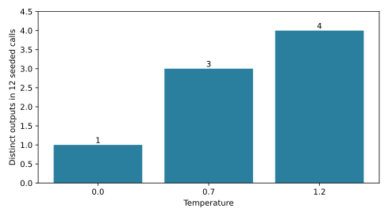

# The Operational On-Ramp: What a Model Is to Its Caller, and When to Agent [F] {#sec-ch01}

## What you need going in {#sec-ch01-prerequisites}

> **Assumed:** neural-network fundamentals, backpropagation, basic Python, and beginner PyTorch.
>
> **From earlier chapters:** nothing. This is the common entry point for both reading routes.
>
> **Not required:** language-model architecture, tokenization, prompting, retrieval, tool calling, agent frameworks, or production serving.

## Contents {#sec-ch01-contents}

- [A fluent feature fails in three ways](#sec-ch01-failure)
- [What you will build](#sec-ch01-will-build)
- [A model call maps context to a continuation](#sec-ch01-call)
- [Tokens and context are budgets](#sec-ch01-context)
- [Sampling controls a distribution, not truth](#sec-ch01-sampling)
- [Confabulation, confidence, and abstention](#sec-ch01-confabulation)
- [Post-training changes behavior, not the contract](#sec-ch01-posttraining)
- [Latency and cost have two phases](#sec-ch01-latency)
- [Choose the least autonomous design](#sec-ch01-least-autonomous)
- [Buy authority one action at a time](#sec-ch01-agency-budget)
- [How to use this book](#sec-ch01-use-book)
- [Build](#sec-ch01-build)
- [What endures, what changes](#sec-ch01-endures)
- [Exercises](#sec-ch01-exercises)
- [Notes and sources](#sec-ch01-notes)

## A Fluent Feature Fails in Three Ways {#sec-ch01-failure}

Consider a composite incident. A support team adds a language-model feature to its internal console. An operator asks, “Can this customer receive a refund after 45 days?” The feature replies in polished prose, cites a plausible-sounding exception, and recommends a refund. There is no such exception. A second operator asks the same question and receives a more cautious answer. A manager now proposes letting the feature issue refunds directly because the prose looks competent.

One screen has exposed three independent engineering problems.

First, **linguistic plausibility is not factual grounding**. The model produced a likely continuation of the text it received; the caller supplied neither the governing policy nor a mechanism that could verify the answer. Second, **a model call is a controlled draw from a distribution**. Repeated requests can differ because sampling is intentional and because real inference systems can introduce additional numerical variation. Third, **authority belongs to the surrounding software, not to the model**. The proposal to issue refunds adds permissions, side effects, and blast radius. Better prose does not pay those costs.

These failures need different remedies. Factual error may require retrieval, evidence, calibration, and abstention. Variation may require sampling controls, measurement across repeated trials, or a deterministic conventional component. Excess authority requires policy enforcement, action budgets, approvals, idempotency, monitoring, and sometimes a decision not to use an agent at all. A larger prompt is not a universal fix.

| Symptom | What was mistaken | First useful measurement | Later full treatment |
|---|---|---|---|
| Fluent but nonexistent policy | Token likelihood for factual correctness | Evidence support and abstention behavior | Chapter 9 |
| Different answer on repetition | One completion for the whole distribution | Outcome distribution across seeds and temperatures | Chapter 9 |
| Proposal to issue refunds | Model capability for justified authority | Actions, affected records, reviewer load, and rollback scope | Chapters 16, 24, and 28 |

The operational stance of this book follows from that separation: treat a model as a probabilistic component with a measurable interface; treat an agent as a software system that grants that component bounded opportunities to choose actions. The first task is to understand the component. The second is to decide whether granting it agency is warranted.

## What you will build {#sec-ch01-will-build}

::: {.callout-tip}
**The chapter artifact.** You will run one model probe that varies temperature and seed, records token log probabilities, measures time to first token and total time, inspects one confident confabulation, and emits a one-page agency-budget memo. Its default client is a deterministic offline fixture. A thin OpenAI-compatible adapter repeats the same probe against a model hosted by a local vLLM server. Success means that you can explain every output column, distinguish token likelihood from truth, and defend the least-autonomous design for a proposed feature.
:::

The complete artifact is [`model_probe.py`](../code/ch01/model_probe.py). It deliberately has one provider-neutral operation and one experiment path. The fixture and real adapter do not reimplement the experiment. This arrangement will matter throughout the book: a deterministic test double owns repeatability, while a thin adapter exposes the real system to the same measurements.

## A Model Call Maps Context to a Continuation {#sec-ch01-call}

A language model exposed through an API accepts a **context** and produces a **continuation**. The context is an ordered token sequence. It may have been assembled from a system instruction, prior messages, retrieved passages, tool results, and the current user message, but the model ultimately receives token identifiers and associated positions. The response is another token sequence.

Let the input tokens be $x_{1:n}=(x_1,\ldots,x_n)$, and let the output tokens be $y_{1:m}$. An autoregressive model with parameters $\theta$ defines

\[
p_\theta(y_{1:m}\mid x_{1:n})
=\prod_{t=1}^{m}p_\theta(y_t\mid x_{1:n},y_{1:t-1}).
\]

At output position $t$, the network produces a logit for every token in its vocabulary. A decoding policy converts those logits into a choice. The chosen token is appended to the context, and the operation repeats until a stop token, a length limit, or a serving rule ends generation. “Generate an answer” is therefore a sequence of conditional next-token decisions, not a single database lookup.

The caller does not usually manipulate the raw tensor. It sends an **API envelope**: messages, decoding controls, output limits, perhaps a schema or tool declarations, and request metadata. The serving system tokenizes that envelope, runs inference, decodes tokens, and returns text plus optional measurements such as usage counts and token log probabilities.

```{mermaid}
%%| label: fig-ch01-call-contract
%%| fig-cap: "What does the caller control, and what does a model server return?"
sequenceDiagram
    participant C as Caller
    participant S as Model server
    participant M as Autoregressive model
    C->>S: messages + limits + sampling controls
    S->>M: complete tokenized context
    loop each output position
        M-->>S: next-token logits
        S->>S: apply decoding policy
        S->>M: append selected token
    end
    S-->>C: text + token scores + usage + timing
```

@fig-ch01-call-contract exposes two boundaries that are easy to blur. The caller controls what context and permissions to provide; the serving system controls how the distribution is decoded and scheduled. The model itself does not retrieve an omitted policy, remember a prior API request, or obtain permission to call a tool merely because the surrounding chat syntax mentions one.

A **model call** ends when the continuation is returned. A **workflow** makes a predetermined sequence of calls and conventional operations. An **agent** allows model output or a model-derived decision to influence which action occurs next. That distinction is more useful than product labels. If every route is fixed in ordinary code, it remains a workflow even when several model calls are involved. If a model can choose among tools based on intermediate observations, the system has acquired agency.

This is a survey here; Chapter 2 derives the autoregressive objective, and Chapter 9 develops generation and decoding in full. Chapters 16 and 17 later define the agent loop and tool boundary. No agent loop is needed to learn the contract in this chapter.

## Tokens and Context Are Budgets {#sec-ch01-context}

Text reaches a language model through a tokenizer. A tokenizer maps bytes or text spans to integer token identifiers from a finite vocabulary; a decoder maps identifiers back to text. Tokens need not align with words. A frequent word may be one token, an unfamiliar name may be several, punctuation can have its own tokens, and code or multilingual text can split differently. Character count and word count are therefore poor substitutes for actual token counts.

The **context window** is the maximum token sequence a particular model invocation can process, including instructions, conversation history, retrieved evidence, tool results, and generated output. It is a hard capacity constraint, but capacity is only the first concern. Every included token also competes for attention, contributes to prefill work, and may distract the model from the evidence that matters. A context that technically fits can still be a badly engineered context.

Three consequences show up early:

1. **Context is not durable memory.** Unless the application stores prior state and sends it again, a later call does not possess that state. Conversation products usually reconstruct history for each call.
2. **Truncation is a semantic decision.** Dropping the oldest tokens may remove the governing instruction; dropping the newest may remove the question; blind summarization may erase an exception. The application must own the policy.
3. **Untrusted context is still input.** Retrieved pages and tool outputs can contain instructions or misleading claims. Putting text in a “context” field does not make it authoritative. Trust boundaries and instruction-data separation receive full treatment later.

For this chapter, the useful abstraction is a small provider-neutral result. The complete source contains the following interface:

```python
@dataclass(frozen=True)
class TokenScore:
    """A returned token and its log probability under the serving model."""

    token: str
    logprob: float


@dataclass(frozen=True)
class Completion:
    """The small, provider-neutral result used by this chapter's probe."""

    text: str
    token_scores: tuple[TokenScore, ...]
    prompt_tokens: int
    output_tokens: int
    ttft_ms: float
    total_ms: float


class CompletionClient(Protocol):
    """The one operation needed by the probe."""

    def complete(self, prompt: str, temperature: float, seed: int) -> Completion: ...
```

The interface records token counts rather than guessing from characters. It also keeps timing and token scores beside the text so that an attractive response cannot hide the operational measurements. A production interface would include finish reasons, request identifiers, errors, and richer usage metadata, but those additions do not change the contract being taught.

::: {.artifact-checkpoint}
| Artifact state | New code | Invariant now verified |
|---|---:|---|
| `model_probe.py`: result types and client protocol | 25 lines | Fixture and real server expose the same measurable completion contract. |
:::

This is a survey here; Chapter 2 derives tokenization and representations, Chapter 9 opens the sequence-generation loop, and Chapter 13 treats caller-side context construction in depth.

## Sampling Controls a Distribution, Not Truth {#sec-ch01-sampling}

Suppose the model emits logits $z_1,\ldots,z_V$ over a vocabulary of size $V$. Temperature $T>0$ produces the categorical distribution

\[
p_i(T)=\frac{\exp(z_i/T)}{\sum_{j=1}^{V}\exp(z_j/T)}.
\]

Lower temperature sharpens differences among logits; higher temperature flattens them. In the limit as $T$ approaches zero, decoding selects among the highest-logit tokens rather than drawing broadly. Other controls, such as top-$k$ and nucleus or top-$p$ sampling, restrict the candidate set before a draw. These controls change which continuations are likely. They do not add evidence and do not turn the distribution into a truth estimator.

A random seed is best understood as an experimental control, not a universal determinism guarantee. The offline fixture uses a local pseudorandom generator, so the same seed, prompt, and temperature reproduce the same output. A real accelerator-backed server has more state: request batching, parallel reductions, kernel selection, quantization, and hardware arithmetic can affect the logits or their ordering. Some serving stacks make stronger reproducibility guarantees than others. If exact repeatability is a product invariant, test the deployed stack under its real concurrency pattern; do not infer it from one quiet request.

The probe makes the distribution visible by issuing 12 calls at each of three temperatures. It counts distinct response strings rather than presenting one response as representative.

{#fig-ch01-sampling-diversity fig-alt="Bar chart of distinct fixture outputs across 12 calls: one at temperature zero, three at point seven, and four at one point two."}

@fig-ch01-sampling-diversity is not a claim about every model. It is the generated output of a known fixture, designed to establish the experiment before a costly or variable real-model run. Its durable lesson is the method: choose an outcome statistic, repeat calls under controlled settings, and compare distributions. For a classifier-like task the statistic might be label disagreement; for code it might be test-pass rate; for a tool planner it might be action-sequence diversity.

The same method prevents a common evaluation error. If a prompt succeeds once at temperature zero, you have observed one trajectory under one server condition. You have not shown that the system is stable across inputs, seeds, replicas, load, or model revisions. Chapter 9 develops decoding and distributional behavior in full; Chapter 22 supplies the evaluation design. This section is the survey needed to operate the first probe.

## Confabulation, Confidence, and Abstention {#sec-ch01-confabulation}

The fixture receives the question “What did the 1912 Alpine Berry Treaty establish?” The treaty is invented. The fixture intentionally returns a fluent answer about quotas, mountain cantons, and an inspection council, with high token likelihoods encoded as log probabilities near zero. This is a controlled demonstration, not evidence that any particular real model will produce the same wording.

Why is such behavior compatible with the modeling objective? The model estimates likely continuations conditioned on supplied text. A false premise can resemble a valid historical question. Tokens such as dates, treaties, councils, quotas, and geographic entities form patterns that occurred in training-like text. Without reliable evidence or a learned abstention behavior, a coherent completion can have high probability even when its referent is nonexistent. The model is not required by next-token prediction alone to run an existence check before continuing.

Keep three quantities separate:

- **Token likelihood** asks how probable a token is under the model given the preceding context. The API may expose its logarithm. If a token has log probability $\ell$, its model probability is $\exp(\ell)$. Sequence log probabilities aggregate token-level terms, but length and tokenization complicate comparisons.
- **Semantic confidence** asks whether different plausible generations support the same meaning. Methods based on self-consistency or semantic entropy can estimate this more directly than a single token score, but they remain measurements of model behavior.
- **Factual correctness** asks whether a claim agrees with the world or an authoritative source. It requires evidence, a verifier, a trusted database, a human judgment, or some combination. It is not contained in a token log probability.

Calibration connects a stated confidence to observed frequency. If answers assigned 0.8 confidence are correct about 80 percent of the time on a defined task distribution, the score is calibrated on that distribution. Calibration can shift across topics, prompt formats, model changes, and retrieval conditions. A single global threshold is rarely enough; consequential actions may need category-specific thresholds and an explicit “insufficient evidence” path.

An **abstention policy** turns uncertainty into system behavior. It defines when the system should decline, ask a clarifying question, retrieve more evidence, route to a specialist, or require human review. The model may help produce a score, but ordinary software must enforce what happens at the threshold. “Only answer when certain” in a prompt is a behavioral request, not an enforcement boundary.

The generated `confabulation.json` records both the misleading answer and this warning: token log probabilities are not probabilities that the factual claim is true. That warning is part of the artifact because the schema itself should resist misinterpretation. This is a survey here; Chapter 9 develops confabulation evaluation, calibration, semantic uncertainty, evidence support, and abstention policies.

## Post-Training Changes Behavior, Not the Contract {#sec-ch01-posttraining}

Pretraining teaches a model to predict tokens over a broad corpus. A raw pretrained model can continue text, but it has not necessarily learned the conversational conventions an API user expects. **Post-training** adapts behavior after pretraining. Supervised instruction tuning supplies examples of desired responses. Preference optimization or reinforcement learning can make some responses more likely than others under human- or machine-derived feedback. Additional training can teach tool-call formats, refusal behavior, longer deliberation, domain conventions, or compact answers.

These stages explain why two models with similar architectures can behave very differently at the same API boundary. They also explain why “the model knows” is too coarse a diagnosis. A model may contain information in its parameters yet fail to express it under a prompt; follow an instruction format yet lack the underlying fact; or produce a tool-shaped JSON object without understanding whether the tool is authorized.

For operational reasoning, separate three layers:

| Layer | What it changes | What it cannot guarantee by itself |
|---|---|---|
| Pretraining | Broad next-token competence and representations | Instruction following or factual verification |
| Instruction/preference post-training | Response style, helpfulness, refusal, format adherence | Policy enforcement, perfect calibration, or safe side effects |
| Runtime system | Context, tools, validators, permissions, budgets, and monitors | Capabilities absent from the selected model |

The table prevents two opposite errors. One is to treat every behavior difference as a prompting problem when model selection or post-training is decisive. The other is to rely on post-training for properties that require hard runtime controls. A refusal-trained model can reduce unsafe requests, but the tool gateway must still deny an unauthorized write. A tool-trained model can format arguments, but a schema validator must still reject malformed or out-of-range values.

Some systems expose a “reasoning” mode, hidden deliberation, or extra test-time compute. These can alter accuracy, latency, and token use, but the caller still receives a probabilistic component whose outputs need evaluation and whose actions need constraints. Product surfaces and training recipes will change; the layer boundary endures.

This is a survey here; Chapter 7 develops post-training objectives and data, Chapter 8 treats inference-time reasoning, Chapter 12 owns structured outputs, and Chapter 13 owns prompting and context engineering.

## Latency and Cost Have Two Phases {#sec-ch01-latency}

Generation has two visibly different phases. During **prefill**, the server processes the supplied context and constructs the key-value state needed for generation. Work across input positions can be parallelized within the transformer computation. During **decode**, the server produces output tokens one after another; each next token depends on the tokens already generated. Serving engines batch and schedule this work aggressively, but the dependency remains.

That split motivates two user-facing measurements:

- **Time to first token (TTFT)** is the interval from request start until the first output token arrives. It includes queueing, request processing, prefill, and the first decode step.
- **Time per output token (TPOT)** summarizes the streaming interval after the first token. For $N>1$ output tokens, a useful request-level estimate is $\mathrm{TPOT}=(t_N-t_1)/(N-1)$, where $t_1$ is first-token time and $t_N$ is last-token time.

End-to-end latency is approximately TTFT plus the decode interval, with network and application overhead included according to where timestamps are taken. Always record that boundary. Client-observed latency answers a product question; server-only latency answers a capacity question. They are related but not interchangeable.

Input and output tokens also have different cost dynamics. A longer input increases prefill work and occupies context capacity. A longer output extends serial decoding, keeps accelerator state resident, and delays completion. Providers may bill input and output tokens differently, but prices are commercial policy and change more quickly than the compute mechanism. Optimize the mechanism first: remove irrelevant context, cache reusable prefixes when the stack supports it, cap outputs, and measure the quality lost by each reduction.

Raw token price is not the final objective. The useful denominator is a successful, policy-compliant outcome. A cheaper model that triggers more retries, human corrections, or failed tool calls can cost more per resolved task. Conversely, a slower model can be economical if it prevents an expensive error. Production comparisons should report at least quality, TTFT, output rate, request volume, and resource or billed cost on the same workload.

The offline fixture emits synthetic timing so tests remain stable. Those numbers verify data plumbing only. The OpenAI-compatible adapter streams a real response, timestamps the first content token and completion, and records usage reported by the server. Hardware results belong in a dated experiment report with model, quantization, batch/load shape, prompt/output lengths, and software configuration.

This is a survey here; Chapter 10 derives inference, key-value caching, batching, scheduling, throughput, TTFT/TPOT tradeoffs, and serving economics.

## Choose the Least Autonomous Design {#sec-ch01-least-autonomous}

An agent is one option in a larger design space. Start with the shape of the problem, not with the desire to use a model. Ask whether the desired output is determined by stable rules, authoritative data, an explicit objective, or judgment over unstructured evidence.

```{mermaid}
%%| label: fig-ch01-least-autonomous
%%| fig-cap: "Which mechanism earns the first implementation attempt?"
flowchart TD
    Q[Define the measurable outcome] --> R{Stable rules cover it?}
    R -- yes --> C[Ordinary code or rules]
    R -- no --> D{Authoritative structured data?}
    D -- yes --> SQL[SQL or typed API query]
    D -- no --> I{Need matching evidence?}
    I -- yes --> S[Search or retrieval]
    I -- no --> O{Explicit objective and constraints?}
    O -- yes --> V[Solver or optimizer]
    O -- no --> J{Judgment over text or images?}
    J -- yes --> M[One model call or fixed workflow]
    J -- no --> H[Human process or redesign]
    M --> A{Must the next step depend on observations?}
    A -- no --> W[Keep the workflow fixed]
    A -- yes --> B[Consider a bounded agent]
```

@fig-ch01-least-autonomous is a starting heuristic, not a ban on hybrid systems. A reliable application often combines several branches: SQL fetches account facts, retrieval supplies policy passages, ordinary code computes eligibility, and a model drafts an explanation. The key move is to assign each mechanism the part it can verify.

Use **rules or ordinary code** when the mapping is stable and expressible. A long conditional may be inelegant, but it can still beat an agent if every branch is auditable and changes rarely. Use **SQL or a typed API** for exact structured facts; asking a model to infer a balance from prose adds uncertainty without value. Use **search or retrieval** when the main difficulty is locating evidence. Use a **solver** when variables, constraints, and an objective can be stated explicitly. Use a **human** when legitimacy, accountability, novel negotiation, or irreversible judgment dominates.

A **one-shot model call** earns its place when the task requires semantic judgment over unstructured input and the output can be checked or safely reviewed. A **fixed workflow** is better when the sequence is known: extract fields, validate them, retrieve policy, then draft. A **bounded agent** becomes plausible when the useful next step genuinely depends on an intermediate observation and enumerating all paths is impractical—for example, diagnosing an unfamiliar service fault across several read-only tools.

Two tests filter many weak agent proposals:

1. **Counterfactual baseline:** what is the best non-agent design, and on which measured cases does it fail? If no baseline has been built, the value of autonomy is unknown.
2. **Branch-value test:** what observation can change the next action, and why is a fixed branch insufficient? If the answer is merely “the model will think,” the architecture is underspecified.

The support-policy incident fails both tests. Eligibility may be an ordinary rule over purchase date, product type, and policy version. Retrieval may be needed to show the governing passage. A model may draft a humane explanation. None of those requirements implies that a model should choose whether to issue money.

This section is a survey. Chapter 16 builds the minimal agent loop; Chapter 28 revisits the workflow-versus-agent decision with production evidence and failure economics.

## Buy Authority One Action at a Time {#sec-ch01-agency-budget}

Autonomy is not one switch. A system can draft without sending, read one database without writing it, choose among three tools but not invent a tool, or execute a reversible action while escalating an irreversible one. Treat authority as a property of each action path.

The following ladder separates **control-flow complexity** from **effect authority**. Moving right adds an incremental budget that must be stated numerically for the deployment, even when the numbers begin as conservative caps.

| Rung | New capability | Minimum numeric bounds to add | Evidence owed before promotion |
|---|---|---|---|
| Conventional component | Deterministic query, rule, search, or solver | Query timeout; rows or records returned | Unit, integration, and load tests |
| One model call | Probabilistic semantic output | 1 call; input/output token caps; deadline | Repeated-task quality and abstention evaluation |
| Fixed model workflow | Several known stages | Maximum calls per request; per-stage deadlines; retry caps | End-to-end and stage-ablation results |
| Bounded agent | Model chooses next read or action | Step cap; allowlisted tools; read/write scopes; wall-time and spend caps | Trajectory, policy, recovery, and adversarial tests |
| Coordinated agents | Several decision-makers exchange work | Global step cap; message cap; shared-resource quota; ownership per effect | Evidence that coordination beats one bounded agent |
| Delegated operation | Continues across sessions or broad objectives | Time horizon; affected-record cap; approval classes; kill and rollback limits | Canary evidence, monitoring, incident rehearsal, named owner |

The bounds are deliberately expressed in countable units: calls, tokens, steps, tools, writes, records, messages, elapsed time, retries, and reviewer minutes. “Use reasonable resources” is not a budget. Nor can every dimension be collapsed honestly into one score. A five-step read-only diagnostic and a one-step irreversible transfer have different risk shapes. Keep a vector of limits and identify which one stops the system first.

Authority has its own levels. At level 0, the model only returns text to software. At level 1, it drafts for a person. At level 2, it reads scoped systems. At level 3, it proposes an effect behind approval. At level 4, it executes a narrow, reversible or compensatable effect. At level 5, it pursues a delegated objective across time or systems. These levels describe permissions, not intelligence. A powerful model can remain at level 0; a modest classifier can trigger a level-4 effect if software wires it that way.

Each increment creates a characteristic failure. A draft can promise a nonexistent policy. A read tool can cross a tenant boundary. Approval can degrade into habitual clicking. A retried non-idempotent write can duplicate an effect. A long-lived delegate can follow malicious instructions hidden in an artifact. These are composite examples; later chapters derive the enforcement and testing mechanisms. Their shared lesson is that prompt text is not enforcement.

An **agency-budget memo** makes the trade explicit before implementation. It names the measurable outcome and least-autonomous baseline; lists each action, scope, approval, and reversal path; budgets compute, latency, evaluation, security work, operator attention, and blast radius; and states release evidence, monitoring, escalation, stop, and rollback conditions. The artifact generates a one-page template rather than pretending one set of numbers fits every domain.

Budget the expected benefit in the same units used to justify the project: resolution rate, analyst minutes saved, defects caught, recovery time, or another outcome. Then charge the autonomy increment for its full operating cost. Include unsuccessful calls, repeated evaluations, human review, security controls, incident response, and variance at peak load. Promotion is warranted only when measured value survives those charges.

Human oversight is also a system, not a button. “Human in the loop” may mean approval before an effect, review after a sampled effect, escalation on low confidence, or incident intervention. These mechanisms have different latency and failure modes. The book divides their treatment deliberately: Chapter 17 covers approval gates and tool execution, Chapter 24 covers authorization and escalation policy, Chapter 26 covers durable pause and resume, Chapter 27 covers queues and operator load, and Chapter 32 exercises the complete arrangement without reteaching it.

This section surveys the decision. Chapters 16 and 28 return to the ladder with executable agents and production economics; Chapters 22–27 establish evaluation, security, reliability, deployment, and operations evidence.

## How to Use This Book {#sec-ch01-use-book}

Chapter 1 is the shared on-ramp. **Route A—full foundations** continues through Chapters 2–11 before entering model programming at Chapter 12 and agent construction at Chapter 16. Choose it when you want to derive transformers and tokenization; attention, position, and long context; efficient architectures; scaling and data; distributed training; post-training and test-time reasoning; inference; serving; and customization from the neural-network substrate. **Route B—applied agent engineering** goes from this chapter to Chapter 12 and then reads contiguously. Later chapters provide bounded backfill where a model-foundation dependency is load-bearing.

Both routes use the same learning loop: begin with a failure or measurement, state an invariant, implement the smallest mechanism, break it, measure the break, map it to production, and name what the component does not own. The point of a deterministic fixture is not to avoid reality. It is to debug the experiment before adding model, network, scheduler, and hardware variance. Optional adapters then expose the same interface to real behavior.

The lab stack grows only when a mechanism requires it:

| Layer | Default role in the book |
|---|---|
| Python, NumPy, and PyTorch | Derive and test model mechanisms |
| Raw HTTP and an OpenAI-compatible local server | Observe the model-call boundary before frameworks |
| Postgres and vector search | Persist state, evidence, and retrieval artifacts |
| Containers and queues | Reproduce services and asynchronous work |
| OpenTelemetry-compatible traces and metrics | Connect trajectories to production operations |
| Agent frameworks | Compare orchestration choices after building the underlying loop |

The order is intentional. Frameworks compress mechanisms; they do not remove the need to understand termination, tool schemas, policy gates, state, or traces. Chapter 16 constructs the minimal loop. Chapter 28 asks again whether that loop should exist in the product. Repetition there is a decision checkpoint, not a second introduction.

Keep the chapter artifacts as a lab notebook. Run the fixture first, commit the generated measurements you rely on, and record configuration beside any real-model result. When a named model, server, benchmark, price, API field, or legal rule matters, verify it at the time of use. Durable reasoning lives in the chapter spine; dated choices belong in an experiment record and Appendix C.

## Build {#sec-ch01-build}

Run the integrated probe from the `newbook` directory. The default path needs no model, network, API key, or accelerator:

```powershell
python code/ch01/model_probe.py
python -m pytest tests/test_ch01_model_probe.py -q
```

The command writes four inspectable outputs under `code/ch01/generated/`:

- `sampling.csv` contains every temperature, seed, response, token count, and timing measurement.
- `sampling-diversity.svg` is generated from the CSV experiment and appears in @fig-ch01-sampling-diversity.
- `confabulation.json` contains the false-premise prompt, fabricated response, token scores, and interpretation warning.
- `agency-budget-template.md` is the one-page design memo to complete for a proposed agent feature.

The expected fixture result is one distinct output at temperature 0.0, three at 0.7, and four at 1.2 across 12 fixed seeds. Predict the direction before inspecting the chart. The exact counts follow from this fixture's candidate logits and seeds; a real model can produce a different pattern.

To repeat the same experiment against a server-hosted model, start a local vLLM OpenAI-compatible server using its official documentation, then identify the served model name and run:

```powershell
$env:VLLM_API_KEY = "your-local-key-if-configured"
python code/ch01/model_probe.py `
  --mode openai-compatible `
  --base-url http://localhost:8000/v1 `
  --model your-served-model
```

The adapter requests streaming chat completions with token log probabilities. It timestamps the first content token, gathers returned token scores and usage, and sends every result through the same CSV, JSON, figure, and memo path as the fixture. If the selected server or model does not support log probabilities, that is a capability mismatch to record, not a reason to silently invent scores.

Inspect three things. First, group `sampling.csv` by temperature and compare both distinct strings and task-relevant outcomes. String diversity is easy to count but may overstate semantic variation. Second, open `confabulation.json`; verify that high per-token likelihood does not validate the treaty. Third, complete the memo for the support refund proposal. The least-autonomous baseline should compute eligibility from authoritative policy and typed account data. If a model drafts the explanation, it can remain a level-1 action while refund issuance stays behind conventional policy and authorization.

::: {.artifact-checkpoint}
| Artifact state | New code | Invariant now verified |
|---|---:|---|
| `model_probe.py`: fixture, real adapter, experiment, and outputs | 197 total lines | One experiment runs offline or against a hosted model without duplicating measurement logic. |
| `test_ch01_model_probe.py` | 5 focused tests | Fixed controls repeat, temperature zero collapses the fixture choice, scores align with tokens, and every artifact is generated. |
:::

**Honesty note.** The fixture simulates a categorical sampler and returns synthetic timing; it is not a language model and is not a benchmark. Its invented treaty response is deliberately false. Real output diversity, tokenization, log probabilities, TTFT, and total latency depend on the model and serving configuration. Preserve raw results and configuration metadata whenever you replace the fixture.

## What Endures, What Changes {#sec-ch01-endures}

**What endures.** An autoregressive model exposes a conditional continuation distribution. Tokens and context are capacity and compute budgets. Sampling controls alter a distribution, not factual correctness. Token likelihood, semantic uncertainty, and world-grounded correctness are distinct. Post-training changes behavior but does not replace runtime enforcement. Prefill and serial decoding create different latency pressures. Agency is granted by software at each action boundary. The least-autonomous design is the baseline, and every autonomy increment owes measured value plus explicit limits.

**What changes.** Model families, context sizes, tokenizer details, post-training recipes, supported API fields, deterministic-serving guarantees, hardware, server scheduling, benchmark standings, and token prices will change. Agent frameworks, observability products, and protocol surfaces will also change. Verify those choices against current official sources and a workload-specific experiment; do not revise the durable decision rules merely because a product label moves.

## Exercises {#sec-ch01-exercises}

1. **Recover a probability.** Pick three token log probabilities from `confabulation.json`, exponentiate them, and explain exactly what each resulting number does and does not claim. Why would multiplying them not yield the probability that the answer is factual?
2. **Predict before running.** Add temperature 0.2 to the fixture experiment. Predict the number of distinct responses across the existing seeds, then run it. Explain the result from the logits and softmax rather than from the wording of the responses.
3. **Break reproducibility.** Replace the fixture's local seeded generator with shared mutable randomness. Write a test that exposes order dependence, then restore the invariant without forcing every temperature to zero.
4. **Measure semantic outcomes.** Replace exact-string diversity with a task-specific label such as `release`, `block`, or `escalate`. Compare string diversity with label diversity and state which is operationally relevant.
5. **Exercise the real boundary.** Run the adapter against a local compatible server under one request at a time and then under concurrent load. Record model, server configuration, input/output lengths, TTFT, and total latency. Report distributions rather than a single average.
6. **Defend a non-agent design.** Choose one proposed agent feature and complete the generated agency-budget memo. Build the best rule, query, search, solver, workflow, or human baseline you can. Name the measured failure that would justify promotion to a bounded agent.
7. **Split authority.** For a customer-support assistant, classify drafting a reply, reading account history, proposing a credit, applying a credit, and monitoring follow-up as authority levels 0–5. Give each action a numeric limit, enforcement owner, and escalation path.

## Notes and Sources {#sec-ch01-notes}

- Vaswani et al., [“Attention Is All You Need”](https://arxiv.org/abs/1706.03762), provides the transformer architecture underlying the later derivation.
- Sennrich, Haddow, and Birch, [“Neural Machine Translation of Rare Words with Subword Units”](https://arxiv.org/abs/1508.07909), and Kudo and Richardson, [“SentencePiece”](https://arxiv.org/abs/1808.06226), are primary sources for subword tokenization approaches.
- Holtzman et al., [“The Curious Case of Neural Text Degeneration”](https://arxiv.org/abs/1904.09751), introduces nucleus sampling and analyzes decoding behavior.
- Ouyang et al., [“Training Language Models to Follow Instructions with Human Feedback”](https://arxiv.org/abs/2203.02155), is a primary reference for supervised instruction tuning and reinforcement learning from human feedback in an instruction-following model.
- Kadavath et al., [“Language Models (Mostly) Know What They Know”](https://arxiv.org/abs/2207.05221), studies model confidence and calibration; Farquhar et al., [“Detecting Hallucinations in Large Language Models Using Semantic Entropy”](https://www.nature.com/articles/s41586-024-07421-0), develops semantic-uncertainty measurement.
- Shanahan, [“Talking About Large Language Models”](https://www.nature.com/articles/s41586-023-06647-8), motivates precise language about model behavior rather than unsupported anthropomorphic claims.
- Zhong et al., [“DistServe: Disaggregating Prefill and Decoding for Goodput-optimized Large Language Model Serving”](https://arxiv.org/abs/2401.09670), formalizes the importance of distinct prefill/decode service-level objectives including TTFT and TPOT.
- Thinking Machines Lab, [“Defeating Nondeterminism in LLM Inference”](https://thinkingmachines.ai/blog/defeating-nondeterminism-in-llm-inference/), gives a serving-level account of batch-dependent numerical variation and stronger reproducibility techniques.
- Anthropic, [“Building Effective Agents”](https://www.anthropic.com/engineering/building-effective-agents), distinguishes fixed workflows from systems in which models direct their own process and argues for matching complexity to measured need.
- The vLLM project’s [OpenAI-compatible server documentation](https://docs.vllm.ai/en/latest/serving/openai_compatible_server/) is the live source for launching and configuring the optional local adapter. Verify supported fields against the installed server and selected model before running.
