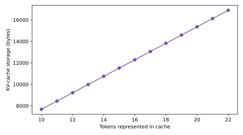
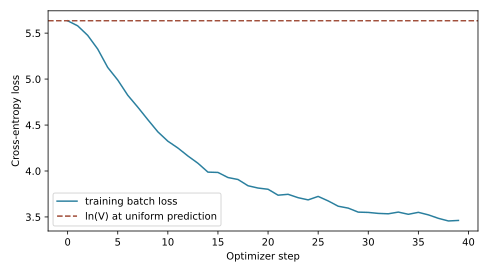

# The Transformer from First Principles [F] {#sec-ch02}

## What you need going in {#sec-ch02-prerequisites}

> **Assumed:** neural-network fundamentals, backpropagation, basic Python, and beginner PyTorch.
>
> **From earlier chapters:** [Chapter 1, A Model Call Maps Context to a Continuation](01-operational-on-ramp.qmd#sec-ch01-call) — a model call returns a continuation by making one conditional next-token decision at a time.
>
> **Not required:** natural-language processing, tokenization, attention, language-model training, positional encodings, or inference serving.

## Contents {#sec-ch02-contents}

- [A suspiciously good loss](#sec-ch02-failure)
- [What you will build](#sec-ch02-will-build)
- [Tokens from bytes: BPE essentials](#sec-ch02-bpe)
- [The next-token objective](#sec-ch02-objective)
- [Attention as a learned weighted lookup](#sec-ch02-attention)
- [Multi-head attention and the causal mask](#sec-ch02-multihead)
- [The residual stream and a modern block](#sec-ch02-residual)
- [Decoder-only: from embeddings to logits](#sec-ch02-decoder)
- [Cache past keys and values exactly](#sec-ch02-kv-cache)
- [Count parameters, FLOPs, and bytes](#sec-ch02-accounting)
- [Train it and read the loss curve](#sec-ch02-training)
- [Build](#sec-ch02-build)
- [What endures, what changes](#sec-ch02-endures)
- [Exercises](#sec-ch02-exercises)
- [Notes and sources](#sec-ch02-notes)

## A Suspiciously Good Loss {#sec-ch02-failure}

A team trains its first tiny language model. Within a few hundred updates, loss collapses and held-out next-token accuracy looks extraordinary. Generated text is incoherent.

The architecture has no causal mask. At position $i$, attention can read the token at position $i+1$—the exact label the model is asked to predict. Training rewards this shortcut. The low loss is real arithmetic attached to an invalid information path.

That failure gives us the chapter’s governing invariant:

> The logits at position $i$ may depend on tokens at positions ${0}$ through $i$, but never on a token at a later position.

Every mechanism in a causal language model serves or preserves that invariant. The tokenizer determines the prediction alphabet. The shifted loss defines which token is the label. The attention mask closes the future path. Residual connections let many transformations update the same per-position state. Positional information distinguishes order. The language-model head maps the final state back to the frozen vocabulary. During generation, a key-value cache must produce the same next-token logits as recomputing the whole visible prefix.

The incident also illustrates why a loss curve is not self-interpreting. A decreasing scalar can mean learning, memorization, label leakage, a broken denominator, or an easier batch. An engineer needs predicted baselines and executable invariants. Before training, a model with near-uniform predictions over a vocabulary of size $V$ should have cross-entropy near $\ln V$. After training, changing future tokens must leave all earlier logits unchanged. During cached decoding, reusing states must agree with the uncached computation.

By the end of the chapter, you will derive those claims, implement them, and test them on one small decoder-only Transformer.

## What you will build {#sec-ch02-will-build}

::: {.callout-tip}
**The chapter artifact.** You will train one nanoGPT-style causal language model end to end. [`bpe.py`](../code/ch02/bpe.py) learns a frozen byte-level BPE vocabulary with exact round trips and no unknown-token path. [`tinygpt.py`](../code/ch02/tinygpt.py) implements masked multi-head attention, pre-RMSNorm residual blocks, QK normalization, SwiGLU, tied embeddings, and cached decoding. [`train.py`](../code/ch02/train.py) owns one experiment: train, sample at three temperatures, plot loss, verify cached logits against full-prefix logits, and plot cache growth. The deterministic CPU fixture is the default; a larger run over a supplied public-domain corpus is optional.
:::

These are three modules of one build, not competing model implementations. Tokenization is a distinct mechanism with its own round-trip contract. The model has one forward path whether it is training, evaluating, or extending a cache. The trainer calls that path and writes all numeric evidence under `code/ch02/generated/`.

## Tokens From Bytes: BPE Essentials {#sec-ch02-bpe}

A neural network consumes integer indices, not strings. The tokenizer defines the mapping from text to those indices and therefore fixes the embedding table’s rows, the output head’s columns, the loss dimension, and the unit in which context and throughput are measured.

Whole-word vocabularies fail on an open-ended language. New names, misspellings, source code, and productive word forms keep appearing. A character vocabulary avoids unknown words but makes common strings long. **Byte-pair encoding** (BPE) starts from small units and repeatedly merges frequent adjacent pairs, retaining fallback units for uncommon text.

This artifact starts from all 256 possible byte values. UTF-8 maps any Unicode string to a byte sequence, so every input is representable before a merge is learned. Training counts adjacent token pairs, chooses the most frequent pair with a deterministic tie break, replaces its non-overlapping occurrences with a new token ID, and repeats until reaching the requested vocabulary size.

Suppose a training stream contains the byte-token sequence

$$
[t,h,e,\;t,h,e,\;t,h,e,r,e].
$$

If $(t,h)$ is the most frequent adjacent pair, BPE creates a token `th` and replaces every non-overlapping occurrence. A later merge may combine `th` and `e` into `the`. Encoding new text replays the learned merges in order. Decoding expands each merged token back to its exact bytes, concatenates them, and runs UTF-8 decoding.

The core is intentionally small:

```python
# bpe.py — BytePairTokenizer.train() and encode()
for token in range(256, vocab_size):
    counts = Counter(zip(ids, ids[1:]))
    if not counts:
        break
    pair = min(counts, key=lambda item: (-counts[item], item))
    ids = _replace_pair(ids, pair, token)
    tokenizer.merges.append(Merge(*pair, token))
    tokenizer.token_bytes[token] = (
        tokenizer.token_bytes[pair[0]] + tokenizer.token_bytes[pair[1]]
    )

def encode(self, text: str) -> list[int]:
    ids = list(text.encode("utf-8"))
    for merge in self.merges:
        ids = _replace_pair(ids, (merge.left, merge.right), merge.token)
    return ids
```

Two properties deserve separate tests. **Round-trip correctness** means `decode(encode(text)) == text` for empty strings, line breaks, emoji, and multilingual text. **Zero OOV** means encoding never needs an “unknown” token: an unseen string may fall back to several bytes, but every byte has an ID. Zero OOV does not mean equal efficiency. A string well represented in tokenizer training may use one merged token; an equally long string from another language or domain may require many. Chapter 5 measures this fertility effect at pretraining scale.

The tokenizer is **frozen** before model pretraining. Once the model’s input embedding has shape $V\times d$ and its output head predicts $V$ logits, adding a merge would introduce a new row and output class with untrained parameters. You can continue to encode novel text through bytes, but you cannot silently change the vocabulary without changing and retraining model parameters. This is why tokenization is part of a model’s architecture contract, not a replaceable request-time utility.

The byte fallback has one more consequence. A model can generate arbitrary byte tokens that do not yet form valid UTF-8. A streaming decoder may need to buffer an incomplete sequence; an undertrained model may emit permanently invalid sequences and require an explicit error policy. The build uses replacement characters only when rendering samples. Its tokenizer round-trip tests remain strict.

::: {.artifact-checkpoint}
| Artifact state | New code | Invariant now verified |
|---|---:|---|
| `bpe.py`: byte base vocabulary and deterministic merges | 80 total lines | Any Unicode input encodes without OOV and valid inputs round-trip exactly. |
:::

## The Next-Token Objective {#sec-ch02-objective}

Let $x_{1:T}=(x_1,\ldots,x_T)$ be a token sequence of length $T$. The probability chain rule factorizes its joint probability as

$$
p_\theta(x_{1:T})=\prod_{t=1}^{T}p_\theta(x_t\mid x_{1:t-1}),
$$

where $\theta$ denotes all model parameters. A **causal language model** represents each conditional distribution using only the prefix before the target token.

Training uses **teacher forcing**: every input prefix comes from the observed sequence, even if the model would have generated a different previous token. In code, one contiguous stream produces aligned arrays:

$$
\text{input}=[x_1,x_2,\ldots,x_{T-1}],\qquad
\text{target}=[x_2,x_3,\ldots,x_T].
$$

The model emits logits $z_{t,v}$ for every position $t$ and vocabulary item $v\in\{1,\ldots,V\}$. Softmax converts logits into probabilities. For a batch with $B$ sequences and $T$ prediction positions, mean cross-entropy is

$$
\mathcal{L}(\theta)=
-\frac{1}{BT}\sum_{b=1}^{B}\sum_{t=1}^{T}
\log p_\theta\!\left(x^{(b)}_{t+1}\mid x^{(b)}_{1:t}\right).
$$

Minimizing this loss makes the observed next token more probable. It does not directly reward factuality, helpfulness, or a completed downstream task. Those behaviors can emerge from data and later post-training, but the base objective is conditional likelihood.

**Perplexity** is $\exp(\mathcal{L})$. It can be read as an effective branching factor only when loss is computed with the same tokenizer, masking, and data convention. Comparing perplexities across different vocabularies can mislead because each model predicts different units.

Before learning, small random logits are often close enough to equal that $p(v)\approx1/V$. The expected target loss is then

$$
-\log(1/V)=\ln V.
$$

For the build’s $V=280$, this baseline is $\ln 280=5.635$. The measured initial loss is 5.636. That agreement is not a quality result; it is a plumbing check. A much lower initial value invites an investigation into target leakage, duplicated labels, or a mask error.

The trainer forms shifted examples explicitly:

```python
# train.py — _batch(), constructing teacher-forced examples
starts = torch.randint(
    0, data.numel() - block_size - 1, (batch_size,), generator=generator
)
inputs = torch.stack([
    data[start : start + block_size] for start in starts
])
targets = torch.stack([
    data[start + 1 : start + block_size + 1] for start in starts
])
```

::: {.artifact-checkpoint}
| Artifact state | New code | Invariant now verified |
|---|---:|---|
| `train.py`: shifted batch construction | 7 new lines | Each target is exactly the token one position after its input prefix. |
:::

## Attention as a Learned Weighted Lookup {#sec-ch02-attention}

At each position, the model needs a content-dependent way to combine earlier states. A fixed-width convolution can only inspect a fixed neighborhood; a recurrent state must compress everything seen so far into one sequentially updated vector. Self-attention instead lets each position perform a learned lookup over visible positions.

Let $X\in\mathbb{R}^{T\times d}$ contain one $d$-dimensional vector per token position. Learned matrices project it into queries, keys, and values:

$$
Q=XW_Q,\qquad K=XW_K,\qquad V=XW_V,
$$

with $Q,K,V\in\mathbb{R}^{T\times d_h}$ for one head of width $d_h$. A query describes what the current position seeks. A key describes how a source position can be matched. A value contains the information returned when that source is selected.

The raw compatibility between query position $i$ and key position $j$ is the dot product $q_i^\top k_j$. Softmax makes the compatible scores nonnegative and sum to one:

$$
a_{ij}=
\frac{\exp(q_i^\top k_j/\sqrt{d_h})}
{\sum_{r}\exp(q_i^\top k_r/\sqrt{d_h})},
\qquad
o_i=\sum_j a_{ij}v_j.
$$

Why divide by $\sqrt{d_h}$? If query and key components are independent, centered, and have unit variance, their dot product sums $d_h$ products and has variance proportional to $d_h$. Without scaling, increasing head width drives logits into saturated softmax regions with very small gradients. Dividing by $\sqrt{d_h}$ keeps the score scale roughly stable.

Attention weights are input-dependent routing coefficients, not explanations by default. A high coefficient says that a value vector contributes strongly through this head at this layer. Residual paths, other heads, later layers, and the value/output projections all affect the final prediction. Chapter 25 returns to the residual stream as the more useful coordinate system for causal analysis.

The dense computation forms a $T\times T$ score matrix. Its prefill cost grows quadratically with sequence length, even though the learned projection parameter count is independent of $T$. Chapter 3 develops alternatives and the effective-context tradeoffs; this chapter keeps dense attention so the causal contract is visible.

## Multi-Head Attention and the Causal Mask {#sec-ch02-multihead}

One attention map must use one similarity geometry and one value representation. **Multi-head attention** runs $H$ such lookups in parallel. With model width $d$ and $H$ heads, this build uses $d_h=d/H$. It concatenates the $H$ head outputs back to width $d$ and applies an output projection $W_O$:

$$
\operatorname{MHA}(X)=
\operatorname{Concat}(O^{(1)},\ldots,O^{(H)})W_O.
$$

Heads are not separate networks. They are slices of tensors produced by shared layer input and batched matrix operations. Different learned projections allow different matching patterns, while $W_O$ mixes their returned information into one update.

Causality enters before softmax. Define mask $M\in\mathbb{R}^{T\times T}$ as

$$
M_{ij}=
\begin{cases}
0,&j\le i,\\
-\infty,&j>i.
\end{cases}
$$

Then

$$
A=\operatorname{softmax}\left(\frac{QK^\top}{\sqrt{d_h}}+M\right).
$$

An exponentiated negative infinity contributes zero probability, so row $i$ can mix only values at positions ${0}$ through $i$. The triangular structure is easiest to audit directly:

| Query position | Key 0 | Key 1 | Key 2 | Key 3 |
|---:|:---:|:---:|:---:|:---:|
| 0 | allow | block | block | block |
| 1 | allow | allow | block | block |
| 2 | allow | allow | allow | block |
| 3 | allow | allow | allow | allow |

The implementation constructs absolute query and key positions, which also makes the same mask work when a cache precedes a chunk:

```python
# tinygpt.py — CausalSelfAttention.forward()
qkv = self.qkv(x).view(
    batch, steps, 3, self.n_heads, self.head_dim
)
query, key, value = qkv.permute(2, 0, 3, 1, 4).unbind(0)
query, key = self.q_norm(query), self.k_norm(key)
past_steps = 0 if past is None else past[0].size(-2)
if past is not None:
    key = torch.cat((past[0], key), dim=-2)
    value = torch.cat((past[1], value), dim=-2)
scores = query @ key.transpose(-2, -1) / math.sqrt(self.head_dim)
query_positions = past_steps + torch.arange(steps, device=x.device)[:, None]
key_positions = torch.arange(key.size(-2), device=x.device)[None, :]
scores = scores.masked_fill(
    key_positions > query_positions, float("-inf")
)
mixed = scores.softmax(dim=-1) @ value
```

The test changes only future token IDs and asserts bit-for-bit equality of all earlier logits on the CPU path. This is stronger than checking that a mask tensor looks triangular: it verifies the externally relevant information-flow invariant through the assembled model.

::: {.artifact-checkpoint}
| Artifact state | New code | Invariant now verified |
|---|---:|---|
| `tinygpt.py`: QKV projections, multi-head reshape, and causal mask | 31 new lines | Changing future tokens cannot change earlier logits. |
:::

## The Residual Stream and a Modern Block {#sec-ch02-residual}

Attention returns one proposed update per position. A feed-forward network returns another. The **residual stream** is the shared width-$d$ state that carries the original embedding and every accumulated update through the stack.

For layer $\ell$, this build uses a pre-normalized block:

$$
X^{\ell+\frac12}
=X^\ell+
\operatorname{Attention}\!\left(\operatorname{RMSNorm}(X^\ell)\right),
$$

$$
X^{\ell+1}
=X^{\ell+\frac12}+
\operatorname{SwiGLU}\!\left(
\operatorname{RMSNorm}(X^{\ell+\frac12})
\right).
$$

The plus signs are load-bearing. A sublayer writes an update rather than replacing the state. This gives gradients a direct identity path and gives analysis a stable question: what information does a component read from the stream, and what direction does it write back?

```{mermaid}
%%| label: fig-ch02-residual-stream
%%| fig-cap: "How do attention and the MLP update one shared residual stream?"
flowchart LR
    X["Residual stream X(l)"] --> N1["RMSNorm"]
    N1 --> A["Causal multi-head attention"]
    A --> P1["add"]
    X --> P1
    P1 --> H["Residual stream X(l+1/2)"]
    H --> N2["RMSNorm"]
    N2 --> F["SwiGLU feed-forward"]
    F --> P2["add"]
    H --> P2
    P2 --> Y["Residual stream X(l+1)"]
```

@fig-ch02-residual-stream shows why attention is not the whole Transformer. Attention moves information among positions. The feed-forward network transforms each position independently using the same weights. Depth alternates communication and per-position computation while the residual stream preserves and combines their updates.

The feed-forward sublayer expands width $d$ to a hidden width $h$, applies a gated nonlinearity, and projects back:

$$
\operatorname{SwiGLU}(x)
=W_{\text{down}}
\left[
\operatorname{SiLU}(W_{\text{gate}}x)
\odot(W_{\text{value}}x)
\right].
$$

Here $\odot$ is elementwise multiplication. The artifact combines gate and value projections into one matrix for efficient code, then splits its output.

The taught block is modernized without pretending one recipe is universal:

| Design surface | Original Transformer baseline | Taught block | Engineering reason |
|---|---|---|---|
| Normalization placement | After each residual addition | Before each sublayer | A clean identity path and better-behaved initialization gradients |
| Normalization statistic | LayerNorm | RMSNorm | Rescaling without mean subtraction |
| Query/key control | Scale only by $\sqrt{d_h}$ | Per-head RMS normalization plus scaling | Prevent uncontrolled query/key magnitude from dominating scores |
| Feed-forward activation | ReLU | SwiGLU | Learned gate over a smooth nonlinear projection |
| Linear biases | Present | Omitted | Smaller, simpler parameter surface |
| Output embedding | Separate matrix | Tied to input embeddings | Removes $Vd$ parameters and shares token geometry |

These are choices, not laws. Post-LN, LayerNorm, GELU, biases, untied heads, and attention-score controls can still be appropriate. “Often replaced” is more accurate than “retired.” A production architecture is an interacting configuration whose choices must be verified together.

```python
# tinygpt.py — Block.forward()
update, present = self.attention(self.attention_norm(x), past)
x = x + update
return x + self.mlp(self.mlp_norm(x)), present

# tinygpt.py — SwiGLU.forward()
gate, value = self.up_gate(x).chunk(2, dim=-1)
return self.down(F.silu(gate) * value)
```

::: {.artifact-checkpoint}
| Artifact state | New code | Invariant now verified |
|---|---:|---|
| `tinygpt.py`: pre-norm attention and SwiGLU residual updates | 25 new lines | Every sublayer reads and writes width $d$, so residual additions are shape-preserving. |
:::

## Decoder-Only: From Embeddings to Logits {#sec-ch02-decoder}

The Transformer originally paired a bidirectional encoder with an autoregressive decoder for sequence-to-sequence translation. A general causal language model can use only the decoder-style stack: represent all conditioning text and desired continuation as one token stream, then apply the next-token objective everywhere.

The path from token ID to distribution has four stages:

1. **Token embeddings** look up one vector in $E\in\mathbb{R}^{V\times d}$ for each token.
2. **Position representations** distinguish identical tokens at different sequence locations.
3. **Decoder blocks** update the residual stream under the causal mask.
4. **The language-model head** maps each final vector to $V$ logits.

This build uses learned absolute position embeddings so Chapter 2 remains self-contained. That choice imposes a fixed table and does not extrapolate naturally beyond trained positions. Chapter 3 replaces the placeholder with rotary position mechanisms and treats extension in depth.

The output head would normally require a matrix $W_{\text{out}}\in\mathbb{R}^{V\times d}$. **Weight tying** sets $W_{\text{out}}=E$, interpreting the same row both as the representation read for a token and the direction used to score that token. It saves $Vd$ parameters. The test checks storage identity, not merely equal initial values.

```python
# tinygpt.py — TinyGPT.__init__(), embeddings through tied head
self.token_embedding = nn.Embedding(
    config.vocab_size, config.d_model
)
self.position_embedding = nn.Embedding(
    config.block_size, config.d_model
)
self.blocks = nn.ModuleList(
    Block(config) for _ in range(config.n_layers)
)
self.final_norm = nn.RMSNorm(config.d_model)
self.lm_head = nn.Linear(
    config.d_model, config.vocab_size, bias=False
)
self.apply(self._initialize)
self.lm_head.weight = self.token_embedding.weight
```

Temperature belongs after the head. If final logits are $z_v$, sampling uses

$$
p(v\mid x_{1:t})=
\frac{\exp(z_v/\tau)}
{\sum_{u=1}^{V}\exp(z_u/\tau)},
$$

where $\tau>0$ is temperature. Greedy decoding takes the maximum logit directly. Chapter 9 owns the full decoding strategy; the build uses three temperatures only to make the learned distribution observable.

Why did decoder-only become the standard shape for broad generative language modeling? The causal objective accepts raw token streams without task-specific encoder/decoder boundaries; prompts, examples, tool text, and answers share one representation; training can draw examples from any text; and autoregressive inference maps directly to a reusable prefix cache. This is an engineering convergence, not proof that other shapes are inferior. Encoder-only models remain natural when every input position may read both directions and no free-form continuation is needed. Encoder-decoder models retain a useful separation for conditional generation where an input is fully visible before an output begins.

::: {.artifact-checkpoint}
| Artifact state | New code | Invariant now verified |
|---|---:|---|
| `tinygpt.py`: embeddings, stack, norm, and tied LM head | 21 new lines | Every output logit corresponds to exactly one frozen tokenizer ID, with no second output embedding table. |
:::

## Cache Past Keys and Values Exactly {#sec-ch02-kv-cache}

Autoregressive generation repeatedly extends one prefix. Without caching, producing token $t+1$ sends all $t$ existing tokens through every layer again. Their projected keys and values are unchanged, so that work is redundant.

For each layer, cache the tensors

$$
K_{1:t}\in\mathbb{R}^{B\times H\times t\times d_h},
\qquad
V_{1:t}\in\mathbb{R}^{B\times H\times t\times d_h}.
$$

For the new token, compute only $q_{t+1}$, $k_{t+1}$, and $v_{t+1}$; append the new key and value; then attend the new query over $K_{1:t+1}$ and $V_{1:t+1}$. At every layer, the new token’s representation still depends on the attention and MLP computation at that layer. The cache stores intermediate projections, not finished future answers.

Be precise about complexity. Caching reduces **past-token projection work** per layer from proportional to prefix length to one new projection. It does not make dense attention independent of prefix length: the new query still scores and mixes $t+1$ keys and values, so attention work per decoded token is $O(t)$. Cache storage is also $O(t)$. Claims that “KV caching makes decode $O(1)$” are valid only for the avoided re-projection term, not for the complete attention step.

With bytes per scalar $s$, cache storage for multi-head attention is

$$
\text{KV bytes}=2BLTHd_hs=2BLTds,
$$

where $B$ is batch size, $L$ layers, $T$ cached positions, $H$ heads, and $d=Hd_h$. The factor 2 is for keys and values. Chapter 3 changes this arithmetic for shared or compressed KV architectures.

Correctness comes before speed. For a fixed model in evaluation mode, cached and full-prefix decoding represent the same function. They may differ by tiny floating-point roundoff because matrix operation shapes differ, but their logits must agree within a stated tolerance and their selected tokens must agree under a stable decision rule.

The artifact has one forward method. Passing no cache performs the ordinary masked computation. Passing layer caches concatenates only the new keys and values and offsets positions by the cached length:

```python
# tinygpt.py — TinyGPT.forward(), cache ownership
past_steps = 0 if cache is None else cache[0][0].size(-2)
if past_steps + steps > self.config.block_size:
    raise ValueError("sequence exceeds configured block_size")
positions = torch.arange(
    past_steps, past_steps + steps, device=tokens.device
)
x = self.token_embedding(tokens) + self.position_embedding(positions)
present: list[LayerCache] = []
for index, block in enumerate(self.blocks):
    layer_past = None if cache is None else cache[index]
    x, layer_present = block(x, layer_past)
    present.append(layer_present)
```

In the measured CPU run, the maximum absolute difference between cached and full-prefix logits is ${9.54\times10^{-7}}$, and greedy generation returns exactly the same token IDs. At $B=1$, $L=2$, $d=48$, and four-byte floating-point scalars, each new token adds

$$
2\cdot1\cdot2\cdot48\cdot4=768\text{ bytes}.
$$

{#fig-ch02-kv-growth fig-alt="A straight line of KV-cache bytes against token count, increasing by 768 bytes per token."}

@fig-ch02-kv-growth answers one question: does the implementation’s storage match the formula? It does. It does not predict production memory without substituting the production batch size, layer count, KV-head count, head width, scalar format, allocator overhead, and cache-management policy.

::: {.artifact-checkpoint}
| Artifact state | New code | Invariant now verified |
|---|---:|---|
| `tinygpt.py`: optional per-layer cache | 23 new lines | Cached and uncached logits agree numerically, greedy tokens agree exactly, and storage grows by the derived per-token slice. |
:::

## Count Parameters, FLOPs, and Bytes {#sec-ch02-accounting}

Architecture accounting turns a configuration into resource expectations before training. Let $V$ be vocabulary size, $T_{\max}$ the learned position-table length, $d$ model width, $L$ block count, and $h$ SwiGLU hidden width.

The tied token embedding contributes $Vd$ parameters, the position table contributes $T_{\max}d$, and the final RMSNorm contributes $d$. In each block:

- Q, K, V, and output projections contribute ${4d^2}$ weights.
- The SwiGLU gate and value projections plus down projection contribute ${3dh}$ weights.
- Two residual-stream RMSNorms contribute ${2d}$ scales.
- Per-head QK normalization in this implementation shares one $d_h$ scale vector across heads for Q and one for K, contributing ${2d_h}$.

Ignoring small terms gives

$$
N\approx Vd+T_{\max}d+L(4d^2+3dh).
$$

For the actual fixture, $V=280$, $T_{\max}=32$, $d=48$, $L=2$, $H=4$, $d_h=12$, and $h=128$:

| Component | Parameters |
|---|---:|
| Tied token embedding / LM head | 13,440 |
| Learned position embedding | 1,536 |
| QKV and attention outputs, two blocks | 18,432 |
| SwiGLU projections, two blocks | 36,864 |
| Residual, QK, and final norm scales | 288 |
| **Measured total unique parameters** | **70,560** |

The table is checked against `model.parameter_count()`. Tying matters: an untied head would add another 13,440 parameters, a 19 percent increase for this tiny model. At large $V$, embeddings can dominate small models even though block weights dominate sufficiently deep and wide ones.

A rough dense-model FLOP heuristic follows from parameter use. A matrix weight participating once in a forward pass costs about one multiply and one add per token, or approximately ${2N}$ floating-point operations. Backpropagation through activations and weights adds roughly twice the forward work, giving the familiar training estimate near ${6N}$ FLOPs per token. These are planning approximations, not profiler readings. Attention-score and value-mixing work add terms that scale with sequence length and are not represented by counting learned parameters.

The **roofline** view compares arithmetic intensity—FLOPs performed per byte moved—with a machine’s ratio of peak compute to memory bandwidth. Prefill applies large matrix-matrix operations across many tokens, reusing weights and often achieving high arithmetic intensity. One-token decoding resembles repeated matrix-vector work: each request uses the weights for little new data, while reading model weights and KV state consumes bandwidth. This is why equal FLOP counts can have very different throughput and why Chapter 10 treats prefill and decode separately.

Counting is a falsifiable forecast. Parameter totals should match the framework. Cache bytes should match tensor storage. Estimated operations should be labeled with inclusions, such as embeddings, attention-score terms, and backward pass. Measured utilization then reveals kernel, scheduler, and memory effects that the algebra intentionally omits.

## Train It and Read the Loss Curve {#sec-ch02-training}

The build optimizes next-token cross-entropy with AdamW. Adam tracks moving averages of gradients and squared gradients. AdamW applies weight decay as a separate parameter update rather than mixing it into the adaptive gradient term. The tiny run uses one optimizer for all parameters; large training recipes commonly assign different decay treatment to norms, biases, or embeddings.

Learning rate changes over the run. A short **warmup** increases it linearly from a small value, reducing the shock of noisy early updates when optimizer statistics are empty. A **cosine decay** then lowers it smoothly. Gradient clipping bounds the global norm of one update’s gradient, limiting damage from a rare spike without fixing its underlying cause.

The loop is ordinary PyTorch:

```python
# train.py — run_build(), one optimizer update
for step in range(steps):
    inputs, targets = _batch(
        encoded, config.block_size, batch_size, generator
    )
    for group in optimizer.param_groups:
        group["lr"] = _schedule(step, steps, 3e-3)
    optimizer.zero_grad(set_to_none=True)
    _, loss, _ = model(inputs.to(device), targets.to(device))
    assert loss is not None
    loss.backward()
    torch.nn.utils.clip_grad_norm_(model.parameters(), 1.0)
    optimizer.step()
    losses.append(loss.item())
```

{#fig-ch02-loss fig-alt="Training cross-entropy over forty updates, starting near the horizontal ln vocabulary baseline and falling below it."}

@fig-ch02-loss is a training-batch curve over a tiny repeated fixture. Its initial agreement with $\ln V$ checks initialization and labels. Its descent shows that gradients, optimizer, and model can fit structure in the stream. It does not demonstrate generalization. A serious run splits documents before sampling windows, evaluates a held-out stream without gradient updates, records tokens rather than steps on the horizontal axis, and reports the tokenizer and data version.

Read loss curves diagnostically:

| Trace | Likely questions |
|---|---|
| Starts far below $\ln V$ | Can the model see its label? Are targets duplicated in inputs? |
| Flat near $\ln V$ | Do gradients reach parameters? Is learning rate nonzero? Are labels aligned? |
| Falls, then spikes | Did data, precision, gradient norm, or learning rate change? |
| Training falls, validation rises | Is the model memorizing? Is the split contaminated or too small? |
| Smooth but samples remain poor | Is the run undertrained, the tokenizer inefficient, or the sample policy inappropriate? |

The default fixture is intentionally small. After 40 updates its mean loss over the final 10 batches is 3.52, down from 5.636. Its samples contain local fragments and repetition rather than coherent prose. This is an honest result: a 70,560-parameter model trained for seconds on a repetitive micro-corpus establishes the mechanism, not language competence. The optional fuller run is where sample quality becomes a meaningful experiment.

::: {.artifact-checkpoint}
| Artifact state | New code | Invariant now verified |
|---|---:|---|
| `train.py`: AdamW, warmup/cosine schedule, clipping, and metrics | 146 total lines | Loss starts near $\ln V$, decreases on the fixture, and all plotted claims come from saved measurements. |
:::

## Build {#sec-ch02-build}

Run the deterministic CPU path from the `newbook` directory:

```powershell
python code/ch02/train.py
python -m pytest tests/test_ch02_tinygpt.py -q
```

The default command trains for 40 optimizer updates and writes:

- `metrics.json` with configuration, unique parameters, initial and final loss, cached-logit error, device, and every cache measurement;
- `tokenizer.json` with the frozen merge sequence;
- `samples.txt` with generations at temperatures 0.0, 0.7, and 1.1;
- `loss-curve.svg`, used in @fig-ch02-loss;
- `kv-cache-growth.svg`, used in @fig-ch02-kv-growth.

Check the build in this order.

First, open `tokenizer.json` and confirm that IDs 0–255 remain implicit byte tokens while learned merges begin at 256. Run `encode` and `decode` on text absent from the training fixture, including multilingual text and emoji. A new string may tokenize inefficiently, but it must not become unknown.

Second, compare `initial_loss` with `uniform_loss_ln_vocab`. They should be close, not identical. Then inspect the loss curve and samples. The default run is a mechanism test, so do not promote its training loss into a language-quality claim.

Third, compare cache storage differences. The fixture adds exactly 768 bytes per represented token. Recompute that number from ${2BLds}$. Then inspect `max_cached_logit_error` and run the greedy cached/uncached test. Storage efficiency is irrelevant if the optimization changes the modeled function.

To make the experiment substantive rather than merely fast, provide a UTF-8 public-domain corpus and opt into the larger configuration:

```powershell
python code/ch02/train.py --full --text path/to/public-domain-corpus.txt --steps 800
```

The fuller mode uses width 128, four layers, eight heads, a 96-token block, a slightly larger BPE vocabulary, and CUDA when available. These defaults are starting points, not a competitive recipe. Record corpus provenance, train/validation split, token count, device, elapsed time, and configuration before interpreting the curve.

**Honesty note.** The learned absolute position table is a didactic placeholder; Chapter 3 owns modern positional methods. The tokenizer omits production features such as normalization policy, reserved special tokens, parallel training, and a serialized compatibility identifier. The model omits dropout, distributed training, mixed precision, fused kernels, checkpointing, and evaluation suites. The KV cache is append-only and single-request; it does not implement paging, sharing, eviction, or serving concurrency. The build proves causal isolation, trainability, accounting, BPE round trips, and cached-decoding equivalence—no more.

## What Endures, What Changes {#sec-ch02-endures}

**What endures.** A causal language model factorizes sequence probability into next-token conditionals. Its tokenizer fixes the vocabulary and prediction units. Byte fallback can eliminate OOV while still producing unequal token efficiency. Scaled dot-product attention is a content-dependent weighted lookup; the causal mask enforces the information boundary. Attention and an MLP write updates into a shared residual stream. Embeddings, positions, decoder blocks, normalization, and the LM head form one differentiable path. Weight tying shares the vocabulary geometry. A KV cache must preserve full-prefix logits while trading avoided projections for linearly growing state. Parameter, FLOP, loss, and byte estimates are predictions to verify.

**What changes.** Tokenizer algorithms and vocabulary sizes, positional mechanisms, normalization placement, attention variants, MLP activations, optimizer recipes, precision formats, kernels, hardware balance, and cache layouts change. Some architectures untie embeddings, share KV heads, interleave local attention, or replace parts of dense attention. Those choices alter constants and sometimes scaling terms, but they do not relax the need to state the objective, information boundary, tensor shapes, and equivalence tests.

## Exercises {#sec-ch02-exercises}

1. **Derive the mask.** For a three-token input and a two-token existing cache, write the full Boolean mask for a two-token appended chunk. Match its query and key position arrays to `CausalSelfAttention.forward`.
2. **Expose cheating.** Remove the causal `masked_fill` line, train for a few updates, and add a test that changes future tokens. Explain why a lower loss is now evidence of a broken model.
3. **Audit BPE.** Train separate 272-token vocabularies on a prose file and a source-code file. Compare the first 16 merges, token counts on the opposite domain, and exact round trips. Defend where the tokenizer should be frozen.
4. **Change the head count budget-neutrally.** Double $H$ while holding $d$ fixed. Predict which parameter counts and cache-byte terms change, then verify in code. Explain what changes even when the totals do not.
5. **Untie the head.** Replace weight tying with an independently initialized output matrix. Predict the added parameters as $Vd$, verify the count, and compare early loss over several seeds.
6. **Account for a larger model.** Given $V=32{,}000$, $d=4{,}096$, $h=11{,}008$, and $L=32$, estimate embeddings, attention, MLP, and total parameters. State every term you omit and why the exact configuration can differ.
7. **Defend cached decoding.** In a design review, respond to the claim “KV caching makes every generated token constant-time.” Separate projection work, dense attention work, memory growth, and measured end-to-end latency; name the experiment that would settle each claim.

## Notes and Sources {#sec-ch02-notes}

- Sennrich, Haddow, and Birch, [“Neural Machine Translation of Rare Words with Subword Units”](https://arxiv.org/abs/1508.07909), introduces the subword BPE approach. The chapter’s byte base is an engineering adaptation that makes its no-OOV and round-trip contracts explicit.
- Vaswani et al., [“Attention Is All You Need”](https://arxiv.org/abs/1706.03762), is the primary source for scaled dot-product attention, multi-head attention, causal decoder masking, residual sublayers, and the original encoder-decoder Transformer.
- Press and Wolf, [“Using the Output Embedding to Improve Language Models”](https://arxiv.org/abs/1608.05859), analyzes and evaluates tying input and output embeddings.
- Zhang and Sennrich, [“Root Mean Square Layer Normalization”](https://arxiv.org/abs/1910.07467), introduces RMSNorm; Xiong et al., [“On Layer Normalization in the Transformer Architecture”](https://arxiv.org/abs/2002.04745), analyzes Post-LN and Pre-LN gradient behavior.
- Shazeer, [“GLU Variants Improve Transformer”](https://arxiv.org/abs/2002.05202), evaluates gated feed-forward variants including SwiGLU. Henry et al., [“Query-Key Normalization for Transformers”](https://arxiv.org/abs/2010.04245), studies controlling query/key norms before attention softmax.
- Loshchilov and Hutter, [“Decoupled Weight Decay Regularization”](https://arxiv.org/abs/1711.05101), introduces AdamW’s separation of weight decay from adaptive gradient updates.
- Brown et al., [“Language Models are Few-Shot Learners”](https://arxiv.org/abs/2005.14165), is a primary example of scaling a decoder-only autoregressive objective into a general text interface.
- Pope et al., [“Efficiently Scaling Transformer Inference”](https://arxiv.org/abs/2211.05102), develops analytical models for Transformer inference and KV-memory tradeoffs.
- Williams, Waterman, and Patterson, [“Roofline: An Insightful Visual Performance Model for Multicore Architectures”](https://escholarship.org/uc/item/3qf383m0), provides the arithmetic-intensity framework used for the prefill/decode intuition.
- Karpathy’s [nanoGPT repository](https://github.com/karpathy/nanoGPT) is the code-lineage inspiration for a compact, inspectable GPT training loop; this chapter implements a smaller modernized teaching model and adds explicit tokenizer and cache-correctness contracts.
