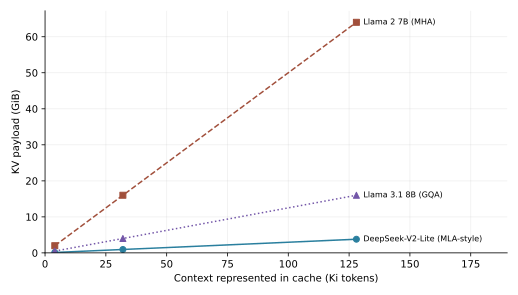

# Attention, Position, and Long Context [F+S] {#sec-ch03}

## What you need going in {#sec-ch03-prerequisites}

> **Assumed:** neural-network fundamentals, matrix multiplication, basic Python, and beginner PyTorch.
>
> **From earlier chapters:** [Chapter 2, Cache Past Keys and Values Exactly](02-transformer-first-principles.qmd#sec-ch02-kv-cache) — cached decoding reuses projected keys and values without changing the next-token function; [Chapter 2, Multi-Head Attention and the Causal Mask](02-transformer-first-principles.qmd#sec-ch02-multihead) — each query head performs a causal weighted lookup.
>
> **Not required:** distributed training, GPU-kernel programming, serving schedulers, or prior knowledge of rotary position embeddings.

## Contents {#sec-ch03-contents}

- [The bill arrives before the answer](#sec-ch03-bill)
- [What you will build](#sec-ch03-will-build)
- [The canonical KV-cache equation](#sec-ch03-kv-equation)
- [Share keys and values: MQA and GQA](#sec-ch03-gqa)
- [Compress the cache: MLA](#sec-ch03-mla)
- [Restrict visibility: windows, interleaving, and sinks](#sec-ch03-patterns)
- [RoPE encodes relative position by rotation](#sec-ch03-rope)
- [Stretching RoPE changes the coordinate system](#sec-ch03-scaling)
- [No position, dropped position, and distributed context](#sec-ch03-alternatives)
- [Advertised context is not effective context](#sec-ch03-effective)
- [Benchmark the failure you actually care about](#sec-ch03-benchmarks)
- [Build](#sec-ch03-build)
- [What endures, what changes](#sec-ch03-endures)
- [Exercises](#sec-ch03-exercises)
- [Notes and sources](#sec-ch03-notes)

## The Bill Arrives Before the Answer {#sec-ch03-bill}

An agent has spent an hour reading a repository, opening issue threads, running tests, and refining a patch. Its transcript has reached 128K tokens. The next request adds only a few words: “now fix the race.” The serving system must preserve enough state for every attention layer to make that small continuation depend on the entire retained history.

For a conventional 32-layer, 32-head attention model with 128-dimensional heads and two-byte cached scalars, that one conversation's keys and values occupy 64 GiB at 128K tokens. This is payload alone: no model weights, activations, allocator metadata, temporary attention workspace, or safety margin. At 4K tokens the same state occupies 2 GiB. Context length changed by a factor of 32; persistent attention state changed by the same factor.

That is the long-context economic story. Token limits are product-interface facts, but cache bytes determine how many live sessions fit in memory. Attention work determines how long the next token takes. Retrieval quality determines whether preserving all that state bought anything useful. A senior engineer has to keep the three ledgers separate:

1. **Capacity:** how many bytes remain live for the request?
2. **Computation:** how much work does prefill or the next decode step perform?
3. **Capability:** does the model use the relevant evidence at this length and position?

A KV cache removes repeated projection of old tokens. It does not make dense decoding constant-time. At decode step $T$, the new query still scores the retained keys and mixes their values, so attention work for that step remains linear in $T$. Dense prefill still contains a quadratic attention term. And a large accepted window does not establish accurate retrieval, synthesis, or reasoning throughout that window.

The mechanisms in this chapter bend one of those curves. Multi-query and grouped-query attention share cached heads. Multi-head latent attention stores a compressed representation. Sliding windows stop most tokens from remaining visible to most queries. RoPE supplies a relative positional coordinate system, while extension methods alter its frequencies. Long-context benchmarks test whether the model's useful window grew with its declared one. None is a free “long context” switch.

## What you will build {#sec-ch03-will-build}

::: {.callout-tip}
**The chapter artifact.** [`kv_math.py`](../code/ch03/kv_math.py) contains the book's single canonical KV-byte function, one grouped-query layer whose KV-head dial spans MHA, GQA, and MQA, and an inspectable MLA-style layer. [`rope.py`](../code/ch03/rope.py) implements RoPE, NTK-aware base scaling, and YaRN's frequency-by-parts and magnitude scaling. [`run_build.py`](../code/ch03/run_build.py) loads three dated configuration excerpts, writes exact footprint tables, exercises both attention layers, and runs a seeded synthetic needle probe over 21 positions. The default is offline and deterministic. Success means the analytic bytes match known cases, cached chunks preserve grouped-attention outputs, RoPE preserves its relative-offset invariant, and every plotted point comes from a saved CSV.
:::

This is one progressive artifact, not a serving runtime. It owns architecture arithmetic and a mechanism probe. Chapter 9 will use the equation when analyzing inference behavior; Chapter 10 will use it for capacity planning and add paging, allocation, eviction, cache precision, and kernels. Those later chapters should cite this declaration rather than creating a competing formula.

## The Canonical KV-Cache Equation {#sec-ch03-kv-equation}

Start from one layer. For every retained token and request in a batch, standard attention caches one key and one value for each KV head. Define:

| Symbol | Meaning |
|---|---|
| $B$ | sequences represented in the cache |
| $T$ | retained tokens per sequence |
| $L$ | attention layers |
| $H_{kv}$ | key-value heads per layer |
| $d_h$ | scalar dimensions in each cached head |
| $s$ | bytes per cached scalar |

The payload is

$$
\operatorname{KVBytes}=B\,T\,L\,(2H_{kv}d_h)\,s.
$$

The factor of two is not an informal safety factor: it is one tensor for keys and one for values. $H_{kv}d_h$ is the width of each tensor's per-token slice. Multiplying by layers, tokens, batch, and scalar width accounts for every stored element. This equation assumes a uniform architecture, equal key and value widths, and an append-only unquantized cache. Hybrid layers require summing layer-specific terms. Padding, sharding, alignment, replication, and runtime metadata belong in a deployment capacity model, not silently inside this payload equation.

The opening example follows directly:

$$
2\cdot32\cdot32\cdot128\cdot2
=524{,}288\text{ bytes/token}=512\text{ KiB/token}.
$$

Multiplying by 4,096 tokens gives exactly 2 GiB. Multiplying by 131,072 gives exactly 64 GiB. Both use binary units: one KiB is ${2^{10}}$ bytes and one GiB is ${2^{30}}$ bytes. Decimal “K tokens” is often used loosely in model interfaces, so a capacity review must record the exact token count.

The implementation declares the equation once:

```python
def kv_bytes(config: KVConfig, tokens: int, batch: int = 1) -> int:
    return (
        batch
        * tokens
        * config.layers
        * config.cached_scalars_per_layer_token()
        * config.bytes_per_scalar
    )
```

`cached_scalars_per_layer_token()` returns ${2H_{kv}d_h}$ for standard attention. The separate method lets an MLA-style configuration state its different stored width without declaring a second byte formula.

The equation also prevents a common complexity error. Caching avoids recomputing old $K$ and $V$ projections. It does not eliminate reading those tensors or computing the new query's scores against them. Memory is $O(T)$ for fixed architecture and batch. Dense attention work for a single new token is $O(T)$; producing a length-$T$ continuation from a growing cache sums those steps. Prefill's dense attention score work is $O(T^2)$. “The KV cache makes generation $O(1)$” confuses avoided projection work with total decode work.

::: {.callout-note .landscape-2026}
### Landscape 2026 — Configuration-derived footprints

The local fixtures record only fields needed for cache accounting, with provenance beside each excerpt. At batch one and two bytes per cached scalar, the generated payloads are:

| Published configuration | Cache design | 4,096 tokens | 32,768 tokens | 131,072 tokens |
|---|---|---:|---:|---:|
| Llama 2 7B | 32-head MHA | 2.00 GiB | 16.00 GiB | 64.00 GiB |
| Llama 3.1 8B | 8 KV-head GQA | 0.50 GiB | 4.00 GiB | 16.00 GiB |
| DeepSeek-V2-Lite | 512-wide latent plus 64-wide rotary key | 0.119 GiB | 0.949 GiB | 3.797 GiB |

{#fig-ch03-kv-footprints fig-alt="Directly labeled line plot of KV-cache GiB versus context length for an MHA, GQA, and MLA-style published configuration. Square-dashed MHA has the steepest line, triangle-dotted GQA is four times smaller, and circle-solid MLA-style is smaller again."}

These are architecture comparisons, not model rankings. Layer counts and widths differ, and the MLA row uses the compressed state described by its implementation. Real allocated memory can be higher or differently sharded.

**Verify live:** re-download the official model configuration or report recorded in the [Llama 2](../code/ch03/fixtures/llama2-7b/config.json), [Llama 3.1](../code/ch03/fixtures/llama31-8b/config.json), and [DeepSeek-V2-Lite](../code/ch03/fixtures/deepseek-v2-lite/config.json) excerpts, compare the relevant fields, and regenerate the CSV and figure before using these rows in a capacity decision. **Verified:** 2026-07-19.
:::

@fig-ch03-kv-footprints answers one narrow question: how does architecture change the bytes-per-token slope? It does not answer which model is more capable, which kernel is faster, or how many requests a server admits. A useful admission estimate subtracts weights, workspaces, and reserve from available device memory, then divides the remainder by per-request KV payload. Chapter 10 makes that estimate operational.

::: {.artifact-checkpoint}
| Artifact state | New code | Invariant now verified |
|---|---:|---|
| `kv_math.py`: configuration plus `kv_bytes()` | 45 lines | The 32-layer MHA example is 512 KiB per token and exactly 2 GiB at 4,096 tokens. |
:::

## Share Keys and Values: MQA and GQA {#sec-ch03-gqa}

Multi-head attention ordinarily gives every query head its own key head and value head. If $H_q=H_{kv}$, it is **multi-head attention** (MHA). Query projections are transient during autoregressive decoding; the historical keys and values persist. Reducing $H_{kv}$ therefore removes a factor from the state that grows with both users and context.

**Multi-query attention** (MQA) takes the reduction to its endpoint: all $H_q$ query heads share one key head and one value head, so $H_{kv}=1$. **Grouped-query attention** (GQA) uses an intermediate number. If $H_q=32$ and $H_{kv}=8$, each KV head serves four query heads. Query heads retain separate query projections and can ask different questions; heads in a group compare against the same keys and receive the same value representation before the output projection mixes results.

For fixed $B,T,L,d_h,$ and $s$, the cache ratio against MHA is simply

$$
\frac{\operatorname{KVBytes}_{\mathrm{grouped}}}
{\operatorname{KVBytes}_{\mathrm{MHA}}}
=\frac{H_{kv}}{H_q}.
$$

| Mode with 32 query heads | KV heads | Query heads per KV head | Cache ratio versus MHA |
|---|---:|---:|---:|
| MHA | 32 | 1 | ${1}$ |
| GQA-8 | 8 | 4 | ${1/4}$ |
| GQA-4 | 4 | 8 | ${1/8}$ |
| MQA | 1 | 32 | ${1/32}$ |

The ratio does not say that quality falls in the same proportion. It counts stored elements, not representational value. The GQA work showed that an MHA checkpoint can be converted by grouping KV heads and then uptrained on a fraction of the original pretraining compute, recovering much of the quality while approaching MQA speed. The right head count is empirical and workload-dependent.

The reference layer projects compact keys and values, caches them in shape $[B,H_{kv},T,d_h]$, and only then repeats groups for the teaching implementation's attention computation:

```python
present = (k, v)                 # compact state owns H_kv heads
repeats = query_heads // kv_heads
k_compute = k.repeat_interleave(repeats, dim=1)
v_compute = v.repeat_interleave(repeats, dim=1)
scores = q @ k_compute.transpose(-2, -1) / head_dim**0.5
```

This logical expansion explains the semantics, but a production kernel should avoid physically materializing repeated tensors. That requirement matters: an architectural byte reduction that falls onto an unsupported or inefficient kernel can lose its latency advantage. Kernel and hardware support gate adoption even when the algebra is favorable; Chapter 10 owns the kernel-level comparison.

The dial also makes three tests possible without three implementations. Output shape stays $[B,T,d]$. Stored tensor shape follows $H_{kv}$, not $H_q$. Token-by-token cached output agrees with the full causal pass. Only after all three pass is the smaller cache a valid optimization.

::: {.artifact-checkpoint}
| Artifact state | New code | Invariant now verified |
|---|---:|---|
| `GroupedQueryAttention`: one KV-head dial | 61 new lines | MHA, GQA, and MQA preserve output shape; stored scalar counts follow the exact 4:2:1 KV-head ratio; cached chunks match a full pass. |
:::

## Compress the Cache: MLA {#sec-ch03-mla}

Head sharing chooses fewer full-width KV representations. **Multi-head latent attention** (MLA) attacks a different boundary: store one low-rank latent representation from which content keys and values can be reconstructed.

For residual state $x_t\in\mathbb{R}^{d}$ at token $t$, an MLA-style layer forms

$$
c_t^{KV}=W^{DKV}x_t,
\qquad c_t^{KV}\in\mathbb{R}^{r},quad r\ll H_qd_h.
$$

Head-specific up-projections derive content keys and values from $c_t^{KV}$. A direct implementation would reconstruct every historical key and value at every step, exchanging memory traffic for substantial extra matrix work. MLA's useful implementation property is that linear projection matrices can be absorbed into query and output-side operations, so attention can operate with the compressed latent more directly.

RoPE complicates that absorption. A position-dependent rotation lies between the up-projection and dot product, so the matrices do not commute in the needed way. DeepSeek-V2's solution is **decoupled RoPE**: split each query and key into a content part and a smaller rotary part. The content key comes from the latent. A shared rotary key is projected separately, rotated, and cached alongside the latent. The score for query head $i$ is conceptually

$$
(q^{C}_{t,i})^\top k^{C}_{j,i}
+(q^{R}_{t,i})^\top k^{R}_{j}.
$$

The persistent width per layer and token becomes $r+d_R$, not ${2H_{kv}d_h}$. Its payload therefore uses the canonical outer accounting structure:

$$
\operatorname{MLABytes}=B\,T\,L\,(r+d_R)\,s.
$$

This is not “free compression.” Rank $r$ constrains the information shared through the latent; up- and down-projections add parameters and compute; the absorbed execution path changes kernel requirements. Compression helps most when moving KV bytes is the bottleneck and the stack has an efficient MLA path. Later work such as TransMLA formalizes conversions from GQA to an MLA representation and then compresses the stored latent, but the capacity reduction and quality recovery still require a deliberate conversion and adaptation procedure. Renaming projections does not compress an existing checkpoint.

`ToyLatentKVAttention` exposes the boundary instead of implementing the absorbed production algebra. It caches tensors with shapes $[B,T,r]$ and $[B,T,d_R]$, rotates the latter at absolute positions, and explicitly reconstructs content keys and values. For $B=1,T=8,r=8,d_R=4$, the measured cache contains 96 scalars. A same-width four-head MHA cache would contain 768. The toy demonstrates what is retained; it is not a latency claim about MLA.

## Restrict Visibility: Windows, Interleaving, and Sinks {#sec-ch03-patterns}

Sharing and compression preserve full causal visibility. Another strategy changes which keys a query may see.

A **sliding-window** layer lets position $t$ attend only to the most recent $W$ positions. Once the sequence exceeds $W$, its retained KV payload can be bounded by substituting $\min(T,W)$ for $T$ in that layer's term. Its attention-score work is also bounded by $W$ per query. The cost is architectural: information older than the window cannot be reached directly through that layer.

Stacking local layers expands the receptive field because an older token can influence newer summaries across layers, but indirect reachability is not equivalent to one-hop access. Exact copying, cross-file dependency tracing, and evidence attribution can be sensitive to that distinction. A common compromise interleaves local and full layers. Local layers handle nearby syntax and state; periodic global layers restore direct long-range paths. The total cache is then a sum: windowed terms for local layers plus length-$T$ terms for global layers.

```{mermaid}
%%| label: fig-ch03-attention-patterns
%%| fig-cap: "Which historical tokens can the final query read under full, windowed, interleaved, and sink-preserving attention?"
flowchart LR
    subgraph F["Full layer"]
      direction LR
      F1["all history"] --> FQ["final query"]
    end
    subgraph W["Windowed layer"]
      direction LR
      WO["older tokens"] -. "not visible" .-> WQ["final query"]
      WR["recent W tokens"] --> WQ
    end
    subgraph I["Interleaved stack"]
      direction LR
      IL["local layer"] --> IG["periodic global layer"] --> IQ["final query"]
    end
    subgraph S["Window plus sinks"]
      direction LR
      SS["first sink tokens"] --> SQ["final query"]
      SR["recent W tokens"] --> SQ
    end
```

@fig-ch03-attention-patterns separates four masks that are too often called merely “efficient attention.” The decision question is not whether a token is somewhere in the request. It is whether a causal path of the required length and precision connects it to the query.

StreamingLLM identified a surprising failure in naive rolling windows: keeping only recent tokens can destabilize language models even when the evicted initial tokens are not semantically important. Attention tends to assign substantial probability to early positions, which act as **attention sinks** for excess probability. Retaining a small prefix of sink tokens alongside the rolling window restored stable streaming behavior in its experiments. Sink retention is therefore a mask and training-compatibility mechanism, not long-term semantic memory. A sink token being visible does not make an evicted tool result recoverable.

::: {.callout-note .landscape-2026}
### Landscape 2026 — Efficient patterns remain empirical choices

The official MiniMax M2 architecture note reports choosing full attention after its hybrid alternatives degraded on long-context agent tasks. That result is a useful counterexample to treating local, linear, or hybrid attention as a universal upgrade; another workload or training recipe can reach a different conclusion.

**Verify live:** review the current official [MiniMax M2 design note](https://platform.minimax.io/docs/guides/text-m2-full-attention) and the released configuration before carrying this example into an architecture decision. **Verified:** 2026-07-19.
:::

## RoPE Encodes Relative Position by Rotation {#sec-ch03-rope}

Attention without positional information is permutation-equivariant before the causal mask: the same token representations in a different order do not carry an explicit coordinate. Rotary position embeddings (RoPE) inject position into queries and keys while making their dot product depend on relative displacement.

Take two coordinates $(x_{2j},x_{2j+1})$ in an even-dimensional rotary subspace. At position $m$, rotate the pair by angle $m\omega_j$:

$$
R_j(m)=
\begin{bmatrix}
\cos(m\omega_j)&-\sin(m\omega_j)\\
\sin(m\omega_j)& \cos(m\omega_j)
\end{bmatrix},
\qquad
\omega_j=b^{-2j/d_R}.
$$

$d_R$ is the rotary dimension and $b$ is the frequency base. Small $j$ gives a high-frequency band that rotates quickly; large $j$ gives a low-frequency band that changes slowly. RoPE applies the block-diagonal collection of these rotations to $q_m$ and $k_n$, but not to the value.

Rotation matrices are orthogonal, so they preserve vector norm. More importantly,

$$
(R(m)q)^\top(R(n)k)
=q^\top R(m)^\top R(n)k
=q^\top R(n-m)k.
$$

Shift both positions by the same offset $c$ and the score is unchanged, because $(n+c)-(m+c)=n-m$. The tests verify this numerically across a 100-position shift. This is the central RoPE invariant: the attention score exposes relative offset through multiple frequency bands without adding a learned absolute position vector to the residual stream.

The implementation rotates interleaved pairs:

```python
angles = positions[:, None] * frequencies[None, :]
even, odd = vectors[..., 0::2], vectors[..., 1::2]
rotated_even = even * angles.cos() - odd * angles.sin()
rotated_odd = even * angles.sin() + odd * angles.cos()
```

Relative dependence does not guarantee unlimited length generalization. During training, the network sees only a bounded distribution of distances and phases. Some low-frequency dimensions may not complete one rotation inside that range, allowing the model to use them like near-absolute coordinates. At inference, a much longer sequence presents phase combinations and relative distances the learned projections did not experience.

Absolute offsets also matter in implementation. During chunked prefill or cached decoding, a new chunk beginning after 20,000 cached tokens must use positions starting at 20,000. Restarting its local position counter at zero rotates new queries in a coordinate system inconsistent with cached keys. Tensor shapes still pass; retrieval and cached/full equivalence fail. Position IDs are cache state even though they consume far fewer bytes than keys and values.

ALiBi is a useful contrast, not this chapter's second derivation. It adds a head-specific linear penalty proportional to query-key distance directly to attention logits. It avoids a rotation table and has different extrapolation behavior, but still imposes a positional inductive bias and does not turn training at one length into a guarantee at every length.

::: {.artifact-checkpoint}
| Artifact state | New code | Invariant now verified |
|---|---:|---|
| `rope.py`: frequency bands plus pairwise rotation | 42 lines | Norm is preserved and equal relative offsets produce equal query-key dot products after a shared shift. |
:::

## Stretching RoPE Changes the Coordinate System {#sec-ch03-scaling}

Suppose a model trained through context $T_0$ must be evaluated at $T_1=aT_0$. A RoPE extension changes how positions map into phases. It does not add evidence to training data or teach the model a long-document task.

**Position interpolation** (PI) maps position $m$ to $m/a$. Equivalently, it divides every frequency by $a$. Positions through $T_1$ then occupy the original phase range. The cost is compressed local resolution: high-frequency bands that formerly distinguished nearby offsets now move $a$ times more slowly.

**NTK-aware scaling** changes the base rather than dividing all bands equally. The common base rule implemented here is

$$
b'=b\,a^{d_R/(d_R-2)}.
$$

Because the first frequency remains one while later frequencies shrink increasingly, high-frequency local information is preserved more than under PI and low-frequency bands absorb more extension. The “NTK-aware” name describes the motivation, not a theorem that a particular checkpoint will preserve quality.

**YaRN** combines two mechanisms. Its NTK-by-parts rule leaves short-wavelength dimensions unscaled, interpolates long-wavelength dimensions, and ramps between them according to how many rotations each band completed within $T_0$. It also changes attention temperature. The reference implementation multiplies both rotated queries and keys by

$$
m(a)=0.1\ln(a)+1\quad\text{for }a>1,
$$

which scales their dot product by $m(a)^2$ before softmax. These parts address different failures: frequency interpolation manages phase extrapolation, while magnitude scaling adjusts attention entropy. Treating YaRN as only a `rope_scaling` label omits half the method.

| Method | What changes | Main tradeoff |
|---|---|---|
| Position interpolation | all positions or frequencies uniformly | stays in the old phase range but compresses local resolution |
| NTK-aware | frequency base, nonuniformly across bands | preserves the highest band but depends on an empirical base rule |
| YaRN | wavelength-dependent interpolation plus attention magnitude | adds tunable boundaries and is strongest as a training recipe, not a magic inference flag |
| Adjusted base frequency (ABF) | manually chosen larger base | simple, but the base and training length remain model-specific |
| LongRoPE | searched nonuniform rescaling factors, often with progressive extension | more flexible, with search and adaptation cost |

Three engineering rules follow. First, extension factor is part of the model configuration and must match training or adaptation. Second, short-context regression matters: a method can improve far positions while blurring local order or changing attention entropy. Third, cache semantics matter. Dynamic schemes whose scale changes with current sequence length may require keys before rotation or a consistent rerotation strategy; otherwise earlier and later cache entries use different maps.

The build implements fixed-scale NTK-aware and YaRN maps because their distinctions are educational and testable. It surveys PI, ABF, and LongRoPE without presenting five drop-in implementations. A production adoption still depends on fine-tuning data, target lengths, precision, attention kernel support, and evaluations at both original and extended lengths.

## No Position, Dropped Position, and Distributed Context {#sec-ch03-alternatives}

RoPE extension is not the only possible response to length generalization.

**NoPE** removes explicit positional embeddings. A causal mask still gives computation an order: position $t$ has access to $t+1$ prefix states while an earlier position has fewer. Experiments on length generalization have found that causal Transformers without explicit position encodings can infer useful relative and absolute signals and can extrapolate surprisingly well on some tasks. The absence of an explicit encoding is not the absence of order, nor is it a universal quality win. Position-sensitive tasks, optimization, and architecture details decide the result.

**DroPE** treats explicit position as a training scaffold. The published method starts from a model trained with positional embeddings, removes them, and performs a short recalibration at the original context length. Its reported experiments motivate a useful distinction: an inductive bias can make training easier yet become an extrapolation constraint later. It is an emerging conversion method, not permission to delete RoPE from an arbitrary production checkpoint without recovery evaluation.

Long context can also be a systems property rather than a new positional formula. **Ring Attention** partitions a long sequence across devices. Each device holds a query block while KV blocks circulate around a ring; blockwise attention overlaps communication with computation and uses online softmax accumulation. The global semantic pattern remains dense. The total logical KV state and dense arithmetic have not vanished; they are partitioned so a sequence longer than one device's memory can be trained or evaluated. Chapter 6 owns distributed training details, and Chapter 10 owns distributed serving.

**Dual Chunk Attention** partitions positions into chunks and defines different rotary relations for tokens within the same chunk, in earlier chunks, and in adjacent chunks. It is a context-extension transformation aimed at keeping local relations familiar while representing much larger global offsets. Like RoPE scaling, it changes the coordinate map and needs evaluation against the model and task. It is not the same as a sliding visibility window: tokens in distant chunks can remain attendable.

This survey sets a decision boundary. If the problem is **state bytes**, change head sharing, compression, or visibility. If it is **position extrapolation**, change or remove the coordinate mechanism with adaptation. If it is **single-device capacity**, partition sequence state and compute. A method can address more than one boundary, but its paper headline should not substitute for tracing which term actually changed.

## Advertised Context Is Not Effective Context {#sec-ch03-effective}

“Context window” hides at least three quantities:

- **Accepted context:** the largest request the interface and runtime admit.
- **trained or adapted context:** the length distribution represented during optimization.
- **effective context:** the positions and lengths over which a specified task remains above a specified quality threshold.

Only the third is a capability statement, and it is task-specific. A model can accept a large tensor, maintain finite perplexity, recover a literal passkey, and still fail to combine two indirect facts in the middle of a repository. Effective context is a measured surface over length, position, distractor structure, and task—not one scalar copied from a model card.

The “Lost in the Middle” experiments demonstrated position sensitivity in long-context language models: on their multi-document question answering and key-value retrieval settings, relevant information was often used better near the beginning or end than in the middle. That U-shaped result is evidence about tested models and tasks, not a law derived from RoPE. Primacy can arise from attention and instruction patterns; recency from causal proximity and training distribution; distractors and task format alter both.

The broader term **context rot** describes quality degrading as more nominally relevant or distracting context is added. Chroma's controlled study reports degradation across multiple task families and models, including cases where every added token belongs to the task. This warns against a fixed folklore threshold such as “the useful window is 30–40 percent of advertised.” There is no universal fraction. Measure the deployed model, prompt format, evidence distribution, and success criterion.

The local probe isolates one mechanism. Each of 256 seeded trials creates a noisy 32-dimensional query, a matching key, and 127 random distractor keys. The query is at the last position; the needle moves from the start to near the end. The probe applies unscaled RoPE, NTK-aware scaling, or YaRN for a fourfold extension, then asks whether the matching key receives the highest dot product. It is an attention diagnostic, not a language model or a reproduction of Lost in the Middle.

{#fig-ch03-rope-retrieval fig-alt="Directly labeled retrieval-rate plot over needle depth. Circle-solid unscaled RoPE is oscillatory and weakest for many distant positions, square-dashed NTK-aware scaling improves its mean, and triangle-dotted YaRN has the highest mean but remains imperfect. Shading shows 95 percent binomial intervals."}

Across the 21 depths, mean top-1 retrieval is 0.600 for unscaled RoPE, 0.696 for NTK-aware scaling, and 0.832 for YaRN. Near the query, all methods benefit from small relative displacement. Farther away, frequency phase and aliasing create an oscillatory rather than smooth decay. YaRN flattens much of the failure but leaves position-dependent errors. Because the fixture has no language training, instruction hierarchy, or attention sinks, its curve must not be used as evidence that a production model has the same shape. Its value is causal: changing only the coordinate map changes retrieval.

::: {.callout-note .landscape-2026}
### Landscape 2026 — A maximum-window claim is a hypothesis

Meta's official Llama 4 announcement and Scout model card advertise support for a 10-million-token context window. That is a valid interface and architecture claim to test, not evidence that every task remains accurate at every depth through 10 million tokens. Record the exact checkpoint, runtime, prompt, and evaluation surface before translating the number into a product requirement.

**Verify live:** inspect the current official [Llama 4 announcement](https://ai.meta.com/blog/llama-4-multimodal-intelligence/) and [Scout model card](https://huggingface.co/meta-llama/Llama-4-Scout-17B-16E-Instruct), then run the target task at stratified lengths and positions. **Verified:** 2026-07-19.
:::

For agents, context quality is also state quality. A transcript mixes policy, user requests, tool schemas, observations, failed plans, code, and summaries. Even perfect literal retrieval may select a superseded instruction or confuse observation with authority. Chapter 13 owns the context-engineering response—selection, ordering, compression, and provenance. This chapter establishes why “send everything” is neither a capacity plan nor an evaluation plan.

## Benchmark the Failure You Actually Care About {#sec-ch03-benchmarks}

A benchmark is useful when its failure mode matches the application. Long-context evaluation evolved because easy retrieval tests saturated before realistic understanding did.

| Benchmark family | What it adds | What a pass does not prove |
|---|---|---|
| Needle-in-a-Haystack (NIAH) | place a literal key or passkey at controlled depths and lengths | indirect association, distractor resistance, synthesis, or reasoning |
| RULER | combines retrieval with multi-hop tracing, aggregation, and question answering across controlled lengths | performance on natural repositories, conversations, or domain evidence |
| NoLiMa | removes literal lexical overlap and requires one- or two-hop association using model knowledge | general long-document reasoning or agent-state correctness |
| LongBench v2 | realistic long single- and multi-document QA, dialogue, code, structured data, and in-context learning tasks | the deployed prompt, tool protocol, latency target, or private data distribution |

NIAH remains a good smoke test. It is cheap, position-controlled, and catches truncation, position-ID, and gross retrieval failures. It saturates first because exact lexical cues let attention match the query and needle directly. Passing it should trigger harder tests, not a “long context solved” declaration.

RULER varies sequence length and includes several synthetic task structures, making effective length easier to compare than with one passkey. NoLiMa deliberately removes surface-form overlap: the query and needle connect through latent knowledge, so simple keyword matching no longer solves the task. LongBench v2 moves toward realistic, reasoning-heavy tasks, including repository and structured-data understanding. As realism rises, attribution becomes harder; preserve synthetic diagnostics alongside end-to-end tasks so a regression can be localized.

A serious evaluation grid records at least:

1. exact tokenizer length, not character count;
2. relevant-evidence depth and span width;
3. total length and number of distractors;
4. literal, associative, aggregation, and reasoning task types;
5. original-window baselines and short-context regression;
6. accuracy or task utility with confidence intervals;
7. prefill latency, decode latency, peak memory, and failure category.

Do not average the grid immediately. A single score can hide a dead middle, a sharp cliff after the trained length, or success only when the needle is adjacent to the query. Plot length by depth, stratify by task, and inspect incorrect outputs. For agent workloads, add temporal validity: whether the selected fact is current or superseded, whether tool output is confused with instruction, and whether two separated observations are joined correctly. Chapter 22 turns these cases into a broader evaluation system.

The benchmark should also test the chosen mechanism. GQA and MLA require quality comparisons at the same context and decoding policy. Windowed attention requires evidence beyond the window and across the interleaving schedule. RoPE extension requires original-length and extended-length tests. Distributed attention requires numerical agreement with an undistributed reference. Capacity, computation, and capability return as three separate acceptance gates.

## Build {#sec-ch03-build}

Run the deterministic artifact from the `newbook` directory:

```powershell
python code/ch03/run_build.py
python -m pytest tests/test_ch03_long_context.py -q
```

The build writes five generated files under `code/ch03/generated/`:

- `kv-footprints.csv` contains exact bytes and GiB for every configuration and context;
- `rope-retrieval.csv` contains successes, trials, accuracy, and standard error at every depth;
- `metrics.json` records both tables, attention shape checks, mean retrieval rates, seed, dimensions, and the diagnostic's claim boundary;
- `kv-footprints.svg` renders the cache slopes used in @fig-ch03-kv-footprints;
- `rope-retrieval.svg` renders the position sweep and binomial intervals used in @fig-ch03-rope-retrieval.

Read the artifact in dependency order. First inspect the three `config.json` excerpts for [Llama 2](../code/ch03/fixtures/llama2-7b/config.json), [Llama 3.1](../code/ch03/fixtures/llama31-8b/config.json), and [DeepSeek-V2-Lite](../code/ch03/fixtures/deepseek-v2-lite/config.json). Recompute their cached scalar width from the architecture: ${2H_{kv}d_h}$ for MHA or GQA, and $r+d_R$ for the MLA-style case. Multiply by layers and scalar bytes. `kv-footprints.csv` should then be predictable before opening it.

Second, change only `kv_heads` in `GroupedQueryAttention`. The tests use four query heads and KV-head settings four, two, and one. Their cached scalar counts are 640, 320, and 160 for the two-sequence, five-token fixture. Output shape remains unchanged. The incremental-cache test then compares all token outputs against a full causal pass.

Third, inspect the latent layer. Its explicit up-projections make it slower than an absorbed implementation may be, but the cache contains only the latent and shared rotary key. Confirm the 96-scalar build measurement from ${1\cdot8\cdot(8+4)}$.

Fourth, run the RoPE invariant tests before reading retrieval accuracy. Pair rotation must preserve norm. Shifting both query and key positions by 100 must preserve their dot product when relative offset is unchanged. PI must divide all frequencies uniformly; NTK-aware scaling must retain the highest frequency and reduce lower bands; YaRN bands must lie between unscaled and fully interpolated frequencies for this fixture.

Finally, inspect the retrieval CSV rather than only the plot. Predict which positions are hardest under an end-position query, rerun with another registered seed family, and report uncertainty. If a scaling change improves the mean but damages near positions, that is a tradeoff to investigate rather than a plotting nuisance.

**Honesty note.** The calculator reports tensor payload, not allocated serving memory. The model configurations are dated excerpts, not downloaded live. The grouped layer uses logical head repetition rather than a fused production kernel. The MLA layer demonstrates stored state but omits projection absorption. The retrieval probe has no trained language model and cannot exhibit semantic lost-in-the-middle behavior; it isolates rotary phase effects. No result here proves a provider's maximum window, production latency, or model quality. Those claims require model- and hardware-specific adapters and the benchmark grid above.

## What Endures, What Changes {#sec-ch03-endures}

**What endures.** Persistent attention state is the product of represented sequences, tokens, layers, cached width, and scalar bytes. MHA, GQA, MQA, and MLA differ chiefly in what width must persist. Caching avoids old projections but leaves dense decode attention linear in retained length. Visibility masks determine causal paths, not merely storage. RoPE rotates query-key coordinate pairs so scores expose relative displacement; length extension changes that coordinate map. Accepted, trained, and effective context are different quantities. Every long-context claim needs capacity, computation, and capability measurements.

**What changes.** Head ratios, latent ranks, rotary dimensions, frequency bases, scaling recipes, training lengths, cache formats, attention patterns, kernels, benchmark saturation, model-card limits, and hardware balance change. NoPE and post-training position removal may mature; distributed and sparse attention implementations will move; today's difficult retrieval suite may become tomorrow's smoke test. Keep dated configuration facts in the landscape blocks and rerun them. Preserve the equations, tensor-shape checks, relative-position invariant, and evaluation grid.

## Exercises {#sec-ch03-exercises}

1. **Audit a new configuration.** Choose a published gpt-oss-class configuration and record $L,H_q,H_{kv},d_h,$ and cache dtype from its primary config. Compute batch-one payload at 32K and 128K tokens by hand, then add a dated fixture without changing `kv_bytes()`. Which factor dominates, and which facts require live verification?
2. **Reach MQA by configuration.** Set `kv_heads=1` in `GroupedQueryAttention` while holding width and query heads fixed. Predict cache shape and scalar ratio before running. Add a cached/full equivalence test and explain why the output shape alone cannot prove correctness.
3. **Break the rotary offset.** Modify the toy latent layer so every appended chunk restarts positions at zero. Construct a two-chunk comparison against a full pass, plot error by position, and identify why tensor shapes and cache bytes remain valid while attention changes.
4. **Make retrieval associative.** Replace the direct matching needle with two separated records: entity-to-alias and alias-to-value. Require the query to recover the value without shared surface tokens. Report length-by-depth results and explain which part moves the probe toward NoLiMa and which language-model abilities it still lacks.
5. **Defend a 40 GiB capacity estimate.** Given a model-weight allocation, workspace reserve, and one configuration from the build, derive the maximum batch at 32K and 128K tokens. Round down, state binary versus decimal units, and list runtime overheads that make the result an upper bound.
6. **Review a “1M context” roadmap.** Write a one-page design defense that separates accepted, trained, and effective context. Specify a length-by-depth benchmark grid, short-context regression gate, KV budget, latency gate, and residual risk. Use the build's plot only for its synthetic mechanism claim.

## Notes and Sources {#sec-ch03-notes}

- Shazeer, [“Fast Transformer Decoding: One Write-Head Is All You Need”](https://arxiv.org/abs/1911.02150), introduces multi-query attention. Ainslie et al., [“GQA: Training Generalized Multi-Query Transformer Models from Multi-Head Checkpoints”](https://arxiv.org/abs/2305.13245), develops grouped-query attention and MHA-checkpoint uptraining.
- DeepSeek-AI, [“DeepSeek-V2: A Strong, Economical, and Efficient Mixture-of-Experts Language Model”](https://arxiv.org/abs/2405.04434), is the primary source for MLA, the compressed KV latent, decoupled RoPE, and matrix absorption. Meng, Yao, and Zhang, [“TransMLA: Multi-Head Latent Attention Is All You Need”](https://arxiv.org/abs/2502.07864), studies conversion from GQA models.
- Xiao et al., [“Efficient Streaming Language Models with Attention Sinks”](https://arxiv.org/abs/2309.17453), identifies sink behavior and the prefix-plus-window streaming pattern.
- Su et al., [“RoFormer: Enhanced Transformer with Rotary Position Embedding”](https://arxiv.org/abs/2104.09864), introduces RoPE and derives its relative-position property.
- Chen et al., [“Extending Context Window of Large Language Models via Positional Interpolation”](https://arxiv.org/abs/2306.15595), introduces position interpolation. Peng et al., [“YaRN: Efficient Context Window Extension of Large Language Models”](https://arxiv.org/abs/2309.00071), specifies NTK-by-parts interpolation and attention-temperature scaling; the authors' [reference repository](https://github.com/jquesnelle/yarn) is the implementation source used here.
- Ding et al., [“LongRoPE: Extending LLM Context Window Beyond 2 Million Tokens”](https://arxiv.org/abs/2402.13753), studies searched nonuniform interpolation and progressive extension.
- Kazemnejad et al., [“The Impact of Positional Encoding on Length Generalization in Transformers”](https://arxiv.org/abs/2305.19466), compares positional mechanisms and analyzes NoPE. Gelberg et al., [“Extending the Context of Pretrained LLMs by Dropping Their Positional Embeddings”](https://arxiv.org/abs/2512.12167), introduces DroPE.
- Liu et al., [“Ring Attention with Blockwise Transformers for Near-Infinite Context”](https://arxiv.org/abs/2310.01889), distributes blockwise attention over a device ring. An et al., [“Training-Free Long-Context Scaling of Large Language Models”](https://arxiv.org/abs/2402.17463), introduces Dual Chunk Attention.
- Liu et al., [“Lost in the Middle: How Language Models Use Long Contexts”](https://arxiv.org/abs/2307.03172), measures position-dependent long-context use. Chroma's [Context Rot report](https://www.trychroma.com/research/context-rot) broadens the empirical study across models and task structures; it is a direct research report rather than a peer-reviewed primary paper.
- Hsieh et al., [“RULER: What's the Real Context Size of Your Long-Context Language Models?”](https://arxiv.org/abs/2404.06654), builds a controlled multi-task synthetic suite. Modarressi et al., [“NoLiMa: Long-Context Evaluation Beyond Literal Matching”](https://arxiv.org/abs/2502.05167), removes literal query-needle overlap. Bai et al., [“LongBench v2”](https://arxiv.org/abs/2412.15204), evaluates realistic long-context understanding and reasoning tasks.
