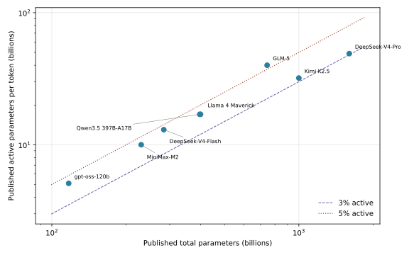

# Mixture-of-Experts, Efficient Architectures, and the 2026 Landscape [F+S] {#sec-ch04}

## What you need going in {#sec-ch04-prerequisites}

> **Assumed:** neural-network fundamentals, matrix multiplication, gradient-based optimization, basic Python, and beginner PyTorch.
>
> **From earlier chapters:** [Chapter 2, The Residual Stream and a Modern Block](02-transformer-first-principles.qmd#sec-ch02-residual) — including the dense token-wise FFN that MoE replaces; [Chapter 3, The Canonical KV-Cache Equation](03-attention-position-long-context.qmd#sec-ch03-kv-equation) — the single byte equation reused by this chapter; [Chapter 3, Share Keys and Values](03-attention-position-long-context.qmd#sec-ch03-gqa) and [Compress the Cache](03-attention-position-long-context.qmd#sec-ch03-mla) — two attention-state designs that appear in real configurations below.
>
> **Not required:** distributed-training collectives, custom GPU kernels, state-space scan derivations, or prior experience deploying an MoE model.

## Contents {#sec-ch04-contents}

- [Two curves, one config](#sec-ch04-two-curves)
- [What you will build](#sec-ch04-will-build)
- [Routing turns a dense FFN into conditional compute](#sec-ch04-routing)
- [Balance is the optimization problem](#sec-ch04-balance)
- [The MoE design space and its systems tax](#sec-ch04-design-space)
- [Linear attention and state-space models change memory](#sec-ch04-linear-state)
- [Fixed state forces a recall tradeoff](#sec-ch04-fixed-state)
- [Hybrids and learned sparsity restore selective recall](#sec-ch04-hybrids)
- [Diffusion LMs and multi-token prediction change decoding](#sec-ch04-decoding)
- [Read the economics from `config.json`](#sec-ch04-config)
- [Landscape 2026: the moving edge](#sec-ch04-landscape)
- [Build](#sec-ch04-build)
- [What endures, what changes](#sec-ch04-endures)
- [Exercises](#sec-ch04-exercises)
- [Notes and sources](#sec-ch04-notes)

## Two Curves, One Config {#sec-ch04-two-curves}

Suppose an agent model is described as “one trillion parameters, 32 billion active.” Both numbers are true, but they answer different engineering questions. The trillion parameters determine how much learned capacity exists, how much weight storage must be downloaded and retained, and how much traffic model loading or expert movement can create. The 32 billion active parameters approximate how many weights participate for one token, which influences arithmetic and weight reads during that token's forward pass. An accelerator does not gain a trillion-parameter model merely by provisioning memory for 32 billion parameters.

This separation is the first economic story in the chapter:

$$
\text{stored capacity} \ne \text{per-token active computation}.
$$

A dense feed-forward network applies the same large parameter matrices to every token. A mixture-of-experts (MoE) layer stores many feed-forward networks and routes each token to a small subset. Adding experts can grow total capacity while leaving the selected count fixed. The idea predates Transformers, but the sparsely gated MoE, GShard, and Switch Transformer made conditional computation practical at language-model scale. The price is a new learned subsystem—the router—and a new systems constraint: tokens selected for an expert must reach the device that owns it.

Now consider an agent reading a million-token trace. Dense attention preserves token-addressable keys and values, so persistent state grows with retained context. Linear attention and state-space models instead update a fixed-size recurrent state. Their second economic story is different:

$$
\text{persistent sequence state} \not\propto T,
$$

for a fixed architecture, even as sequence length $T$ grows. Constant state can make streaming and long decoding attractive, but it cannot preserve an unbounded number of independent facts with perfect fidelity. The model must compress, forget, overwrite, or periodically consult token-addressable memory.

These two stories are orthogonal. MoE sparsifies **which parameters** process a token. Linear or recurrent mixers change **how sequence history** is represented. A model may be dense with full attention, MoE with full attention, dense with recurrent mixers, or a hybrid MoE containing both recurrent and full-attention layers. “Efficient architecture” is therefore not one axis and not one benchmark score. It is a vector of weight capacity, active computation, persistent state, communication, kernel fit, and recall behavior.

The durable skill is to reconstruct that vector rather than memorize model names. The fastest first source is often a public `config.json`: hidden width, layer count, expert count, selected experts, shared-expert width, attention cadence, KV heads, latent ranks, and recurrent-state dimensions. The rest of this chapter develops enough mechanism to read those fields without treating marketing parameter counts as a complete deployment plan.

## What you will build {#sec-ch04-will-build}

::: {.callout-tip}
**The chapter artifact.** [`moe_min.py`](../code/ch04/moe_min.py) implements a top-$k$ router, a local toy MoE, an auxiliary-loss-free balancing update, a small gated linear-attention recurrence, and a synthetic associative-recall capacity probe. [`config_reader.py`](../code/ch04/config_reader.py) parses dense, MoE-plus-MLA, and hybrid-MoE configuration excerpts. It imports Chapter 3's canonical `kv_bytes()` rather than redefining cache arithmetic. [`run_build.py`](../code/ch04/run_build.py) performs one deterministic build: it trains collapsed and balanced routers, reconstructs parameter counts, computes state at 32,768 tokens, runs the bounded-state probe, and writes every plotted point to CSV and JSON.

Success means that all three total-parameter estimates are within two percent of their published counts; the intentionally biased router visibly collapses without a balancing term and distributes load with one; recurrent chunking matches full-sequence execution; and a fixed-state lookup loses exact recall as independent associations exceed its capacity. This is an architecture laboratory, not a throughput benchmark or distributed MoE runtime.
:::

## Routing Turns a Dense FFN into Conditional Compute {#sec-ch04-routing}

Let $x\in\mathbb{R}^d$ be one token representation and let $E_i(x)$ be expert $i$'s feed-forward transformation. A router produces logits

$$
r=W_rx,
$$

converts them to scores $p$, and selects a set $I(x)$ of the $k$ largest scores. With softmax routing, $p_i=\exp(r_i)/\sum_j\exp(r_j)$. Some architectures use independent sigmoid scores before selection. A typical output is

$$
y=\sum_{i\in I(x)} g_i E_i(x),
\qquad
g_i=\frac{p_i}{\sum_{j\in I(x)}p_j}.
$$

The normalization is over selected experts. Top-1 routing can use its single gate directly or set it to one, depending on the implementation. Top-2 or larger $k$ lets multiple experts contribute but raises active computation and dispatch volume. Selection is discrete; gradients flow through selected gate values and through any differentiable balancing objective, not through an ordinary derivative of the top-$k$ index operation.

The reference router keeps the observables needed to debug it:

```python
logits = self.projection(tokens)
probabilities = logits.softmax(-1)
indices = (probabilities + self.selection_bias).topk(self.top_k, dim=-1).indices
weights = probabilities.gather(-1, indices)
load = one_hot(indices, self.experts).float().sum(1).mean(0) / self.top_k
```

The `selection_bias` supports a balancing controller discussed next. It changes which experts win but does not change their output gates. Keeping those roles separate prevents a balancing correction from silently rescaling expert contributions.

### The two parameter ledgers

For a SwiGLU-like expert with model width $d$ and intermediate width $h_e$, the three dominant matrices contain approximately

$$
P_e \approx 3dh_e
$$

parameters: gate and value projections up, then a projection down. If a layer stores $E$ routed experts, selects $k$, and always applies $S$ shared-expert equivalents, its expert ledgers are approximately

$$
P_{\mathrm{expert,total}}=(E+S)P_e,
\qquad
P_{\mathrm{expert,active}}=(k+S)P_e.
$$

Router, attention, norms, embeddings, and output-head parameters are common to both ledgers. Dense layers before the first MoE layer are also always active. This is why “active parameters” is not just total parameters multiplied by $k/E$. The common trunk can be a large fraction in a fine-grained MoE.

Parameter count is also not FLOPs. Activations, attention, normalization, routing, and communication remain. Nor is active count resident memory. If every expert is available at low latency, the weights must exist somewhere in the serving topology. Quantization can reduce their bytes; expert offloading can trade memory for transfers; neither changes the logical total count.

Routing is token-level, not sequence-level. Two adjacent tokens may choose different experts, and the same expert may process tokens from unrelated languages or domains. Visualizations sometimes reveal statistical specialization, but expert IDs are not guaranteed to be human-readable job titles. The useful contract is behavioral: the router chooses parameter subsets that jointly reduce the training objective while satisfying whatever balance pressure the system applies.

## Balance Is the Optimization Problem {#sec-ch04-balance}

A router initialized with a slight preference can create a positive feedback loop. The favored expert receives more tokens, therefore more task gradient, therefore becomes more useful, therefore receives still more tokens. Other experts become undertrained. This **router collapse** wastes stored parameters and creates severe device imbalance even when aggregate accelerator capacity is ample.

Two statistics distinguish probability mass from actual assignments. For expert $i$ in a batch of $N$ tokens, define

$$
f_i=\frac{1}{Nk}\sum_{n=1}^{N}\mathbf{1}[i\in I(x_n)]
$$

as its hard routed fraction, and

$$
P_i=\frac{1}{N}\sum_{n=1}^{N}p_i(x_n)
$$

as its mean router score. A Switch-style auxiliary loss is

$$
L_{\mathrm{balance}}=E\sum_{i=1}^{E}f_iP_i.
$$

Implementations usually stop the gradient through $f_i$ because top-$k$ assignments are discrete; $P_i$ supplies a differentiable pressure. The minimum is near uniform use, but the coefficient matters. Too little pressure permits collapse. Too much asks the router to optimize a uniform histogram instead of the language-model objective, suppressing useful conditional specialization.

Router logits can also grow to unstable magnitudes. ST-MoE introduced the router $z$-loss

$$
L_z=\frac{1}{N}\sum_{n=1}^{N}
\left(\log\sum_{i=1}^{E}\exp r_i(x_n)\right)^2,
$$

which discourages extreme log-partition values. It solves a numerical-stability problem, not load balance itself. Treating the two losses as interchangeable makes diagnosis harder.

An alternative keeps balancing out of the task loss. Maintain a per-expert selection bias $b_i$ and route with $p_i+b_i$. After measuring load, lower the bias of overloaded experts and raise the bias of underloaded experts:

$$
b_i\leftarrow b_i+\eta\,\operatorname{sign}\left(\frac{1}{E}-f_i\right).
$$

Subtracting the mean bias removes an irrelevant common offset. DeepSeek-V3 demonstrated this auxiliary-loss-free family at large scale. It is a feedback controller: its update rate, measurement window, and interaction with data parallelism require tuning. A sequence-wise auxiliary term can still be useful to avoid local bursts even when global balancing is bias-controlled.

{#fig-ch04-router-load fig-alt="Two side-by-side bar charts for four experts. The unbalanced router sends all tokens to expert zero. The balanced router sends roughly one quarter to each expert."}

The build intentionally starts expert 0 with a logit advantage. After 300 seeded steps, the unbalanced run routes 100 percent of held-out tokens to expert 0 and reaches 98.35 percent toy classification accuracy. With balance weight ${0.5}$, the loads are 26.57, 23.05, 24.56, and 25.82 percent, with 97.34 percent accuracy. This does not establish a production coefficient; it isolates the collapse mechanism. The important lesson is that task loss can look healthy while most experts are dead and one device is overloaded.

### Capacity, overflow, and dropless routing

Communication implementations often allocate each expert a token capacity

$$
C=\left\lceil c\frac{Nk}{E}\right\rceil,
$$

where $c\ge 1$ is a capacity factor. When more than $C$ assignments reach an expert, a system can drop overflow, route it to a lower-ranked expert, pad larger buffers, or use a dropless variable-size implementation. Dropping keeps static shapes and bounded communication but removes expert computation for some tokens. Rerouting changes the function chosen by the router. Dropless routing preserves assignments but exposes imbalance directly as stragglers and uneven buffers.

Monitor at least per-layer load, probability entropy, overflow or drop rate, tokens per destination rank, and the gap between the busiest and median expert. An average histogram over an entire training run can hide short hot spots that determine step time. Balance is simultaneously an optimization objective and a distributed-systems service-level objective.

## The MoE Design Space and Its Systems Tax {#sec-ch04-design-space}

“An MoE” leaves several independent choices unspecified:

| Choice | Smaller or simpler end | Larger or richer end | Consequence |
|---|---|---|---|
| Routed experts $E$ | few, wider experts | many, fine-grained experts | more capacity choices, smaller token groups |
| Selected experts $k$ | top-1 | top-2 or higher | less compute versus ensemble-like mixing |
| Shared path | none | one or more shared experts | all-token capacity and extra active cost |
| Layer placement | periodic MoE | nearly every FFN is MoE | lower versus higher conditional capacity |
| Early stack | MoE from layer 0 | dense-first | immediate sparsity versus stable shared feature formation |
| Scoring | softmax | sigmoid plus normalization | coupled versus independent preselection scores |
| Balance | auxiliary loss | bias controller or hybrid | direct gradient pressure versus external feedback |
| Overflow | capacity and drops | dropless dispatch | static buffers versus dynamic imbalance |

A coarse MoE stores relatively few large experts. A fine-grained MoE divides the same or greater total capacity among many small experts and selects several. Fine granularity offers more combinations—choosing 8 of 256 is a richer code than choosing 1 of 8—but each expert receives fewer tokens per step, which can make matrix operations smaller and expert training noisier. Shared experts provide a dense path for common transformations, yet they appear in every active-parameter calculation.

Layer placement matters as much as expert count. If only every fourth FFN is sparse, three quarters of FFN layers remain dense. If initial layers are dense, their parameters are always active. A model name such as `A3B` may summarize one publisher's counting convention rather than the exact number obtained by summing every common projection. Always state whether embeddings, output heads, attention, routers, shared experts, norms, and multimodal encoders are included.

The systems tax begins after top-$k$. Under expert parallelism, each rank owns a subset of experts. Tokens start where preceding tensor or data-parallel work produced them; routing creates a permutation by destination expert. A conceptual layer therefore performs:

1. compute router scores and assignments;
2. pack token states by destination rank and expert;
3. exchange variable token groups, commonly with an all-to-all collective;
4. run local expert matrix multiplications;
5. exchange outputs back and restore token order;
6. combine selected expert outputs using their gates.

Small experts can turn compute into communication. Skew creates stragglers. Padding wastes bandwidth; variable sizes complicate scheduling. Topology matters because crossing a node boundary is not equivalent to moving within one accelerator fabric. These facts explain why equal active-parameter counts can have different latency, but the engineering of expert placement, overlap, dispatch kernels, and fault handling belongs to Chapters 6 and 10. At this point retain one rule: conditional FLOPs are not free if the chosen weights or token activations are far away.

MoE also changes failure analysis. A corrupt or unavailable expert affects only routed tokens, creating input-dependent degradation. Quantizing experts can have heterogeneous error. Fine-tuning a sparse model may starve rarely selected experts. Capacity planning must cover total resident weights and peak routed traffic, not merely average active parameters.

## Linear Attention and State-Space Models Change Memory {#sec-ch04-linear-state}

Softmax attention retains token-addressable keys and values. Linear attention begins by replacing the softmax similarity with a feature map whose kernel factorizes:

$$
\operatorname{sim}(q,k)\approx \phi(q)^\top\phi(k).
$$

For causal attention, associate first and sum second. With key feature width $m$ and value width $d_v$, maintain

$$
S_t=\lambda_t S_{t-1}+\phi(k_t)v_t^\top,
\qquad
z_t=\lambda_t z_{t-1}+\phi(k_t),
$$

then compute

$$
y_t=\frac{\phi(q_t)^\top S_t}
{\phi(q_t)^\top z_t+\epsilon}.
$$

$S_t$ has shape $m\times d_v$ and $z_t$ has width $m$, independent of $t$. The learned decay $\lambda_t$ can forget old content. More expressive delta-rule variants update memory using the difference between a new value and the value currently retrieved by its key, reducing destructive accumulation. Gates can make writing, retaining, and erasing input-dependent.

The reference block is deliberately small:

```python
state = decay[:, :, None] * state + einsum("bf,bd->bfd", key, value)
normalizer = decay * normalizer + key
numerator = einsum("bf,bfd->bd", query, state)
output = numerator / (query * normalizer).sum(-1, keepdim=True)
```

The same recurrence processes an entire sequence or accepts the returned state one token at a time; the tests require both paths to match. For batch $B$, feature width $m$, and value width $d_v$, this didactic state contains $B(md_v+m)$ scalars no matter how many tokens have passed. A production gated delta or SSM block has different states and kernels, but the fixed-state contract remains.

### From S4 to selective state spaces

A linear state-space model writes

$$
h_t=A h_{t-1}+B x_t,
\qquad
y_t=C h_t+D x_t.
$$

The challenge is to make the recurrence expressive, stable over long horizons, and efficient during parallel training. S4 structured $A$ so the corresponding long convolution could be computed efficiently. Mamba made state-space parameters input-dependent, letting the model select what to propagate or forget, and supplied a hardware-aware scan. Mamba-2's structured state-space duality showed that useful SSMs and attention-like matrix transformations are closely related rather than opposing species.

That lineage now includes gated delta networks, Kimi Delta Attention, and recurrent families such as RWKV. Names differ in update rule, normalization, gating, convolutional local path, and training algorithm. The engineering questions are more stable:

| Question | Full softmax attention | Fixed-state linear or recurrent mixer |
|---|---|---|
| Persistent history | token-addressable KV entries | compressed recurrent matrices or vectors |
| State growth with $T$ | linear for a fixed architecture | constant for a fixed architecture |
| Decode history work | reads retained history | recurrent update independent of $T$ |
| Parallel training | attention matrix with optimized kernels | chunkwise, scan, or dual matrix form |
| Exact arbitrary lookup | direct content-addressable path | limited by compressed state |
| Implementation sensitivity | attention kernel and cache layout | update-rule fusion and scan/chunk kernels |

“Linear” can describe asymptotic training work, a kernelized attention identity, or a recurrent decode path. It does not guarantee lower wall-clock latency at every sequence length. Dense attention benefits from exceptionally mature matrix kernels; recurrent operators may need specialized fusion and can be less parallel in naive code. Compare end-to-end throughput, memory, quality, and batch behavior on the target runtime.

## Fixed State Forces a Recall Tradeoff {#sec-ch04-fixed-state}

A fixed-size state is a lossy compression channel. Imagine writing $n$ arbitrary key-value pairs and later querying any key. Full attention can retain one addressable representation per pair. A state with a fixed number of independent slots must eventually map distinct histories to the same or nearby representation. Without assumptions about the data, exact retrieval of unbounded independent associations is impossible at fixed precision.

Multi-query associative recall (MQAR) exposes this pressure. A sequence supplies key-value pairs, then repeats keys whose values must be emitted. It removes much of natural language's redundancy: the model cannot rely on topic or grammar to reconstruct a forgotten random value. State expansion, better update rules, and learned feature maps postpone interference; they do not repeal the information bottleneck.

{#fig-ch04-fixed-state-mqar fig-alt="Recall accuracy versus number of key-value pairs. Full attention remains perfect. Fixed states with eight and thirty-two slots decline as pair count increases, with thirty-two slots consistently better."}

The probe behind @fig-ch04-fixed-state-mqar is intentionally not a trained language model. It hashes each key to a bounded slot and stores the most recent value in that slot. At 128 pairs, the 8-slot state recalls 6.18 percent exactly and the 32-slot state recalls 24.32 percent, while the token-addressable reference remains at 100 percent. This makes one collision mechanism visible without attributing a benchmark score to an architecture family.

Real recurrent models distribute information across continuous dimensions rather than literal hash buckets. They can exploit structure, compress correlated facts, learn selective forgetting, and answer many tasks without exact token recall. The plot therefore supports a bounded claim: fixed state creates a capacity tradeoff, and increasing state improves the tradeoff. It does not say that a 32-dimensional SSM attains the plotted rate or that full attention is universally better.

For agents, the distinction matters. Summarizing a conversation's intent is compression-friendly. Reproducing an exact identifier, line of code, or tool result from an arbitrary earlier position is associative recall. A workload with long streams and modest exact lookup may favor recurrence. A repository agent that must retrieve any of thousands of unique symbols benefits from periodic token-addressable attention, external retrieval, or both. Architecture evaluation should include the memory behavior of the intended task, not perplexity alone.

## Hybrids and Learned Sparsity Restore Selective Recall {#sec-ch04-hybrids}

Hybrids combine cheap streaming layers with occasional token-addressable layers. If $L_f$ layers use full attention and $L_r$ use fixed-state mixers, persistent sequence state is approximately

$$
\operatorname{StateBytes}(T)
=\operatorname{KVBytes}(L_f,T)+L_rP_{\mathrm{state}}s,
$$

where the first term uses the canonical equation from [Chapter 3](03-attention-position-long-context.qmd#sec-ch03-kv-equation), $P_{\mathrm{state}}$ is recurrent scalars per layer, and $s$ is bytes per scalar. Only the full-attention layers contribute a context-proportional KV term. A cadence with three recurrent layers followed by one full-attention layer preserves a periodic exact-retrieval path while cutting the KV slope to roughly one quarter of an otherwise comparable all-attention stack.

Cadence is not enough to predict quality. Layer order, state width, local convolutions, attention head design, training length distribution, and residual pathways all matter. The useful systems observation is additive: sum state by layer type. Do not apply an all-attention cache formula to every layer in a hybrid, and do not call the whole stack constant-memory merely because most layers recur.

Sparse attention takes a different route: retain a token-addressable history but compute only selected interactions. Fixed windows and block patterns are easy to express but encode a predetermined visibility bias. Learned selectors can adapt retrieval to the query:

- **Native Sparse Attention (NSA)** trains compression, fine-grained selection, and local sliding branches end to end, while co-designing block structure for hardware efficiency.
- **Mixture of Block Attention (MoBA)** routes a query to selected key-value blocks, applying the MoE idea to attention regions and allowing a path between sparse and full modes.
- **DeepSeek Sparse Attention (DSA)** uses a lightweight learned indexer to score historical tokens and selects a fine-grained top-$k$ set for the main attention computation.

Learned sparsity must be trained or adapted with the backbone. Taking a dense-attention checkpoint and applying a post hoc mask changes the function under a distribution the model did not learn, and the selector itself can miss evidence. Selection cost also matters: an indexer that scores every past token may reduce expensive value mixing while retaining a linear search term. Block granularity, index caches, selector precision, and sparse kernels determine whether asymptotic savings become wall-clock savings.

The design triangle is now visible. Full attention preserves direct access but grows state and work. Fixed-state recurrence bounds state but compresses history. Learned sparse attention keeps addressable history and chooses a subset, paying index and miss-risk costs. Hybrids place these mechanisms where each is useful. There is no architecture label that removes the need to measure recall, state, and runtime together.

## Diffusion LMs and Multi-Token Prediction Change Decoding {#sec-ch04-decoding}

Autoregressive language models factor a sequence left to right:

$$
p(x_{1:T})=\prod_{t=1}^{T}p(x_t\mid x_{<t}).
$$

This supplies a simple cacheable interface but imposes a sequential dependency between committed output tokens. Two research lines relax different parts of that contract.

A diffusion language model corrupts tokens or representations and learns to reverse the corruption over a sequence or block. At inference it initializes masked or noisy positions and refines many positions over several denoising steps. Because positions can change before commitment, the model can revise a block and perform infilling naturally. Latency depends on block size, number and schedule of denoising steps, confidence-based remasking, kernel efficiency, and how much prefix state can be reused. “Multiple tokens in parallel” is not itself a speed guarantee: one refinement step may process the whole block, and several steps may be required.

Multi-token prediction (MTP) usually preserves an autoregressive trunk. At each training position, several heads predict successive future tokens:

$$
L_{\mathrm{MTP}}=\sum_{j=1}^{n}\lambda_j
\operatorname{CE}\!\left(p_j(x_{t+j}\mid h_t),x_{t+j}\right).
$$

This gives the shared representation denser future supervision. After training, auxiliary heads may be discarded, or they can propose multiple future tokens for speculative verification. Verification against the target model preserves its exact distribution when implemented correctly; accepting unverified drafts does not. MTP therefore spans a training objective and a serving opportunity, while diffusion changes the generative factorization itself.

::: {.callout-note .landscape-2026}
### Landscape 2026 — Parallel text generation is now a product question

Diffusion text models have moved beyond small research demonstrations, but reported speed numbers remain workload- and hardware-specific. Google DeepMind's experimental Gemini Diffusion page reports an average sampling speed of 1,479 tokens per second excluding 0.84 seconds of overhead. Inception's Mercury technical report reports 1,109 tokens per second for Mercury Coder Mini and 737 for Small on NVIDIA H100 GPUs, based on independent evaluations cited by the report. Inception announced Mercury 2 in July 2026 with a reported 1,009 tokens per second on NVIDIA Blackwell GPUs. These figures use different models, hardware, quality points, and accounting conventions; they are evidence of a viable design space, not a universal comparison against autoregressive serving.

Current autoregressive releases also expose MTP-derived draft models or multi-step training. The operational question is no longer “does the paper predict several tokens?” but “does the deployed engine exploit the extra heads, what acceptance rate does it obtain, and what latency metric includes verification and overhead?” Chapter 10 owns those serving measurements.

**Verify live:** check the current [Gemini Diffusion model page](https://deepmind.google/models/gemini-diffusion/), [Mercury technical report](https://arxiv.org/abs/2506.17298), [Mercury 2 announcement](https://www.inceptionlabs.ai/blog/introducing-mercury-2), and the target engine's documentation before using any throughput claim in a design review. **Verified:** 2026-07-19.
:::

The durable comparison is dependency structure. Autoregression commits one next token. Speculative MTP proposes several but verifies them. Diffusion refines a block through repeated passes. Their output-token counters are not automatically comparable, and agent latency includes time to first useful action, tool waits, and repeated model calls—not just steady-state generated tokens per second.

## Read the Economics from `config.json` {#sec-ch04-config}

A configuration is not a complete implementation specification, but it is often enough to reject a bad capacity assumption. Read it in four passes.

**Pass 1: the common trunk.** Record `hidden_size`, `num_hidden_layers`, `vocab_size`, embedding tying, normalization style, and dense `intermediate_size`. Embedding and output matrices can materially affect smaller active counts. Count them once if tied and twice otherwise.

**Pass 2: attention state.** Record query heads, KV heads, head dimension, latent rank, decoupled rotary-key width, and which layers actually use full attention. Standard GQA caches keys and values; MLA-style configurations cache a latent plus a rotary component; hybrid configurations cache KV only in their attention layers. Feed those fields into the Chapter 3 equation rather than inventing a model-specific shortcut.

**Pass 3: experts.** Look for routed-expert count, selected experts per token, per-expert intermediate width, shared-expert width or count, dense-first layers, and MoE frequency. Field names vary: `n_routed_experts` and `num_experts` may mean the same thing; `num_experts_per_tok` usually means selected routed experts and may exclude a shared expert. Inspect model code or report when the semantics are ambiguous.

**Pass 4: non-attention state.** A linear mixer may expose key/value head counts, state dimensions, convolution width, and a full-attention interval. Recurrent state can include matrix memories and short convolution buffers. It is fixed with respect to context length but scales with batch, layers, heads, precision, and any tensor-parallel replication.

The parser uses leading-order matrix counts. For a dense layer it adds GQA projections, approximately ${3}dh$ for SwiGLU, and two norm vectors. For MoE layers it counts every stored expert in `total_params` and selected plus shared experts in `active_params`. For hybrid layers it separately counts full-attention and linear mixers. Biases and some specialized parameters are included where the public structure makes them material; exact framework totals may include or omit buffers and modality components.

::: {.callout-note .landscape-2026}
### Landscape 2026 — Three configuration reconstructions

The integrated build parses dated excerpts from three public configurations:

| Configuration | Architecture signal | Estimated total | Published total | Estimated active | State at 32,768 tokens, batch 1, BF16 |
|---|---|---:|---:|---:|---:|
| Llama 3.1 8B | dense, 32 layers, 8 KV heads | 8.030B | 8B | 8.030B | 4.000 GiB KV |
| DeepSeek-V3 | 256 routed, top-8 plus shared, MLA | 671.026B | 671B | 37.552B | 2.145 GiB KV |
| Qwen3-Next 80B-A3B | 512 routed, top-10 plus shared, 3:1 linear/full | 79.574B | 80B | 3.774B | 0.750 GiB KV + 0.0368 GiB fixed state |

Total-count errors are 0.38, 0.004, and -0.53 percent, respectively. The Qwen active reconstruction exceeds the marketed 3B label because this parser includes embeddings, output head, token mixers, routers, norms, and the shared expert; the label uses its publisher's convention. That disagreement is useful: “active parameters” needs a written counting boundary.

The rows are architectural accounting, not quality or speed comparisons. Their widths, layers, precision assumptions, and attention mechanisms differ. Real serving memory adds model weights, allocator effects, temporary workspaces, parallel duplication, and batch-specific state.

**Verify live:** compare the local excerpts with the official [Llama 3.1 8B config](https://huggingface.co/meta-llama/Llama-3.1-8B/blob/main/config.json), [DeepSeek-V3 Base config](https://huggingface.co/deepseek-ai/DeepSeek-V3-Base/blob/main/config.json), and [Qwen3-Next 80B-A3B config](https://huggingface.co/Qwen/Qwen3-Next-80B-A3B-Instruct/blob/main/config.json), then rerun the parser before making a deployment decision. **Verified:** 2026-07-19.
:::

The contrasting rows expose both economic stories. The MoE-plus-MLA example bends the active-weight curve. The recurrent/full-attention MoE bends the context-state curve, but its periodic attention layers still contribute context-proportional KV state. Neither ledger alone says whether a model fits or runs efficiently on a specific topology.

## Landscape 2026: The Moving Edge {#sec-ch04-landscape}

::: {.callout-note .landscape-2026}
This section is intentionally removable. The equations, mechanisms, build, and config-reading method above do not depend on these model snapshots.

{#fig-ch04-landscape-scatter fig-alt="Log-log scatter plot of total versus active parameters for eight mixture-of-experts models. Dashed guide lines show three and five percent active fractions, and most points fall near that band."}

As of the verification date, a visible open-weight trend is very large stored capacity with a low single-digit active fraction. The generated fixture records DeepSeek-V4-Pro at 1.6T total and 49B active, DeepSeek-V4-Flash at 284B and 13B, Kimi K2.5 at 1T and 32B, Qwen3.5 397B-A17B, GLM-5 at 744B and 40B, MiniMax-M2 at 230B and 10B, gpt-oss-120b at 117B and 5.1B, and Llama 4 Maverick at 400B and 17B. @fig-ch04-landscape-scatter shows published counting conventions, not parser-normalized counts.

Architecture combinations are diversifying at the same time:

- DeepSeek-V4's model card describes MoE with a hybrid of compressed sparse and heavily compressed attention; Pro and Flash trade total and active scale.
- Kimi K2.5 reports 384 routed experts, top-8 selection plus one shared expert, and MLA.
- Qwen3.5 397B-A17B reports 60 layers organized as repeated groups of three Gated DeltaNet layers followed by one gated full-attention layer, with 512 experts, top-10 routing, and a shared expert.
- GLM-5 reports 744B total, 40B active, and DeepSeek Sparse Attention. MiniMax-M2 retained the small active fraction, while later [deployment guidance for the M2 family](https://platform.minimax.io/docs/guides/text-m2-full-attention) documents full-attention variants—evidence that sparse attention is not a one-way migration.
- Llama 4 introduced MoE to that family; Maverick reports 128 experts and 17B active. OpenAI's gpt-oss-120b reports 117B total and 5.1B active.
- Google's Gemma 4 family spans edge, dense, unified, and a 26B A4B MoE design; its model card describes hybrid local/global attention and MTP draft models. This is a reminder that the frontier includes deployment-targeted families, not only trillion-parameter checkpoints.

Several choices now look established enough to design around: conditional FFN computation is a mainstream capacity lever; shared-KV or compressed-KV attention is common in long-context systems; and hybrid layer stacks are credible production architectures. Still contested are the best expert granularity, shared-expert design, auxiliary loss versus bias control, the ratio and placement of full attention, token- versus block-level learned sparsity, whether fixed-state mixers should dominate the stack, and whether diffusion decoding becomes a default rather than a specialized serving point.

**Verify live:** recheck every record in [`landscape_models.json`](../code/ch04/fixtures/landscape_models.json) against its linked official model card; then review the current official cards for [Qwen3.5 397B-A17B](https://huggingface.co/Qwen/Qwen3.5-397B-A17B), [Kimi K2.5](https://huggingface.co/moonshotai/Kimi-K2.5), [GLM-5](https://huggingface.co/zai-org/GLM-5), [Gemma 4](https://ai.google.dev/gemma/docs/core), and any successor models. Update the dated fixture rather than rewriting the durable sections. **Verified:** 2026-07-19.
:::

## Build {#sec-ch04-build}

Run the entire offline artifact from the book root (`newbook/` in this workspace):

```bash
python code/ch04/run_build.py
pytest -q tests/test_ch04_efficient_architectures.py
```

The build has no network dependency. Its public configuration excerpts and landscape records carry source URLs and a verification date. It writes:

| Output | What it makes auditable |
|---|---|
| `config-estimates.csv` | every parameter, active-fraction, and 32K state estimate |
| `router-loads.csv` | per-expert held-out load and task metrics for both router conditions |
| `mqar-capacity.csv` | trials underlying the fixed-state recall curves |
| `landscape-models.csv` | the dated total-versus-active scatter inputs |
| `metrics.json` | all rows plus experiment contracts and claim boundaries |
| three SVG files | figures generated directly from the saved measurements |

The reference parser explicitly imports `KVConfig` and `kv_bytes` from Chapter 3. This dependency is deliberate: one repository should not accumulate slightly different cache formulas. The parser's hybrid estimate constructs a cache configuration with only 12 full-attention layers, then adds fixed recurrent state for the other 36 layers.

The tests enforce seven contracts: router tensor shapes and normalized selected gates; balancing-bias direction; collapse prevention; recurrence chunk equivalence and fixed state size; bounded-state recall degradation; total-count reconstruction within two percent and known KV cases; and emission of all evidence files. The seeded router is the slowest part because it performs two short optimization runs. It uses one CPU thread and fixed generators so reruns are stable.

To inspect a new architecture, copy only the fields required for accounting into a dated fixture, add a parser branch, and state the counting convention. Do not silently force an unfamiliar config into the nearest known schema. If a field such as `num_experts_per_tok` includes shared experts in one implementation and excludes them in another, resolve it from the model code or report and capture that decision in the fixture.

The build excludes distributed all-to-all timing, production kernels, quantized weight packing, and language-model quality. Those require hardware and checkpoints and would turn a deterministic architecture lesson into an environment-specific benchmark. The generated evidence answers narrower questions: what is stored, what is active by a stated convention, how much sequence state grows, and what failure mechanism appears in a controlled toy system.

## What Endures, What Changes {#sec-ch04-endures}

**Endures:**

- Total parameters, active parameters, FLOPs, resident bytes, communication bytes, and sequence-state bytes are different ledgers.
- Sparse top-$k$ routing needs a balance mechanism and operational load measurements; a low task loss does not prove healthy expert use.
- Shared experts and common trunk parameters are active for every token and must be counted explicitly.
- Expert parallelism turns routing decisions into data movement; topology and skew can dominate nominal compute savings.
- A fixed-size recurrent state cannot preserve an unbounded number of independent exact associations at fixed precision.
- Hybrid architectures are sums of layer-specific costs. Cache arithmetic must include only layers that actually maintain KV state.
- A configuration field is evidence only after its semantics and counting boundary are understood.

**Changes:**

- Expert counts, granularity, top-$k$, shared paths, dense-first depth, and balancing controllers.
- The preferred recurrence—SSM, gated delta, linear attention, or a successor—and the kernels that make it practical.
- The cadence among recurrent, local, sparse, and full-attention layers.
- Learned sparse-attention selectors, index granularity, and cache strategy.
- Whether MTP heads are discarded, used for drafting, or integrated into an engine-specific decoding path.
- The quality-speed frontier for diffusion language models and the metrics vendors use to report it.
- Model names and published total/active counts in the dated landscape.

The senior-engineering habit is stable: translate architecture labels into ledgers and invariants, then measure the target runtime and recall workload. “MoE,” “linear,” “hybrid,” and “diffusion” begin an investigation; none completes one.

## Exercises {#sec-ch04-exercises}

1. **Reconstruct an MoE layer.** A model has width $d=4{,}096$, $E=64$ routed SwiGLU experts of width $h_e=1{,}024$, top-$k=2$, and one shared expert of the same width. Ignoring biases and the router, compute total expert parameters, active expert parameters, and the active fraction. Then explain why the model-wide active fraction will differ.

2. **Diagnose a router.** Extend `train_router()` to log load every ten steps. Run balance weights of ${0}$, ${0.01}$, ${0.1}$, ${0.5}$, and ${2}$. Plot maximum load and task accuracy. Identify a range that prevents collapse without making the balance term the apparent task, and state why the result cannot be transferred directly to a large-language-model run.

3. **Compare overflow policies.** For $N=8{,}192$, $E=32$, top-$k=2$, and capacity factors ${1.0}$, ${1.1}$, and ${1.25}$, compute per-expert capacity. Construct a skewed load vector and quantify assignments dropped under static capacity. Discuss how rerouting and dropless dispatch change correctness and step-time risks.

4. **Break the fixed state.** Modify `mqar_capacity_curve()` to use two independent hash tables and return a value only when they agree. Compare recall and state size with the one-table probe. Explain whether the modification removes the asymptotic bottleneck or only changes its constant.

5. **Audit a new config.** Choose a public dense, MoE, or hybrid model configuration not present in `fixtures/`. Write a field-semantics table, estimate total and active parameters under an explicit convention, and compute batch-one state at 32,768 tokens using Chapter 3's `kv_bytes()`. Record source URL and verification date. List every omitted parameter family.

6. **Design an agent backbone.** Compare an all-attention MoE, a 3:1 recurrent/full hybrid MoE, and a learned sparse-attention MoE for an agent that reads large repositories and must reproduce exact identifiers. Give a weighted decision matrix for resident weights, per-token computation, persistent state, exact recall, implementation maturity, and distributed communication. Specify the experiments that could reverse your choice.

## Notes and Sources {#sec-ch04-notes}

The conditional-computation lineage starts with Shazeer et al., [*Outrageously Large Neural Networks: The Sparsely-Gated Mixture-of-Experts Layer*](https://arxiv.org/abs/1701.06538), followed here by [GShard](https://arxiv.org/abs/2006.16668), [Switch Transformers](https://arxiv.org/abs/2101.03961), and [ST-MoE](https://arxiv.org/abs/2202.08906). Switch motivates top-1 routing and its auxiliary balance objective; ST-MoE develops stability guidance including router $z$-loss. The [DeepSeek-V3 technical report](https://arxiv.org/abs/2412.19437) is the primary source for its total/active counts, auxiliary-loss-free balancing, MLA-plus-MoE architecture, and multi-token prediction objective. Exact fixture fields come from the linked official configs.

For the fixed-state lineage, see [S4](https://arxiv.org/abs/2111.00396), [Mamba](https://arxiv.org/abs/2312.00752), [Mamba-2 and structured state-space duality](https://arxiv.org/abs/2405.21060), [Gated Delta Networks](https://arxiv.org/abs/2412.06464), and [Kimi Linear](https://arxiv.org/abs/2510.26692). The chapter uses their architectural contracts and lineage, not their paper-specific benchmark claims.

For learned sparse attention, see [Native Sparse Attention](https://arxiv.org/abs/2502.11089), [Mixture of Block Attention](https://arxiv.org/abs/2502.13189), and the [DeepSeek-V3.2 report](https://arxiv.org/abs/2512.02556) for DSA. These methods differ in granularity and selector design; grouping them does not imply identical complexity or quality.

For alternative decoding and supervision, see Gloeckle et al., [*Better & Faster Large Language Models via Multi-token Prediction*](https://arxiv.org/abs/2404.19737), and the [Mercury technical report](https://arxiv.org/abs/2506.17298). Current product claims are confined to dated Landscape 2026 boxes so the mechanism chapter remains valid when the frontier changes.
