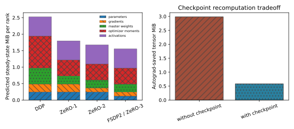
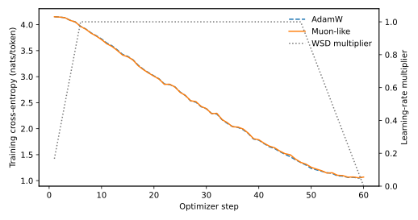
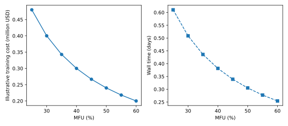

# Distributed and Frontier Training [F+S] {#sec-ch06}

## What you need going in {#sec-ch06-prerequisites}

> **Assumed:** neural-network fundamentals, gradient-based optimization, basic Python, and beginner PyTorch.
>
> **From earlier chapters:** [Chapter 2, The Training Objective](02-transformer-first-principles.qmd#sec-ch02-objective) supplies the decoder and training loop; [Chapter 2, The Accounting Ledger](02-transformer-first-principles.qmd#sec-ch02-accounting) supplies parameter and FLOP accounting; [Chapter 3](03-attention-position-long-context.qmd) supplies attention and long-context mechanics; [Chapter 4](04-moe-efficient-architectures.qmd) separates stored from active parameters in mixture-of-experts models; and [Chapter 5](05-scaling-laws-pretraining-data.qmd) chooses the parameter, token, and compute budget that this chapter must execute.
>
> **Not required:** prior experience operating a cluster. This chapter defines each parallelism axis and collective when it becomes useful. Inference batching and KV-cache placement belong to Chapter 10; reinforcement-learning infrastructure belongs to Chapter 23; the production cost ledger across training, serving, and durable agent effects belongs to Chapter 26.

## Contents {#sec-ch06-contents}

- [A run that fits still may not train](#sec-ch06-opening)
- [What you will build](#sec-ch06-will-build)
- [A training step has a byte ledger](#sec-ch06-memory)
- [Shard model state with ZeRO and FSDP](#sec-ch06-sharding)
- [Compose tensor, pipeline, context, and expert parallelism](#sec-ch06-parallelism)
- [Trade precision and recomputation for capacity](#sec-ch06-precision)
- [Optimizers and schedules are scaling interfaces](#sec-ch06-optimization)
- [Compose the mesh around the topology](#sec-ch06-topology)
- [Frontier stability is a goodput problem](#sec-ch06-goodput)
- [Training economics converts utilization into procurement](#sec-ch06-economics)
- [Landscape 2026 (dated)](#sec-ch06-landscape)
- [Build](#sec-ch06-build)
- [What endures, what changes](#sec-ch06-endures)
- [Exercises](#sec-ch06-exercises)
- [Notes and sources](#sec-ch06-notes)

## A Run That Fits Still May Not Train {#sec-ch06-opening}

A team's parameter files fit across its accelerators, so the capacity review passes. The first step fails when Adam state initializes. A second layout waits on an all-to-all across a slow fabric. A third loses forty minutes per host failure, then resumes with a data cursor inconsistent with its optimizer step. Each failure comes from treating distributed training as “put the model on more GPUs.”

The real objective is **productive learning per unit of wall time and capital**. A valid training design must satisfy several ledgers simultaneously: persistent model state, peak activations, temporary collective buffers, communication volume, numerical error, failure waste, power, and money. Model FLOPs are necessary work, but the system only makes progress when those FLOPs update the intended parameters on the intended tokens and leave a restartable state.

We begin with bytes on one rank, then shard state and computation along explicit device-mesh dimensions. We treat precision and checkpointing as measured policies, connect optimizer parameterization to proxy transfer, and replace one utilization percentage with goodput, recovery, and cost. By the end, you can turn a proposed run into a memory ledger, parallelism map, checkpoint plan, and economic sensitivity analysis.

## What you will build {#sec-ch06-will-build}

::: {.callout-tip}
**The chapter artifact.** The integrated laboratory reuses Chapter 2's `TinyGPT`, launches a real fully sharded training job, and measures local parameter, gradient, and optimizer-state bytes. Freshly initialized checkpoint-off and checkpoint-on phases use identical weights, optimizer state, RNG, and batches; the probe compares final loss and gradient norm, counts tensors saved by autograd, records tokens per second, and computes a labeled local-roofline MFU proxy. A seeded optimizer probe compares AdamW with a small Muon-like matrix update under one warmup-stable-decay schedule. A formula-driven XLSX cost workbook and CSV model translate a hypothetical 30-billion-parameter, 600-billion-token dense run into FLOPs, accelerator-hours, wall time, power, energy, and cost across an MFU sweep.

Success means actual distributed tensors and collectives execute; the measured sharded state agrees with the byte ledger; checkpointing saves activation bytes; all optimizer losses remain finite; and every plotted number exists in CSV or JSON. The optimizer curves are a mechanism probe, not a speedrun ranking. The CPU MFU denominator is a measured local matrix-multiplication roofline, not a vendor peak. The dollar and power inputs are illustrative assumptions, not quotes.
:::

## A Training Step Has a Byte Ledger {#sec-ch06-memory}

Start with a classic mixed-precision Adam estimate. For each trainable parameter, store a two-byte BF16 parameter, a two-byte gradient, a four-byte FP32 master copy, and two four-byte FP32 moments. The persistent model-state total is therefore approximately

$$
M_{\text{Adam}} = P(2+2+4+8)=16P\ \text{bytes},
$$

where $P$ is the number of trainable parameters. Other component choices can yield the same total. BF16-native updates, quantized moments, fused layouts, factored statistics, or Muon state require a different ledger.

Sixteen bytes per parameter is a conventional mixed-precision Adam baseline, not a lower bound or peak-memory forecast. Activations depend on microbatch size, sequence length, width, depth, attention algorithm, and checkpoint policy. Temporary memory includes an all-gathered parameter unit, reduction buckets, attention workspaces, logits, allocator fragmentation, and framework metadata. Some bytes persist; others overlap briefly. An out-of-memory incident depends on the maximum simultaneous set, so a design review asks for a timeline as well as a total.

Ordinary **distributed data parallelism** (DDP) gives every rank a full copy of the model and optimizer state. Each rank processes a different microbatch, computes local gradients, and participates in a gradient all-reduce so all replicas apply the same update. In an ideal ring all-reduce over $p$ ranks, reducing a gradient payload of $S$ bytes moves approximately

$$
V_{\text{rank}} \approx \frac{2(p-1)}{p}S
$$

bytes per rank. A latency-aware estimate adds $\,2(p-1)\alpha$, where $\alpha$ is per-hop startup latency. Libraries bucket gradients and overlap reductions with backward, so readiness and message size matter alongside total bytes.

Gradient accumulation delays synchronization while one rank processes several microbatches. For fixed-size sequences,

$$
B_{\text{global}}=B_{\text{micro}}\,a\,p_{\text{DP}},
$$

where $B_{\text{micro}}$ is examples per rank per forward pass, $a$ is the number of accumulated microbatches, and $p_{\text{DP}}$ is the data-parallel degree. Variable-length training should record non-padding tokens instead of examples. Accumulation lowers communication frequency and can make a model fit, but it retains the activation cost of only one microbatch while increasing update latency.

The **critical batch size** is the regime beyond which more examples per update yield sharply diminishing reductions in gradient noise. It changes with training phase, data, optimizer, and learning rate. Measure loss versus seen tokens and wall time across a batch ladder. If doubling hardware barely reduces steps to target loss, the extra replicas bought utilization rather than learning speed.

[`memory_math.py`](../code/ch06/memory_math.py) makes the steady-state components and transient largest-unit parameters explicit. Its communication estimate is deliberately a ring-equivalent byte model, not a network simulator.

| Artifact state | New code | Invariant now verified |
|---|---:|---|
| `memory_math.py` ledger | 153 lines | DDP holds $\,16P$ modeled bytes; each ZeRO stage shards only its promised state |

Name every byte by owner, lifetime, dtype, and shard group. “The model fits” is not a memory invariant.

## Shard Model State with ZeRO and FSDP {#sec-ch06-sharding}

DDP stops scaling when replicated state consumes each rank. **Zero Redundancy Optimizer** (ZeRO) removes one class of replication at each stage. Let $p_s$ be the state-sharding degree and retain the 16-byte Adam convention. Ignoring rounding and transient buffers, the per-rank persistent state is approximately:

| Strategy | Parameters | Gradients | Master + moments | Per-rank total |
|---|---:|---:|---:|---:|
| DDP / stage 0 | $\,2P$ | $\,2P$ | $\,12P$ | $\,16P$ |
| ZeRO stage 1 | $\,2P$ | $\,2P$ | $\,12P/p_s$ | $\,4P+12P/p_s$ |
| ZeRO stage 2 | $\,2P$ | $\,2P/p_s$ | $\,12P/p_s$ | $\,2P+14P/p_s$ |
| ZeRO stage 3 / fully sharded | $\,2P/p_s$ | $\,2P/p_s$ | $\,12P/p_s$ | $\,16P/p_s$ |

Stage 1 shards optimizer state. Stage 2 also shards gradients; stage 3 shards parameters between computations. Its attractive $\,16P/p_s$ term does not let a layer execute from arbitrary fragments. Before a sharded module computes, its parameter group is gathered into the required layout and later resharded. Peak memory includes the largest materialized unit, activations, and collective workspaces.

Granularity matters. One root-sized unit creates a huge blocking all-gather. Transformer-block units expose prefetch and reshard overlap; units that are too small pay excessive startup and bookkeeping. Measure boundaries against layer size, fabric latency, prefetch depth, and peak memory.

A distributed tensor pairs one logical global tensor with a device mesh and shard, replicate, or partial placements. A matrix may be output-sharded for tensor parallelism while its state is sharded on a data-parallel dimension. Operators propagate compatible layouts or redistribute. Every layout transformation must remain accountable.

**Hybrid sharded data parallelism** (HSDP) shards within a group and replicates shards across groups. With $p_s=8$ rack-local ranks and $r=16$ replicas, each rank retains about $\,16P/8$, not $\,16P/128$. Latency-sensitive gather and scatter stay inside eight ranks; replica synchronization crosses the slower boundary.

Sharding changes checkpoints too. A local rank shard is not a model checkpoint. A distributed writer should stage rank-local shards without blocking every training step, record global tensor names, shapes, placements, optimizer state, and checksums in a reshardable manifest, flush to durable storage, validate completeness, then atomically publish a commit marker. Bound staging memory and bandwidth with backpressure; never expose a partial save. Recovery should reconstruct logical tensors on a different world size, not depend on old rank identities.

The central trade is not “memory versus communication” in the abstract. It is persistent replication versus timed materialization across a particular collective group. A useful plan lists steady-state bytes, largest gathered unit, collective type and message size, and whether communication can overlap useful computation.

## Compose Tensor, Pipeline, Context, and Expert Parallelism {#sec-ch06-parallelism}

State sharding alone does not divide the computation of a layer. When one rank cannot execute a layer quickly or fit its transient tensors, add model-parallel axes. Each axis partitions a different mathematical object and therefore introduces a different collective.

**Tensor parallelism** (TP) partitions matrices inside a layer. Column-parallel linears split output features; row-parallel linears consume split inputs and sum partial outputs. Alternating layouts can avoid gathers, but reductions sit on nearly every layer's critical path. TP belongs on fast scale-up links, and excessive TP leaves kernels too small to saturate devices.

**Pipeline parallelism** (PP) partitions depth into $s$ sequential stages. Microbatches flow through the stages so forward and backward work overlaps. For balanced stages and a simplified one-forward/one-backward schedule, the fill-and-drain bubble fraction is

$$
f_{\text{bubble}}\approx\frac{s-1}{m+s-1},
$$

where $m$ is microbatches per optimizer step. Eight stages and 32 microbatches give $\,7/39\approx17.9\%$ idle bubble before imbalance and communication. More microbatches reduce it but add overhead and may alter global batch. Interleaved virtual stages avoid multiplying the batch but add transfers and scheduling complexity.

**Context parallelism** (CP) partitions sequence positions. Ring Attention keeps a query block local, circulates key/value blocks, and incrementally combines exact attention statistics. Ulysses-style parallelism all-to-all transposes sequence shards into head shards, computes full-sequence attention for subsets of heads, then reverses the transpose. Ring exposes point-to-point overlap; Ulysses needs head divisibility and strong all-to-all. The system question is whether communication fits the topology and hides behind compute.

**Expert parallelism** (EP) places different mixture-of-experts feed-forward networks on different ranks. Routing becomes a dispatch all-to-all before expert compute and a combine all-to-all after it. A simple dispatch-plus-combine payload estimate is

$$
V_{\text{EP}}\approx2Tdkbf,
$$

where $T$ is routed tokens in the group, $d$ is hidden width, $k$ is experts selected per token, $b$ is bytes per activation scalar, and $f$ is the fraction assigned off-rank. It omits metadata, padding, quantization scales, congestion, and load imbalance. A dropless router preserves every assignment but lets the most loaded expert set step time unless kernels and routing rebalance work. Static expert capacity bounds time and memory but may drop or reroute tokens, changing the model computation.

An existing dense checkpoint can be **upcycled** into an MoE by copying feed-forward weights into experts, initializing routers, and continuing training. Duplicated experts initially lack specialization and routing can destabilize optimization, so compare with a from-scratch compute-matched control.

These dimensions are not automatically independent. A convenient first sketch is

$$
p_{\text{world}}=p_{\text{DP}}p_{\text{TP}}p_{\text{PP}}p_{\text{CP}},
$$

but EP may reuse a process-group dimension rather than multiply world size. Draw rank sets: one rank can join TP for attention, EP for feed-forward dispatch, a PP edge, and a sharded-data group. Unmapped labels produce impossible counts and double-counted bandwidth.

```{mermaid}
%%| label: fig-ch06-mesh
%%| fig-cap: "A logical training mesh: which parallel dimensions partition computation, and which may overlap rather than multiply device count?"
%%| fig-alt: "Two data-parallel replicas each contain two pipeline stages; every stage contains a tensor-parallel pair. Context-parallel and expert-parallel groups are shown as dashed overlays on attention and feed-forward computation."
flowchart TB
  W["Training world"] --> D0["DP replica 0"]
  W --> D1["DP replica 1"]
  subgraph R0["Replica 0 pipeline"]
    S00["PP stage 0: TP ranks 0–1"] -->|"activations"| S01["PP stage 1: TP ranks 2–3"]
  end
  subgraph R1["Replica 1 pipeline"]
    S10["PP stage 0: TP ranks 4–5"] -->|"activations"| S11["PP stage 1: TP ranks 6–7"]
  end
  D0 --> S00
  D1 --> S10
  S00 <-->|"DP / shard-group synchronization"| S10
  S01 <-->|"DP / shard-group synchronization"| S11
  CP["CP overlay: sequence shards in attention"] -.-> S00
  CP -.-> S10
  EP["EP overlay: token dispatch to experts"] -.-> S01
  EP -.-> S11
```

The textual invariant in @fig-ch06-mesh is that DP, TP, PP, and CP identify orthogonal partitions only when their rank sets are actually orthogonal; EP is an overlay until the process-group map proves it is an additional physical dimension. The diagram is a logical map, not a claim that eight devices suit a real model.

## Trade Precision and Recomputation for Capacity {#sec-ch06-precision}

Precision is a policy over tensors and operations. BF16 keeps an FP32-like exponent range with fewer significand bits, usually avoiding the dynamic-range failures that make FP16 loss scaling necessary. Reductions, normalization, optimizer state, attention logits, and softmax accumulation may still need FP32; gradient communication may use another dtype. Record each choice.

FP8 adds scaling. E4M3 favors precision; E5M2 favors range. Specify tensor eligibility, scale granularity and updates, accumulator dtype, clipping, rounding, and high-precision islands. “FP8 training” never means every operation is FP8. Inspect overflow, underflow, saturation, scales, gradients, attention-logit tails, and agreement with a higher-precision reference.

**Activation checkpointing** attacks a different term. Autograd normally stores intermediate tensors during forward so backward can reuse them. Checkpointing saves selected boundary tensors and recomputes the enclosed forward region during backward. It exchanges extra FLOPs for lower peak activation memory. Transformer-block granularity is a robust starting point: checkpoint every block, measure peak allocated bytes and tokens per second, then selectively retain expensive-to-recompute regions if memory allows.

Recomputation must be semantically identical. Dropout requires consistent RNG state; stateful modules, mutable caches, or side effects can change gradients. Compare one step from identical parameters and inputs, check finite gradients, and bound differences under the chosen precision.

```{mermaid}
%%| label: fig-ch06-step-sequence
%%| fig-cap: "A sharded, checkpointed block: when do full parameters and activations exist on each rank?"
%%| fig-alt: "Two ranks all-gather a block's parameter shards, compute forward, reshard the parameters, save only a block boundary, then re-gather and recompute during backward before reduce-scattering gradients."
sequenceDiagram
  participant R0 as Rank 0
  participant R1 as Rank 1
  participant A as Autograd
  R0->>R1: all-gather block parameter shards
  R1->>R0: all-gather block parameter shards
  Note over R0,R1: full block parameters are transient
  R0->>R0: forward on local microbatch
  R1->>R1: forward on local microbatch
  R0-->>A: save block boundary only
  R1-->>A: save block boundary only
  Note over R0,R1: reshard parameters after forward
  A->>R0: backward requests block
  A->>R1: backward requests block
  R0->>R1: all-gather, recompute, differentiate
  R1->>R0: all-gather, recompute, differentiate
  R0->>R1: reduce-scatter gradient shards
  R1->>R0: reduce-scatter gradient shards
```

@fig-ch06-step-sequence explains why multiplying “sharded parameter bytes” by a safety factor is not enough. Full unit parameters reappear during compute, checkpointed activations disappear and later reappear through recomputation, and gradient shards emerge only after a collective. Prefetch can overlap these events and increase the simultaneous peak.

{#fig-ch06-memory-checkpoint fig-alt="Stacked bars show state memory falling as optimizer state, gradients, and parameters are sharded. A separate bar chart shows checkpointing greatly reducing locally measured autograd-saved bytes."}

In the seeded Chapter 2 model, checkpointing reduced tensors saved by autograd from 3,130,372 to 610,052 bytes, an 80.5 percent reduction. The two-rank CPU phase took longer with checkpointing in the recorded run, as recomputation predicts, but the tiny timing is environment-specific and noisy. The durable conclusion from @fig-ch06-memory-checkpoint is the byte trade, not its absolute speed.

| Artifact state | New code | Invariant now verified |
|---|---:|---|
| `probe_model.py` plus `train_dist.py` | 235 lines across two mechanism-focused files | block checkpointing preserves a valid backward pass while reducing saved tensors |

Use low precision to reduce storage, bandwidth, and arithmetic cost; use checkpointing to reduce saved activations. They compose, but their error and recomputation effects must be measured separately.

## Optimizers and Schedules Are Scaling Interfaces {#sec-ch06-optimization}

AdamW is a strong reference: it maintains exponential first and second moments, divides the first by the square root of the second, and applies decoupled weight decay. A new optimizer must beat a tuned control at equal tokens, active FLOPs, batch, precision, data order, and architecture—not merely equal steps.

Muon takes a different view of two-dimensional hidden weight matrices. It forms a momentum matrix and approximately orthogonalizes the update, commonly through a few Newton–Schulz iterations. In schematic form,

$$
B_t=\mu B_{t-1}+G_t,\qquad O_t\approx\operatorname{NS}_k\!\left(\frac{B_t}{\lVert B_t\rVert_F}\right),
$$

where $G_t$ is the current gradient matrix, $\mu$ is momentum, $\lVert\cdot\rVert_F$ is the Frobenius norm, and $\operatorname{NS}_k$ denotes $k$ approximate orthogonalization iterations. Embeddings, biases, normalization vectors, and sometimes input/output projections remain on AdamW. Update scaling, weight decay, distributed implementation, and precision are part of the recipe; “replace Adam with Muon” is underspecified. Shampoo also preconditions matrix gradients from second-order statistics, while SOAP combines Shampoo-like preconditioning with Adam-style updates; both introduce state and distributed-preconditioner costs that need their own ledger.

The **maximal update parameterization**, or $\mu$P, uses width-dependent initialization, learning-rate, and output scalings so many proxy-model hyperparameters remain useful at larger width. Transfer assumes the same parameterization, architecture family, and optimizer regime; it does not cover arbitrary data, context, batch, or architecture changes. Verify it on a proxy ladder.

The learning-rate schedule is also a scaling interface. Cosine decay ties the entire curve to a known terminal token budget. **Warmup-stable-decay** (WSD) raises the rate, holds a long stable trunk, and attaches a final decay. The stable checkpoint can branch into several short decays for different budgets, which is valuable when the final token allocation may change. A branch is not free: each candidate consumes data and compute, and its comparison must preserve the data cursor and evaluation protocol.

The probe cannot establish a winner. Both strategies see identical batches and weights under one WSD curve. AdamW falls from 4.1522 to 1.0701 nats per token; the Muon-like split ends at 1.0690. A short single-seed check can expose divergence, not validate a frontier claim.

{#fig-ch06-optimizer fig-alt="Two nearly overlapping loss curves decrease from about 4.15 to about 1.07. A dotted schedule rises during warmup, stays flat, and decays near the end."}

@fig-ch06-optimizer uses line style as well as color, so its conclusion survives grayscale: both implementations are finite and learn under the controlled fixture; their tiny final separation is not evidence of general superiority. A real optimizer evaluation needs paired seeds, learning-rate and weight-decay sweeps, equal-token quality, throughput, state bytes, communication, checkpoint compatibility, and stability at the target width.

| Artifact state | New code | Invariant now verified |
|---|---:|---|
| `optimizer_probe.py` | 137 lines | AdamW and the matrix-update strategy see identical batches and remain finite under one WSD schedule |

The durable engineering question is whether an optimizer-schedule-parameterization package transfers useful progress per token and per wall-clock dollar. An optimizer name alone is not an experiment.

## Compose the Mesh Around the Topology {#sec-ch06-topology}

A parallelism plan becomes credible only on physical links. A fast scale-up domain usually carries latency-sensitive TP, EP, or CP; scale-out often carries PP, DP, or HSDP replica traffic. Benchmark the actual collective, message size, concurrency, route, and failure domain.

For a collective with $n$ participating ranks and payload $S$, the shorthand

$$
t_{\text{collective}}\approx a(n)\alpha+b(n)\frac{S}{\beta}
$$

separates startup latency $\alpha$ from effective bandwidth $\beta$; algorithm-dependent $a(n)$ and $b(n)$ encode rings, trees, hierarchical algorithms, or all-to-all schedules. Peak link bandwidth is not $\beta$. Congestion, protocol overhead, topology, other collectives, and small-message inefficiency reduce it. Benchmark at the shapes generated by the model, then record p50 and tail latency. Step time follows the slowest rank.

Three reference compositions cover many starting points:

| Workload | First composition to test | Main reason to reject it |
|---|---|---|
| Model state fits one device | DDP, gradient accumulation, BF16, block checkpointing | replicated Adam state or critical-batch inefficiency |
| Large dense model in one strong cluster | HSDP plus intra-domain TP; add PP only for depth/peak constraints | TP collectives cross slow links or PP bubbles dominate |
| Long-context MoE | previous stack plus CP for attention and EP for experts | CP/EP all-to-all contention, routing skew, or too-small kernels |

Start with the fewest axes that satisfy memory. Choose TP from layer shape and the scale-up domain. Add PP when stages exceed memory or avoid cross-domain TP; CP for long-sequence work; EP from expert placement and overlap; then DP only while the global batch remains efficient.

Hardware selection is system selection: device memory and bandwidth, fabrics, host paths, storage, checkpoint bandwidth, scheduling, telemetry, firmware, spares, rack power, and cooling all matter. A faster chip can lose time to target behind a weak fabric or slow recovery.

Wide-area or decentralized training changes the algorithm because synchronous collectives cannot tolerate WAN latency and churn. Local-update methods let each island run many inner optimizer steps, then periodically combine parameter deltas through an outer optimizer. Communication falls, but replicas drift; staleness, non-identically distributed data, security, and quorum behavior become optimization variables. Treat these methods as local-SGD families with explicit convergence and failure assumptions, not drop-in replacements for a healthy low-latency cluster.

The topology invariant is: place the most frequent and least hideable communication on the strongest links, and make every cross-domain byte justify itself. A process-group diagram and collective trace should agree.

## Frontier Stability Is a Goodput Problem {#sec-ch06-goodput}

Model FLOPs utilization (MFU) estimates what fraction of aggregate peak arithmetic performs the model's nominal forward-and-backward work:

$$
\operatorname{MFU}=\frac{q\,F_{\text{model/token}}}{G P_{\text{peak}}},
$$

where $q$ is observed training tokens per second, $F_{\text{model/token}}$ is the declared model FLOPs per token, $G$ is accelerator count, and $P_{\text{peak}}$ is peak FLOPs per accelerator in the relevant precision. A dense Transformer baseline often uses $F_{\text{model/token}}\approx6P$, with attention-length corrections. For MoE, use activated parameters or profiler-derived FLOPs. Publish the counting convention, precision, sparsity treatment, and whether recomputation is excluded.

Hardware FLOPs utilization (HFU) counts implementation-executed arithmetic, including recomputation. Checkpointing can raise HFU while leaving model progress unchanged, so HFU is useful for kernel diagnosis but less comparable across implementations. MFU can also hide idle days: it is normally computed while steps execute.

**Goodput** is useful work completed per wall-clock resource. One component is the effective-training-time rate (ETTR), productive nominal iteration time divided by elapsed wall time. When denominators align, $\operatorname{MFU}\times\operatorname{ETTR}$ is a rough productive fraction of peak capacity. Keep both terms: low MFU points toward kernels, communication, or bubbles; low ETTR points toward failures, checkpoint stalls, data starvation, validation pauses, or scheduler gaps.

Expected time to recovery—also abbreviated ETTR by some teams—is detection, isolation, replacement, checkpoint load, and replay. Spell out the ambiguous acronym. Record interruption rate, tail recovery, lost tokens, automated-handling fraction, and first-step correctness.

A complete checkpoint includes model, optimizer, schedule, scaler, token count, data cursor, per-rank RNG, topology, configuration, tokenizer/data/code digests, and the integrity manifest. A clean-worker, different-world-size restart drill is stronger evidence than a save log.

Checkpoint frequency has an economic optimum. If a synchronous checkpoint costs $C_s$ seconds, job mean time between interrupting failures is $M$, restart cost is $R$, and checkpoints occur every $I$ seconds, a simple waste model is

$$
w(I)\approx\frac{C_s}{I}+\frac{I}{2M}+\frac{R}{M}.
$$

The first term is checkpoint overhead; the second is average work lost since the last checkpoint under uniformly timed failures; the third is restart overhead. Minimizing the first two gives Young's approximation $I^*\approx\sqrt{2C_sM}$. Correlated rack failures, preemption warnings, asynchronous staging, remote persistence lag, and checkpoint corruption violate the model. Use it to initialize policy, then fit failure and save distributions from operations data.

**Silent data corruption** (SDC) produces plausible but wrong values. ECC cannot cover every arithmetic, transfer, firmware, or software fault. Layer defenses include burn-in, distribution checks, training monitors, collective probes, checksums, quarantine, replay, and clean restoration. Measure detector coverage and false positives; restarting a corrupt checkpoint only reproduces failure.

Frontier stability is also optimization stability. Classify a spike before responding: **data** faults include corrupt or shifted batches; **numerical** faults include overflow, attention-logit growth, and bad scales; **routing** faults include expert collapse or overload; **system** faults include corrupted arithmetic, collectives, or state. Preserve batch identifiers, metrics, and state hashes for replay. A skip policy must be explicit, bounded, and logged; nonfinite or corrupted optimizer state requires rollback to a verified checkpoint, not blind continuation. Preventive controls can include gradient clipping, **QK-clip** or query/key rescaling to cap attention logits, and router **z-loss** to penalize extreme routing logits. Each changes optimization and needs an ablation. “Loss recovered” is not proof that moments and data order remained valid.

The operating invariant is that a run is healthy only when it makes verifiable forward progress and can recover to the same logical training state. High MFU during surviving minutes does not compensate for low goodput across the month.

## Training Economics Converts Utilization into Procurement {#sec-ch06-economics}

The compute budget from Chapter 5 becomes an elapsed-time model. For a dense Transformer with $P$ parameters and $D$ training tokens,

$$
C_{\text{train}}\approx6PD.
$$

With $G$ accelerators, per-device peak rate $F$, and MFU $u$,

$$
T_{\text{seconds}}=\frac{C_{\text{train}}}{GFu},\qquad
H_{\text{accelerator}}=\frac{C_{\text{train}}}{Fu\,3600}.
$$

The second equation is independent of $G$: ideal scaling changes wall time, not accelerator-hours. Real scaling changes $u$, batch, ETTR, and often price. For MoE and long context, replace $\,6P$ with activated or profiled FLOPs and include attention's sequence-dependent work.

Cloud cost begins with $H_{\text{accelerator}}$ times an effective rate. Add storage, transfer, orchestration, support, failed and development runs, idle reservations, and preemption. Spot lowers nominal rates but increases interruption waste; reserved capacity can create utilization risk. Model distributions, not one rate cell.

Power needs an equally explicit boundary. If the combined accelerator-and-node IT draw averages $W_{\text{IT}}$ per accelerator and the facility power-usage effectiveness is PUE,

$$
P_{\text{facility}}\approx G W_{\text{IT}}\operatorname{PUE}.
$$

Energy is power integrated over wall time. Do not multiply a facility-inclusive watt assumption by PUE a second time. Average draw, peak rack provisioning, and grid capacity answer different questions: the energy bill uses the first; cluster feasibility and demand charges care about the others.

Buying capacity replaces the hourly quote with annualized ownership. For discount rate $r$ and useful life $L$, the capital-recovery factor is

$$
\operatorname{CRF}=\frac{r(1+r)^L}{(1+r)^L-1}.
$$

Divide annualized capex plus energy, facility, network, spares, software, financing, and staff by **productive** accelerator-hours, with utilization and ETTR in the denominator. A cluster bought for one burst can cost more than cloud despite cheap chip-plus-electricity arithmetic.

{#fig-ch06-cost fig-alt="Two line plots fall as MFU rises from 25 to 60 percent: illustrative training cost on the left and wall days on the right."}

The base case behind @fig-ch06-cost is hypothetical: 30B parameters, 600B tokens, 8,192 accelerators, 1,000 TFLOP/s each, 40 percent MFU, a \$4 accelerator-hour, and 1.2 facility-inclusive kW each. It yields $\,1.08\times10^{23}$ FLOPs, 75,000 accelerator-hours, 9.16 hours, \$300,000, 9.8304 MW, and 90 MWh. These are fixtures, not a forecast. Moving MFU from 40 to 50 percent multiplies time and compute charge by $\,0.4/0.5=0.8$.

| Artifact state | New code | Invariant now verified |
|---|---:|---|
| `cost_model.py` plus `cost-sensitivity.csv` | 54 lines plus eight auditable rows | compute remains fixed while time and accelerator-hours scale as $\,1/u$ |

A rent-versus-buy decision also values time to capacity, topology guarantees, capacity certainty, scaling efficiency, egress, compliance, support, and technology-stranding risk. Ask what happens at twice the nominal dollars per useful FLOP, half the expected utilization, a six-month delivery slip, or correlated failures. Procurement is a distribution over outcomes, not a comparison of one chip price with one cloud rate.

## Landscape 2026 (dated) {#sec-ch06-landscape}

::: {.callout-note .landscape-2026}
This section contains current APIs, products, training reports, and policy status. Deleting it leaves the byte, collective, precision, checkpoint, goodput, and economics mechanisms intact.

### Current PyTorch distributed surface

As of 2026-07-19, PyTorch FSDP2's `fully_shard` represents parameters as per-parameter dimension-0 `DTensor`s. Forward hooks all-gather and reshard; backward reduce-scatters. Current guidance shards blocks bottom-up and then the root, with the optimizer constructed afterward. Recheck `MixedPrecisionPolicy`, offload, resharding, mesh naming, and the activation-checkpoint recommendation to pass `use_reentrant=False`. The build follows this surface while teaching its layout invariants separately.

**Verify live: 2026-07-19.** Recheck the official [`fully_shard`](https://docs.pytorch.org/docs/main/distributed.fsdp.fully_shard.html), [DTensor](https://docs.pytorch.org/docs/stable/distributed.tensor.html), [tensor-parallel](https://docs.pytorch.org/docs/stable/distributed.tensor.parallel.html), [pipeline-parallel](https://docs.pytorch.org/docs/stable/distributed.pipelining.html), [activation-checkpoint](https://docs.pytorch.org/docs/stable/checkpoint.html), and [Distributed Checkpoint](https://docs.pytorch.org/docs/stable/distributed.checkpoint.html) documentation before changing a training stack.

### Low precision, optimizers, MoE communication, and decentralized training

Current FP8 recipes combine E4M3/E5M2 tensors, scaling, and higher-precision islands; DeepSeek-V3 is one published example. OCP Microscaling defines MX block formats, while NVIDIA's 2025 NVFP4 work describes two-level scaling, higher-precision islands, transforms, two-dimensional quantization, and stochastic rounding. Hardware support is dated; the durable requirement is to declare scale granularity, accumulation, rounding, and telemetry.

Muon now appears in larger recipes and a PyTorch API. Kimi K2's MuonClip rescales query/key projections when attention logits cross a threshold; eligible parameters and distributed details remain recipe-specific. Shampoo and SOAP are matrix-preconditioning comparisons. WSD appears in MiniCPM and later analyses. `modded-nanogpt` is a useful laboratory, but its records combine optimizer, architecture, data, kernels, and schedule.

Current reference stacks include Megatron-Core, PyTorch TorchTitan, and JAX/MaxText; their defaults change. DeepEP specializes MoE dispatch. DiLoCo uses local inner steps plus outer optimization; INTELLECT-1 reported a 10B decentralized pretraining proof of concept; 2026 Decoupled DiLoCo explores asynchronous fragment exchange and quorum-style merging. Their convergence is experiment-specific; INTELLECT-2 concerns reinforcement learning.

**Verify live: 2026-07-19.** Check the [OCP MX specification](https://www.opencompute.org/documents/ocp-microscaling-formats-mx-v1-0-spec-final-pdf), [Transformer Engine FP8 guide](https://docs.nvidia.com/deeplearning/transformer-engine/user-guide/examples/fp8_primer.html), [NVFP4 paper](https://arxiv.org/abs/2509.25149), [PyTorch Muon API](https://docs.pytorch.org/docs/stable/generated/torch.optim.Muon.html), [TorchTitan](https://github.com/pytorch/torchtitan), [MaxText](https://github.com/AI-Hypercomputer/maxtext), [DeepEP](https://github.com/deepseek-ai/DeepEP), [INTELLECT-1](https://arxiv.org/abs/2412.01152), and [Decoupled DiLoCo](https://arxiv.org/abs/2604.21428).

### Frontier operations and hardware

Llama 3's 405B snapshot records 466 interruptions over 54 days: 47 planned and 419 unexpected, about 78 percent hardware-related or suspected; effective training time exceeded 90 percent. MegaScale reports 55.2 percent MFU for 175B over 12,288 GPUs and production runs with more than 100 restarts, over 90 percent automatically handled, and over 90 percent effective training time. These are existence proofs, not universal rates.

The hardware landscape now includes NVIDIA GB300 NVL72 systems and an announced Vera Rubin platform, Google's Ironwood TPU, and AMD MI350-series accelerators. Vendor peak numbers differ by dtype, sparsity, scale, and system boundary and are not directly comparable. Procurement work must use dated specifications plus workload-shaped collective and kernel measurements.

**Verify live: 2026-07-19.** Recheck the [Llama 3 report](https://arxiv.org/abs/2407.21783), [MegaScale](https://arxiv.org/abs/2402.15627), [GB300 NVL72 reference architecture](https://docs.nvidia.com/enterprise-reference-architectures/nvl72-ai-factory/latest/components.html), [Vera Rubin announcement](https://nvidianews.nvidia.com/news/nvidia-vera-rubin-platform), [Google Ironwood overview](https://blog.google/innovation-and-ai/infrastructure-and-cloud/google-cloud/ironwood-google-tpu-things-to-know/), and [AMD MI350 overview](https://www.amd.com/content/dam/amd/en/documents/instinct-tech-docs/solution-briefs/amd-instinct-mi350-series-5-reasons-why.pdf). Obtain live, workload-specific quotes for any financial decision.

### The historical U.S. $\,10^{26}$-operation threshold

Executive Order 14110 historically used a threshold above $\,10^{26}$ integer or floating-point operations for certain reporting about dual-use foundation models, with a separate biological-sequence threshold. It is **not an active general U.S. reporting requirement as of 2026-07-19**. Executive Order 14110 was revoked in January 2025 by Executive Order 14148. Executive Order 14409, issued June 2, 2026, emphasizes classified capability benchmarking and a voluntary developer framework; it does not reinstate the general $\,10^{26}$ reporting threshold. Treat the number as a dated policy case study, not a current compliance trigger. Verify current federal, state, export-control, outbound-investment, contractual, and sector rules with qualified counsel.

**Verify live: 2026-07-19.** Read the archived [Executive Order 14110](https://www.govinfo.gov/content/pkg/CFR-2024-title3-vol1/pdf/CFR-2024-title3-vol1-eo14110.pdf), the [Congressional Research Service status summary](https://www.congress.gov/crs_external_products/R/HTML/R48555.web.html), the [revocation record](https://www.govinfo.gov/app/details/DCPD-202500115), and [Executive Order 14409](https://www.whitehouse.gov/presidential-actions/2026/06/promoting-advanced-artificial-intelligence-innovation-and-security/). Legal status can change faster than a textbook release.
:::

## Build {#sec-ch06-build}

Run the integrated offline laboratory from the book root (`newbook/` in this workspace).

```bash
python code/ch06/run_build.py
pytest -q tests/test_ch06_distributed_training.py
```

[`run_build.py`](../code/ch06/run_build.py) is the only integrated runner. It launches [`train_dist.py`](../code/ch06/train_dist.py) under two CPU or multi-GPU processes, falling back to one process when only one GPU is visible. The probe builds a one-dimensional device mesh, shards transformer blocks bottom-up and then the root, and creates AdamW afterward. Each checkpoint condition restarts from identical weights, optimizer state, RNG, and rank-local batches; tests bound final loss and gradient-norm differences. Rank 0 separately measures saved tensors on an identical unsharded replica, which isolates checkpoint policy but is not FSDP peak memory. CPU uses Gloo and CUDA uses NCCL; an explicitly requested GPU world larger than visible capacity is rejected.

The model contains 127,360 trainable parameters. Its largest FSDP unit is the 45,120-parameter root-owned group, not either 41,120-parameter block. The actual FP32 runtime ledger predicts 254,720 parameter bytes, 254,720 gradient bytes, and 509,440 moment bytes on rank 0; measurement matches parameters and gradients exactly and records 509,520 optimizer bytes, including 80 bytes of step scalars. The classic BF16-plus-master-copy baseline is reported separately. This component-level comparison does not include allocator fragmentation or claim a frontier peak.

Throughput and local-roofline MFU fields vary across runs and hosts. Their denominator is a small local matrix-multiplication calibration, not a vendor peak, so it must not be compared with published GPU MFU. Stable evidence is the executed collective path, matched loss and gradient checks, finite state, component bytes, and saved-tensor reduction.

The runner writes:

| Output | What it makes auditable |
|---|---|
| `fsdp-probe.json` | actual world, device, precision policy, sharded bytes, saved tensors, loss, tokens/s, and MFU denominator |
| `memory-ledger.csv` and `runtime-memory-ledger.csv` | classic BF16/master-copy and actual FP32 state ledgers, transient unit, and communication bytes |
| `optimizer-curves.csv` | paired seeded loss and WSD multiplier for AdamW and the Muon-like split strategy |
| `cost-sensitivity.csv` | every assumption and result for eight MFU values |
| [`cost-model.xlsx`](../code/ch06/generated/cost-model.xlsx) | editable assumptions, formula model, MFU sensitivity, checks, sources, and native chart |
| `metrics.json` | experiment contracts, summaries, runtime versions, and seeds |
| three generated SVGs | the exact values used by the chapter's quantitative figures |

The tests enforce six contracts: conventional Adam and ZeRO algebra; mesh and collective equations; compute-preserving MFU sensitivity; checkpoint savings; finite optimizer learning; and a real FSDP2/DTensor build with matched phases, component-level byte checks, and a formula-bearing XLSX. Timing fields are measurements; seeds, shapes, data, byte results, curves, cost rows, and style are fixed.

To adapt the build, replace the toy configuration first and keep the evidence schema. Then run a memory-only scale test, a short numerical-equivalence test, a collective microbenchmark at the resulting message sizes, and an end-to-end throughput test. Change one axis at a time until memory forces composition. A successful smoke step is the start of capacity validation, not the end.

## What Endures, What Changes {#sec-ch06-endures}

**Endures:**

- Parameter, gradient, optimizer, activation, transient, communication, and checkpoint bytes are separate ledgers with different lifetimes and owners.
- DDP replicates state; ZeRO-style stages progressively shard optimizer state, gradients, and parameters; full parameters still become transiently available for computation.
- TP partitions layer matrices, PP partitions depth, CP partitions sequence positions, EP partitions experts, and DP partitions examples or tokens. Their process groups must be drawn, not inferred from labels.
- Pipeline bubbles, collective latency-bandwidth tradeoffs, expert skew, and the critical batch can erase nominal scaling.
- Precision is an operation-and-scaling policy. Activation checkpointing trades recomputation for saved tensors. Both require numerical verification.
- Optimizer, schedule, parameterization, data order, batch, precision, and hardware form one experimental package.
- MFU describes model arithmetic while executing; goodput and recovery describe productive wall time. A complete, atomic, reshardable checkpoint is a correctness artifact.
- Dense compute, useful throughput, facility power, ETTR, and productive utilization connect the training design to finance. Rent-versus-buy is a sensitivity analysis, not one quoted rate.

**Changes:**

- Framework names, sharding APIs, compiler behavior, collective implementations, checkpoint formats, and process-mesh helpers.
- Preferred FP8, microscaling, FP4, accumulator, rounding, and scaling recipes—and which hardware executes them safely.
- Optimizer recipes, Muon variants, preconditioners, update scaling, schedule branches, and speedrun records.
- Accelerator SKUs, system topologies, peak-FLOP conventions, cloud availability, prices, power envelopes, and delivery times.
- The best composition of TP, PP, CP, EP, HSDP, and local-update training for a particular model and fabric.
- Published interruption statistics, SDC detectors, decentralized-training results, and the policy obligations attached to large runs.

The senior habit is stable: convert every claim into a tensor layout, byte count, collective trace, numerical check, failure-recovery invariant, and economic denominator. A larger cluster amplifies an incorrect assumption faster than it fixes one.

## Exercises {#sec-ch06-exercises}

1. **Replace Adam state with an 8-bit optimizer.** For a 30B-parameter model, begin with the chapter's two-byte parameter, two-byte gradient, four-byte master copy, and eight-byte Adam moments. Replace the two moments with one byte each plus 0.5 bytes per parameter of scales and metadata. Compute DDP and ideal 64-way stage-3 persistent bytes per rank. Add a two-byte transient largest unit containing 600M parameters. State which accuracy, kernel, and checkpoint assumptions the arithmetic does not validate.

2. **Map 512 H100s for a 235B MoE.** Design DP, TP, PP, CP, and EP groups for a 235B-total, 22B-active model with 128 experts, top-8 routing, and 128K training sequences. Give exact rank-set dimensions and say whether EP is independent or overlaps another dimension. Estimate dispatch-plus-combine bytes for one expert group from $\,2Tdkbf$. Defend which collectives stay inside a node, which cross nodes, and how dropless skew changes the plan.

3. **Cut a pipeline bubble two ways.** Compute the simplified bubble for $s=8,m=32$. Halve it once by changing the number of microbatches while keeping stages fixed, and once through an interleaved schedule without changing the global batch. Quantify the first solution exactly; for the second, define a schedule assumption and its effective virtual-stage count. List memory, communication, and imbalance costs that the formula omits.

4. **Reproduce a speedrun optimizer ablation.** Extend `optimizer_probe.py` with paired seeds and a small learning-rate/weight-decay grid for AdamW and the Muon-like split. Hold model, tokens, batches, WSD curve, and initialization fixed. Report median loss at equal tokens, **tokens to a prespecified target loss**, tokens per second, optimizer bytes, and divergence count with uncertainty. Then compare one current speedrun recipe and identify every change that prevents attributing its record to the optimizer alone.

5. **Stress the cost model.** Add spot and reserved capacity to `cost_model.py`. Model interruption arrivals, checkpoint interval, save time, recovery time, and reserved-capacity idle fraction. Produce expected and p90 wall time and cost for at least three mixes. Use the checkpoint-waste equation as a baseline, then explain where correlated failures and preemption warnings violate it.

6. **Defend rent versus buy to a CFO.** Your proposed run faces cloud dollars per useful FLOP that may be twice nominal because MFU and failure overhead are worse than forecast. Compare renting with buying a cluster using CRF, facility build time, PUE, staff, spares, network, utilization, ETTR, residual value, and technology-stranding risk. Present a break-even productive-hours range and three observations that would reverse your recommendation. Separate accounting assumptions from technical measurements and include the cost of a six-month capacity delay.

## Notes and Sources {#sec-ch06-notes}

For replicated and sharded state, see PyTorch's [DistributedDataParallel documentation](https://docs.pytorch.org/docs/stable/generated/torch.nn.parallel.DistributedDataParallel.html), Rajbhandari et al., [*ZeRO: Memory Optimizations Toward Training Trillion Parameter Models*](https://arxiv.org/abs/1910.02054), and the current primary documentation linked in the dated landscape. The chapter's ring payload and latency-bandwidth equations are leading-order models; production decisions require collective traces.

For model-parallel mechanisms, see Megatron-LM's [tensor-parallel work](https://arxiv.org/abs/1909.08053), GPipe for [pipeline parallelism](https://arxiv.org/abs/1811.06965), [Ring Attention](https://arxiv.org/abs/2310.01889), [DeepSpeed-Ulysses](https://arxiv.org/abs/2309.14509), and the current [Megatron-Core MoE guide](https://docs.nvidia.com/megatron-core/developer-guide/0.17.0/user-guide/features/moe.html). The implementation-oriented [Ultra-Scale Playbook](https://huggingface.co/spaces/nanotron/ultrascale-playbook) and JAX team's [*How to Scale Your Model*](https://jax-ml.github.io/scaling-book/) are useful comparative guides. These sources use different hardware and accounting conventions; borrow mechanisms, not interchangeable benchmark numbers.

For low precision, the [DeepSeek-V3 report](https://arxiv.org/abs/2412.19437) supplies one large FP8 training recipe; the [Microscaling paper](https://arxiv.org/abs/2310.10537) and OCP specification define the MX lineage; and the dated landscape links current NVFP4 work. For optimizers and schedules, see the [Muon design note](https://kellerjordan.github.io/posts/muon/), [Muon scaling study](https://arxiv.org/abs/2502.16982), [Kimi K2](https://arxiv.org/abs/2507.20534) for MuonClip, [Tensor Programs V](https://arxiv.org/abs/2203.03466) for $\mu$P, [MiniCPM](https://arxiv.org/abs/2404.06395) for WSD, and a later [WSD analysis](https://arxiv.org/abs/2410.05192). None makes optimizer transfer automatic across a changed training system.

For utilization and operations, PaLM distinguishes [model and hardware FLOPs utilization](https://arxiv.org/abs/2204.02311). The dated landscape links Llama 3 and MegaScale for report-specific interruption and goodput evidence. Young's original checkpoint-interval approximation is available [here](https://graal.ens-lyon.fr/~abenoit/CR02/papers/young.pdf). For current SDC evidence, see a [2025 large-scale study](https://arxiv.org/abs/2502.12340), [2026 GEMM fault-injection work](https://arxiv.org/abs/2604.00726), and [AEGIS at OSDI 2026](https://www.usenix.org/conference/osdi26/presentation/lei).

For economics, Epoch AI's [frontier training-cost study](https://epoch.ai/publications/how-much-does-it-cost-to-train-frontier-ai-models) and [one-gigawatt data-center cost model](https://epoch.ai/data-insights/ai-datacenter-cost-breakdown) illustrate the categories and uncertainties. Live cloud pricing pages are inputs to a dated scenario, not primary laws. The chapter therefore generates its chart from replaceable assumptions and keeps provider prices out of the durable spine.
