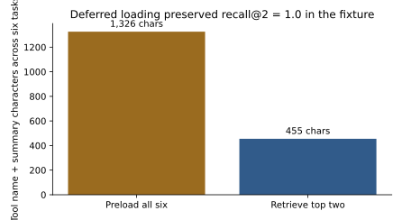

# Tool Engineering and Harness Design [F+S] {#sec-ch17}

## What you need going in

> **Assumed:** production Python, typed APIs, basic authorization, file paths, and tests.
>
> **From earlier chapters:** [Chapter 13](13-prompting-context-engineering.qmd) owns caller-side context selection and compaction; [Chapter 16](16-agent-anatomy.qmd) supplies the proposal–gate–execute–observe kernel and the rule that model output is a proposal rather than authority.
>
> **Not required:** MCP, LangGraph, a hosted model, container internals, or a durable workflow engine. Those appear only after the harness boundary is understood.

::: {.route-b}
**Route B backfill.** Read **Chapter 10, “Prefix caching and cache economics”** (about 4 pages) before Section 17.3. Without it, the harness will still work, but you may reorder stable and volatile context in a way that silently destroys prefix reuse on every turn.
:::

## Contents

- [The interface is part of the intelligence](#sec-ch17-aci)
- [Search the tool surface instead of preloading it](#sec-ch17-tool-search)
- [Assemble context with a ledger](#sec-ch17-context)
- [Skills as progressively disclosed procedures](#sec-ch17-skills)
- [A workspace is a boundary, not a sandbox](#sec-ch17-workspace)
- [Human approval as a typed protocol](#sec-ch17-approval)
- [Close the approval-to-execution race](#sec-ch17-toctou)
- [Resume threads without pretending effects are durable](#sec-ch17-resume)
- [Improve the harness with evaluations](#sec-ch17-eval)
- [Build](#sec-ch17-build)
- [What endures, what changes](#sec-ch17-endures)
- [Exercises](#sec-ch17-exercises)
- [Notes and sources](#sec-ch17-sources)

## What you will build

::: {.callout-tip}
### A six-tool harness under attack

The artifact under `code/ch17/` exposes six support tools, retrieves only the relevant definitions, confines paths to a per-thread workspace, binds a human approval to exact arguments and target state, and checkpoints harness state in SQLite. The build measures tool-retrieval recall and context exposure, substitutes a larger refund after approval, changes the target before execution, restarts the process, and verifies that the audit event is not duplicated. The deterministic path uses only local fixtures.
:::

## The interface is part of the intelligence {#sec-ch17-aci}

Two systems can use the same model and produce very different results because they expose different action and observation interfaces. One gives the model a generic `run(command: str)` tool and returns 40,000 characters of terminal output. The other gives it `search_code`, `view_file`, `apply_patch`, and `run_tests`, each with bounded arguments and concise structured results. The second model appears more capable because the environment makes useful actions easy to express and mistakes easy to detect.

This is the **Agent–Computer Interface** (ACI) thesis: interface design is a first-class model-performance variable. The [SWE-agent study](https://arxiv.org/abs/2405.15793) demonstrated it in software engineering, but the principle applies to support, analytics, research, and operations. A tool is not merely a Python function exposed through JSON. It is a vocabulary item the model must distinguish, select, populate, and interpret.

An effective tool contract answers six questions:

1. **What single job does the tool do?** A specific verb–object name such as `order_lookup` is easier to retrieve than `get`.
2. **When should it be used?** The description names the user's intent and meaningful exclusions.
3. **What arguments are legal?** The schema uses domain types, ranges, enumerations, and semantic field descriptions.
4. **What authority does it exercise?** Read, propose, write, transfer, delete, or administer are different risk classes.
5. **What observation comes back?** Results are concise, structured, correlated, and distinguish expected failure categories.
6. **How is success verified?** A write returns a receipt or new resource version, not a reassuring sentence.

Large grab-bag tools hide these answers. A `manage_order(action, data)` endpoint asks the model to invent a second protocol inside untyped strings. At the other extreme, dozens of nearly identical tools increase selection ambiguity. Good tool design follows the shape of decisions the model can reliably make while keeping enforcement in application code.

The chapter artifact makes risk visible in the registry:

```python
# harness.py — one model-facing tool contract
@dataclass(frozen=True)
class Tool:
    """A model-facing contract bound to an application-owned handler."""
    name: str
    summary: str
    schema: dict[str, type]
    risk: Risk
    handler: Callable[..., Any]
    target_version: Callable[[dict[str, Any]], str] | None = None
```

`target_version` is not for the model. It lets the harness ask the application whether the resource is still the one a human reviewed. The distinction between model-facing description and application-owned control is deliberate.

Tool results deserve the same design care. Return the fields required for the next decision, a stable identifier, provenance or resource version when relevant, and a bounded human-readable summary. Put bulk output in a file or artifact and return a handle. Dumping an entire database row or terminal transcript into the conversation spends context, leaks fields, and makes the next choice harder.

Granularity is a design choice, not a universal preference for smaller functions. A tool should usually represent one domain decision whose preconditions and outcome can be explained. `set_account_state` is too broad because a model must synthesize hidden business rules. Separate tools for every internal database update are too narrow because the model must coordinate a transaction it cannot observe atomically. `suspend_account(reason, evidence_ids)` can be the right boundary when application code validates the evidence, performs the transaction, and returns the resulting account version.

Reads and writes should normally be distinguishable before arguments are inspected. This lets the harness assign budgets, sandboxes, approvals, and concurrency policies at discovery time. A “read” that causes an expensive export or reveals regulated data is not low-risk merely because it leaves state unchanged, so risk classes also need data sensitivity and resource impact in production. The two-value enum in the fixture exposes the mechanism without pretending to be that full taxonomy.

Tool semantics also need retry clarity. A pure calculation can be retried freely. A lookup is usually safe but may observe a newer version. A write needs an idempotency or reconciliation contract. The model should not decide retry legality from a natural-language error. The handler returns a typed category, while code applies the retry policy developed in Chapter 26.

## Search the tool surface instead of preloading it {#sec-ch17-tool-search}

Every tool definition placed in the prompt consumes tokens before the agent has done work. A larger menu also creates more opportunities to confuse tools with overlapping names. With six small tools, preloading can be reasonable. With hundreds of enterprise endpoints and several protocol servers, it becomes a context-allocation policy.

Deferred loading separates **discovery metadata** from the full callable contract. The model initially sees a small set of always-available tools plus a search capability or namespace catalog. When the task requires another capability, the harness retrieves a few candidate definitions and adds them to the active surface. The chosen definition normally remains available for the rest of the relevant phase so the model does not repeatedly rediscover it.

The retrieval objective is recall-oriented. Missing the needed tool makes the task impossible; including one extra plausible tool costs a little context. A practical pipeline is:

1. filter by tenant, permission, environment, and risk before semantic retrieval;
2. retrieve by task language against tool name, description, parameter names, and examples;
3. rerank a small candidate set when the catalog is large;
4. expose full schemas only for the final set;
5. record which catalog and tool versions were considered.

Risk changes discovery. A destructive administrative tool should not become callable merely because its description matched a query. Tool search narrows the context surface; an authorization service narrows the authority surface. Both are necessary.

The deterministic fixture uses transparent lexical overlap rather than an embedding service. Across six tasks, retrieving two tools retained the expected tool in every candidate set while reducing exposed name-and-summary characters from 1,326 to 455.

{#fig-ch17-tool-surface}

The plot answers a narrow question: can this fixture reduce prompt surface without losing the expected tool? It does not establish a universal threshold, and characters are only a transparent proxy for tokenizer-specific token counts. A real catalog evaluation should report recall@k by task slice, wrong-tool rate after the model chooses, added search turns, end-to-end success, and token/latency savings.

The retrieval core is small enough to inspect:

```python
# harness.py — select_tools(), deterministic retrieval fixture
def select_tools(query: str, tools: list[Tool], limit: int = 3) -> list[Tool]:
    """Retrieve a small tool surface by transparent lexical overlap."""
    terms = set(query.casefold().replace("-", " ").split())

    def score(tool: Tool) -> tuple[int, str]:
        words = set(
            f"{tool.name} {tool.summary}".casefold().replace("_", " ").split()
        )
        return len(terms & words), tool.name

    return sorted(tools, key=score, reverse=True)[:limit]
```

This function is a teaching probe, not a production search engine. Its value is that it makes catalog inputs, tie breaking, and the measured surface explicit. Replace it only after establishing an evaluation set that the replacement must beat.

::: {.landscape-2026}
**Landscape 2026 (dated).** Verified 2026-07-19. Deferred tool loading is now exposed by multiple agent products and SDKs, including current GitHub Copilot CLI and OpenAI Agents SDK documentation. Exact activation thresholds, supported models, namespace behavior, and event types are provider surfaces rather than spine concepts.

**Verify live:** [GitHub tool-search documentation](https://docs.github.com/en/copilot/concepts/agents/copilot-cli/tool-search) and [OpenAI Agents SDK tool documentation](https://openai.github.io/openai-agents-python/tools/).
:::

## Assemble context with a ledger {#sec-ch17-context}

Chapter 13 treated context as a caller-side allocation problem. A harness operationalizes that decision on every step. It gathers stable instructions, the current task, compacted history, selected tools, activated skills, retrieved evidence, workspace artifacts, policy messages, and recent observations. Without explicit accounting, whichever component appends last tends to win the remaining window.

```{mermaid}
%%| label: fig-ch17-context
%%| fig-cap: "Which sources enter one model call, and which component records the allocation decision?"
flowchart LR
    Stable["Stable instructions\nand safety contract"] --> Assemble["Harness assembler"]
    Task["Task + authenticated\ncaller context"] --> Assemble
    History["Compacted run history"] --> Assemble
    Tools["Retrieved tool schemas"] --> Assemble
    Skills["Activated skill body"] --> Assemble
    Evidence["Just-in-time evidence"] --> Assemble
    Assemble --> Prompt["Ordered model context"]
    Assemble --> Ledger[("Context ledger")]
    Ledger --> Metrics["tokens, source, reason,\ncache class, truncation"]
```

A **context ledger** records each contribution's source, version, token count, selection reason, trust class, cache class, and whether it was truncated or summarized. It turns context from an invisible string into an inspectable build artifact. When an agent fails because a policy was missing or stale evidence displaced the task, the ledger makes that causal claim testable.

Let the usable window be $W$, the reserved output allowance be $R$, and the selected input components have token counts $n_i$. Admission requires

$$
\sum_i n_i \le W - R.
$$

The inequality is simple; deciding which $i$ survive is the harness policy. Hard requirements such as the current task, authenticated scope, and safety contract are admitted first. Recent tool observations may be required for correlation. Retrieved evidence competes by relevance and freshness. Older conversation can be compacted, but the ledger retains a pointer to the source transcript and the compactor version. If the sum still does not fit, the harness should stop or narrow the task rather than silently dropping an authority-bearing instruction.

Token count alone is not enough. Two equally sized components can have different attention value and injection risk. The ledger therefore supports counterfactual debugging: replay the failed task without one component, with an earlier snapshot, or with a different ordering. That is how a vague diagnosis such as “the model got confused by context” becomes an experiment.

Ordering also interacts with prefix caches. Stable, reusable content belongs near the front; volatile state belongs later. If a timestamp, random request identifier, or freshly rendered tool catalog appears before stable instructions, the prefix changes and the server cannot reuse prior computation. The harness should record cache-boundary choices without re-teaching the serving mechanism from Chapter 10.

Trust labels are not prompt decorations. They tell the assembler and policy layer whether content is instruction-authoritative, application data, user input, retrieved third-party text, or tool output. A model may still be influenced by every token, so labels alone do not contain injection. They support stronger architectural separation and trace analysis developed in Chapter 24.

The harness should answer “why was this item present?” for every context component. “Because the framework added it” is not a sufficient production explanation.

## Skills as progressively disclosed procedures {#sec-ch17-skills}

A tool supplies an action. A **skill** supplies procedural knowledge for accomplishing a class of tasks: when to use tools, in what order, what checks to run, which templates to fill, and how to interpret results. Keeping those instructions out of the global system prompt prevents every specialized procedure from taxing every task.

The durable pattern has three disclosure levels:

1. **Metadata**—a name and precise description—stays cheap enough to index broadly.
2. **Instructions** load only when the task activates the skill.
3. **Resources** such as scripts, references, schemas, and assets load or execute only when a particular step needs them.

The current [Open Agent Skills specification](https://openagentskills.dev/docs/specification) formalizes this directory-shaped pattern, but the mechanism is older and broader: retrieve procedure metadata, bind an immutable version, then disclose depth on demand.

A skill is part of the software supply chain. Treat its instructions as code-adjacent content:

- version and review it;
- declare required tools and permissions;
- pin or hash scripts and referenced assets;
- test activation precision and task outcomes;
- keep secrets out of the package;
- refuse deep reference chains that hide what will execute;
- record the activated version in the run trace.

Progressive disclosure reduces context load; it does not make a skill trustworthy. A malicious skill can tell the model to read secrets or invoke a dangerous tool. Tool gates and workspace isolation must still constrain the resulting proposals.

Good skill descriptions are activation classifiers. “PDF helper” is vague. “Extract text and tables from PDF files; fill forms; merge pages; do not use for image generation” supplies positive and negative boundaries. Measure both missed activations and false activations on a labeled task set.

## A workspace is a boundary, not a sandbox {#sec-ch17-workspace}

Longer tasks need artifacts outside the token window: notes, patches, downloaded pages, generated data, plans, and test reports. A per-thread workspace gives those artifacts stable names and lets the model use files as external working memory. It also creates a boundary between tenants and concurrent runs.

The smallest useful path rule resolves every requested path against one owned root and rejects anything outside it:

```python
# state.py — Workspace.resolve(), path containment seam
def resolve(self, relative: str) -> Path:
    """Return a contained path or reject traversal and absolute escapes."""
    candidate = (self.root / relative).resolve()
    if not candidate.is_relative_to(self.root):
        raise PermissionError(f"path escapes workspace: {relative}")
    return candidate
```

This blocks `../other-thread/secret.txt` through this API. It is not a sandbox. A process with ambient filesystem permission can open another path directly; symlinks, mount configuration, race conditions, shell expansion, subprocesses, networks, credentials, CPU, memory, and time require OS- or container-level controls.

```{mermaid}
%%| label: fig-ch17-workspace
%%| fig-cap: "What does path containment protect, and what remains outside its guarantee?"
flowchart LR
    subgraph Process["Agent process — still untrusted"]
      Call["file proposal"] --> Resolver["resolve under thread root"]
    end
    subgraph Root["Thread workspace"]
      Files[("artifacts, patches, notes")]
    end
    Resolver -->|contained path| Files
    Resolver -. reject escape .-> Other[("other tenant / host files")]
    Process -. requires separate controls .-> Network[("network + credentials")]
    Process -. requires separate controls .-> Compute[("CPU, memory, subprocesses")]
```

The invariant to retain is scoped: a workspace API establishes naming and path ownership; a sandbox establishes execution containment. A secure harness normally uses both.

## Human approval as a typed protocol {#sec-ch17-approval}

“Ask a human before dangerous actions” sounds precise until the system has to pause and display something. What exactly did the person approve? Which actor and tenant were active? Was the target still in the reviewed state? How long is the decision valid? Can the model change arguments afterward?

Approval mechanics begin with an immutable, reviewable proposal. The chapter artifact binds:

- tool name and exact canonical arguments;
- authenticated tenant and actor supplied by the application;
- a digest of the target's current version;
- an expiration time;
- a request identifier and approver identity.

The preview shown to the person should translate the structured action into domain language while retaining exact values: “Refund order A-17 by 49.99 USD to the original payment method,” not “Approve tool call.” High-risk interfaces should display the resulting state change, affected resource, reversibility, and why the system requested approval.

Denial is a first-class outcome. The harness records it and returns a safe reason to the agent. An operator may edit a proposal, but an edit creates a new request; it does not mutate the object that an existing approval signs.

Approval policy varies by risk: low-risk reads may need no checkpoint; ordinary writes may need one reviewer; large transfers may require dual control or a cooling-off period; irreversible actions may be disallowed entirely. Chapter 24 owns the policy architecture. This chapter owns the mechanics that make any such decision bind to execution.

Approval is not free safety. Every checkpoint adds queue time and cognitive work, and repeated low-value prompts create approval fatigue. A useful preview clusters related read-only evidence, highlights the delta from the last reviewed plan, and asks for one domain decision rather than a series of implementation details. It must not bundle independent high-risk effects so broadly that one click grants authority the reviewer did not intend.

Measure the human channel like any other subsystem: time to decision, abandonment, edit rate, disagreement, stale-before-execution rate, and the fraction of approvals that later prove unnecessary. A high acceptance rate may mean the agent is calibrated; it may also mean reviewers have learned to click through. Chapter 27 combines these measures with queue age and escalation operations, while Chapter 28 asks whether work was merely shifted from the agent to reviewers.

## Close the approval-to-execution race {#sec-ch17-toctou}

Time-of-check to time-of-use (TOCTOU) failures occur when the state reviewed at approval differs from the state used at execution. The model may substitute arguments. Another process may change the order. An approval may expire. A tool registry may point the same name at a new implementation.

The defense is **execution-time revalidation at the last responsible moment**. The dispatcher recomputes the action digest from the current call and authenticated context, asks the application for the current target version, checks expiry, and only then invokes the handler.

```{mermaid}
%%| label: fig-ch17-approval
%%| fig-cap: "How does approval remain bound when arguments or target state can change?"
sequenceDiagram
    autonumber
    participant A as Agent
    participant H as Harness
    participant U as Human reviewer
    participant S as Source of truth
    participant T as Write tool
    A->>H: propose refund(A-17, 4999)
    H->>S: read target version v1
    H->>U: exact action + target v1 + expiry
    U-->>H: approval token bound to digests
    Note over A,S: arguments or target may change here
    H->>S: re-read current target version
    H->>H: recompute action + target digests
    alt substituted, stale, or expired
        H-->>A: typed rejection; request new review
    else still identical
        H->>T: execute exact approved call
        T-->>H: receipt + new version
    end
```

The critical code is a set of comparisons immediately before the handler:

```python
# harness.py — dispatch(), execution-time approval checks
current_time = time.time() if now is None else now
current_target = tool.target_version(call.arguments) if tool.target_version else ""
checks = {
    "expired": current_time > approval.expires_at,
    "substituted action": action_digest(call, context) != approval.action_digest,
    "stale target": _digest({"target_version": current_target})
    != approval.target_digest,
}
failed = [name for name, is_failed in checks.items() if is_failed]
if failed:
    raise ApprovalError(", ".join(failed))
```

In the fixture, changing 4,999 to 9,999 cents yields `substituted action`. Updating the order from version `v1` to `v2` yields `stale target`. Neither reaches the refund handler. A fresh request against `v3` executes and returns a receipt for 4,999 cents.

The hash is not an authorization system by itself. The application must authenticate actors, protect token integrity, canonicalize all security-relevant fields, prevent confused-deputy reuse, and decide which target version represents meaningful state. The artifact makes the binding property testable without claiming the surrounding infrastructure.

## Resume threads without pretending effects are durable {#sec-ch17-resume}

A harness should be able to stop after an approval event, restart, and reconstruct enough state to continue. It therefore checkpoints explicit thread state and appends audit events with stable identifiers. A replayed event uses `INSERT OR IGNORE`, so process recovery does not produce two “approved” rows.

```{mermaid}
%%| label: fig-ch17-resume
%%| fig-cap: "Which state can this harness resume, and where does durable-effect responsibility begin?"
stateDiagram-v2
    [*] --> Running
    Running --> AwaitingApproval: proposal requires review
    AwaitingApproval --> Checkpointed: save state + audit event
    Checkpointed --> ProcessGone: crash / deployment
    ProcessGone --> Resumed: load checkpoint
    Resumed --> Revalidate: same event ID is deduplicated
    Revalidate --> Running: approval and target still valid
    Revalidate --> AwaitingApproval: stale or expired
    Running --> ExternalEffect: dispatch write
    ExternalEffect --> Unknown: crash before outcome recorded
    note right of Unknown
      Ch26 owns effect ledger,
      idempotency, and reconciliation
    end note
```

The boundary at `Unknown` is important. A local checkpoint written before a remote payment does not prove the payment happened. A checkpoint written afterward can be lost in a crash while the payment remains committed. Reordering the two writes cannot manufacture exactly-once behavior across systems. Chapter 26 introduces an effect ledger, provider idempotency keys, and reconciliation for that ambiguous state.

This chapter's journal is intentionally narrower: it persists harness phase and deduplicates audit events. The build closes and reopens SQLite, replays `evt-approval-A17`, and observes one audit row plus the original checkpoint. That is a real guarantee about local harness records, not a claim about the payment provider.

## Improve the harness with evaluations {#sec-ch17-eval}

Tool and harness design should be an evaluation loop, not an aesthetic review. Start with traces where the current system selected the wrong tool, omitted required context, exceeded a workspace boundary, retried a denial, or asked for an approval that a human could not understand. Convert each failure into a versioned case with an observable predicate.

Useful harness metrics include:

- tool retrieval recall@k and final wrong-tool rate;
- schema argument validity before repair;
- context tokens by source and cache-hit class;
- task success and steps after a tool-surface change;
- denied-proposal rate versus forbidden-effect rate;
- approval acceptance, edit, abandonment, and stale-revalidation rates;
- workspace escape containment;
- resume success and duplicate audit events;
- latency and modeled cost added by discovery, verification, or review.

Do not optimize one metric in isolation. Making every tool always visible can raise catalog recall while reducing end-to-end selection accuracy and prefix reuse. Requiring approval for every read can reduce effect risk while overwhelming reviewers and teaching users to click through. Chapter 22 supplies the statistical release discipline; Chapter 27 owns online operational queues.

When a harness change affects outcomes, use paired replay wherever possible. Run the same task snapshot, tool-state fixture, and seed against baseline and candidate. Attribute the first divergent event: different tool retrieval, different context item, different proposal, different gate result, or different observation. End-to-end success tells you whether the candidate helped; first-divergence analysis tells you where. For stateful tasks, isolate trials so one candidate's write cannot alter the other's starting state.

Failure classes should map back to owned levers. A required tool absent from the candidate set is a retrieval failure. A visible tool selected incorrectly is a model/interface failure. Correct selection with malformed arguments is a schema or example problem. An allowed call with a harmful effect is a policy defect. A correct effect followed by an unsupported answer is an observation or synthesis defect. This mapping prevents every trace from becoming another prompt tweak.

A self-improving harness may propose new descriptions, examples, skills, routing indexes, or compaction rules from failure traces. It should not deploy those proposals directly. Treat them as candidates: regenerate the evaluation set if needed, run the versioned suite, inspect worst slices, red-team new authority paths, and release through the normal pipeline.

The durable lesson is that weights and prompts are only two levers. A precise tool, a smaller active surface, a better observation, or a correctly bound approval can improve reliability without changing the model.

## Build {#sec-ch17-build}

Run the deterministic artifact from `newbook`:

```powershell
python code/ch17/fixture.py --plot assets/figures/ch17-tool-surface.svg
python -m pytest tests/test_ch17_harness.py -q
```

The fixture should report:

```json
{
  "surface": {
    "recall_at_2": 1.0,
    "retrieved_schema_chars": 455,
    "preloaded_schema_chars": 1326
  },
  "attack": {
    "substituted": "substituted action",
    "stale": "stale target",
    "fresh": {"order_id": "A-17", "refunded_cents": 4999}
  },
  "resume": {
    "checkpoint": {"phase": "approved", "step": 2},
    "duplicate_inserted": false,
    "audit_rows": 1
  }
}
```

The build has four stages.

**1. Evaluate the tool surface.** Read the six names and descriptions in `make_tools`. Add an ambiguous seventh tool named `order_get` and predict which cases will change before running. Improve its name or description, rerun recall@2, and record the context delta.

**2. Inspect deferred loading.** For each task, print the retrieved pair and its risk classes. Add a permission filter before retrieval so a user without refund authority cannot load `refund_issue`, even if it is semantically relevant.

**3. Defeat substituted and stale approval.** Run `run_attack`. Then comment out one digest comparison at a time and watch the corresponding test fail. Restore both checks. Add an expiry case at time 161 for the token issued at 100 with a 60-second TTL.

**4. Resume the harness.** Run `run_resume`, close the first database connection, and replay the same event after reopening. Change the event identifier and confirm the row count becomes two; stable event identity, not payload equality, supplies deduplication.

### Acceptance checks

- Expected tool recall@2 remains 1.0 on the six shipped cases.
- Retrieved schema characters remain below the preload baseline.
- Substituted arguments and a stale target produce different typed rejection reasons.
- No rejected attack changes `refunded_cents`.
- A fresh, matching approval produces exactly one receipt.
- Parent-directory workspace escape is rejected.
- Restart and event replay leave exactly one approval audit row.

### Honesty note

Lexical retrieval is not production semantic search. Path containment is not a sandbox. SHA-256 binding does not supply identity or token integrity. SQLite checkpointing does not make remote effects durable. The build isolates these seams so later chapters can replace each mechanism without changing the property it must preserve.

## What endures, what changes {#sec-ch17-endures}

**What endures.** Tool descriptions, schemas, observations, and risk classes are part of model performance. Large catalogs require permission-aware discovery and deferred disclosure. Harness context should have an inspectable ledger. Procedures can be packaged as versioned skills whose depth loads on demand. A workspace needs both naming containment and a real sandbox. Human approval must bind exact arguments and current target state, then be revalidated immediately before execution. Resumable harness state and durable external effects are separate contracts.

**What changes.** Tool-search APIs, Agent Skills ecosystem conventions, model context limits, protocol registries, framework hooks, and sandbox products will evolve. Appendix C tracks versions. The core questions—what is visible, what is callable, what is authorized, what changed after review, and what can be recovered—remain stable.

## Exercises {#sec-ch17-exercises}

1. **Description ablation.** Replace the six specific summaries with generic phrases such as “gets information.” Measure recall@2 and explain each new collision.
2. **Permission before relevance.** Add tenant-scoped allowed-tool sets. Prove that a high semantic score cannot reintroduce a filtered write tool.
3. **Skill activation.** Write metadata and instructions for a refund-investigation skill. Create six positive and six confusing negative activation cases, then measure precision and recall.
4. **Workspace race.** Add a symlink inside the workspace that points outside it. Explain why path resolution alone is insufficient and propose OS/container controls that close the gap.
5. **Approval expiry and dual control.** Require two different approvers for refunds over 20,000 cents. Bind both approvals to one request and reject reuse by the same identity.
6. **Design defense.** A product manager wants one generic `execute_api` tool so new endpoints require no harness release. Argue the case through selection reliability, schema evolution, risk classification, authorization, observability, and rollback.

## Notes and sources {#sec-ch17-sources}

The empirical motivation for treating interfaces as a capability lever comes from [SWE-agent: Agent–Computer Interfaces Enable Automated Software Engineering](https://arxiv.org/abs/2405.15793). The progressive-disclosure layout described for skills is documented by the [Open Agent Skills specification](https://openagentskills.dev/docs/specification). The implementation here remains framework-neutral: provider-specific tool-search details are dated and quarantined because their activation rules and event surfaces can change.

Chapter 19 introduces MCP and LangGraph after these boundaries are established. Chapter 24 expands the threat model and policy architecture. Chapter 26 replaces the local resume seam with durable effect execution and reconciliation.
