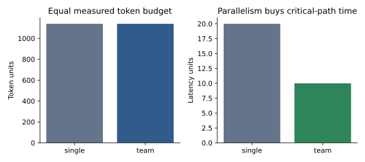

# Multi-Agent Systems: Architectures, Failure Modes, and Economics [F+S] {#sec-ch20}

## What you need going in

> **Assumed:** concurrency, queues, schemas, optimistic concurrency, budgets, and basic evaluation design.
>
> **From earlier chapters:** [Chapter 16](16-agent-anatomy.qmd) supplies the single-agent baseline and workflow patterns. [Chapter 17](17-tool-harness-engineering.qmd) supplies tool and workspace boundaries. [Chapter 18](18-memory-experiential-learning.qmd) owns memory semantics. [Chapter 19](19-protocols-frameworks.qmd) owns A2A and framework mechanics.
>
> **Not required:** distributed-agent frameworks, game theory, multi-agent RL, or a hosted model. This chapter starts with the decision to keep one agent.

## Contents

- [When a single agent wins](#sec-ch20-single-first)
- [Context is the architecture](#sec-ch20-context)
- [Orchestrator–worker and parallel fan-out](#sec-ch20-orchestrator)
- [Handoffs, topologies, and classical coordination](#sec-ch20-coordination)
- [Debate, ensembles, and emergent behavior](#sec-ch20-debate)
- [MAST: classify and attribute team failures](#sec-ch20-mast)
- [Contain error cascades and cross-agent attacks](#sec-ch20-security)
- [Economics and cost-matched evaluation](#sec-ch20-economics)
- [Build](#sec-ch20-build)
- [What endures, what changes](#sec-ch20-endures)
- [Exercises](#sec-ch20-exercises)
- [Notes and sources](#sec-ch20-sources)

## What you will build

::: {.callout-tip}
### A team that must earn its coordination cost

The artifact under `code/ch20/` splits a read-only policy task into three independent shards. Workers write typed JSON reports with provenance; one orchestrator validates and merges them. A single agent receives the team’s measured total token budget. Both produce the same answer, while the parallel team halves modeled critical-path latency. Then one worker omits provenance. The merge gate contains the result and attributes the failure to that worker and handoff.

There is one runtime and one experiment—not a gallery of supervisor, swarm, debate, and hierarchy implementations.
:::

## When a single agent wins {#sec-ch20-single-first}

Adding agents creates a distributed system whose messages are lossy, expensive, and partly generated. Before asking which topology to use, ask whether the task should be split at all.

A multi-agent design needs three positive conditions:

1. **The work is genuinely decomposable.** Independent or weakly coupled read-heavy branches can run concurrently. A single chain of dependent reasoning cannot be accelerated by pretending its steps are peers.
2. **The split creates a useful boundary.** Each worker gets a smaller context, different tools or permissions, a distinct model capability, or an independently operated service. Renaming identical prompts “researcher,” “critic,” and “writer” does not create specialization.
3. **A measured single-agent failure remains.** The best simple baseline has already tried sharper tools, just-in-time context, compaction, a deterministic workflow, a specialist call, or ordinary parallel functions. The proposed team targets a named failure or latency constraint.

If any condition is absent, retain one agent or a deterministic workflow. The test is not whether multiple agents can finish the task. It is whether they outperform the strongest simpler system under the resource constraint the product actually has.

```{mermaid}
%%| label: fig-ch20-split-decision
%%| fig-cap: "When does a task earn the coordination cost of multiple agents?"
flowchart TD
    Start["strong single-agent / workflow baseline"] --> Failure{"measured failure or deadline remains?"}
    Failure -->|no| One["keep one agent"]
    Failure -->|yes| Parallel{"independent or weakly coupled subproblems?"}
    Parallel -->|no| Improve["improve tools, context, planning, or verifier"]
    Parallel -->|yes| Boundary{"useful context, permission, model, or ownership boundary?"}
    Boundary -->|no| Functions["parallel functions, not agent personas"]
    Boundary -->|yes| Writes{"concurrent unresolved writes to same state?"}
    Writes -->|yes| Veto["veto split or appoint one writer"]
    Writes -->|no| Trial["cost-matched team experiment"]
    Trial --> Gate{"quality / latency gain exceeds coordination risk?"}
    Gate -->|yes| Team["ship bounded topology"]
    Gate -->|no| One
```

This decision can be formalized as an incremental utility test:

$$
\Delta U = w_q\Delta Q - w_c\Delta C - w_l\Delta L - w_r\Delta R,
$$

where $Q$ is task quality, $C$ total compute or spend, $L$ deadline-relevant latency, and $R$ operational risk. Weights reflect the product. Parallel research may accept higher total tokens to cut wall time and raise source coverage. A low-latency transaction flow may not.

Compare **systems**, not call counts. Holding “one turn per agent” constant gives the team more model compute. Hold total input/output or reasoning tokens, modeled spend, wall-clock budget, tool calls, and environment access as appropriate. [AI Agents That Matter](https://arxiv.org/abs/2407.01502) argues for cost-aware, reproducible agent evaluation; the requirement is even more important when one architecture silently multiplies calls.

Task coupling is the practical veto. If worker B needs the exact rejected alternatives, uncertainty, and intermediate observations produced by worker A, a short handoff damages the computation. Passing the full trace restores information but erases much of the context and cost benefit. The system has discovered that the work was one chain.

The best reason for multiple agents is often not “collective intelligence.” It is ordinary parallelism plus isolation: search independent sources concurrently, run reviews with disjoint permissions, or delegate to an external owner. State that reason in the design document. If “agent count” is itself the success metric, the architecture has no falsifiable objective.

## Context is the architecture {#sec-ch20-context}

Once a task is split, the decisive design question is what crosses each boundary. Every handoff compresses one agent’s state into another agent’s context. Missing facts, duplicated history, conflicting versions, and adversarial instructions all enter here.

Common strategies trade fidelity for cost:

| Handoff | Preserves | Loses or risks | Good fit |
|---|---|---|---|
| Full trace | Decisions, uncertainty, rejected paths | Context cost, pollution, hidden instructions | Tightly coupled continuation |
| Rolling summary | Compact progress | Quietly drops constraints and provenance | Low-risk conversation continuity |
| Last $k$ turns | Recent local detail | Early requirements and rationale | Short recency-dominated loops |
| Typed artifact | Declared fields, validation, diffability | Undeclared nuance | Bounded delegation and merge |
| Shared store/blackboard | Common named state | Races, stale reads, write conflicts | Coordinated tasks with ownership |
| Retrieved handoff | Just-in-time relevance | Retrieval misses and permission errors | Large evidence collections |

A summary can be fluent and incomplete. Suppose a user says “on-premises only” early in a long trace. The researcher later compares five services and a summarizer emits “prefers a secure enterprise option.” The writer may recommend a hosted product while believing it respected the handoff. A typed requirement field—`deployment: on_prem_only`—fails validation if absent and survives paraphrase.

A useful delegation envelope includes:

- parent run, task, and worker identity;
- objective and excluded work;
- input snapshot or evidence handles;
- output schema and acceptance predicate;
- allowed tools, data, destinations, and effects;
- token, call, time, and hop budgets;
- deadline and cancellation behavior;
- provenance and confidence requirements;
- where to write the artifact and who may merge it.

The worker cannot mint new authority. If the parent delegates read-only access to three files, a worker’s plan to “also update the database” is a rejected proposal. Child budgets are carved from a parent-owned total so spawning more workers cannot evade cost or action limits.

Use **isolated context** when specialization, privacy, or injection containment matters. Give a payroll reviewer only payroll policy and a redacted case; give a code reviewer read-only repository access. Use **shared context** only for state every participant genuinely needs, and prefer append-only evidence or proposals over mutable prose.

Shared files work well as handoff artifacts because they are addressable, bounded, and inspectable. A worker writes `worker-2.json`; the orchestrator reads it after completion and verifies its schema and evidence. The file is not automatically trustworthy because it resides in the same workspace. It is another agent’s output.

Keep conversational coordination small. Chat is suitable for clarification and status. Durable facts, task claims, outputs, and decisions belong in structured artifacts or an event store. Otherwise a reconnect or compaction turns “the agent said it finished” into the only completion record.

Memory follows the same ownership. Private working memory belongs to a worker thread. A shared semantic record goes through the Chapter 18 memory policy. Do not concatenate every worker’s transcript into a permanent team memory; doing so amplifies poisoning, retention, and deletion problems.

## Orchestrator–worker and parallel fan-out {#sec-ch20-orchestrator}

The most useful production topology is often one orchestrator with bounded workers. The orchestrator decomposes the objective, issues task briefs, watches global budgets, validates reports, and synthesizes the answer. Workers perform independent searches, analyses, or reviews. They return artifacts; they do not decide the parent task is complete.

```{mermaid}
%%| label: fig-ch20-orchestrator
%%| fig-cap: "How does orchestrator–worker parallelism preserve isolation and single-writer ownership?"
flowchart TB
    User["objective + constraints"] --> O["orchestrator\nplan, budget, terminate"]
    O --> B1["typed brief A"]
    O --> B2["typed brief B"]
    O --> B3["typed brief C"]
    subgraph Isolated["isolated workers — read/propose only"]
      B1 --> W1["worker 1"]
      B2 --> W2["worker 2"]
      B3 --> W3["worker 3"]
    end
    W1 --> A1["report A + evidence"]
    W2 --> A2["report B + evidence"]
    W3 --> A3["report C + evidence"]
    A1 --> Gate["schema, scope, provenance, version gate"]
    A2 --> Gate
    A3 --> Gate
    Gate --> Merge["single-writer merge"]
    Merge --> Verify["outcome verifier"]
    Verify --> Answer["answer / commit / escalation"]
    W1 -. no direct global write .-> Merge
    W2 -. no direct global write .-> Merge
    W3 -. no direct global write .-> Merge
```

Parallel fan-out changes critical-path latency from a sum toward a maximum:

$$
L_{fanout} \approx L_{plan} + \max_i L_{worker_i} + L_{merge}.
$$

The total compute remains approximately the sum of worker compute plus planning and merging. Parallelism buys time, not free reasoning. Tail latency depends on the slowest required worker. Retries, rate limits, shared bottlenecks, and stragglers can erase the gain.

Shard boundaries should minimize cross-worker dependence. “Search sources A, B, and C independently” is strong. “Worker 1 invents the plan, worker 2 interprets its summary, worker 3 fixes both” is a serial chain with lossy links. If results must be combined, specify compatible schemas and stable entity identifiers before dispatch.

Fan-out needs bounds:

- maximum workers per parent and per tenant;
- maximum nesting depth and handoff count;
- token, tool-call, wall-time, and monetary sub-budgets;
- cancellation propagation and orphan cleanup;
- deadline behavior for partial results;
- concurrency caps for downstream systems;
- deterministic tie-breaking and a single completion owner.

The orchestrator should decide whether partial success is usable. A research report might publish three of four independent sections with a visible gap. A compliance decision may require every shard and fail closed. Encode quorum and required-shard rules rather than asking the model whether the answer “seems complete.”

Workers can use different models or tools when specialization is measured. A cheap extraction model may process tables while a stronger model synthesizes. Heterogeneity may improve diversity, but it complicates calibration, security review, capacity, and attribution. Start homogeneous unless the eval demonstrates a slice-specific reason.

The artifact uses deterministic workers to isolate orchestration mechanics. Each consumes 220 token units and five latency units. Three run concurrently; planning costs two latency units and merge costs three. The team and single-agent baseline each consume 1,140 token units, but the modeled critical path is ten versus twenty. This is an example of a justified benefit—latency on independent read work—not a claim that three agents reason better.

## Handoffs, topologies, and classical coordination {#sec-ch20-coordination}

Topology determines who can send work, share state, and end the run.

| Topology | Routing owner | Context path | Strength | Characteristic failure |
|---|---|---|---|---|
| Star/supervisor | Central parent | Worker ↔ parent | Budgets and attribution | Parent bottleneck |
| Direct handoff | Current agent | Agent → agent | Natural specialization chain | Telephone-game drift |
| Tree/hierarchy | Parent at each level | Up/down branches | Scales decomposition | Hidden cost and depth explosion |
| Blackboard | Shared scheduler/state | Artifact store | Flexible contributors | Races and stale state |
| Peer network | Any peer | Arbitrary graph | Adaptive coordination | Cycles, authority spread, hard termination |

Use the smallest topology that expresses the dependency graph. A star is easier to observe and contain than a peer mesh. Hierarchy helps only if branches remain independent and sub-orchestrators receive real budgets. Direct handoff is useful for an ownership transfer, such as intake to a specialized regulated workflow, but the handoff must carry identity, constraints, and acceptance state.

Classical multi-agent and distributed-systems ideas are more useful than new persona names.

**Contract Net** coordination announces a task, receives bids, awards work, and evaluates results. A modern router can use deterministic capability metadata, cost, deadline, and load instead of free-form agents persuading one another. The parent still verifies the winner’s output.

A **blackboard** lets specialized processes read and contribute to shared problem state. Make entries typed and append-only where possible. Use claims or leases for work ownership, versions for reads, and idempotent completion records. A shared chat log is not a concurrency protocol.

The **single-writer principle** is central. Parallel agents may inspect, test, and propose, while one owner commits a file, account, or deployment under a version check. If two code agents edit the same file independently, the issue is not how to make them debate the merge. Change the shape: parallel reviewers return findings; one writer applies them.

Conflicts become observations. A rejected compare-and-swap tells the orchestrator that state changed; it reloads, replans, or escalates. Last-write-wins hides which evidence and approval were overwritten. Chapter 26 provides the durable effect ledger and reconciliation for external writes.

Role specialization should follow authority and context, not theater. “Database migration reviewer with schema-read and test tools” is a real role. “Optimist agent” and “pessimist agent” are sampling prompts unless repeated evaluation shows complementary error. Mirroring an organization chart usually imports human communication overhead without the tacit knowledge that makes the human organization function.

For remote ownership, use the A2A task boundary from Chapter 19. Do not teach the remote agent your internal framework state. Send a task brief and receive typed artifacts. The parent remains responsible for using them safely.

## Debate, ensembles, and emergent behavior {#sec-ch20-debate}

Multiple model calls can generate diverse candidates, critique an answer, vote, or debate. These are test-time inference patterns before they are production organizations.

**Independent sampling plus aggregation** works when errors are not perfectly correlated and an answer can be verified or voted. Self-consistency is the simplest case. It needs no agents with identities or persistent chat. Spend the same compute first on best-of-$N$, verifier-guided search, or a stronger model as developed in Chapter 8.

**Debate** exposes candidate reasoning to peers over several rounds. It can surface missed evidence, but it also creates anchoring, conformity, verbosity, and persuasive-error failure modes. A majority can converge on the same injected premise. More turns are not monotonically better, and a judge may reward rhetorical agreement over correctness.

Use debate as an evaluated subroutine when the task has independent perspectives and a final verifier. Bound rounds, preserve original evidence, prevent debaters from rewriting one another’s sources, and compare with equally priced independent samples. Do not deploy a permanent council because one benchmark improved without a compute-matched baseline.

**Ensembles** gain most when channels differ in a meaningful way: model family, data, retrieval source, tool, or inductive bias. Five copies of one model with near-identical context have correlated blind spots. Diversity without aggregation quality can lower performance because the final synthesizer must discriminate more plausible errors.

Emergence and game-theoretic language can help analyze behavior, not replace a contract. Local incentives, information asymmetry, repeated interaction, and shared resources may produce specialization, collusion, free riding, or escalation. An agent that appears cooperative in a simulation has not acquired a deployable service-level guarantee.

The transferable lessons from social simulations and role-playing systems are modest but useful:

- environment and action constraints shape behavior more than character prose;
- memory changes repeated interaction;
- communication topology changes which errors propagate;
- incentives and termination conditions need explicit ownership;
- observed group behavior may disappear under a new model or prompt.

Multi-agent RL and co-training can teach policies that anticipate peers instead of prompting independent models to cooperate at inference. That is a different mechanism, introduced in Chapter 23. This chapter evaluates inference-time systems as deployed software.

## MAST: classify and attribute team failures {#sec-ch20-mast}

“The team failed” is too coarse to guide a fix. [MAST](https://arxiv.org/abs/2503.13657), the Multi-Agent System Failure Taxonomy, organizes 14 observed failure modes into three categories. Its initial study used expert annotation and reported strong inter-annotator agreement. The exact prevalence depends on the systems and dataset; the vocabulary is useful because it directs attention to specification, coordination, and verification rather than blaming every outcome on model capability.

| Category | Code | Failure mode | Engineering signal |
|---|---:|---|---|
| Specification/system design | 1.1 | Disobey task specification | Output violates an explicit constraint |
|  | 1.2 | Disobey role specification | Worker uses authority or work outside its brief |
|  | 1.3 | Step repetition | Same work or message cycle repeats |
|  | 1.4 | Loss of conversation history | Required earlier state disappears |
|  | 1.5 | Unaware of termination conditions | Team continues after success or cannot decide to stop |
| Inter-agent misalignment | 2.1 | Conversation reset | Dialogue unexpectedly restarts and loses progress |
|  | 2.2 | Fail to ask for clarification | Agent guesses across an ambiguous handoff |
|  | 2.3 | Task derailment | Interaction drifts from the objective |
|  | 2.4 | Information withholding | Agent fails to pass material evidence |
|  | 2.5 | Ignored other agent’s input | Received contribution is not incorporated |
|  | 2.6 | Reasoning–action mismatch | Declared plan and executed action diverge |
| Task verification | 3.1 | Premature termination | System ends before required objectives are met |
|  | 3.2 | No or incomplete verification | Required checks are missing |
|  | 3.3 | Incorrect verification | The verifier approves bad work or rejects correct work |

One trace can contain several modes. “Step repetition” describes behavior; the root cause may be a missing parent hop budget or completion event. Do not treat taxonomy labels as causal proof. Use them to cluster failures, inspect first divergence, and choose an owned intervention.

Attribution adds **who and when**. Record agent identity, model and prompt version, task brief, state snapshot, incoming artifact identifiers, proposed action, gate decision, observation, and outgoing artifact. Find the earliest decisive step after which the run cannot recover under normal policy. Later agents may amplify an error without originating it.

The artifact’s poisoned worker omits an evidence identifier. Its finding happens to be correct, but the handoff contract requires provenance. The validator returns:

```json
{
  "category": "inter-agent misalignment",
  "agent": "worker-2",
  "step": "handoff",
  "reason": "missing provenance"
}
```

This coarse category corresponds most closely to information withholding. The run status is `contained`, not `completed`: a gate prevented an unsupported answer, but the user’s task remains unsatisfied. Containment success and task success must be separate metrics.

Automated taxonomy judges require calibration. A model may infer motives or hidden state not present in the trace. Maintain human-reviewed examples, permit multiple labels, report per-mode precision/recall, and keep the raw evidence span. Chapter 22 supplies judge and statistical discipline.

## Contain error cascades and cross-agent attacks {#sec-ch20-security}

Every worker output is untrusted input, even when all workers run in one application. A mistaken premise, poisoned document, or malicious instruction can cross several model calls and acquire credibility through repetition.

```{mermaid}
%%| label: fig-ch20-cascade
%%| fig-cap: "Where can one poisoned worker report be stopped before it becomes a team conclusion or effect?"
sequenceDiagram
    autonumber
    participant D as Retrieved document
    participant W as Worker 2
    participant A as Report artifact
    participant G as Merge gate
    participant O as Orchestrator
    participant E as Effect tool
    D->>W: evidence plus injected instruction
    W->>A: confident finding, provenance omitted
    A->>G: typed report
    G->>G: validate schema, scope, evidence, version
    alt fail closed
        G-->>O: attributed rejection: missing provenance
        O-->>O: retry, omit shard, or escalate
    else unchecked propagation
        G-->>O: accepted claim
        O->>E: action based on laundered premise
    end
```

The merge boundary should validate:

- schema and bounded size;
- worker and task identity;
- allowed shard, subject, and target;
- evidence identifiers and source policy;
- artifact and source versions;
- unsupported instructions or executable content;
- confidence and conflict state;
- signature or integrity metadata for remote peers.

Do not paste worker reports into the orchestrator’s system prompt. Delimit them as data. Preserve quotations and source handles so the parent can inspect evidence rather than trust a summary. A worker may recommend an action but cannot sign an approval or elevate the parent’s credentials.

Topology affects blast radius. A star routes every cross-worker claim through a validation point. A peer mesh lets an infection propagate laterally. Hierarchy can contain branches if sub-orchestrators have disjoint permissions; it can also launder content through several summaries. Give one agent final effect authority and keep other agents read-only or proposal-only when possible.

The “chained low-risk actions” problem becomes worse with teams. Worker A reads a secret, worker B opens an external channel, and worker C combines both even if no individual tool looks high-risk. Policy evaluates information flow and aggregate run authority, not only each call. Chapter 24 develops taint, injection, and least-privilege defenses.

Cross-agent denial of service also matters. A malicious or confused worker can spawn children, bounce handoffs, emit huge artifacts, hold a required shard, or force repeated clarification. Parent-owned fan-out, depth, size, deadline, and total-token limits prevent local decisions from expanding the run indefinitely.

Verification should be independent of the producer’s claim. Re-run tests, query the source of truth, compare versions, or use a separately controlled verifier. Asking the same worker “are you sure?” often preserves the premise that caused the error.

## Economics and cost-matched evaluation {#sec-ch20-economics}

Multi-agent cost is not simply agent count times one call. Each loop re-reads instructions, tools, conversation, and artifacts; parents also read worker outputs and may retry. Context topology determines repeated input.

For workers $i=1\ldots n$ and a parent, a useful accounting identity is

$$
C_{team}=C_{plan}+\sum_i(C_{worker,i}+C_{handoff,i})+C_{merge}+C_{verify}+C_{retry}.
$$

Break each term into input, output, cached input, tool, and infrastructure units. Attribute them to the parent run and task slice. A fixed “cost per agent” obscures long traces and large tool catalogs.

{#fig-ch20-cost-latency fig-alt="Two bar charts. Single and team token units are equal at 1,140; latency units are 20 for single and 10 for team."}

The build’s result is intentionally restrained. The team does not score higher. It returns the same three evidence-backed findings with the same measured token units. Its twofold modeled speedup comes from three independent five-unit workers running concurrently. A sequential task would not get that benefit.

Compare at least these baselines:

1. deterministic workflow;
2. one agent with all relevant context;
3. one agent with retrieval, tool search, and compaction;
4. deterministic parallel workers with a non-model merge;
5. one orchestrator with model workers;
6. richer handoffs or peer coordination only if earlier variants fail.

For each, report task success, slice floors, total tokens/spend, wall-clock distribution, tool calls, retries, handoffs, reviewer work, and forbidden effects. Use the same task snapshots, models, tool state, concurrency limits, and success predicates. Run enough repetitions for stochastic variance.

Evaluate milestones as well as outcomes. Did decomposition cover the requirements? Did every required worker finish? Did reports pass schema and provenance? Did the merge preserve constraints? Did the verifier check the result? These signals localize gains and regressions.

::: {.callout-note .landscape-2026}
### Landscape 2026 — measured scaling replaced “more agents” as the default story

Verified **2026-07-19**: Anthropic’s engineering report says its agents used roughly four times the tokens of chat interactions and its production multi-agent research system roughly fifteen times, while describing gains on breadth-first research. These are vendor-reported workload figures, not constants. [Towards a Science of Scaling Agent Systems](https://arxiv.org/abs/2512.08296) reports controlled comparisons across many configurations and finds strong dependence on task parallelism and topology. A 2026 equal-thinking-budget study, [Single-Agent LLMs Outperform Multi-Agent Systems on Multi-Hop Reasoning](https://arxiv.org/abs/2604.02460), reports single-agent advantages on coupled multi-hop tasks under its tested conditions.

SDK names, hosted team features, model families, and quantitative rankings are volatile. **Verify live:** recheck paper revisions, exact budgets, task definitions, model versions, and production reports before quoting a multiplier or recommending a framework.
:::

The decision artifact should state why the team exists, which simpler variants were tested, the budget, the residual gain, failure distribution, rollback trigger, and owner. A well-supported rejection of multi-agent architecture is a successful engineering result.

Chapter 26 turns this accounting into platform cost and capacity controls. Here the invariant is simple: complexity must earn measurable utility under matched resources.

## Build {#sec-ch20-build}

Run the deterministic experiment from `newbook`:

```powershell
python code/ch20/fixture.py --plot assets/figures/ch20-cost-latency.svg
python -m pytest tests/test_ch20_team_runtime.py -q
```

The central result should be:

```json
{
  "cost_matched": {
    "single": {"score": 1.0, "tokens": 1140, "latency_units": 20},
    "team": {"score": 1.0, "tokens": 1140, "latency_units": 10},
    "team_speedup": 2.0,
    "same_answer": true
  },
  "fault_injection": {
    "status": "contained",
    "failure": {
      "category": "inter-agent misalignment",
      "agent": "worker-2",
      "step": "handoff",
      "reason": "missing provenance"
    }
  }
}
```

Work through one runtime in six passes.

**1. Defend the split.** Read `CORPUS`: three independent regions, one finding each. Call `should_split` with each condition false in turn. Write down why a coupled chain or an unmeasured single-agent baseline should veto this architecture.

**2. Inspect task briefs.** In `Orchestrator.run`, verify each worker receives one shard, one read tool, an output schema, and budgets. Add an unauthorized write tool and make the worker reject the brief.

**3. Follow file handoffs.** Each worker writes one immutable JSON report. Inspect the temporary artifacts by replacing `TemporaryDirectory` with a test-owned directory. Add a fourth shard and confirm the orchestrator, not a worker, still owns the final answer.

**4. Reproduce the cost match.** The team spends 180 planning units, three times 220 worker units, and 300 merge units. Pass that measured total to `SingleAgent`. Change one budget and make the comparison report itself as unmatched rather than silently plotting it.

**5. Break provenance.** Set `poison_worker="worker-2"`. The finding remains textually correct, but the evidence tuple is empty. Follow the first decisive failure from report creation to gate rejection. Change the gate to accept it and observe how unsupported content becomes a final answer.

**6. Change task shape.** Replace the three shards with a dependent chain where each input requires the prior result. Model the team’s communication latency and repeated context. The single agent should now win or the splitter should veto the run.

### Acceptance checks

- All three split conditions are necessary.
- Worker authority is narrower than parent authority.
- Reports are typed, immutable, scoped, and provenance-bearing.
- Exactly one component merges final state.
- Single and team runs use equal measured token units.
- Parallel latency uses the maximum worker path, not the sum.
- Missing provenance is contained and attributed; it is not called task success.

### Honesty note

The workers are deterministic functions, token and latency units are modeled, and the fixture has perfectly independent shards. It isolates decomposition, accounting, handoff, and attribution properties; it does not estimate the quality of a particular model or hosted agent product. Re-run the same contract with a local model and repeated task suite before making a deployment decision.

## What endures, what changes {#sec-ch20-endures}

**What endures.** Multiple agents are a decomposition choice, not a maturity level. A team needs parallelizable work, a useful boundary, and a measured failure of a simpler baseline. Context architecture determines whether information survives a handoff. Typed artifacts beat conversational summaries for bounded delegation. Parent-owned budgets, isolated authority, validation, and a single writer contain distributed failure. Evaluate under matched compute and report containment separately from task success. Attribute the first decisive error by agent and step.

**What changes.** Model coordination ability, long-context quality, SDK team features, learned topologies, co-trained policies, and benchmark results will move. Named agent roles will come and go. The stable questions are: why split, what travels, who may write, what is the total budget, where can an error propagate, how is success verified, and does the team beat one well-equipped agent?

## Exercises {#sec-ch20-exercises}

1. **Compression trap.** Take a real long trace containing five hard constraints and three rejected alternatives. Compare full trace, rolling summary, last-$k$, and typed-artifact handoffs. Measure retained constraints and token units.
2. **Tail latency.** Give three workers different latency distributions and retry policies. Simulate the fan-out p50 and p95, then choose a deadline and partial-result policy.
3. **Single writer.** Convert two parallel code writers into parallel reviewers plus one writer. Add a stale-version conflict and compare regression rate.
4. **MAST injection suite.** Inject one failure from each MAST category. Attribute the earliest decisive agent and step, and measure the classifier against human labels.
5. **Topology defense.** Compare star, direct handoff, hierarchy, and blackboard for an incident-response task. State context, permission, termination, and write ownership for each; select one.
6. **Cost curve.** Repeat the build at three total budgets and two task shapes. Plot quality, latency, and cost; identify the range, if any, where a team has positive $\Delta U$.
7. **Design rejection.** A product manager proposes five persona agents for a tightly coupled refactor. Write `MULTI_AGENT_DECISION.md` with the baseline, veto condition, evidence, and a simpler alternative.

## Notes and sources {#sec-ch20-sources}

The decision and cost discipline builds on [AI Agents That Matter](https://arxiv.org/abs/2407.01502), the controlled experiments in [Towards a Science of Scaling Agent Systems](https://arxiv.org/abs/2512.08296), and the equal-budget analysis in [Single-Agent LLMs Outperform Multi-Agent Systems on Multi-Hop Reasoning](https://arxiv.org/abs/2604.02460). The production orchestrator–worker example and reported token magnitudes come from Anthropic’s dated engineering account, [How we built our multi-agent research system](https://www.anthropic.com/engineering/multi-agent-research-system).

The failure vocabulary follows [Why Do Multi-Agent LLM Systems Fail?](https://arxiv.org/abs/2503.13657), with failure-attribution motivation from [Which Agent Causes Task Failures and When?](https://proceedings.mlr.press/v267/zhang25cq.html). Classical coordination predates LLM agents: Reid Smith’s Contract Net Protocol and the Hearsay-II blackboard architecture remain useful foundations. [Multiagent Debate](https://arxiv.org/abs/2305.14325) motivates the debate discussion; Chapter 8 remains the canonical home for verifier-guided inference. Chapter 24 develops cross-agent injection and Chapter 23 develops agent-policy training.
