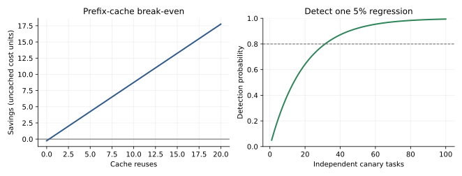

# The Production Platform: Gateways, Cost, Durable Execution, and Delivery [F+S] {#sec-ch26}

## What you need going in

> **Assumed:** production Python, HTTP APIs, SQL transactions, authentication versus authorization, retries, timeouts, containers, and basic continuous delivery.
>
> **From earlier chapters:** [Chapter 17](17-tool-harness-engineering.qmd#sec-ch17) made tool effects explicit, [Chapter 19](19-protocols-frameworks.qmd#sec-ch19) introduced graph checkpointers, [Chapter 22](22-evaluation.qmd#sec-ch22) built the offline release argument, and [Chapter 24](24-agent-security.qmd#sec-ch24) put authorization at the final effect boundary. This chapter builds the platform around those mechanisms.
>
> **Not required:** experience with an AI gateway, FinOps, workflow engine, property-based testing, or Kubernetes. Observability, SLOs, incident response, live review queues, and privacy operations belong to Chapter 27.

> **Route B backfill**
>
> - **Chapter 10, goodput and cost sections (~6 pp).** Read the serving-cost and goodput treatment in [Serving at Scale](10-serving-at-scale.qmd#sec-ch10) before the cost section here. Skipping it leaves the formulas usable but hides how continuous batching, cache reuse, prefill/decode imbalance, and admission control create the capacity envelope.

## Contents

- [The platform is four planes, not one cluster](#sec-ch26-planes)
- [What you will build](#sec-ch26-artifact)
- [One gateway owns identity, admission, and routing](#sec-ch26-gateway)
- [Price the journey and provision its constrained resource](#sec-ch26-cost)
- [Retries consume a deadline and an effect budget](#sec-ch26-reliability)
- [Close the crash window with an effect ledger](#sec-ch26-ledger)
- [Choose checkpointing or durable execution by effect lifetime](#sec-ch26-durable)
- [Version and recover the complete artifact surface](#sec-ch26-versioning)
- [Test deterministic code as aggressively as model behavior](#sec-ch26-testing)
- [Deliver through gates, shadow traffic, and powered canaries](#sec-ch26-delivery)
- [Build](#sec-ch26-build)
- [What endures, what changes](#sec-ch26-endures)
- [Exercises](#sec-ch26-exercises)
- [Notes and sources](#sec-ch26-sources)

## The platform is four planes, not one cluster {#sec-ch26-planes}

At 16:40 on Friday, three product teams discover that their agents share one provider account. One team's fallback loop retries a rate-limited request against two models, another prepends a large corpus on every turn, and a third runs an evaluation sweep. The account spends twenty-three thousand dollars before anyone can attribute the traffic to a tenant, release, or task. Disabling the only provider key stops the runaway loop—and every healthy application with it.

The defect is not a missing dashboard. The organization has no enforcement point between application intent and scarce model capacity. A **production platform** gives every journey a trusted identity, explicit budget, routable capability, recoverable effect contract, complete version, and controlled release path. A *journey* is the whole user outcome, including model calls, retrieval, tools, retries, and review; one API request is only a hop within it.

Separate the platform into four planes. The distinction is about responsibility, not necessarily four deployments:

| Plane | Owns | Must not become |
|---|---|---|
| request | authentication, admission, deadlines, routing, streaming, effect invocation | a place where every product rule accumulates |
| data | prompts, corpora, checkpoints, effect records, cache entries, receipts | an unversioned collection of “temporary” state |
| control | catalogs, policies, budgets, release bundles, traffic allocation | an eventually consistent path for per-request authorization |
| evidence | traces, usage, eval results, lineage, audit exports | hot-path authority whose outage blocks safe service by accident |

The request plane acts synchronously. The control plane publishes immutable configuration that request workers consume. The data plane stores both primary and derived state. The evidence plane records what occurred. Evidence can trigger a later control-plane change, but a trace collector should not decide whether a refund is authorized. That remains the final enforcement point from Chapter 24.

@fig-ch26-planes locates authority and evidence. A control-plane bundle is published ahead of traffic; the request path carries a verified bundle hash so a later trace can be interpreted against the exact rules it used.

```{mermaid}
%%| label: fig-ch26-planes
%%| fig-cap: "Where do request authority, durable state, release control, and operational evidence live?"
%%| fig-alt: "Clients enter a request gateway that calls an agent and effect service. A control plane publishes an immutable bundle to the gateway and agent. A data plane stores corpora, checkpoints, effect ledgers, and receipts. Each component emits evidence to a separate observability plane."
flowchart LR
    CLIENT["Client with virtual key"] --> GATE["Request plane<br/>identity · budget · route · deadline"]
    GATE --> AGENT(["Agent runtime"])
    AGENT --> EFFECT["Effect gateway"]

    CONTROL["Control plane<br/>catalog · policy · release bundle"] -->|"atomic version pointer"| GATE
    CONTROL -->|"pinned model and tools"| AGENT
    DATA[("Data plane<br/>corpus · cache · checkpoint<br/>effect ledger · receipt")]
    AGENT <--> DATA
    EFFECT <--> DATA

    GATE -. "usage + decision" .-> EVIDENCE[("Evidence plane<br/>traces · evals · lineage · audit")]
    AGENT -. "trajectory" .-> EVIDENCE
    EFFECT -. "authoritative receipt" .-> EVIDENCE
```

Deployment topology follows constraints rather than fashion. A managed model API minimizes model-serving work and accelerates model substitution, but it creates provider availability, data-handling, quota, and network dependencies. Self-hosting gives control over weights, batching, isolation, and accelerators while adding serving expertise and capacity risk. On-premises or sovereign deployments can satisfy locality and procurement constraints at the cost of slower elasticity. Edge or hybrid systems reduce network latency and preserve an offline path, but memory, power, model size, and version convergence become first-class limits.

Make the decision per workload and data class. The same organization may use a managed API for public drafting, a regional managed endpoint for tenant-private support, and a self-hosted small model for high-volume classification. Record residency, latency, availability, staffing, customization, isolation, update cadence, and exit cost. Chapter 27 converts residency and retention decisions into operated controls; Chapter 28 uses the staffing and substitution evidence for build-versus-buy.

::: {.callout-note .landscape-2026}
### Landscape 2026 (dated)

**Verify live: 2026-07-19. Appendix C owner: gateways, workflow engines, and deployment products.** Current AI-gateway options include dedicated projects and AI extensions in general API gateways; current durable-execution choices include [Temporal](https://docs.temporal.io/), [Restate](https://docs.restate.dev/foundations/key-concepts), [DBOS](https://docs.dbos.dev/), and cloud workflow services. Managed accelerator endpoints, serverless GPU products, sovereign offerings, and supported regions change frequently. Select by the mechanism and verified service contract—identity propagation, policy enforcement, replay semantics, storage control, quotas, and failure behavior—not by the category label.
:::

## What you will build {#sec-ch26-artifact}

::: {.callout-tip}
### The chapter artifact

You will build [`mini_platform.py`](../code/ch26/mini_platform.py), one deterministic reference platform with an executable facade. [`gateway_control.py`](../code/ch26/gateway_control.py) owns identity, admission, routing, and retry policy; [`effect_runtime.py`](../code/ch26/effect_runtime.py) owns backpressure and crash-safe effects; and [`release_gate.py`](../code/ch26/release_gate.py) owns the canary decision. Together they settle metered usage, preserve stable effect identity, hash a complete release bundle, and gate promotion.

The secondary [`cost_curves.py`](../code/ch26/cost_curves.py) derives the two quantitative questions that prose tends to obscure: when a prefix-cache write premium pays back, and how many independent canary cases are needed to have a stated chance of seeing a regression. The build deliberately uses injected clocks and a deterministic provider so every security and recovery claim has a focused test.
:::

## One gateway owns identity, admission, and routing {#sec-ch26-gateway}

An **LLM gateway** is the policy-controlled entry point to model inference. An **AI gateway** may additionally route embeddings, rerankers, media models, and safety classifiers. An **MCP gateway** mediates protocol servers and tools. The payloads differ, but the platform pattern is the same: authenticate the caller, derive trustworthy context, check policy and budgets, resolve a logical capability to a deployment, propagate a deadline, meter actual use, and emit evidence.

A client header saying `tenant=bank-a` is data, not identity. Issue a **virtual key** or accept a verified workload token and map it server-side to tenant, project, allowed capabilities, environment, and budget. Never forward the platform's broad provider key to an application. The gateway holds provider credentials and records the downstream account or deployment actually used.

Admission occurs before expensive work. Reserve an estimate for the whole journey, not only the first model call. A request that can take eight agent steps, invoke a paid search tool, and fan out to four workers has a different maximum exposure than a single extraction call. Settle against authoritative provider usage and effect receipts, then release unused reservation. Under concurrency, reservations need an atomic counter or transactional ledger; checking a balance and incrementing it in separate operations overspends.

The reference artifact makes the trust direction visible:

```python
# gateway_control.py — identity and admission boundary
def authenticate(self, virtual_key, request_id, deadline_s):
    if virtual_key not in self.keys:
        raise PermissionError("unknown virtual key")
    tenant, scopes = self.keys[virtual_key]
    return RequestContext(request_id, tenant, scopes, deadline_s)

def admit(self, context, estimated_cost):
    limit = self.limits[context.tenant]
    if self.spend[context.tenant] + estimated_cost > limit:
        raise BudgetError("tenant journey budget exhausted")
```

Production admission must atomically reserve outstanding cost; the small artifact has no concurrency and therefore says only that identity comes from the virtual key and a journey above its tenant limit is rejected before routing.

**Routing**, **cascading**, **fallback**, and **hedging** are different operations:

| Operation | Decision time | Purpose | Test oracle |
|---|---|---|---|
| route | before a call | select a deployment satisfying capability, policy, locality, and health | selected deployment is eligible |
| cascade | after a valid low-cost result is graded insufficient | escalate capability deliberately | escalation rule and grader justify next tier |
| fallback | after an operational failure | preserve availability with an equivalent contract | only declared retryable failures change provider |
| hedge | before the first attempt completes | cut tail latency with a redundant attempt | first valid result wins; loser is canceled and charged |

Resolve a product alias such as `support-answer` through capability filters first—schema support, context, modality, region, data class, release, and policy—then optimize cost or latency among eligible deployments. A cheap model that cannot satisfy the contract is not a candidate.

Do not provider-shop around a policy refusal. If provider A refuses a harmful request, sending the same request to B until one complies converts resilience into a security bypass. The artifact permits fallback for overload, a connection reset, or rate limiting while time remains; authentication, invalid-request, and policy errors are terminal. Likewise, degraded mode is an application-declared smaller contract, such as “read-only answer without account action,” not the gateway quietly removing safety checks.

A circuit breaker stops sending normal traffic to a failing deployment after a threshold, waits, then admits bounded probes. Its state is health evidence, not model-quality preference. Record fallback rate separately from escalation rate: rising fallback suggests provider or network health; rising escalation suggests task or routing quality.

::: {.artifact-checkpoint}
| Artifact state | New code | Invariant now verified |
|---|---:|---|
| `gateway_control.py` complete | 112 lines total; 12 shown | An untrusted tenant field cannot select identity, an over-budget journey cannot start, and policy refusal cannot trigger provider shopping. |
:::

## Price the journey and provision its constrained resource {#sec-ch26-cost}

Per-token list price is an input to cost, not the answer. The useful unit is **cost per successful business outcome**. Attribute input, cached input, output, reasoning tokens, embeddings, reranking, tool charges, accelerator time, storage, network egress, and human review to one journey identity. Also retain failed and abandoned journeys: hiding them makes a retry-heavy system look efficient.

For a journey with calls $j=1,\ldots,m$, let $x_j$ and $y_j$ be metered input and output tokens, $p^{(x)}_j$ and $p^{(y)}_j$ their unit prices, $u_j$ other tool charges, and $h$ review cost. A first cost ledger is

$$
C_{\text{journey}}
= \sum_{j=1}^{m}\left(x_jp^{(x)}_j+y_jp^{(y)}_j+u_j\right)+h.
$$

All prices must use the units declared by the provider; the code artifact converts per-million-token rates. Reconcile the unsampled billing ledger against sampled traces. Traces explain why cost occurred, but sampling them must never erase spend. Compare totals by provider invoice window, tenant, deployment, release, and usage class. Investigate missing usage, delayed adjustments, cached-token classification, and retries that lost their parent journey.

Agent loops create hidden multipliers. A repeated system prompt pays input cost on every uncached turn. Parallel workers multiply shared context. A timeout followed by fallback may charge both providers. Long reasoning raises output and occupies decode capacity. A low-quality cheap model can cost more if it triggers retries, tool errors, or escalation. Set step, token, time, tool, concurrency, and currency budgets at the harness; enforce the currency reservation at the gateway.

Caching has different correctness surfaces:

- a **provider prefix cache** reuses model-internal computation for byte- or token-identical prefixes;
- an **exact response cache** reuses an application result for the same correctness-scoped key;
- a **semantic cache** reuses a result for a merely similar query and therefore changes product semantics.

Every cache key must include the scopes that can change correctness: tenant and permissions, model and adapter, prompt/template and tokenizer, tool schemas, corpus/index revision, policy, locale, time or freshness bucket, sampling contract, and output schema. Never share private prefixes or semantic responses across tenants without an explicit isolation proof. Chapter 10 owns KV and serving-cache isolation; Chapter 24 owns the threat model.

Suppose an uncached prefix costs $c$, writing it costs $wc$, each cache read costs $dc$, and it receives $r$ reuses after the write. Uncached cost is $(r+1)c$; cached cost is $(w+rd)c$. Caching pays back when

$$
r \ge \frac{w-1}{1-d}.
$$

The synthetic plot uses $w=1.25$ and $d=0.10$, so one integer reuse is enough. Real values include expiry, invalidation, missed matches, capacity pressure, and the opportunity cost of cache memory. A semantic-cache threshold has no comparable price-only optimum: lowering it increases hit rate and also false reuse. Tune it against task correctness and privacy slices, not only savings.

Capacity is governed by the tightest resource. Track input tokens per second, output tokens per second, concurrent sequences, KV memory, requests, tool concurrency, and provider quota. **Goodput** is the rate of completions that satisfy the task and service contract; throughput includes waste. If raw completion throughput is $Q$ and the qualifying fraction is $s$, then goodput is $G=Qs$. A faster deployment with more invalid outputs can have lower goodput.

Retry probability amplifies load. If an attempt independently needs another attempt with probability \(q<1\), the expected attempt count is \(1/(1-q)\). At \(q=0.2\), offered load grows by 25 percent before hedging or agent loops. This geometric model is a warning, not a capacity forecast: correlated outages make retries synchronize and become worse. Add jitter, enforce global retry budgets, and shed load at the outermost boundary that still knows tenant, priority, and journey value.

Rate limits should use the constrained dimension. A token bucket per `(tenant, input-token)` prevents one enormous prompt from hiding behind request count; separate buckets can govern output, embeddings, tools, and spend. Give priority traffic reserved capacity, cap concurrency, and apply backpressure before queues outlive their deadlines. Provider quota is a ceiling, not a capacity plan; provisioned throughput is useful only when measured goodput and utilization justify its commitment.

## Retries consume a deadline and an effect budget {#sec-ch26-reliability}

A timeout says the caller stopped waiting. It does not say the server stopped working, the model call was unbilled, or the external effect did not occur. Treat every timeout after request transmission as **ambiguous** until an authoritative query or idempotent retry resolves it.

Classify failures before retrying:

| Class | Examples | Default handling |
|---|---|---|
| retryable | connection reset before response, declared overload, rate limit with useful retry window | retry within the same journey budget, deadline, and stable operation identity |
| terminal | invalid schema, failed authentication, policy refusal, unsupported capability | stop; repair caller or surface the decision |
| ambiguous effect | connection lost after sending a write, deadline after provider acceptance | reconcile by stable idempotency key or effect status; never invent a new identity |

A **retry budget** limits total extra work, while a **deadline** bounds elapsed usefulness. Propagate an absolute deadline or a decreasing remaining duration. If a service receives 800 milliseconds remaining, it must not start a fixed two-second timeout and pretend the original objective still matters. Reserve time for validation, effect recording, and the response path. Cancellation is cooperative: downstream work may continue, so cost and effects still need reconciliation.

Use exponential backoff with jitter for distributed transient failures, but do not let every layer retry independently. Three retries in a client, two in a gateway, and three in an SDK can produce eighteen attempts. Select one owner for each boundary, expose attempt metadata, and enforce a journey-wide maximum. Retry only operations whose semantics are safe under replay.

**Hedging** issues a redundant attempt after a latency threshold rather than waiting for failure. Dean and Barroso's tail-at-scale analysis explains why a small fraction of slow components can dominate a fan-out request. Hedging can cut tail latency when attempts have weakly correlated delays, but it spends extra tokens, consumes capacity during the most loaded period, complicates streaming, and can duplicate effects. Use it for side-effect-free reads or model calls with stable correlation IDs; cancel losers when possible and charge both attempts to the journey.

Idempotency means repeating the same operation identity and payload has the same externally visible effect as performing it once. It does not mean all retries are safe. A key must represent the business operation, not the network attempt. `uuid4()` inside a retry loop is a new identity every time. `refund:{order_id}:{approved_intent_version}` is better because every recovery path can recompute it and a changed amount or approval becomes a different—or rejected—intent.

The platform should carry request identity, journey identity, step identity, effect identity, attempt number, parent trace, tenant, release bundle, and deadline. These are not interchangeable. Attempts may multiply; the effect identity must remain stable.

## Close the crash window with an effect ledger {#sec-ch26-ledger}

Now the second incident. A worker calls a refund provider. The provider commits the refund and returns a receipt. Before the worker checkpoints the response, its process dies. Replay restarts from the last checkpoint and calls the provider again. If it uses a new idempotency key, the customer receives two refunds.

The unsafe interval is the **crash window** between an external commit and the durable record that tells replay not to repeat it. No ordinary checkpoint can atomically commit with an unrelated external provider across a network. “Exactly once” is therefore a scoped claim. Within one database transaction, a row and checkpoint can commit atomically. Across independent systems, use stable identity, idempotent providers, reconciliation, transactional messaging, or compensating actions.

@fig-ch26-crash makes the ambiguity visible. The ledger reserves a stable application-owned identity before the request. After the crash, recovery reuses that identity; the provider returns the original receipt instead of applying the refund again.

```{mermaid}
%%| label: fig-ch26-crash
%%| fig-cap: "Where is a duplicate effect born, and which stable fact lets recovery resolve it?"
%%| fig-alt: "A worker reserves an effect key in a ledger, calls a provider with that key, and the provider commits. The worker crashes before recording the receipt. On replay it reads the same key and asks the provider again, which returns the existing receipt without a second effect."
sequenceDiagram
    participant W as Worker
    participant L as Effect ledger
    participant P as Provider
    participant C as Workflow checkpoint

    W->>L: reserve(stable effect key, payload digest)
    L-->>W: RESERVED
    W->>P: apply(effect key, exact payload)
    P-->>W: committed(receipt-1)
    Note over W,C: process dies before receipt checkpoint
    W->>C: replay from prior workflow step
    W->>L: recover(stable effect key)
    W->>P: apply(same key, same payload)
    P-->>W: existing receipt-1
    W->>L: record(receipt-1)
    W->>C: checkpoint recorded result
```

An **effect ledger** records application intent separately from workflow progress. The reference artifact uses five states. They are not ceremony; each answers a recovery question.

```{mermaid}
%%| label: fig-ch26-ledger-states
%%| fig-cap: "What must recovery determine for each durable effect state?"
%%| fig-alt: "An intended effect becomes reserved, executed, then recorded. A reservation can fail. Recovery returns a recorded receipt, reconciles reserved work with the provider, and investigates failed or impossible transitions."
stateDiagram-v2
    [*] --> INTENDED: create exact intent
    INTENDED --> RESERVED: persist key + payload digest
    RESERVED --> EXECUTED: provider returns receipt
    EXECUTED --> RECORDED: persist authoritative receipt
    RESERVED --> FAILED: terminal provider decision
    FAILED --> RESERVED: reviewed retry with same intent
    RECORDED --> [*]

    note right of RESERVED
      Recovery asks provider by stable key.
      Never assumes “not checkpointed” means “not done.”
    end note
```

`INTENDED` says the application has a valid effect plan. `RESERVED` says its immutable key and payload digest are durable. `EXECUTED` says a provider receipt is known in the current process. `RECORDED` says that receipt is durable and replay may return it. `FAILED` records a terminal result or a state requiring review. A production design may add leases, reconciliation timestamps, manual states, and fencing tokens; add states only when they change recovery behavior.

The core implementation is small:

```python
# effect_runtime.py — execute_once(), effect boundary
record = ledger.reserve(key, payload)
if record.state == EffectState.RECORDED:
    return record.receipt

receipt = provider.apply(key, payload)
if crash_after_provider:
    raise InjectedCrash("died before recording receipt")
record.state = EffectState.EXECUTED
record.receipt = receipt
record.state = EffectState.RECORDED
return receipt
```

The test injects three deaths in the gap. Every recovery calls the provider again with `refund:A-17:v1`; the provider returns `receipt-1` and its authoritative effect count remains one. The ledger also rejects reuse of that key with a different payload digest. This proves only a composition: durable stable identity plus a provider that honors that identity. If the provider lacks idempotency, recovery needs a query by business key, an application-owned proxy that supplies it, or an explicit compensation and review policy.

A **transactional outbox** solves a related local boundary. The application writes business state and an outgoing intent in one database transaction. A relay delivers outbox rows at least once; the consumer deduplicates by message identity. The outbox prevents “database committed but message was never scheduled,” not duplicate delivery by itself.

Compensation is not time travel. A saga's “undo shipment” may issue a return label; it cannot make the customer unsee a disclosure or retract an already-sent wire. Compensation is a new forward effect with its own stable identity, authorization, failure handling, and audit. Classify effects as reversible, compensatable, or irreversible before deciding how autonomous recovery may be.

::: {.artifact-checkpoint}
| Artifact state | New code | Invariant now verified |
|---|---:|---|
| `effect_runtime.py` complete | 124 lines total; 10 shown | Three injected deaths after provider acceptance create one authoritative external effect, and a substituted payload cannot reuse its identity. |
:::

## Choose checkpointing or durable execution by effect lifetime {#sec-ch26-durable}

A framework **checkpointer** stores agent state so a graph or loop can resume. A **durable-execution engine** records enough workflow history to reconstruct decisions, schedules retries, timers, and signals, and moves work to another worker after failure. Both are useful; nesting them around the same state without an ownership decision creates two notions of progress.

Use a checkpointer when one application owns the run, waits are short, effects already pass through a safe ledger, and a team can operate recovery itself. Use a workflow engine when tasks span deploys, workers, days, external callbacks, or many services; when timers and signals must survive downtime; or when operators need first-class visibility and intervention. A chat thread may need a graph checkpoint. A claims process that waits two weeks for documents and approval usually needs a durable workflow.

| Decision | Framework checkpointer | Durable-execution engine |
|---|---|---|
| unit of resume | model/graph state or named node | workflow history plus activities/steps |
| long timers and external signals | application implements and operates them | native durable primitive in many engines |
| deployment migration | deserialize state into compatible graph code | replay/version workflow history under engine rules |
| external effect contract | application-owned | still application-owned unless engine and data store share a documented atomic boundary |
| best fit | conversational or bounded agent state | multi-service, long-running business process |

Deterministic replay means the workflow code makes the same decisions from recorded history. It does **not** mean calling the model again and hoping for the same tokens. Put nondeterministic or paid operations—model inference, network calls, current time, randomness—inside activities or steps whose result is recorded. On replay, return the recorded result. Re-executing an LLM call changes output, cost, latency, and possibly the next control path.

An activity may run more than once if a worker dies after the external effect but before the engine records completion. The effect ledger remains necessary unless the engine gives a narrower atomic guarantee with the affected store. Official [DBOS transaction documentation](https://docs.dbos.dev/python/tutorials/transaction-tutorial), for example, distinguishes database transactions whose result is committed with durability metadata from general steps that can be retried. [Restate's concepts](https://docs.restate.dev/foundations/key-concepts) similarly describe journaled operations and replay. Read exact scope and failure assumptions; do not translate a marketing phrase into a universal guarantee.

Long human waits become durable timers and signals. The workflow emits an approval request containing exact action identity, suspends without holding a process, and resumes only when a validated signal arrives or the timer expires. Chapter 17 defined approval mechanics, Chapter 24 defined authorization binding, and Chapter 27 operates the queue and reviewer experience. Here the platform guarantee is that restart, deployment, or a week of inactivity does not lose or duplicate the suspended intent.

Version long-running workflows deliberately. Old histories may replay through new code after a deploy. Use the engine's version markers or worker-version routing, maintain compatibility until old histories drain or migrate, and test yesterday's checkpoints against today's code. Never change an activity name, argument schema, serialization, or branch order and assume stored history will adapt.

The application-owned residue is constant across substrates: business idempotency keys, object authorization, provider reconciliation, compensation semantics, schema migration, release version, secret handling, and authoritative outcome verification. A workflow engine removes a large amount of scheduler and recovery plumbing. It does not decide what “safe to repeat” means for your business.

## Version and recover the complete artifact surface {#sec-ch26-versioning}

“Model version” does not identify an agent release. Output can change when any of the following changes:

- base model, adapter, merge, quantization, tokenizer, or chat template;
- system prompt, behavior specification, tool schema, skill, or policy;
- retrieval source snapshot, chunker, embedder, vector index, reranker, or freshness rule;
- gateway route, decoding settings, cache scope, reasoning budget, or provider adapter;
- grader, judge rubric, evaluation task set, sandbox image, MCP server, or effect handler.

A **release bundle** maps every material surface to an immutable identifier or content digest. Canonically serialize the map and hash it. Publish the new bundle fully, verify referenced artifacts exist, then atomically move a small environment pointer from the previous hash to the new one. Requests capture the resolved hash at admission and retain it through the whole journey. Rollback publishes a new control-plane event pointing at a proven prior bundle; it never edits historical bundle `v42` in place.

Fail behavior depends on direction of risk. If the control plane is briefly unavailable, a request worker may **fail static** on its last verified bundle when staleness is safe and bounded. If authorization policy or a revoked tool cannot be verified, fail closed. If a new worker receives a bundle hash it cannot resolve, do not silently assemble a partial release from “latest” components.

Cache keys include the bundle hash plus request-specific correctness scopes. Checkpoints store it so resume uses compatible tools and policies. Effect records store it so an incident can reconstruct the code and authorization that produced a receipt. Eval reports and canary decisions identify it so evidence cannot be reassigned to a later release.

Data recovery needs per-store objectives. **Recovery point objective** (RPO) is the maximum tolerable data loss measured in time; **recovery time objective** (RTO) is the target time to restore service. A rebuildable vector index may tolerate an older backup if source documents, chunker, embedder, and deletion log are preserved. An effect ledger may require near-zero RPO because losing a receipt can duplicate money movement. A prompt cache can often be discarded. State that cannot be rebuilt needs tested backup and restore—not merely a backup job with a green timestamp.

Maintain lineage from source document to chunk, embedding, index revision, retrieved context, model call, proposed action, policy decision, and effect receipt. That chain supports deletion propagation from Chapter 18, security forensics from Chapter 24, and incident work in Chapter 27. A vector index is derived state, but “derived” means it needs a reproducible rebuild recipe and source retention decision; it does not mean it may disappear without operational consequence.

Legal hold, retention, and deletion can conflict. A hold preserves in-scope evidence from normal deletion; retention limits how long other data persists; deletion propagates through derived artifacts according to policy and law. Qualified owners decide that policy. The platform supplies classifications, lineage, immutable decisions, scoped jobs, and proof that requested stores were processed.

## Test deterministic code as aggressively as model behavior {#sec-ch26-testing}

An evaluation asks whether a probabilistic system performs tasks. A test asks whether deterministic code obeys an invariant. A release needs both. A 92 percent task pass rate says nothing about whether concurrent budget checks overspend, a retry changes the effect key, a stream drops multibyte text, or yesterday's checkpoint can load.

Use several test families because each sees a different defect:

- **example tests** pin incidents and important nominal paths;
- **property-based tests** generate many inputs and verify invariants, such as spend never exceeding an atomically reserved cap;
- **metamorphic tests** change execution while preserving the expected relation—for example, assembled streaming output equals non-streamed output, and adding a retry never increases external effect count;
- **fuzz tests** attack parsers, protocol frames, schemas, and boundary values;
- **mutation tests** deliberately alter code and check that the suite detects the change;
- **concurrency and crash tests** inject interleavings and death at every persistence boundary;
- **migration tests** load old checkpoints, bundles, ledger rows, and cache metadata under new code.

The Chapter 26 suite has eight focused tests. It derives tenant identity from a virtual key, rejects an over-budget journey, prevents policy-refusal fallback, injects three crashes, rejects a changed payload under an old effect identity, drains and refills a token bucket under an injected clock, proves bundle order does not affect its digest while a corpus change does, and checks cache/canary math.

Mocks are useful for rare errors and deterministic unit tests, but a mock provider often grants the exact idempotency behavior you forgot to verify. Record/replay preserves a historical response but cannot prove current policy, rate limiting, or side effects. Contract tests should run against a provider sandbox; crash and transaction guarantees need an integration environment with the actual database and workflow engine. Official DBOS testing guidance, for instance, distinguishes mock-level workflow sequence tests from integration tests of recovery behavior.

Quarantine a flaky test only with an owner, diagnosis, impact statement, and expiry. A silently retried test suite trains the team to ignore evidence. If nondeterminism is intentional, control the seed or assert a statistical property with the method from Chapter 22; do not label every intermittent failure “the model.”

Test the tests. A mutation that removes tenant scope, creates a fresh effect key on retry, skips an audit write, or reuses a stale bundle should fail. If it passes, the release argument has an uncovered boundary regardless of its number of green examples.

## Deliver through gates, shadow traffic, and powered canaries {#sec-ch26-delivery}

Progressive delivery limits the number of users and effects exposed while evidence accumulates:

1. **offline gate:** unit, property, migration, security, and task evaluations run against the exact bundle;
2. **shadow:** the candidate receives a copy of eligible traffic but cannot create production effects; compare outputs, cost, latency, and grader results asynchronously;
3. **canary:** a small declared traffic slice uses the candidate with real effects and strong abort rules;
4. **ramp:** increase allocation in stages while preserving a stable comparison group and rollback path;
5. **converge:** retire the previous version only after old journeys, checkpoints, caches, and workflows drain or migrate.

Shadowing is not free. It may duplicate model and tool cost, disclose production inputs to another provider, mutate caches, and overload dependencies. Strip write capabilities, use approved data handling, tag all usage, and exclude cases whose consent or residency does not permit duplication. Never call a real effect merely because its response will be ignored.

A canary needs enough independent tasks to detect a plausible regression. If a candidate independently fails an additional fraction $p$ of cases and the gate detects the release after seeing at least one such failure, then the probability of detection in $n$ cases is

$$
P(\text{detect})=1-(1-p)^n.
$$

For target probability $\gamma$, choose

$$
n \ge \frac{\log(1-\gamma)}{\log(1-p)}.
$$

At $p=0.05$, 25 cases detect at least one extra failure with probability about 0.723—not “about half,” and certainly not proof of safety. Reaching 0.80 requires 32 independent cases under this simplified model. Correlation, low base rates, delayed outcomes, and imperfect graders reduce what the calculation means. For comparative quality, use the paired uncertainty and power methods from Chapter 22.

@fig-ch26-economics-delivery combines the two quantitative decisions generated from code. The left panel shows the synthetic cache break-even under declared multipliers. The right shows how slowly evidence accumulates for a five-percent failure mode.

{#fig-ch26-economics-delivery fig-cap="When does synthetic cache reuse pay back, and how many independent tasks expose a five-percent regression? Generated from `cost_curves.py`; assumptions are illustrative, not provider prices."}

Use different gates for different harms. A single unauthorized transfer, cross-tenant disclosure, or broken must-not-break case can be zero tolerance. Quality and latency usually use non-inferiority margins, uncertainty bounds, and minimum slices. The reference gate holds if any critical failure occurs or if a Wilson lower bound misses a declared quality floor. That compact rule illustrates uncertainty; Chapter 22's paired release contract remains canonical for full evaluation.

Rollback has two meanings. **Technical rollback** moves traffic to a prior bundle. **Business rollback** repairs effects already caused: reconcile transactions, contact users, retract messages where possible, or invoke compensation. Chapter 27 owns incident execution. The delivery pipeline must retain the identities, receipts, release hashes, and kill-switch path that make both possible.

## Build {#sec-ch26-build}

The integrated build runs without a model, network, database, or workflow service. This is deliberate: it isolates the platform invariants before adapters add distributed failure modes. From the `newbook/` directory, run:

```bash
python -m pytest tests/test_ch26_platform.py -q
python code/ch26/mini_platform.py
python code/ch26/cost_curves.py \
  --plot assets/figures/ch26-economics-delivery.svg
```

The deterministic platform report is:

```json
{
  "tenant": "acme",
  "route": "small",
  "journey_cost": 0.013,
  "injected_crashes": 3,
  "provider_effects": 1,
  "receipt": "receipt-1",
  "ledger_state": "RECORDED",
  "canary": {
    "effect": "PROMOTE",
    "observed_rate": 0.98,
    "lower_bound": 0.9299868370580062,
    "reasons": []
  }
}
```

Follow the evidence in dependency order. First, `vk-acme` maps server-side to tenant `acme`; no payload tenant participates. The gateway selects the least-cost healthy deployment satisfying `chat`. It settles 20,000 input and 2,000 output tokens under an explicit synthetic schedule to 0.013 cost units.

Second, the same refund intent is attempted across three injected process deaths. Each death occurs after the provider accepted the operation and before the local receipt was recorded—the dangerous window. Recovery retains `refund:A-17:v1`, the provider reports only one effect, and the final replay records `receipt-1`. Change the amount while keeping that key and the ledger rejects the substitution.

Third, the canary observes 98 successes in 100 cases. Its Wilson lower bound is about 0.930, above the fixture's 0.90 floor, so it promotes. Change the input to 24 of 25: the observed rate is still 0.96, but the lower bound is below 0.90 and the gate holds. Add one critical failure to a perfect 100 of 100 and the zero-tolerance rule also holds.

Finally, regenerate the figure. Under the illustrative write multiplier 1.25 and read multiplier 0.10, one cache reuse crosses break-even. Under the independent one-hit detection model, 32 cases provide at least an 80-percent chance of seeing a five-percent regression.

The artifact names its missing production assumptions. Budget admission is not transactional under concurrency. Deployments do not implement a circuit-breaker state machine. The provider supports stable-key idempotency. The effect ledger is in memory and has no leases, reconciliation worker, or external database transaction. The release bundle is hashed but not signed or atomically published. The canary has no paired baseline or delayed outcome. The token bucket is process-local. These are adapter requirements, not hidden guarantees.

Map the mechanisms outward without changing their contracts. Put identity and atomic reservations in the gateway's durable store. Resolve a catalog alias to a pinned model deployment. Wrap model inference as a recorded workflow activity. Put the effect ledger beside the credential and authoritative integration. Store release bundles in immutable object or database records and swap one signed pointer. Feed the Chapter 22 evaluation report into the offline gate. Then repeat the three-crash drill against the actual database, workflow engine, and provider sandbox before canarying.

## What endures, what changes {#sec-ch26-endures}

**What endures.** Give every journey trusted identity, a deadline, a complete release version, and a budget. Separate request, data, control, and evidence responsibilities. Route only among deployments that satisfy the contract. Treat retries as multiplied load and ambiguous writes as unresolved effects. Make effect identity stable before execution, preserve authoritative receipts, and state the exact scope of any exactly-once claim. Record nondeterministic results for replay. Version every correctness surface. Test crashes and migrations. Deliver from offline evidence through shadow, powered canary, and staged ramp with both technical and business rollback paths.

**What changes.** Provider prices, cache discounts, accelerator offerings, gateway products, workflow-engine APIs, managed regions, quotas, model catalogs, and deployment frameworks will change. Appendix C records those dated facts. Removing the Landscape box leaves the platform mechanisms, equations, and failure tests intact.

## Exercises {#sec-ch26-exercises}

1. Extend the gateway with atomic budget reservation and settlement for concurrent journeys. Write a barrier-based test in which two estimates individually fit but together exceed the tenant limit; prove that at most one is admitted.
2. Add a circuit breaker with closed, open, and half-open states under an injected clock. Test that a policy refusal does not affect health, transient failures open the circuit, and only a bounded probe enters half-open.
3. Derive cache break-even when entries expire before reuse with probability $e$ and a miss pays both lookup overhead and uncached cost. Plot the boundary over $e$, write premium, and read discount. State which probabilities must be measured per prefix cohort.
4. Implement a reconciliation worker for ledger records left `RESERVED`. Model provider answers `committed`, `not_found`, and `unknown`; design a safe transition for each. Defend why `unknown` must not invent a new effect key.
5. Design a saga for booking a flight, hotel, and nonrefundable event. Classify each effect as reversible, compensatable, or irreversible; give every forward and compensating action a stable identity; identify the states that require human ownership.
6. Compare a graph checkpointer and a durable workflow engine for an agent waiting ten days on an approval. Include state ownership, timers, worker deploys, activity replay, schema migration, effect idempotency, operator controls, and the failure that each substrate leaves to the application.
7. Write a complete release-bundle manifest for a permission-aware RAG agent. Mutate one tokenizer, corpus, policy, MCP server, and judge version independently; prove every mutation changes the digest and invalidates affected cache scopes.
8. Power a canary for a critical failure expected at one in ten thousand journeys. Explain why waiting to observe one event may be unacceptable, then combine targeted offline adversarial cases, invariant gates, shadow evidence, and live exposure limits into a release argument.

## Notes and sources {#sec-ch26-sources}

- Dean and Barroso, [“The Tail at Scale”](https://research.google/pubs/the-tail-at-scale/), explain how component latency tails dominate large fan-out services and motivate carefully budgeted hedging.
- Gray, [“Why Do Computers Stop and What Can Be Done About It?”](https://www.hpl.hp.com/techreports/tandem/TR-85.7.pdf), is a foundational failure-and-recovery treatment behind process-pair and transaction thinking.
- Garcia-Molina and Salem, [“Sagas”](https://dl.acm.org/doi/10.1145/38713.38742), introduce compensating transactions for long-lived activities.
- Kleppmann, [*Designing Data-Intensive Applications*](https://dataintensive.net/), is a useful systems reference for replication, transactions, derived data, stream processing, and the limits of distributed guarantees.
- Temporal's official [documentation](https://docs.temporal.io/) describes workflow history, replay, activities, timers, signals, and versioning in its current engine.
- Restate's official [key concepts](https://docs.restate.dev/foundations/key-concepts) describe journaled durable operations, single-writer state, and suspended handlers.
- DBOS's official [workflow](https://docs.dbos.dev/golang/tutorials/workflow-tutorial), [transaction](https://docs.dbos.dev/python/tutorials/transaction-tutorial), and [testing](https://docs.dbos.dev/java/tutorials/testing) documentation makes useful distinctions among workflow recovery, retried steps, atomic database transactions, and integration tests.
- Fowler, [“Transactional Outbox”](https://microservices.io/patterns/data/transactional-outbox.html), summarizes the local transaction plus at-least-once relay pattern and its consumer-idempotency requirement.
- Wilson, [“Probable Inference, the Law of Succession, and Statistical Inference”](https://doi.org/10.1086/320169), is the primary source for the binomial interval used by the compact canary gate; Chapter 22 provides the fuller comparative evaluation method.
