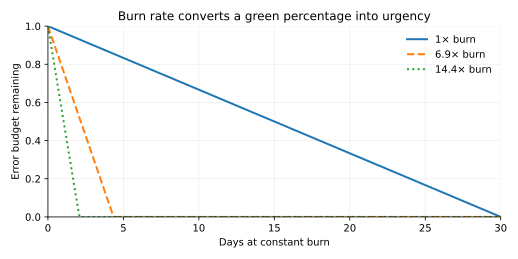

# Operating Agents: Observability, SLOs, Incidents, and HITL/Privacy Operations [S] {#sec-ch27}

## What you need going in

> **Assumed:** production APIs, metrics, logs, percentiles, authentication, deployments, and basic on-call vocabulary.
>
> **From earlier chapters:** [Chapter 17](17-tool-harness-engineering.qmd#sec-ch17) defined per-action human approval, [Chapter 18](18-memory-experiential-learning.qmd#sec-ch18) defined deletion propagation, [Chapter 22](22-evaluation.qmd#sec-ch22) built graders and release evidence, [Chapter 24](24-agent-security.qmd#sec-ch24) defined the effect kill boundary, and [Chapter 26](26-production-platform.qmd#sec-ch26) supplied cost attribution, durable pause/resume, versioned bundles, and progressive delivery.
>
> **Not required:** prior OpenTelemetry, SRE, incident-command, chaos-engineering, privacy-engineering, or queue-operations experience. Chapter 28 owns product funnels, team design, reviewer wellbeing, and the management system that consumes the evidence produced here.

## Contents

- [The pager belongs to the user journey](#sec-ch27-pager)
- [What you will build](#sec-ch27-artifact)
- [Trace one run without making a three-day span](#sec-ch27-tracing)
- [Fan telemetry into four sources of truth](#sec-ch27-fanout)
- [Score live behavior asynchronously and slice drift](#sec-ch27-online-eval)
- [Page on error-budget burn, not a green average](#sec-ch27-slos)
- [Let evidence lower autonomy and let chaos test the claim](#sec-ch27-control)
- [Run the incident through both kinds of rollback](#sec-ch27-incident)
- [Operate human review as a queue, not a checkbox](#sec-ch27-hitl)
- [Make telemetry private by construction](#sec-ch27-privacy)
- [Build](#sec-ch27-build)
- [What endures, what changes](#sec-ch27-endures)
- [Exercises](#sec-ch27-exercises)
- [Notes and sources](#sec-ch27-sources)

## The pager belongs to the user journey {#sec-ch27-pager}

A support ticket says, “The agent got slow this week.” The API dashboard is green: 99.98 percent of requests return HTTP 200, median latency is unchanged, and workers have spare CPU. Another chart reports 96.55 percent successful tasks and is also green because its threshold is 95 percent.

The service objective is 99.5 percent successful, grounded journeys over 30 days. A 96.55 percent result has a 3.45 percent bad-event rate against an allowed 0.5 percent. The error budget is burning at 6.9 times its sustainable rate and, with 95 percent remaining, will be gone in about 4.1 days. The “slow” report is only one symptom: tool timeouts have triggered more retries, costs have risen, and some responses claim success without the required final state.

Operating an agent means being able to answer two questions at any time:

> What is the fleet doing for users now, and is that behavior within its declared quality, safety, latency, cost, and review budgets?

Classic service telemetry answers only part of this. A healthy HTTP endpoint can return an unauthorized refund, an unsupported answer, or a plan that loops until its currency budget expires. Agent operations join infrastructure evidence with trajectory and outcome evidence. The join key is the journey identity from Chapter 26.

Keep three scopes distinct. Chapter 22 owns whether an offline evaluation supports a release. Chapter 26 owns gateways, durable effects, cost accounting, and delivery. This chapter owns runtime truth: traces, unsampled indicators, asynchronous production scoring, service objectives, paging and self-throttling, incidents, review queues, and telemetry privacy.

An operator needs both **leading** and **lagging** signals. Tool-error rate and growing queue age may predict trouble. Final task state, user correction, and a downstream reversal establish consequences later. Do not replace the lagging outcome because it arrives slowly; keep a provisional leading view and reconcile it when authority catches up.

The operating contract starts from user-visible journeys, not components. A useful record includes run and attempt identities, tenant and release, initial request class, model and tool steps, authoritative outcome, effect receipts, latency phases, metered cost, policy decisions, review events, and links to sampled content only when policy permits. With that record, “got slow” can be localized to retrieval, model time to first token, a tool, queueing, approval wait, or retry amplification without guessing from one aggregate.

## What you will build {#sec-ch27-artifact}

::: {.callout-tip}
### The chapter artifact

You will build [`ops_console.py`](../code/ch27/ops_console.py), a deterministic operations console around one scripted fleet. It emits real OpenTelemetry spans to an in-memory exporter, represents a durable approval pause as two linked traces, reads diagnostic cost, selects stable samples for asynchronous scoring, detects per-tenant score drift, computes journey-level SLIs and error-budget burn, reduces autonomy when burn rises, measures approval behavior, and sanitizes attributes before span creation.

The companion [`render_burn.py`](../code/ch27/render_burn.py) generates an error-budget figure directly from the same burn model. The integrated tabletop begins from the fixture's uncomfortable result: the fleet looks 96.55 percent successful while its 99.5 percent SLO burns at 6.9 times and triggers both a page and mandatory review.
:::

## Trace one run without making a three-day span {#sec-ch27-tracing}

A **trace** represents causal work across components. A **span** represents one bounded operation within it, with start and end times, status, attributes, events, parent context, and optional links. Context propagation lets an HTTP client span become the parent of a server span. A **link** associates work that is related but not a strict child, such as a resumed workflow, batch consumer, or fan-in.

Name spans by operations a reader can reason about: `invoke_agent`, `chat`, `retrieval`, `execute_tool`, `request_approval`, and `resume_agent`. Use shared semantic fields where a maintained convention exists, normal database and HTTP conventions for dependencies, and an application namespace for business facts. A useful split is:

- `gen_ai.*` for model/agent operation, model identifier, usage, and related convention fields;
- `db.*`, `http.*`, and `rpc.*` for ordinary dependency instrumentation;
- `app.*` for run, release, action, outcome, tenant surrogate, approval, and cost-allocation fields.

Do not encode unbounded values such as raw prompts, order identifiers, URLs, or user IDs as metric labels. They create cardinality and privacy failures. Put a minimized or tokenized value on a sampled span only when needed, and retain searchable business lineage in its governed store.

Long-running work should not hold one span open for days. End the trace when the active computation suspends, persist run and action identity in the durable workflow, then start a new trace when the signal arrives. Add a link from the resumed root span to the earlier trace context. This preserves bounded latency semantics: the approval wait is a workflow duration and queue metric, not an absurd tool-call span.

@fig-ch27-linked-traces shows one run crossing an approval wait. The run ID joins application state; the trace link tells an observability backend why the second execution is related.

```{mermaid}
%%| label: fig-ch27-linked-traces
%%| fig-cap: "How should a durable approval pause appear without holding one trace open for days?"
%%| fig-alt: "The first trace contains agent invocation, model call, and approval request, then ends when the workflow suspends. After an approval signal, a new root span starts and links to the first trace before executing the approved tool. Both traces share the durable run and action identities."
sequenceDiagram
    participant U as User
    participant A as Agent worker
    participant W as Durable workflow
    participant H as Review queue
    participant T as Effect tool

    U->>A: run-17
    rect rgb(238, 244, 250)
        Note over A: Trace 1
        A->>A: invoke_agent → chat
        A->>H: request_approval(action-17)
        A->>W: persist suspension + trace context
    end
    W-->>A: worker may stop
    H->>W: approved(action-17)
    rect rgb(238, 248, 242)
        Note over A: Trace 2, linked to Trace 1
        W->>A: resume_agent(run-17)
        A->>T: execute_tool(action-17)
        T-->>A: receipt-1
    end
```

The artifact uses the OpenTelemetry SDK rather than a homegrown trace structure. It creates five spans across two trace IDs and one link. An in-memory exporter makes the structure testable without a collector:

```python
# ops_console.py — the resumed root
with tracer.start_as_current_span(
    "resume_agent",
    links=[Link(first_context, attributes={
        "app.link.reason": "approval_resume"
    })],
    attributes={
        "app.run.id": "run-17",
        "app.approval.decision": "approve",
    },
):
    with tracer.start_as_current_span("execute_tool", attributes={
        "gen_ai.operation.name": "execute_tool",
        "app.action.id": "refund:A-17:v1",
        "app.effect.receipt": "receipt-1",
    }):
        pass
```

A trace is diagnostic evidence, not an immutable audit record. Sampling, exporter loss, attribute limits, operator edits, and retention are legitimate properties of tracing systems. Chapter 24's effect audit remains separately controlled. Likewise, a trace showing `tool.status=success` does not prove the external state unless the span carries a verifier-owned receipt or links to the authoritative outcome.

::: {.callout-note .landscape-2026}
### Landscape 2026 (dated)

**Verify live: 2026-07-19. Appendix C owner: GenAI telemetry conventions and observability integrations.** OpenTelemetry's earlier GenAI convention pages now point to the dedicated [`open-telemetry/semantic-conventions-genai`](https://github.com/open-telemetry/semantic-conventions-genai) repository; pin the revision and version your mapping because operation names, attribute names, and stability levels continue to evolve. Current ecosystems also include OpenInference instrumentation and products such as Langfuse, Phoenix, LangSmith, Braintrust, and Weave. Compatibility claims, ingestion models, self-hosting packages, and retention controls change. The durable design is standard trace context plus an explicit versioned mapping and application-owned outcome fields.
:::

::: {.artifact-checkpoint}
| Artifact state | New code | Invariant now verified |
|---|---:|---|
| `ops_console.py` with OTel export | 88 lines total; 17 shown | One durable run may cross bounded linked traces without losing stable run, action, release, or receipt identity. |
:::

## Fan telemetry into four sources of truth {#sec-ch27-fanout}

No single telemetry channel should answer billing, debugging, alerting, and audit. Their reliability, volume, retention, and mutability needs conflict. Use four channels joined by stable identities:

1. **unsampled metrics and counters** answer fleet rate, latency distribution, saturation, error, queue age, and SLO questions;
2. **sampled traces** explain selected trajectories and dependency timing;
3. **an unsampled usage ledger** settles model, tool, and review cost by tenant, run, attempt, and release;
4. **an append-only audit/effect record** establishes policy decisions and authoritative external receipts.

@fig-ch27-fanout shows which channel is authoritative for which question. Export can fail independently; a tracing outage must not erase billing or effect truth.

```{mermaid}
%%| label: fig-ch27-fanout
%%| fig-cap: "Which operational channel is authoritative for rates, diagnosis, cost, and consequential effects?"
%%| fig-alt: "An agent run fans out to unsampled metrics for fleet alerts, sampled traces for diagnosis, an unsampled usage ledger for cost settlement, and an append-only effect audit for authorization and receipts. All share stable run, attempt, release, and tenant-surrogate identities and reconcile later."
flowchart LR
    RUN["Agent journey<br/>run · attempt · release · tenant surrogate"] --> METRIC[("Unsampled metrics<br/>rates · latency · SLO")]
    RUN --> TRACE[("Sampled traces<br/>trajectory · dependency timing")]
    RUN --> USAGE[("Unsampled usage ledger<br/>tokens · tools · review · cost")]
    RUN --> AUDIT[("Append-only effect audit<br/>policy · approval · receipt")]
    METRIC -. "exemplar / run ID" .-> TRACE
    TRACE -. "diagnostic attribution" .-> USAGE
    AUDIT -. "authoritative outcome" .-> METRIC
    USAGE -. "invoice reconciliation" .-> METRIC
```

Metrics aggregate. A counter such as `agent_journeys_total{release, outcome_class}` is cheap and complete, but it cannot reconstruct one path. Histograms represent TTFT, time per tool, total journey latency, cost, steps, and approval wait without a label for every run. Include bounded dimensions that drive decisions—environment, release, region, task family, autonomy tier, outcome class—not every property available in context.

Sampling controls trace volume. Head sampling decides before observing the trace and can miss rare failures. Tail sampling decides after enough spans arrive and can retain errors, high latency, new releases, safety decisions, or unusual cost. Keep an unbiased probability sample alongside targeted retention so population estimates remain possible. Record the sampling policy; a trace store overrepresenting failures is valuable for debugging but cannot directly estimate fleet failure rate.

The usage ledger is unsampled and append-oriented. Provider usage may arrive late or be adjusted. Record observed units, price-schedule version, currency, provider account, cache class, and parent journey, then reconcile totals against provider invoices. The reference artifact sums `app.cost` on spans only as a diagnostic demonstration. It explicitly names that result `diagnostic_trace_cost`; losing a sampled span must not change the bill.

The audit channel is also unsampled but narrower. It records proposed and authorized action, policy version, approval evidence, provider receipt, and outcome. Access should be more restricted than ordinary traces, because consequential records often contain identifiers and decision context. Immutability and independent anchoring belong to Chapter 24.

Replay is a diagnostic mode, not a second production execution. Reconstruct model inputs from retained, authorized content; substitute recorded model and read-tool results where the question is deterministic code; run write tools behind a no-effect adapter; and use the Chapter 26 ledger if an integration test intentionally exercises a sandbox effect. A “replay” that resends a customer email or refund is a new incident.

Reconciliation jobs should detect missing joins: an effect receipt without a run, metered usage without a tenant, a completed journey without an outcome, a trace naming an unknown bundle, or a review decision without an action digest. The operator console can then say whether evidence is absent or the underlying event is absent—a distinction dashboards often blur.

## Score live behavior asynchronously and slice drift {#sec-ch27-online-eval}

Offline tasks are controlled and reproducible. Production traffic supplies distribution, dependency, and interaction reality. Use both without putting an expensive, fallible judge in the request path.

Sample eligible completed runs asynchronously. Redact or tokenize content before export, attach the exact rubric and judge versions, and score only when the authoritative outcome is ready. A deterministic grader should inspect state, schema, policy, citations, or receipts before any model judge. The calibrated judge from Chapter 22 handles remaining open-ended qualities. Store component scores and diagnostic reasons, not only one average.

The sample rate is a capacity and detection decision, not a ritual percentage. Rare severe outcomes need targeted or complete monitoring; common quality questions may use a stable probability sample. Oversample a new release, low-confidence runs, high-cost outliers, policy reviews, new task families, and critical tenants, while retaining weights or a separate representative sample for population estimates. The canary-power arithmetic remains in Chapters 22 and 26.

**Drift** means the live distribution or relationship has changed relative to a reference. Monitor several kinds:

- input drift: task family, language, document size, retrieval source, modality, or risk mix changes;
- outcome drift: success, groundedness, correction, reversal, or abandonment changes;
- score drift: calibrated grader distributions change under a pinned judge;
- trajectory drift: steps, tool choice, retries, loop rate, approval requests, or fallback changes;
- dependency drift: tool latency/error, provider refusal, corpus freshness, or index coverage changes.

A difference is not automatically harmful. A product launch can create intentional input drift. A score shift can come from a judge update rather than the agent. Compare control and candidate under the same interval, slice by release and tenant, preserve reference windows, and annotate known events. When a detector fires, inspect raw counts, sampling, grader health, and authoritative outcomes before assigning cause.

Fleet averages hide concentrated harm. Suppose tenant A's mean score improves from 0.9 to 1.0 while tenant B falls from 0.9 to 0.4. The fleet mean drops from 0.9 to 0.7 and may stay above a coarse threshold; tenant B has suffered a 0.5 regression. The artifact's `drift_by_tenant` compares per-tenant means and emits only drops above the declared threshold. Production detectors should add uncertainty, minimum counts, multiple-testing discipline, seasonality, and robust distribution metrics.

Thumbs-up rate is not a standalone quality metric. Users self-select whether to rate; response propensity changes with sentiment, interface, and cohort. Combine it with invocation-to-outcome funnels, corrections, reversals, sampled adjudication, and exposure. Chapter 28 owns product reliance and value measurement.

The feedback-to-dataset flywheel is governed promotion: triage a trace, remove or tokenize private data, verify the failure and intended behavior, deduplicate, assign provenance, have a human approve, then add a versioned task or training example. Chapter 23's data and policy controls apply. Automatically training on every negative reaction creates poisoning, feedback-loop, and deletion problems.

Quality is a metric; safety is a guardrail. A slight quality regression can consume a declared error budget. An unauthorized cross-tenant disclosure or unapproved irreversible effect is an invariant violation and triggers containment regardless of the monthly average.

## Page on error-budget burn, not a green average {#sec-ch27-slos}

A **service-level indicator** (SLI) is a measured property of service behavior. A **service-level objective** (SLO) is a target for that indicator over a window. The **error budget** is the permitted amount of behavior outside the target. For a 99.5 percent good-journey SLO, the allowed bad-event fraction is 0.5 percent.

Choose indicators at the journey boundary:

| User promise | Good event | SLI |
|---|---|---|
| useful completion | authoritative task success **and** grounded response | good completed journeys / eligible journeys |
| effect integrity | exactly the intended number of authorized effects | journeys with exact effect cardinality / effectful journeys |
| responsiveness | first useful streamed token within threshold | compliant interactive journeys / interactive journeys |
| bounded cost | successful journey within task-family cost ceiling | cost-compliant successes / successful journeys |
| workable oversight | risk review completed before expiry and action remains current | valid reviews / review-required actions |

“API availability” remains useful for a component, but it does not substitute for task correctness. Define eligibility and exclusions before measurement. A user cancellation, policy denial, upstream outage, and agent failure may each deserve a different class, yet exclusions should not make genuine user pain disappear. Publish both SLO accounting and total outcome distribution.

For observed good events \(g\) among \(n\), target \(S\), observed bad fraction is \(1-g/n\) and allowed bad fraction is \(1-S\). The **burn rate** is

$$
B=\frac{1-g/n}{1-S}.
$$

At $g=9{,}655$, $n=10{,}000$, and $S=0.995$, burn is 6.9. A burn of 1 consumes exactly the available budget over the SLO window if sustained. A burn above 1 exhausts early. If fraction $r$ of the budget remains in a $W$-day window, a constant-burn approximation gives

$$
T_{\text{exhaust}}=\frac{Wr}{B}.
$$

With $W=30$, $r=0.95$, and $B=6.9$, this is about 4.1 days.

@fig-ch27-budget-burn makes urgency legible. The same apparently small failure percentage has different consequences because the promised budget is narrow.

{#fig-ch27-budget-burn fig-cap="Why does error-budget burn convey urgency better than a raw success percentage? Synthetic constant-burn illustration generated by `render_burn.py`."}

Multiwindow, multi-burn-rate alerting balances speed and precision. A fast page can require a high burn over both a long and short confirmation window; a slower page uses a lower burn; sustained mild burn becomes a ticket. The Google SRE Workbook gives a principled derivation and example thresholds. The artifact uses 14.4 times for read-only plus rollout freeze, 6 times for mandatory review plus a page, and 1 time for a ticket. These are teaching values, not universal policy.

Low traffic complicates ratios. One failure can produce enormous burn with little evidence, while a rare safety failure may be too important to wait for volume. Use longer windows, event counts, Bayesian or exact interval context, synthetic probes, and targeted invariant monitoring. State which rule is SLO-budgeted and which is zero tolerance.

Cost per successful task divides total journey cost—including failures—by successful journeys. If failed runs vanish from the numerator, the metric rewards systems for failing early. Track distribution and task mix, not only a mean. Chapter 26 owns the underlying cost ledger; this chapter pages when the user-facing cost objective is threatened.

## Let evidence lower autonomy and let chaos test the claim {#sec-ch27-control}

An error-budget policy is executable governance. Before the bad day, map evidence to automatic and human actions. One example:

| Condition | Immediate platform action | Human action |
|---|---|---|
| burn below 1 | normal declared autonomy | routine review |
| sustained 1–6 | stop rollout expansion | open owned ticket and inspect slices |
| burn 6–14.4 | require review for write actions | page operator; compare release/control |
| burn at least 14.4 | read-only mode; freeze rollout | page incident lead; prepare rollback |
| safety invariant violated | stop new effects regardless of burn | declare security/safety incident |

Self-throttling reduces blast radius before a person understands cause. It can lower step or concurrency budgets, disable optional tools, route to a simpler verified workflow, require human approval, or stop new effects while preserving read-only service. The fallback must have a smaller explicit contract. It must not route around a refusal or discard authorization.

The artifact implements this as a pure decision function so the policy is reviewable and testable. At 6.9 times, it returns `require_review_and_page`; a safety flag at 0.1 times still returns `stop_new_effects`. Safety is not an error budget to spend.

**Chaos engineering** tests whether these controls survive real failure. Begin with a measurable steady-state hypothesis, inject one realistic fault under a bounded blast radius, observe user-facing and invariant outcomes, and abort on declared conditions. It is not random production breakage.

Useful agent drills include:

- kill a worker after provider acceptance and assert the Chapter 26 effect count remains one;
- inject overload and connection resets, then assert retry and currency budgets cap amplification;
- delay a tool beyond the propagated deadline and assert stale actions cannot execute;
- corrupt or load an old checkpoint and assert quarantine or compatible migration;
- make the trace exporter unavailable and assert requests continue while a telemetry-loss counter fires;
- fill the review queue and assert expiry prevents old approval from releasing a changed action;
- revoke the effect tool or kill-switch control plane and verify the independent enforcement fallback.

A chaos card names the hypothesis, steady-state indicators, target cohort, fault, start and stop conditions, maximum duration, expected alerts, owner, rollback, and evidence retained. Start in a disposable environment, then a non-effectful or tiny production cohort when justified. Chapter 32's failure game consumes this skill but does not repeat the incident tabletop taught here.

## Run the incident through both kinds of rollback {#sec-ch27-incident}

An incident begins when observed behavior threatens users or an invariant, not when the root cause is known. A workable lifecycle is detection, triage and declaration, containment, diagnosis and eradication, recovery, then learning. Roles scale with severity: one incident commander coordinates; an operations lead changes the system; a communications lead keeps stakeholders current; subject experts investigate without each becoming commander.

@fig-ch27-incident separates containment from recovery and technical from business rollback.

```{mermaid}
%%| label: fig-ch27-incident
%%| fig-cap: "What happens in what order when an agent incident has already created external effects?"
%%| fig-alt: "A drift or invariant alert triggers triage and incident declaration. Containment stops new admission or effects. Investigation branches to technical rollback of the release and business rollback of already executed consequences. Recovery validates indicators before ramp. A postmortem creates controls and permanent regression tests."
stateDiagram-v2
    [*] --> DETECT: alert, report, or audit mismatch
    DETECT --> DECLARE: classify severity and assign commander
    DECLARE --> CONTAIN: stop new admission/effects, preserve evidence
    CONTAIN --> DIAGNOSE: compare release, tenant, tool, and trajectory
    DIAGNOSE --> TECHNICAL: revert or repair bundle
    DIAGNOSE --> BUSINESS: reconcile executed consequences
    TECHNICAL --> RECOVER
    BUSINESS --> RECOVER
    RECOVER --> VALIDATE: SLI, invariant, and authoritative state checks
    VALIDATE --> RAMP: controlled restoration
    RAMP --> LEARN: blameless postmortem + regression case
    LEARN --> [*]
```

The **kill switch** must have defined semantics. “Disable agent” can mean stop new journeys, cancel active model calls, prevent new tool invocations, revoke effect credentials, drain queues, or place tasks in review. The strong containment path stops new admissions and new consequential effects while preserving receipts and read-only diagnosis. It cannot retract a sent message, erase a disclosure, or reverse an already-settled transfer.

That limitation creates two rollbacks:

| Rollback | Changes | Examples | Evidence needed |
|---|---|---|---|
| technical | future system behavior | point traffic to last-known-good bundle, revoke tool, restore policy, rebuild poisoned index | release hashes, control-plane events, health and eval evidence |
| business | consequences already produced | void or credit transaction, correct record, notify affected user, rotate exposed secret, arrange return | effect receipts, affected-object query, owner, compensation result |

Incident response cannot wait for perfect diagnosis. Contain based on plausible blast radius, preserve state, and keep a timestamped decision log. Compare candidate versus control, tenant and task slices, provider and tool health, recent bundles, corpus changes, approval behavior, and audit receipts. Avoid replaying hostile input through production effects during investigation.

Mean time to detect is often the hidden failure. Probabilistic quality defects may first appear as user corrections days after release. Asynchronous outcome scoring, drift slices, authoritative-effect reconciliation, and golden probes shorten that gap. Track time from first harmful event—not first alert—to detection, containment, last harmful effect, technical recovery, and business recovery.

Recovery is controlled restoration, not “pods are green.” Verify the user-facing SLI, critical slices, effect invariant, queue state, data consistency, and control health. Ramp with the Chapter 26 delivery path. Retain a comparison cohort when safe and communicate remaining uncertainty.

A blameless postmortem explains the conditions and decisions that made the incident possible without confusing blamelessness with lack of accountability. Include impact, timeline, detection gap, contributing technical and organizational factors, what went well, where controls failed, technical and business recovery, and actions with owners and verification. Promote a reviewed incident case into Chapter 22's golden regression set. If the incident exposed a missing runtime invariant, also add a deterministic or chaos test. “Be more careful” is not a corrective action.

## Operate human review as a queue, not a checkbox {#sec-ch27-hitl}

Chapter 17 bound a decision to one action. Chapter 24 placed that approval in authorization policy. Chapter 26 made the pause durable. Operations must ensure a qualified person can decide in time, with adequate evidence, without being trained to click approve.

Each review item needs tenant and risk class, exact action and arguments, authoritative current state, why review is required, evidence and uncertainty, deadline and expiry, permitted decisions, escalation path, and action digest. The interface should make `approve`, `deny`, `modify as a new proposal`, and `escalate` semantically distinct. Free-form comments are context, not authorization.

Queue objectives include age percentiles, oldest item, arrival and completion rates, abandonment, expiry, escalation, rework, and staffing coverage by skill and region. Little's Law gives a planning check: average work in system $L$ equals arrival rate $\lambda$ times average time in system $W$ under stable conditions, $L=\lambda W$. It does not model burst severity or skill routing; simulate or measure those separately. When arrivals persistently exceed service capacity, the queue grows without bound regardless of a beautiful SLA.

Measure review behavior:

- **automation rate:** fraction of eligible actions executed without human review;
- **approval rate:** approved among completed reviews;
- **override or modification rate:** actions the reviewer changes rather than accepts;
- **decision latency and queue wait:** separated so interface time is not confused with staffing delay;
- **abandonment and expiry:** work that never receives a valid decision;
- **post-approval defect rate:** later reversals or incidents by reviewer, queue, and action class.

A 99 percent approval rate with 0.2-second median decisions is not evidence of safe oversight. It is a **rubber-stamp signal**. It may reflect a low-risk queue whose policy should automate, or an interface and workload that make real review impossible. Sample decisions, test whether reviewers notice seeded discrepancies, examine disagreement and downstream outcomes, and redesign the policy or queue.

The artifact computes approval, override, abandonment, median decision time, and the combined rubber-stamp signal. The threshold is illustrative. In production, compare by risk, complexity, reviewer, shift, and queue age; protect reviewer privacy and avoid simplistic performance ranking. Chapter 28 owns reviewer wellbeing and organizational incentives.

Approval fatigue is a control failure. Route only genuinely decision-relevant cases, make consequence differences legible, batch only independent low-risk items, cap simultaneous work, rotate high-stakes duties, and give reviewers feedback about outcomes. If nearly every item is approved, either automate the policy-backed safe subset or find why the review has no discriminating information.

During overload, do not silently widen authority. Lower autonomy, slow or reject new high-risk work, prioritize expiry and consequence, and preserve separation of duties. A week-old approval must not release an action whose amount, destination, state, policy, or release changed while queued.

## Make telemetry private by construction {#sec-ch27-privacy}

Telemetry is a second data product. It often outlives application state, reaches more operators and vendors, and copies prompts, retrieved documents, tool arguments, model output, user IDs, secrets, and decisions into indexes optimized for search. A tracing feature can therefore become the breach.

Adopt **content off by default**. Emit operation name, timing, model/deployment, token counts, status, bounded task class, release, and pseudonymous join keys without prompt or response bodies. Enable sampled content only for approved environments, cohorts, purposes, roles, and retention windows. Prefer hashes, classifications, lengths, and references to a governed content store over raw duplication.

Redact before span creation, not only in the backend UI. Exporters can fan out to several systems; network buffers and collector logs may already contain the secret before server-side masking. Secret-bearing keys—authorization, API key, access token, cookie, password—are unconditionally removed even when content capture is allowed. Scan string values for common bearer patterns. Treat model-generated output as capable of echoing a secret.

The reference sanitizer enforces three small rules: secret-named fields become `[REDACTED]`, raw tenant ID becomes a short one-way surrogate, and GenAI input/output content becomes `[CONTENT_DISABLED]` unless capture is explicitly enabled. It also removes bearer values from error messages. The test plants a token in both an authorization attribute and a normal string; neither survives.

Production redaction needs structured parsing, allowlists, validated tokenization, secret scanning, and tests over every instrumentation path. Regex is a last layer, not a complete privacy system. Keep a telemetry data inventory, access control, purpose, residency, retention, deletion path, export list, and breach-response owner. Audit who queries raw-content projects.

“Zero data retention” is a provider contract term, not an end-to-end property. Verify which endpoint, account tier, abuse or safety exception, logging surface, feature, and region it covers. It does not erase your gateway, trace backend, crash dump, evaluation dataset, support export, browser recording, or effect audit. Record the contract revision and test actual integrations.

Prompts and traces may be personal data when they identify or relate to a person. Applicable duties depend on jurisdiction, role, purpose, and sector. Engineering supports counsel and privacy owners by documenting lawful purpose, minimization, access, retention, residency, processors, security, data-subject request reach, deletion lineage, and holds. Chapter 18 owns propagation to memories, embeddings, adapters, caches, and derived learning artifacts. This section owns the operational job that finds and processes telemetry copies.

Privacy-enhancing technologies solve different problems:

- **differential privacy** bounds how much one record can influence a released statistic or trained mechanism under a stated adjacency relation and privacy budget; it does not hide raw inputs from the machine computing the mechanism;
- **federated or on-device processing** keeps raw examples decentralized and aggregates updates or results; updates can still leak information and require secure aggregation, clipping, authentication, and sometimes differential privacy;
- **confidential computing** protects data in use from parts of the host infrastructure through hardware-backed isolated execution and attestation; it does not make application code, prompts, outputs, or authorized recipients trustworthy.

Choose a PET from the threat model. Pair it with minimization, access control, and deletion rather than using it as a privacy label. The model-asset privacy attacks and differential-privacy limitations introduced in Chapter 24 still apply.

::: {.callout-note .landscape-2026}
### Landscape 2026 (dated)

**Verify live: 2026-07-19. Appendix C owner: telemetry retention, ZDR, privacy law, and PET deployment support.** Provider retention terms, content-capture defaults, regional telemetry storage, self-hosting architectures, masking features, GDPR guidance, and confidential-accelerator support are fast-moving and contract-specific. For example, current [Langfuse self-hosting documentation](https://langfuse.com/self-hosting) describes its present storage architecture and deployment options, while its [masking documentation](https://langfuse.com/self-hosting/security/data-masking) exposes configurable failure behavior that must be reviewed rather than assumed. Maintain a counsel-reviewed jurisdiction and vendor matrix; never infer production privacy posture from this chapter's dated examples.
:::

## Build {#sec-ch27-build}

The integrated build has two parts: execute the console, then run the chapter's single incident tabletop. From `newbook/`, run:

```bash
python -m pytest tests/test_ch27_ops.py -q
python code/ch27/ops_console.py
python code/ch27/render_burn.py \
  --plot assets/figures/ch27-budget-burn.svg
```

The fixture reports:

```text
spans                         5
traces                        2
links                         1
diagnostic trace cost         0.013
success-and-grounded SLI      0.50   (four-run teaching subset)
exactly-one-effect SLI        0.75   (four-run teaching subset)
p95 TTFT                      400 ms
cost per successful task      0.028
30-day fleet burn             6.9×   (9,655 / 10,000 good; 99.5% target)
days to exhaustion            4.1    (95% budget remaining)
runtime action                require_review_and_page
rubber-stamp signal           true   (99% approve; 0.2 s median)
```

The four-record subset exists to make SLI ownership inspectable; it is not the 10,000-event fleet window used for the burn calculation. One run succeeds and is grounded, one appears successful but is ungrounded and emits two effects, and another fails without an effect. HTTP status is irrelevant to these outcome labels.

Now write three SLOs for a support agent:

1. at least 99.5 percent of eligible journeys are authoritatively successful and grounded over 30 days;
2. 100 percent of effectful journeys have exactly the authorized effect cardinality, treated as an invariant rather than burnable budget;
3. 95 percent of interactive journeys stream a first useful token within the product threshold, with an accompanying cost-per-successful-task ceiling by task family.

Write the error-budget policy before the incident. Use the table from the control section, name the feature flag and independent effect-credential revocation path, assign the on-call and business-effect owners, and state which SLO windows and slices determine restoration.

### The incident tabletop

At 14:00, the facilitator reveals a canary drift alert: outputs shaped like data exfiltration appear for one tenant. The general task-success chart is green. A new retrieval connector was enabled at 13:30. At 14:05, audit reconciliation finds two non-allowlisted URL proposals; the Chapter 24 PEP denied both. At 14:12, one older tool path with direct network credentials is discovered outside that PEP. Its trace exporter is also missing 40 percent of spans.

Run the response in real time:

1. **Detect and declare.** Start the incident clock at the first harmful or suspicious output, not the alert. Assign commander, operations, communications, security, and business-effect roles.
2. **Contain.** Stop new external effects, revoke the old tool credential independently of tracing, freeze the canary, preserve audit and usage ledgers, and keep safe read-only service if policy permits.
3. **Scope.** Query authoritative egress and effect receipts by tool, tenant, release, connector revision, and time. Treat missing traces as missing diagnostic evidence, not absence of effects.
4. **Recover technically.** Point traffic to the last-known-good bundle, remove the bypass path, rebuild the connector corpus if poisoned, and pass the security regression plus release gate.
5. **Recover the business.** Identify any data actually disclosed, rotate affected secrets, contact owners under the incident plan, and record remediation. Denied proposals need different handling from executed disclosure.
6. **Validate and ramp.** Confirm the PEP is unavoidable, reconcile every attempted effect, restore trace health, run the golden case, and ramp through a bounded canary.
7. **Learn.** Produce the Appendix B postmortem, calculate MTTD, time to stop new effects, budget consumed, and last harmful effect. Add a permanent test proving no tool path can bypass the PEP and a chaos drill in which telemetry disappears during effect reconciliation.

Success is not naming the poisoned connector. It is demonstrating that containment did not depend on that diagnosis, that missing sampled traces did not hide authoritative effect evidence, and that both technical and business rollback received an owner.

## What endures, what changes {#sec-ch27-endures}

**What endures.** Instrument journeys, not only endpoints. Use bounded spans and linked traces for durable runs. Join unsampled metrics, sampled traces, an unsampled usage ledger, and an append-only effect record rather than forcing one store to be every truth. Score live outcomes asynchronously, preserve representative samples, and slice drift. Define journey-level SLOs and page on budget burn. Let rising burn reduce autonomy while invariant violations stop effects immediately. Practice hypothesis-driven chaos. Contain before perfect diagnosis, distinguish technical from business rollback, and convert incidents into permanent evidence. Measure human queues for discrimination and delay. Minimize and redact telemetry before export.

**What changes.** GenAI semantic-convention fields, observability vendors, judge models, drift libraries, provider retention contracts, privacy rules, confidential hardware, and dashboard APIs will change. Appendix C records those dated facts. Removing both Landscape boxes leaves the operating model and its equations intact.

## Exercises {#sec-ch27-exercises}

1. Extend `drift_by_tenant` with minimum sample counts and confidence intervals. Construct a fleet in which the weighted average improves while one high-risk language slice regresses; specify the alert and the action it should trigger.
2. Compute burn, remaining budget, and days to exhaustion for three scripted patterns: a brief total outage, a sustained 2-times burn, and intermittent 14.4-times spikes. Design multiwindow rules that page on the first and third without paging on harmless low-volume noise.
3. Export the artifact's OTel spans to a local collector and one current self-hosted GenAI observability backend. Pin every package and mapping version, reproduce the two linked traces, and prove content capture remains off in storage—not just in the UI.
4. Write and run a chaos drill against Chapter 26: kill the worker in the effect gap, disable the trace exporter, and delay the approval signal past expiry. State the steady-state hypothesis, blast radius, abort condition, expected alerts, and authoritative post-run assertions.
5. Given a week of approval events, compute queue age, arrival/service rate, approval, override, abandonment, expiry, and post-approval defects by risk class. Decide which class should automate, which needs better evidence, and where staffing—not reviewer behavior—is the bottleneck.
6. Audit a supplied span fixture containing a bearer token in tool arguments, raw tenant ID, full prompt on an error span, a secret echoed in model output, and an unbounded URL label. Extend `sanitize_attributes` and tests while retaining enough surrogate identity for incident joins.
7. Defend the four-channel telemetry fan-out against a proposal to derive invoices and effect audit entirely from sampled traces. Name the sampling, exporter, mutation, retention, cardinality, and access-control failures the proposal creates.
8. Repeat the tabletop with both the feature-flag service and normal trace backend unavailable. Design an independent kill path, identify which evidence remains authoritative, and add concrete postmortem actions with owners, deadlines, and verification tests.

## Notes and sources {#sec-ch27-sources}

- OpenTelemetry's [trace concepts](https://opentelemetry.io/docs/concepts/signals/traces/) define spans, context, and links; the dedicated [GenAI semantic-conventions repository](https://github.com/open-telemetry/semantic-conventions-genai) is the current moving source for GenAI mappings.
- Beyer et al., [*Site Reliability Engineering*](https://sre.google/sre-book/table-of-contents/) and the [*SRE Workbook*](https://sre.google/workbook/table-of-contents/), supply the SLI, SLO, error-budget, incident, and postmortem foundations. The Workbook's [alerting chapter](https://sre.google/workbook/alerting-on-slos/) derives burn-rate and multiwindow alerting.
- The [Principles of Chaos Engineering](https://principlesofchaos.org/) supply the steady-state hypothesis, realistic-variable, and minimized-blast-radius frame used by the drills.
- Langfuse's current [data model](https://langfuse.com/docs/observability/data-model), [self-hosting](https://langfuse.com/self-hosting), and [data-masking](https://langfuse.com/self-hosting/security/data-masking) pages are one maintained implementation example, not the chapter's mechanism.
- NIST's [Privacy Engineering Program](https://www.nist.gov/privacy-engineering) frames privacy as measurable systems engineering; NIST SP 800-226 is the maintained technical reference for differential privacy.
- McMahan et al., [“Communication-Efficient Learning of Deep Networks from Decentralized Data”](https://proceedings.mlr.press/v54/mcmahan17a.html), introduce the federated-averaging setting referenced in the PET literacy section.
- Dwork and Roth, [*The Algorithmic Foundations of Differential Privacy*](https://www.cis.upenn.edu/~aaroth/Papers/privacybook.pdf), provide the formal differential-privacy foundation.
- Applicable privacy and data-protection obligations are jurisdiction- and sector-dependent. Use Appendix C's dated, counsel-reviewed supplement rather than treating this engineering chapter as legal advice.
