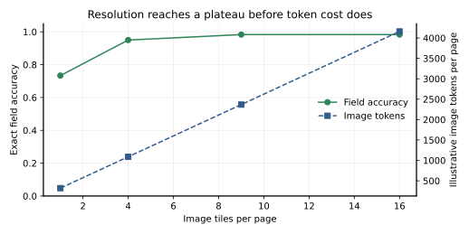

# Multimodal Agents I: VLMs, Documents, and GUI Perception [F+S] {#sec-ch29}

## What you need going in

> **Assumed:** neural-network fundamentals, matrix multiplication, basic image dimensions, JSON APIs, and the agent/tool boundary from Chapters 16–17.
>
> **From earlier chapters:** [Chapter 14](14-embeddings-rag.qmd#sec-ch14) introduced dense and late-interaction retrieval, [Chapter 15](15-agentic-retrieval.qmd#sec-ch15) handled retrieval control and poisoning, [Chapter 21](21-agent-applications.qmd#sec-ch21) deliberately deferred pixel-level computer-use perception to this chapter, [Chapter 22](22-evaluation.qmd#sec-ch22) supplied the evaluation contract, and [Chapter 24](24-agent-security.qmd#sec-ch24) supplied the action gate.
>
> **Not required:** prior computer vision, OCR, image-model training, browser automation, or a local GPU. The default build is deterministic and offline; an optional adapter exercises the same extraction interface against a local OpenAI-compatible multimodal endpoint.

> **Route B backfill**
>
> - **Chapter 2, attention and embeddings sections (~8 pp).** Read [Attention as a learned weighted lookup](02-transformer-first-principles.qmd#sec-ch02-attention), [The residual stream and a modern block](02-transformer-first-principles.qmd#sec-ch02-residual), and [Decoder-only: from embeddings to logits](02-transformer-first-principles.qmd#sec-ch02-decoder). Skipping them leaves the production patterns usable but makes image patches and projected visual vectors feel like API magic rather than ordinary transformer inputs.

## Contents

- [Two workloads expose one lossy assumption](#sec-ch29-loss)
- [What you will build](#sec-ch29-artifact)
- [A VLM turns patches into language-model vectors](#sec-ch29-vlm)
- [Instruction tuning and tiling create the image-token bill](#sec-ch29-budget)
- [Fusion decides when modalities can interact](#sec-ch29-fusion)
- [Grounding turns words into regions and points](#sec-ch29-grounding)
- [Document understanding needs values, structure, and evidence](#sec-ch29-documents)
- [Visual retrieval preserves page-level interactions](#sec-ch29-visual-rag)
- [GUI perception must end in a fresh, gated proposal](#sec-ch29-gui)
- [Choose the cheapest multimodal tier that passes](#sec-ch29-field-guide)
- [Own an evaluation after the benchmark saturates](#sec-ch29-eval)
- [Build](#sec-ch29-build)
- [What endures, what changes](#sec-ch29-endures)
- [Exercises](#sec-ch29-exercises)
- [Notes and sources](#sec-ch29-sources)

## Two workloads expose one lossy assumption {#sec-ch29-loss}

An analyst asks, “Which quarter has the tallest revenue bar on page 17?” The ingestion pipeline runs OCR, extracts the title, axis labels, legend, and four numbers in reading order, then discards the bar geometry. Retrieval finds the right page. The language model sees every character and still cannot know which number belongs to the tallest rectangle.

A computer-use agent receives “Delete the old draft, not the account.” Its text accessibility tree exposes two buttons with truncated names; the rendered screen distinguishes them by position, icon, warning color, and surrounding panel. The agent architecture from Chapter 21 can plan, but its perception surface is incomplete.

Both failures came from treating two-dimensional evidence as if it were only a string. Documents communicate through tables, columns, font hierarchy, diagrams, spatial alignment, handwriting, and visual marks. Graphical interfaces communicate through layout, state, focus, icons, overlays, and coordinates. A **vision-language model** (VLM) maps images and text into a shared computation so a model can answer, extract, ground, or propose an action using both.

This does not make OCR obsolete. Clean prose is often cheaper, more searchable, more accessible, and easier to cite as text. DOM and accessibility actions are often more stable than pixels. The engineering decision is per workload: preserve the visual channel when the task depends on it; prefer the cheapest structured channel that retains the needed evidence.

The chapter builds one visual foundation, then applies it twice. For documents, a page image becomes schema-valid fields with evidence boxes and a measured accuracy/token tradeoff. For GUIs, a screenshot becomes a named click proposal bound to one screen digest; deterministic code revalidates freshness, geometry, and confirmation before acting. The pixel-perception deferral flagged in Chapter 21 is completed here.

## What you will build {#sec-ch29-artifact}

::: {.callout-tip}
### The chapter artifact

You will build [`page_reader.py`](../code/ch29/page_reader.py), a page-image extraction interface with an offline source-traceable fixture and an optional local VLM adapter. Twelve synthetic invoices supply 60 field values and evidence regions. The evaluator sweeps four tiling budgets, validates the result schema and boxes, and reports exact field accuracy beside image-token cost.

Two small artifacts cover genuinely different mechanisms. [`maxsim_demo.py`](../code/ch29/maxsim_demo.py) makes pooled versus late-interaction retrieval visible on one transparent vector construction. [`gui_step.py`](../code/ch29/gui_step.py) grounds a screen label, binds the proposal to the screenshot, and demonstrates why stale or destructive actions need deterministic gates. They share the chapter's principle—retain fine-grained visual evidence—but do not reimplement one another.
:::

## A VLM turns patches into language-model vectors {#sec-ch29-vlm}

A language model does not receive pixels directly. A visual preprocessing and encoder stack converts pixels into vectors that can enter attention beside text-token vectors.

Start with an image of height $H$, width $W$, and $C$ channels. Split it into non-overlapping square patches of side $P$. The number of patches is

$$
N=\frac{H}{P}\frac{W}{P},
$$

assuming both dimensions are divisible by $P$. Flatten patch $i$ into $\mathbf{x}_i\in\mathbb{R}^{P^2C}$ and project it into visual width $d_v$:

$$
\mathbf{p}_i=\mathbf{x}_i\mathbf{E}+\mathbf{e}_i,
\qquad
\mathbf{E}\in\mathbb{R}^{P^2C\times d_v}.
$$

Here $\mathbf{E}$ is the learned patch projection and $\mathbf{e}_i$ carries position. A 224-by-224 image with 16-by-16 patches yields a 14-by-14 grid, or 196 visual tokens. Smaller patches or larger images preserve more spatial detail while increasing sequence length and attention work. Modern encoders may use convolutional stems, resampling, variable resolution, or patch merging, but the budgeting intuition survives: spatial resolution becomes tokens.

The [Vision Transformer](https://arxiv.org/abs/2010.11929) applies transformer blocks to this sequence. A contrastively trained image encoder then learns representations aligned with text. For a batch of $B$ matched image/text pairs, let normalized image embedding $\mathbf{v}_i$, text embedding $\mathbf{t}_j$, similarity $s_{ij}=\mathbf{v}_i^\top\mathbf{t}_j$, and temperature $\tau>0$. One direction of the CLIP-style InfoNCE loss is

$$
\mathcal{L}_{I\rightarrow T}
=-\frac{1}{B}\sum_{i=1}^{B}
\log\frac{\exp(s_{ii}/\tau)}{\sum_{j=1}^{B}\exp(s_{ij}/\tau)}.
$$

The text-to-image direction is symmetric and the losses are averaged. Each positive competes against the other batch texts. This creates useful joint embeddings, but it couples normalization to the batch.

SigLIP instead treats every pair as a binary match. Let $z_{ij}=1$ for a matched pair and $-1$ otherwise, with learned scale $a$ and bias $b$. A compact form is

$$
\mathcal{L}_{\text{sigmoid}}
=-\frac{1}{B^2}\sum_{i,j}\log\sigma\!\left(z_{ij}(a s_{ij}+b)\right),
$$

where $\sigma$ is the logistic sigmoid. The [SigLIP paper](https://arxiv.org/abs/2303.15343) motivates this pairwise loss without a global softmax normalization. Both objectives teach alignment. Neither alone makes an image encoder follow a conversation or emit a structured answer.

A **projector** maps visual width $d_v$ to the language model's residual width $d_m$. A two-layer example is

$$
\mathbf{h}_i
=\mathbf{W}_2\phi(\mathbf{W}_1\mathbf{p}_i+\mathbf{b}_1)+\mathbf{b}_2,
$$

with nonlinear function $\phi$. The vectors $\mathbf{h}_i\in\mathbb{R}^{d_m}$ can then occupy designated positions in the language-model sequence. Some systems resample many visual tokens into fewer latent tokens; some train vision and language components together. The projector equation is still a useful boundary: it tells us where an image representation becomes compatible with the language model.

@fig-ch29-vlm answers where visual evidence enters context.

```{mermaid}
%%| label: fig-ch29-vlm
%%| fig-cap: "Where does an image become a sequence the language model can attend to?"
%%| fig-alt: "Pixels are resized or tiled, split into patches, encoded with spatial position, mapped by a projector to language-model width, and inserted beside text embeddings before the language model produces text, fields, or coordinates."
flowchart LR
    IMAGE["Image pixels<br/>height × width × channels"] --> PRE["Resize / tile / normalize"]
    PRE --> PATCH["Patch sequence<br/>N visual tokens"]
    PATCH --> ENCODER["Vision transformer<br/>spatial contextualization"]
    ENCODER --> PROJECT["Project / resample<br/>visual width → LM width"]
    TEXT["Text token embeddings"] --> LM(["Language model<br/>cross-modal attention"])
    PROJECT --> LM
    LM --> OUT["Answer · JSON fields<br/>regions · action proposal"]
```

The LLM sees projected vectors, not a photograph. Crop policy, orientation, scaling, compression, tiling, color conversion, and patch layout have already determined which evidence survives. Logging only the original file hash is not enough for reproducibility; record preprocessing and the actual rendered image or its immutable derivative.

## Instruction tuning and tiling create the image-token bill {#sec-ch29-budget}

Image/text alignment teaches semantic proximity. A VLM assistant also needs examples that connect visual inputs and instructions to useful responses: description, question answering, OCR, chart reasoning, grounding, refusal, and structured output. A common staged recipe freezes or partly freezes pretrained components while training a projector, then instruction-tunes more of the stack on multimodal conversations. Exact recipes differ; the enduring distinction is encoder alignment versus task-following behavior.

One fixed square view is poor for a dense page. **Dynamic tiling** divides a high-resolution image into model-sized crops and often adds a thumbnail for global layout. More tiles reveal small text but repeat context, raise image tokens, and can make cross-tile reading order harder. Document models may instead use native variable resolution, patch packing, or learned compression.

For a model that emits $k$ tokens per tile plus $t$ thumbnail tokens, the page cost is

$$
V(n)=nk+t,
$$

where $n$ is tile count. The fixture uses $k=256$ and $t=64$ only to make the tradeoff tangible. At 1, 4, 9, and 16 tiles, it charges 320, 1,088, 2,368, and 4,160 image tokens per page. A real serving adapter must use the model's processor or returned usage rather than this illustration.

Resolution is a hyperparameter with an evaluation curve. Low resolution can merge characters, erase decimals, miss tiny controls, or make chart marks indistinguishable. Beyond the task's spatial frequency, extra pixels add little accuracy. The chapter fixture reaches 59 of 60 exact fields at nine tiles and does not improve at sixteen, while token cost rises 76 percent.

{#fig-ch29-resolution fig-cap="Where does more page resolution stop paying? Deterministic synthetic invoices; token counts are illustrative processor units, not a provider price."}

Do not select the elbow on aggregate alone. Slice by scan quality, font size, orientation, tables, formulas, handwriting, language, page density, and field consequence. A total amount and a decorative logo may have equal field weight in a naive metric but very different product cost. Predeclare required fields and abstention behavior.

VLMs can hallucinate visible objects and relationships just as text models confabulate facts. POPE-style probing tests object presence with controlled positive and negative questions. In production, use evidence regions, OCR or structured-source cross-checks, consistency constraints, and abstention. A fluent description is not page-grounded merely because an image was supplied.

::: {.callout-note .landscape-2026}
### Landscape 2026 (dated)

**Verify live: 2026-07-19. Appendix C owner: VLM model, processor, and serving matrix.** Current open and hosted VLM families vary in native resolution, dynamic tiling, coordinate format, video support, schema enforcement, and image-token accounting. [vLLM's maintained multimodal documentation](https://docs.vllm.ai/en/latest/features/multimodal_inputs/) describes its current local-serving surface; model processor and endpoint behavior must be pinned together. Roster names, context sizes, supported media, and leaderboard positions change. The spine keeps only the processor-token-evaluation mechanism.
:::

## Fusion decides when modalities can interact {#sec-ch29-fusion}

“Multimodal” covers several architectures. The useful question is when information from one modality can alter the representation of another.

| Pattern | Interaction | Strength | Constraint |
|---|---|---|---|
| separate encoders + joint embedding | modalities meet in a shared retrieval space | cheap search and classification | pooled vectors lose token/region interactions |
| vision encoder + projector + LLM | projected visual tokens enter a language model | reuse pretrained specialists; practical adaptation | vision preprocessing may be a bottleneck |
| cross-attention modules | language states attend to visual states at selected layers | controlled repeated fusion | more architectural and serving complexity |
| early/native multimodal transformer | modalities are trained in a more unified token stream | rich interaction and potential any-to-any behavior | expensive joint data/training; modality balance matters |

An **omni model** usually refers to a model intended to accept and possibly emit several modalities in one conversational system. The label says little about internal fusion or latency. Chapter 30 treats audio, video, and generated media at the production boundary.

Do not confuse **late fusion** with **late interaction**. Late fusion is an architectural statement: independently formed modality representations meet late. Late interaction is a retrieval scoring statement: keep multiple query and document vectors, then compare them at search time. A system can use a late-fusion VLM encoder to produce vectors and late-interaction retrieval to score them.

Native multimodality does not remove application preprocessing. Images still need size, orientation, frame, and safety policies; audio needs sampling and turn boundaries; documents need page selection; screens need freshness. The model may learn more of the mapping, but the caller still chooses which evidence enters the context and what authority follows.

## Grounding turns words into regions and points {#sec-ch29-grounding}

**Grounding** connects a linguistic reference to image coordinates or a region. A model might answer “the total is 312.00” and emit `[820,1180,1080,1260]` as the supporting box. For GUI work, it might emit the center point of the button labeled “Save draft.” A grounding result is evidence or a proposal—not authorization.

Coordinates need a declared convention. Absolute pixels depend on the exact rendered width and height. Normalized coordinates such as integers in a 0–1000 grid travel across image sizes but must be mapped back with known rounding and letterboxing. Some models emit `(x_0,y_0,x_1,y_1)`, others a point, polygon, mask, or tokenized region. Store the source image dimensions, transform, and model convention with every result.

For a normalized point $(u,v)$ on scale $M$ and rendered image $(W,H)$, one mapping is

$$
x=\operatorname{round}\!\left(\frac{u}{M}W\right),
\qquad
y=\operatorname{round}\!\left(\frac{v}{M}H\right).
$$

If preprocessing letterboxed an image, subtract padding and divide by the content scale before using page coordinates. A one-line normalization mismatch can move every click while language answers remain excellent.

Grounding can be produced as ordinary coordinate tokens without a dedicated detector head. That makes the prompt convention and tokenizer part of the contract. It also means constrained syntax does not guarantee correct geometry. Validate bounds, shape, target identity, visibility, occlusion, and current screen state outside the model.

**Pointing** asks for one or more representative locations; boxes cover rectangular extent; segmentation masks cover shape. A point is compact for clicks but weak evidence for a table or chart. A box is useful for field citations and crop re-inspection. Choose the representation the downstream verifier can evaluate.

Spatial reasoning often lags semantic recognition. A model can identify every UI control yet swap left/right after a crop, misread an overlapping modal, or fail to relate a legend color to a bar. Test relational and state-dependent cases rather than inferring grounding from VQA accuracy.

## Document understanding needs values, structure, and evidence {#sec-ch29-documents}

Document extraction has at least four outputs: recognized content, layout structure, normalized business values, and evidence linking each value to the page. OCR produces characters and sometimes boxes. Layout models identify blocks, tables, formulas, and reading order. A VLM can perform end-to-end parsing or direct schema extraction. A deterministic layer must still validate types, constraints, and authoritative cross-checks.

The cheapest pipeline for clean digital prose is often PDF text extraction plus layout metadata. OCR remains strong for scans and gives an independent numeric channel. VLM-native parsing becomes attractive when visual hierarchy, charts, handwriting, mixed scripts, or irregular tables dominate. Many production systems keep a **dual representation**: text for exact lexical search and validation, page images or visual embeddings for layout-dependent retrieval and answering.

The reference schema requires five invoice fields, each with a value and evidence box. Validation checks the exact field set, string value type, all four box coordinates, and that every box lies inside the rendered page. The evaluator then compares normalized values to source truth. The core loop is:

```python
# page_reader.py — one resolution sweep
for page in pages:
    extraction = fixture_extract(page, tiles)
    validate_extraction(extraction, page)
    page_correct, page_total = score_fields(extraction, page)
    correct += page_correct
    total += page_total
```

The deterministic adapter is not a model benchmark. It provides a stable failing curve so the chapter's schema, scoring, evidence, and budget code always runs. `OpenAICompatibleVLM` encodes a real PNG, requests the same five values and boxes from a local endpoint, and parses JSON. A production version should use schema-constrained decoding where supported, retry only malformed responses within a budget, and preserve raw model evidence for adjudication.

Field-level exact match needs domain normalization: currency separators, dates, Unicode, whitespace, identifiers, and tolerance where measurement is approximate. Score absent and abstained separately from wrong. Add table structure, reading order, formula, chart, and region-overlap metrics only when the product requires them. A composite parsing benchmark cannot select a system for a specific invoice policy without this task contract.

Optical compression treats visual tokens as a compact representation from which text and structure can be decoded. The useful engineering question is not whether a page can theoretically compress, but how accuracy changes with scan quality, density, script, formulas, and token budget. Preserve the original and preprocessing lineage; a compressed representation is derived state, not the evidentiary document.

::: {.callout-note .landscape-2026}
### Landscape 2026 (dated)

**Verify live: 2026-07-19. Appendix C owner: document parsing and evaluation registry.** [OmniDocBench](https://arxiv.org/abs/2412.07626) established diverse component-level document parsing evaluation; 2026 work such as [Real5-OmniDocBench](https://arxiv.org/abs/2603.04205) and [PureDocBench](https://arxiv.org/abs/2605.07492) emphasizes physical degradation, source traceability, annotation audit, and saturation risk. Model names and top-line scores move rapidly. Retain a frozen public benchmark for comparability, a source-traceable internal set for field decisions, and fresh degraded/incident cases for deployment validity.
:::

::: {.artifact-checkpoint}
| Artifact state | New code | Invariant now verified |
|---|---:|---|
| `page_reader.py` with schema, evidence, and sweep | 164 lines total; 7 shown | Every scored value has in-page evidence, and resolution is selected from measured accuracy and image-token cost rather than intuition. |
:::

## Visual retrieval preserves page-level interactions {#sec-ch29-visual-rag}

Chapter 14 represented a document as text chunks and dense vectors. Visual-document retrieval can instead encode each page image. A single pooled vector is compact, but pooling can dilute a small relevant region or be dominated by repeated generic material. **Late interaction** retains multiple vectors per page.

Let query token vectors be $\mathbf{q}_1,\ldots,\mathbf{q}_m$ and page patch vectors be $\mathbf{d}_1,\ldots,\mathbf{d}_n$, all normalized. MaxSim scoring is

$$
S(Q,D)=\sum_{i=1}^{m}\max_{1\le j\le n}\mathbf{q}_i^\top\mathbf{d}_j.
$$

Every query term finds its best patch, then those best matches are summed. The operation is asymmetric: query tokens ask questions of a larger page-vector set. A page cannot win merely because one patch matches one term if the remaining query terms find no home.

@fig-ch29-maxsim contrasts pooled and late-interaction paths.

```{mermaid}
%%| label: fig-ch29-maxsim
%%| fig-cap: "Why can late interaction preserve a small visual region that pooling dilutes?"
%%| fig-alt: "A pooled retriever compresses all query tokens and page patches to one vector before one similarity. A late-interaction retriever keeps query-token and page-patch vectors, takes the best patch match for each query token, and sums those matches."
flowchart TB
    Q["Query token vectors"] --> QPOOL["Pool to one query vector"]
    PAGE["Page patch vectors"] --> DPOOL["Pool to one page vector"]
    QPOOL --> ONE["One similarity"]
    DPOOL --> ONE

    Q --> EACH["For each query token"]
    PAGE --> MATCH["Compare with every page patch"]
    EACH --> MATCH
    MATCH --> MAX["Keep best patch per query token"]
    MAX --> SUM["Sum MaxSim score"]
```

The runnable example asks for two orthogonal concepts. The relevant page contains one perfect patch for each plus eight unrelated patches; pooling dilutes it. The flooded page repeats a generic vector halfway between the concepts. Pooled similarity chooses the flood 1.0 to 0.174. MaxSim chooses the relevant page 2.0 to 1.414. This is a constructed explanation, not a theorem that MaxSim defeats poisoning.

A practical cost ladder is:

1. caption or OCR and use the existing text index;
2. one joint image/text embedding per page;
3. a document-specific single-vector encoder;
4. multivector visual embeddings with late interaction;
5. agentic retrieval that selects pages, crops, tools, and follow-up queries.

Storage rises with page count, vectors per page, dimension, and bytes per component. Reduce it through patch pooling, lower dimensions, quantization, centroid/residual compression, candidate generation before exact scoring, and tiered storage. Each lever can destroy tiny-region recall; evaluate after every transformation. Do not cite a generic terabyte-to-gigabyte ratio without your page count and representation.

Visual retrieval complements rather than automatically replaces text. Text indexes give exact identifiers, filters, phrase search, and cheap snippets. Visual multivectors retain layout and figure evidence. A dual index can union or cascade candidates, rerank with query-specific policy, and cross-check extracted numbers. Tenant filters and source authorization apply before either search. Visual prompt injection and poisoned pages still require Chapters 15 and 24's defenses.

::: {.callout-note .landscape-2026}
### Landscape 2026 (dated)

**Verify live: 2026-07-19. Appendix C owner: visual-retrieval models, benchmarks, and engines.** [ColPali](https://arxiv.org/abs/2407.01449) introduced page-image multivectors and ViDoRe alongside a late-interaction recipe. Current libraries and vector engines differ in native multivector indexing, MaxSim execution, compression, and filters. ViDoRe revisions and leaderboards continue to move. Benchmark the exact encoder, preprocessing, index, compression, filter order, and reranker on your own pages.
:::

## GUI perception must end in a fresh, gated proposal {#sec-ch29-gui}

This section completes the pixel-based computer-use perception deferred in Chapter 21. A GUI loop observes a screen, grounds the intended control, proposes a semantic action and coordinates, passes deterministic policy and freshness checks, acts, then observes again. The model never receives raw authority to click arbitrary coordinates.

Prefer a stable semantic channel when available. DOM selectors, accessibility nodes, native automation identifiers, and application APIs are cheaper and easier to verify than pixels. Use the screenshot to resolve visual-only state and fall back to coordinates when structured surfaces are missing or untrustworthy. Hybrid agents can ask the VLM which named element matters, then let code target it.

Screen parsers can detect icons, text, and controls, while **Set-of-Marks** overlays give candidate regions short speakable identifiers. This can reduce free-coordinate error: the model says “mark 17” and code maps it to a known box. It can also clutter dense screens, miss custom controls, or expose a stale parse. The unmarked screenshot, marks, element table, and coordinate transform must share one revision.

The reference screen has `Save draft`, `Delete account`, and `Email address` elements. `ground` stands in for a VLM: it finds exactly one label and proposes the element's center plus the screen digest. `authorize` then rechecks:

```python
# gui_step.py — deterministic boundary after visual grounding
if proposal.screen_digest != screen.digest:
    return "deny:stale_screen"
element = find_element(screen, proposal.element_id)
if not point_inside(proposal, element.box):
    return "deny:coordinates_outside_target"
if element.destructive and not confirmed:
    return "review:confirmation_required"
return "allow"
```

The source file spells out the helpers rather than hiding them. A safe click is allowed. Deleting the account requires confirmation. After the delete button moves and the screen revision changes, the previously confirmed proposal is denied as stale. Confirmation authorized the semantic action on one state, not a coordinate forever.

@fig-ch29-gui shows the trust boundary between perception and effect.

```{mermaid}
%%| label: fig-ch29-gui
%%| fig-cap: "What must happen between a VLM grounding a control and the runtime clicking it?"
%%| fig-alt: "The runtime captures a screenshot and revision, the VLM proposes a named element and coordinates, a deterministic gate re-reads the current screen, verifies the digest, target box, policy, and confirmation, then either denies or executes and captures a new screen."
sequenceDiagram
    participant R as Runtime
    participant V as VLM perception
    participant G as Deterministic gate
    participant U as User/reviewer
    participant UI as GUI

    R->>UI: capture screenshot + revision
    UI-->>R: pixels + structured elements
    R->>V: task + bounded screen evidence
    V-->>R: proposal(element, point, screen digest)
    R->>G: proposal + current authenticated state
    G->>UI: re-read target and screen revision
    alt destructive and current
        G->>U: exact semantic action + consequence
        U-->>G: bound confirmation
    end
    G-->>R: allow / deny / review
    R->>UI: execute only if allowed
    R->>UI: capture post-action screen
```

Cost grows per step. If each screenshot costs $v$ image tokens, planning adds $t$ text tokens, and a task takes $s$ observed steps, the input scale is roughly $s(v+t)$ before cache effects. Twelve pixel steps at 1,088 image tokens already consume 13,056 visual tokens. Reduce steps through APIs, DOM actions, deterministic workflows, cropped search regions, state-difference processing, and better stopping—not by silently lowering resolution below the target size.

Evaluate grounding hit rate separately from task success. Test small and dense controls, high-resolution professional software, overlays, scrolling, scaling, multiple displays, lookalike labels, disabled state, and moving targets. One misgrounding can be harmless on `Save draft` and catastrophic on `Delete account`; report risk-weighted errors and gate containment.

::: {.callout-note .landscape-2026}
### Landscape 2026 (dated)

**Verify live: 2026-07-19. Appendix C owner: GUI grounding models and benchmarks.** [Set-of-Mark prompting](https://arxiv.org/abs/2310.11441), screen parsers, native GUI models, and hybrid browser/computer-use products form a fast-moving stack. The original [ScreenSpot-Pro](https://arxiv.org/abs/2504.07981) results exposed large gaps on high-resolution professional interfaces; newer systems and leaderboard entries improve, so verify current numbers rather than copying them. Benchmark revisions, OS images, scaling, coordinate conventions, and allowed action surfaces are part of the evaluated system.
:::

## Choose the cheapest multimodal tier that passes {#sec-ch29-field-guide}

Begin from the question whose answer must survive preprocessing:

| Workload | Start with | Escalate when | Dominant failure to measure |
|---|---|---|---|
| clean contracts and articles | native text + layout metadata | scans, signatures, tables, or visual citations matter | reading order and exact identifiers |
| invoices and forms | OCR/layout + schema rules, optionally VLM cross-check | irregular layouts, handwriting, charts, or long-tail templates dominate | required-field error and evidence validity |
| visually rich legal discovery | dual text and visual page indexes | single-vector visual recall misses fine regions | tenant-filtered recall and storage/latency |
| product-image search | joint image/text embeddings | queries name multiple local attributes | slice recall and near-duplicate confusion |
| chart/figure questions | retrieve page then crop-aware VLM | answer spans pages or requires calculation | numeric grounding and unsupported inference |
| browser or desktop control | DOM/accessibility/API action | state is visible only in pixels | grounding, stale-screen containment, cost per step |

The default is not the accuracy frontier. It is the least expensive representation and model that passes the deployment contract with acceptable residual risk. A large general VLM may lose to a small document specialist on parsing, while being more robust to unusual pages. A multivector index may improve visual recall but be unnecessary for a prose knowledge base. A pixel loop may demo broadly while a narrow API workflow is cheaper and safer.

Use cascades. Extract digital text first, route only low-confidence or visually dependent pages to a VLM, and require independent checks for consequential numbers. Search text and visual indexes in parallel for high-value queries, or use a single-vector first stage before multivector reranking. Crop a GUI search area before expensive grounding, then revalidate against the full current state.

Batch offline documents; keep interactive screens latency-bound. Cache immutable page renderings and embeddings under document and processor hashes. Do not cache GUI coordinates across revisions. Include image storage, preprocessing CPU, visual tokens, vector storage, MaxSim compute, model latency, step count, and review in cost per successful outcome.

The field guide ends in an experiment. Select two plausible tiers, freeze a source-traceable task set, measure quality, latency, cost, security containment, and operational burden, then keep the simpler tier unless the next one earns its complexity. Chapter 32 applies this rule across the whole agent stack.

## Own an evaluation after the benchmark saturates {#sec-ch29-eval}

Multimodal benchmarks saturate for familiar reasons: models improve, public tasks enter training ecosystems, annotations contain errors, and the remaining deployment distribution is harder than clean pages or consumer screens. A “v2” usually adds harder sources, better annotations, professional interfaces, degradation, or contamination controls. It does not invalidate the first benchmark; keep a stable subset for regression and add fresh evidence for selection.

Build task-specific outcome metrics. Document extraction needs schema validity, required-field exactness, normalized numeric/date accuracy, evidence-region validity, table/formula/reading-order metrics where relevant, latency, image tokens, and abstention. Visual retrieval needs recall at candidate depth, tenant-filter correctness, reranking gain, storage, latency, and poisoning slices. GUI work needs element grounding, coordinate hit, task completion, destructive-error rate, stale-screen containment, steps, visual tokens, and confirmation burden.

The independent unit matters. Fifty fields on one invoice are correlated; resampling fields pretends to have more documents than you do. Cluster uncertainty by page or document. Repeated GUI attempts on one screen share layout. Pair systems on the same pages and screen states, preserve clean environment resets, and use the Chapter 22 statistics.

Evaluate preprocessing as part of the system. A model comparison with different DPI, crop, color conversion, tile count, prompt, coordinate mapping, or schema decoder is not a base-model comparison. Record every surface. Test rotations, skew, blur, compression, screen photography, dark mode, scaling, localization, tiny targets, overlays, and assistive settings that appear in use.

Adversarial cases belong beside quality cases. Render an indirect prompt into a retrieved page, hide text at small scale, insert a lookalike button, change the screen after proposal, poison a visual index, and attempt cross-tenant retrieval. Measure whether the model follows the attack and whether the gate contains the effect separately.

Benchmark literacy is the ability to read construction, annotation, contamination, splits, harness, and error slices—not memorize a leaderboard. The evaluation you own should decide processor budget, retrieval tier, gate policy, and release. A saturated public score never proves your invoices or professional GUI are solved.

## Build {#sec-ch29-build}

Run the deterministic build from `newbook/`:

```bash
python -m pytest tests/test_ch29_multimodal.py -q
python code/ch29/page_reader.py
python code/ch29/maxsim_demo.py
python code/ch29/gui_step.py
python code/ch29/render_tradeoff.py \
  --plot assets/figures/ch29-resolution-tradeoff.svg
```

The document sweep returns:

```text
tiles   image tokens/page   correct/60   field accuracy
1                    320          44          0.7333
4                  1,088          57          0.9500
9                  2,368          59          0.9833
16                 4,160          59          0.9833
```

The source-traceable pages guarantee every gold value and region came from the generator rather than manual transcription. At one tile, every chart peak and four due dates are unreadable. At four, three chart peaks remain wrong. At nine and sixteen, one deliberately difficult chart remains wrong. Every returned field still carries a valid in-page box, which lets a reviewer or verifier inspect the claim.

The retrieval construction produces:

```text
             relevant page   flooded page   winner
pooled              0.174          1.000    flooded
MaxSim               2.000          1.414    relevant
```

The flooded page repeats a generic vector aligned with the pooled query. The relevant page contains exact patches for both query concepts plus eight distractors. Late interaction preserves the two local matches. Change pooling, vector counts, or embeddings and the example may flip; the test teaches the mechanism, not a universal robustness guarantee.

The GUI fixture returns:

```text
safe action                         allow
destructive, no confirmation        review:confirmation_required
destructive, confirmed              allow
same proposal after screen change   deny:stale_screen
illustrative image tokens/step      1,088
```

To replace the document fixture with a real local VLM, render or select a PNG and run:

```bash
python code/ch29/page_reader.py \
  --base-url http://127.0.0.1:8000 \
  --model YOUR_PINNED_VLM \
  --image path/to/page.png
```

The adapter uses the common `/v1/chat/completions` shape with an image data URL. Verify the current server's multimodal and structured-output contract, pin model and processor, and validate the result with the same `validate_extraction` and `score_fields` functions. Never publish the fixture numbers as model performance.

The build succeeds when three invariants hold: resolution selection is justified by a measured field/token curve; every document value has bounded page evidence; and no GUI coordinate executes after the observed screen changes or before a destructive confirmation. A production system still needs real images, calibrated abstention, a secured local endpoint, authoritative DOM/screen capture, OS-level isolation, and the policy architecture from Chapter 24.

## What endures, what changes {#sec-ch29-endures}

**What endures.** Images become a budgeted sequence of representations before language attention. Preserve preprocessing lineage. Choose resolution from a task curve. Distinguish alignment, instruction following, grounding, and authorization. Carry evidence regions with extracted values. Keep OCR/text and visual representations when each preserves different truth. Use late interaction when local page matches justify its storage and compute. Prefer semantic GUI actions, bind coordinate proposals to fresh screens, and gate consequential effects in deterministic code. Evaluate the full processor-model-index-gate system on source-traceable tasks and degraded/adversarial slices.

**What changes.** VLM families, native resolution, image-token accounting, document parsers, visual retrievers, vector engines, GUI models, screen parsers, endpoint schemas, and benchmark leaderboards will change. Appendix C records those dated facts. Removing every Landscape box leaves the visual mechanisms and build intact.

## Exercises {#sec-ch29-exercises}

1. For images at 224, 448, and 896 square with patch sizes 14 and 16, compute patch-token counts before any resampling. Add a four-tile plus thumbnail processor and identify which term dominates long-document context.
2. Extend `maxsim_demo.py` with four-to-one patch pooling and int8 quantization. Find a construction where compression changes the winner, then state which real retrieval slice should catch that loss.
3. Add rotation, skew, blur, and a photographed-screen artifact to the invoice generator or a real page set. Measure field and evidence accuracy separately, apply one preprocessing repair, and report which page clusters—not fields—enter the confidence interval.
4. Generate Set-of-Marks overlays from the deterministic screen elements. Compare label-to-mark grounding with raw coordinates under screen scaling, a modal overlay, and duplicate labels. Keep the same freshness gate.
5. Render an indirect instruction into a page image and pass it through extraction and retrieval. Record instruction-following and final-effect containment separately; apply the controls from Chapters 15 and 24 without calling the page trusted.
6. Size multivector storage for ten million pages under a 100-GB budget. State vectors per page, dimension, bytes per component, metadata, replicas, and index overhead; order pooling, lower dimension, quantization, and candidate reranking by expected recall risk.
7. Compare a twelve-step pixel loop with a hybrid DOM/API path on image tokens, text tokens, latency, grounding errors, stale-state errors, and review burden. Decide which steps genuinely require pixels.
8. Defend a dual OCR-plus-visual index against a pure visual proposal for legal discovery. Include exact identifier search, layout questions, tenant filtering, storage, rebuild time, citation evidence, poisoning, and the evaluation that would change your decision.

## Notes and sources {#sec-ch29-sources}

- Dosovitskiy et al., [“An Image Is Worth 16×16 Words”](https://arxiv.org/abs/2010.11929), introduce the Vision Transformer patch-sequence construction.
- Radford et al., [“Learning Transferable Visual Models From Natural Language Supervision”](https://arxiv.org/abs/2103.00020), describe CLIP's contrastive image-text training.
- Zhai et al., [“Sigmoid Loss for Language Image Pre-Training”](https://arxiv.org/abs/2303.15343), introduce the pairwise sigmoid alternative used in the derivation.
- Liu et al., [“Visual Instruction Tuning”](https://arxiv.org/abs/2304.08485), establish the LLaVA-style projector and visual instruction-tuning recipe.
- Li et al., [“Evaluating Object Hallucination in Large Vision-Language Models”](https://arxiv.org/abs/2305.10355), introduce POPE's controlled object-presence probing.
- Faysse et al., [“ColPali: Efficient Document Retrieval with Vision Language Models”](https://arxiv.org/abs/2407.01449), introduce page-image multivectors, late interaction, and ViDoRe.
- Santhanam et al., [“PLAID: An Efficient Engine for Late Interaction Retrieval”](https://arxiv.org/abs/2205.09707), provide a systems route for pruning and compressed late-interaction search.
- Ouyang et al., [“OmniDocBench”](https://arxiv.org/abs/2412.07626), provide diverse parsing tasks and component-level evaluation.
- Yang et al., [“Set-of-Mark Prompting”](https://arxiv.org/abs/2310.11441), introduce speakable region overlays for visual grounding.
- Li et al., [“ScreenSpot-Pro”](https://arxiv.org/abs/2504.07981), evaluate GUI grounding on professional high-resolution interfaces.
