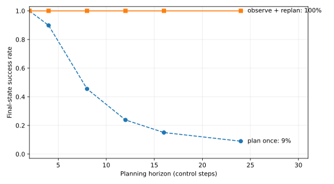

# World Models, VLA, and Embodied Agents [S] {#sec-ch31}

## What you need going in {#sec-ch31-prerequisites}

> **Assumed:** neural-network fundamentals, probability, basic Python and NumPy, and production-backend concepts such as latency, tests, and typed interfaces.
>
> **From earlier chapters:** [Chapter 17](17-tool-harness-engineering.qmd#sec-ch17-approval) owns approval mechanics; [Chapter 22](22-evaluation.qmd#sec-ch22-graders) owns statistical evaluation and graders; [Chapter 23](23-training-agents-rl.qmd#sec-ch23) owns reinforcement-learning machinery; [Chapter 24](24-agent-security.qmd#sec-ch24-policy) owns protocol-neutral action security; [Chapter 29](29-multimodal-vlm-documents-gui.qmd#sec-ch29-grounding) explains vision-language perception and pixel grounding. Appendix A supplies search and planning algorithms such as MCTS, MPC, PDDL, and behavior trees.
>
> **Not required:** robotics coursework, camera calibration, control-theory derivations, a GPU, a robot, or experience with a robotics simulator. The default build is deterministic and CPU-only. The live adapter is optional and preserves the same policy and grader contracts.

## Contents {#sec-ch31-contents}

- [Acting is different: the closed physical loop](#sec-ch31-loop)
- [What you will build](#sec-ch31-artifact)
- [Spatial representations in brief: the demoted bridge](#sec-ch31-spatial)
- [VLA I: actions as tokens](#sec-ch31-vla-actions)
- [VLA II: data engines and the 2026 frontier](#sec-ch31-vla-data)
- [World models and interactive generation](#sec-ch31-world-models)
- [The decision-grade criterion](#sec-ch31-decision-grade)
- [Simulators as infrastructure](#sec-ch31-simulators)
- [Embodied agents in simulation](#sec-ch31-agents)
- [Embodied and physical-world safety](#sec-ch31-safety)
- [Open problems](#sec-ch31-open)
- [Build](#sec-ch31-build)
- [What endures, what changes](#sec-ch31-endures)
- [Exercises](#sec-ch31-exercises)
- [Notes and sources](#sec-ch31-sources)

## Acting is different: the closed physical loop {#sec-ch31-loop}

A warehouse agent sees a box near the edge of a table and receives “place the box on pallet three.” It predicts a grasp, the controller moves the arm, and the box shifts under first contact. The next camera frame is no longer an independent query: it is evidence about a world the agent just changed. If the gripper closes two centimeters early, every later observation begins from the wrong state. A fluent recovery message cannot put a crushed package back together.

An **embodied agent** closes a computational policy around a physical or simulated environment. Its actions have geometry, timing, dynamics, and consequences. A GUI agent also observes after acting, but software state usually offers stronger schemas, transactional boundaries, and rollback. Physical state is only partially observed, contact can be discontinuous, sensor readings arrive late, and many effects are not reversible. Embodiment is therefore not “computer use with a robot tool.” It is agency inside a feedback system.

Let $x_t$ be the unobserved physical state at time $t$, $o_t$ the sensor observation, $a_t$ the commanded action, and $w_t$ process noise. A compact closed-loop model is

$$
x_{t+1}=f(x_t,a_t,w_t),
\qquad
o_t=h(x_t)+v_t,
\qquad
a_t=\pi(o_{\le t},g),
$$

where $f$ is the environment dynamics, $h$ is the observation process, $v_t$ is sensor noise, $pi$ is the policy, and $g$ is the goal expressed in language or a structured task. The policy sees observations, not $x_t$. Its action changes the distribution of the next observation. That coupling is the central fact of the chapter.

Control frequency turns model latency into part of behavior. If a controller must produce an action every $T_c$ seconds, then a useful latency budget is

$$
T_{\text{sense}}+T_{\text{policy}}+T_{\text{gate}}+T_{\text{transport}}
\le T_c-T_{\text{control}},
$$

where the terms cover observation acquisition, policy inference, deterministic authorization, communication, and low-level control. A two-second forward pass cannot directly sustain a five-hertz loop, even when its predictions are accurate. Practical systems respond with action chunks, asynchronous inference, a fast local policy beneath a slow semantic planner, or a narrower model. Each choice changes how long the system runs without fresh semantic feedback.

@fig-ch31-loop separates probabilistic proposals from authority and actuation.

```{mermaid}
%%| label: fig-ch31-loop
%%| fig-cap: "What changes when an agent action moves mass? The policy proposes; deterministic software and the low-level controller retain authority across the actuation boundary."
%%| fig-alt: "A language goal and sensor observations enter a probabilistic policy. Its proposed action passes through a deterministic safety governor and low-level controller before reaching the physical world. The changed world returns sensor observations and an independent final-state grader reads simulator or environment state."
flowchart LR
    GOAL["Language goal"] -->|task| POLICY(["VLA / policy<br/>probabilistic proposal"])
    SENSOR["Sensors<br/>image · depth · proprioception"] -->|observation| POLICY
    POLICY -->|proposed action| GATE{"Deterministic<br/>safety governor"}
    GATE -->|authorized target| CTRL["Low-level controller<br/>limits · tracking · reflexes"]
    GATE -->|deny / request approval| STOP["Hold safe state"]
    CTRL -->|torque / velocity / position| WORLD["Physical world<br/>irreversible effects"]
    WORLD -->|changed state| SENSOR
    WORLD -.->|state predicate| GRADE["Independent grader"]
```

The invariant is that model output never acquires actuator authority merely by being well formed. A typed proposal passes through limits, freshness checks, a safety governor, and a controller that can reject or override it. The grader observes the resulting state independently of the policy’s explanation.

The new engineering burden is not only prediction quality. It includes reference frames, action normalization, stale observations, contact limits, watchdogs, control rate, and a safe state when any component disappears. A useful embodied architecture makes those boundaries explicit before choosing a larger model.

## What you will build {#sec-ch31-artifact}

::: {.callout-tip}
### The chapter artifact

You will build [`embodied_eval.py`](../code/ch31/embodied_eval.py), one progressive evaluation harness. It first quantizes a seven-dimensional robot action and verifies its round trip. It then injects a controlled dynamics error, compares an open-loop plan with observe-and-replan control, and generates the chapter’s quantitative figure. A reversibility gate intercepts large displacement or predicted-contact-force proposals. Finally, one runner drives ten language-conditioned episodes and trusts only the environment’s final-state predicate.

The default `MiniTabletopEnv` and `ScriptedPolicy` are an offline **harness test**, not evidence about VLA capability. An optional `SimplerEnvAdapter` and OpenVLA-compatible policy exercise the same protocol with rendered observations and a real checkpoint. The separation lets CPU-only readers test grading, latency, termination, and gates without presenting a scripted solution as learned intelligence.
:::

## Spatial representations in brief: the demoted bridge {#sec-ch31-spatial}

An image supplies appearance from one viewpoint. Manipulation also needs spatial questions: where is the object relative to the gripper, which surfaces are free, what blocks a path, and what changed after contact? A **spatial representation** stores enough geometry or relational structure to answer some of those questions. No single representation is best for rendering, collision checking, semantics, editing, and learning at once.

A **point cloud** is a set of sampled 3D positions, often carrying color or learned features. Depth cameras and lidar produce point-like measurements directly. A policy can query local neighborhoods, segment objects, estimate poses, and find candidate surfaces, but raw point sets do not define watertight surfaces or free space. Point-based encoders such as PointNet made unordered sets usable by neural networks; production stacks still have to manage frames, density, occlusion, and calibration.

A **mesh** joins vertices with faces to approximate surfaces. Meshes support rendering, collision checking, signed-distance fields, and conventional motion-planning geometry. They are explicit and editable, but reconstructing clean topology from noisy observations can be expensive. A **voxel grid** discretizes space into cells and makes occupancy queries direct; its memory grows cubically with resolution unless sparse structures are used.

A **neural radiance field** (NeRF) learns a continuous function that maps 3D position and viewing direction to density and color. It is optimized for novel-view synthesis, not for declaring collision-free space. **3D Gaussian splatting** represents a scene with anisotropic Gaussian primitives whose projected contributions render efficiently. Splats can preserve appearance and support fast view synthesis, but a visually convincing primitive cloud is not automatically a contact surface. “Renders well” and “safe to plan through” are different contracts.

Learned **spatial tokens** compress image, depth, pose, or scene features into vectors that a transformer can attend to. A **scene graph** instead exposes entities and relations such as `mug ON table`, `drawer PART_OF cabinet`, or `gripper NEAR handle`. Tokens preserve flexible learned information; graphs provide queryable symbolic handles. Both depend on the evidence used to create them and can retain stale or incorrect relations after the world changes.

| Representation | Stores | Natural query | Strength for an agent | Residual limitation |
|---|---|---|---|---|
| point cloud | sampled 3D positions and features | neighbors, clusters, pose | direct sensor geometry; flexible learned encoders | incomplete surfaces, variable density, frame errors |
| mesh or signed-distance field | explicit surface or distance-to-surface | collision, clearance, contact | geometric planning and physics interfaces | reconstruction and topology maintenance |
| sparse voxels | occupancy or features in cells | occupied/free region | simple spatial lookup and fusion | resolution–memory tradeoff |
| NeRF / radiance field | view-conditioned density and color | render a novel camera view | view synthesis and appearance completion | geometry is indirect; dynamics absent |
| 3D Gaussian splats | position, covariance, opacity, appearance | fast differentiable rendering | rapid scene reconstruction and view synthesis | no inherent collision or rigid-body semantics |
| spatial tokens | learned compressed scene features | attention or similarity | end-to-end policy input | hard to audit; metric geometry may be implicit |
| scene graph | entities, attributes, relations | symbolic relation and task query | planning handles and persistent identity | depends on perception updates; weak for contact geometry |

Multi-view geometry triangulates structure from camera motion or multiple calibrated cameras. Depth estimation predicts distance from one or more images. Both are observation mechanisms, not guarantees of object permanence or dynamics. A robot usually combines visual features with proprioception—its own joint positions and velocities—and may add force, tactile, audio, or language signals.

This bridge is intentionally short. Building NeRFs, deriving camera models, and optimizing meshes are separate subjects. The decision needed here is narrower: identify what a representation makes queryable, what transformations bind it to the action frame, and which safety-critical facts remain outside it. Splats do not replace meshes any more than a photograph replaces a collision model.

## VLA I: actions as tokens {#sec-ch31-vla-actions}

A **vision-language-action model** (VLA) maps visual observations and a language instruction to robot actions. The simplest transformer-compatible interface converts each action dimension into discrete symbols. Instead of ending its sequence with words, the model emits values that a caller decodes into translation, rotation, and gripper commands.

Suppose action coordinate $a_j$ is normalized to $[-1,1]$ and divided into $K$ bins. One tokenizer is

$$
q_j=\operatorname{round}\!\left(\frac{a_j+1}{2}(K-1)\right),
\qquad
\hat a_j=2\frac{q_j}{K-1}-1.
$$

Here $q_j\in\{0,\ldots,K-1\}$ is the token and $\hat a_j$ is its decoded value. Rounding gives a worst-case scalar error of at most $(K-1)^{-1}$, provided the input was normalized correctly. With 256 bins, that bound is about 0.00392. It is only a codec bound. A mismatched action convention—meters versus normalized deltas, quaternion versus Euler rotation, open-positive versus close-positive gripper—can be orders of magnitude worse while still producing valid tokens.

The artifact starts with the codec:

```python
# artifact: embodied_eval.py — §31.3 adds: seven-dimensional action codec
ACTION_DIM = 7

def tokenize_action(action: np.ndarray, bins: int = 256) -> np.ndarray:
    action = np.asarray(action, dtype=float)
    if action.shape != (ACTION_DIM,) or bins < 2 or np.any(np.abs(action) > 1):
        raise ValueError("expected seven values in [-1, 1] and at least two bins")
    return np.rint((action + 1.0) * (bins - 1) / 2.0).astype(int)

def detokenize_action(tokens: np.ndarray, bins: int = 256) -> np.ndarray:
    tokens = np.asarray(tokens, dtype=int)
    if tokens.shape != (ACTION_DIM,) or bins < 2 or np.any(
        (tokens < 0) | (tokens >= bins)
    ):
        raise ValueError("tokens must be seven integers inside the vocabulary")
    return 2.0 * tokens / (bins - 1) - 1.0
```

Run the supplied tests and the sample vector `[-0.9, ..., 0.9]` produces tokens `[13, 51, 89, 127, 166, 204, 242]` with maximum round-trip error `0.0039215686`. That assertion detects a broken codec. It does not test whether a learned policy selected the right action.

| Artifact state | New code | Invariant now verified |
|---|---:|---|
| `embodied_eval.py` after the action codec | 22 lines | seven normalized coordinates round-trip within half a bin |

Action representations create a systems tradeoff. Per-dimension discrete tokens reuse language-model machinery and yield an ordinary next-token loss. They also lengthen the output and can impose sequential decoding latency. An **action chunk** predicts several future control targets at once, amortizing the slow model call, but runs longer without observation feedback. A continuous action expert can generate a whole chunk jointly. Frequency-domain tokenization compresses smooth trajectories by transforming a chunk, retaining important coefficients, and tokenizing those coefficients rather than every raw timestep.

| Action interface | Model output | Main benefit | Main engineering risk |
|---|---|---|---|
| per-dimension discrete tokens | one token per coordinate or timestep | simple shared vocabulary and likelihood training | quantization and autoregressive latency |
| chunked action tokens | several future actions | amortized inference | stale open-loop execution inside the chunk |
| continuous action head or expert | joint real-valued trajectory | smooth high-rate chunks | separate objective, sampler, and normalization contract |
| hierarchical skills | named skill plus parameters | long-horizon abstraction and inspectability | skill coverage and handoff failures |

RT-1 demonstrated tokenized robot actions at scale, and RT-2 placed action symbols in a vision-language model’s output vocabulary so web-scale semantic learning could transfer into control. FAST later showed why tokenizing raw high-frequency trajectories is inefficient and compressed action sequences in a frequency basis. These papers establish interface families, not a universal choice. A mobile base, a dexterous hand, and a bimanual arm have different bandwidth and error tolerance.

The durable rule is to version the action contract with the checkpoint. Log coordinate order, frame, units, bounds, normalization statistics, chunk length, execution rate, and gripper convention. A VLA whose model card is detached from its action normalizer is not deployable, even if its weights load.

## VLA II: data engines and the 2026 frontier {#sec-ch31-vla-data}

Robot data is expensive because a useful example couples perception, instruction, embodiment state, action, and outcome over time. A web image can be copied; a manipulation trajectory requires hardware or simulation, calibration, an operator or policy, and recovery after failure. The central scaling problem is therefore a **data engine**: a repeatable process for collecting, filtering, labeling, replaying, and improving trajectories.

Teleoperation records human actions through joysticks, motion capture, bilateral devices, or other interfaces. It supplies competent behavior but imports operator delay, embodiment-specific conventions, and coverage bias. Autonomous collection can target uncertainty or failures, yet unsafe exploration is unacceptable on real hardware. Simulation supplies parallelism and exact state but introduces a reality gap. Production programs mix demonstrations, scripted or planned data, simulation, autonomous rollouts, intervention corrections, and post-deployment hard cases.

Cross-embodiment data attempts to learn shared structure from robots with different cameras, arms, action spaces, and datasets. Open X-Embodiment assembled many such datasets and paired them with a transformer model to study transfer. The hard part is not concatenation. Each record needs a common semantic layer while preserving embodiment-specific action adapters and calibration. Language can name the task; it does not automatically align coordinate frames or gripper dynamics.

Let dataset $D_e$ come from embodiment $e$ with native action $u_t^{(e)}$. A shared policy can emit a latent or canonical action $z_t$, then use adapter $A_e$:

$$
z_t\sim\pi_\theta(o_{\le t},g,e),
\qquad
u_t^{(e)}=A_e(z_t;\phi_e).
$$

The parameters $\phi_e$ encode embodiment calibration or learned translation. Transfer succeeds only if $z_t$ preserves task-relevant behavior and $A_e$ is valid on the new platform. Dataset scale does not erase this interface.

OpenVLA provided an open-weight reference that couples a visual encoder, language backbone, and tokenized action output. Its value to an engineering curriculum is inspectability: processor, prompt, action prediction call, and normalization key are visible. The chapter’s optional adapter uses that shape. It does not promise that the default checkpoint matches every simulator task; checkpoint, task, camera transform, and action statistics must be compatible.

Large programs increasingly separate a slow semantic model from a fast action expert. The slower path interprets language and scene context; the faster path emits a temporally dense control chunk. This resembles a hierarchical controller, with learned components at both levels. It reduces the rate demanded of the largest model but creates a handoff contract: the fast path must know when its condition is stale, and the slow path must not assume a chunk completed as imagined.

::: {.callout-note .landscape-2026}
### Landscape 2026 (dated)

**Verify live: 2026-07-19. Appendix C owns the version roster and deployment profiles.** The current Physical Intelligence research index lists **π0.7**, announced 2026-04-16, superseding earlier roster entries; its [official research site](https://www.pi.website/) is the source to recheck. NVIDIA’s official [GR00T page](https://developer.nvidia.com/isaac/gr00t) currently describes GR00T N1.7 as early access. DeepMind’s current robotics line includes [Gemini Robotics 1.5](https://deepmind.google/blog/gemini-robotics-15-brings-ai-agents-into-the-physical-world/), while Figure describes [Helix](https://www.figure.ai/news/helix) as a vision-language-action system.

The world-model roster is moving just as quickly. Official or primary pages describe [Genie 3](https://deepmind.google/blog/genie-3-a-new-frontier-for-world-models/), [Dreamer 4](https://arxiv.org/abs/2509.24527), [V-JEPA 2](https://ai.meta.com/research/publications/v-jepa-2-self-supervised-video-models-enable-understanding-prediction-and-planning/), and NVIDIA’s [Cosmos world foundation models](https://developer.nvidia.com/blog/?p=94577). These names do not define the mechanism and may age out.

A [2026 audit of robot-policy benchmarks](https://arxiv.org/abs/2606.04233) reports that fixed scores can fail diagnostics for shortcuts, statistical significance, overfitting, and dependence on the chosen dataset. Treat that as a current warning, not a timeless ranking: recheck the paper and active benchmark repositories before making a deployment claim. Videos, benchmark leaders, checkpoint availability, licenses, action rates, and hardware requirements are volatile.
:::

The stable lesson survives deletion of that box. A VLA program needs a data flywheel tied to failures, a versioned observation/action contract, cross-embodiment adapters, and evaluation outside the collection distribution. A frontier name is not a substitute for any of them.

## World models and interactive generation {#sec-ch31-world-models}

A VLA can map observation directly to action. A **world model** instead learns how the environment changes, optionally including how actions influence that change. The distinction matters because prediction and control impose different tests. A model may generate plausible futures without preserving the small state differences that reverse the best action.

A useful learned model has at least a state representation, transition, and observation relation. With encoder $E$, latent state $z_t=E(o_{\le t})$, learned transition $p_\theta$, and decoder or predictor $p_\theta(o_{t+1}\mid z_{t+1})$,

$$
z_{t+1}\sim p_\theta(z_{t+1}\mid z_t,a_t),
\qquad
\hat o_{t+1}\sim p_\theta(o_{t+1}\mid z_{t+1}).
$$

For control, the first relation is load-bearing: it must be action-conditioned. A video predictor trained only to extrapolate likely footage can learn that a hand usually moves toward a cup, yet fail to answer what happens if the gripper approaches from an unusual direction. A world model used for planning needs counterfactual action coverage, not merely temporal continuity.

Predicting pixels forces the model to spend capacity on texture, lighting, and camera details. Predicting in a learned representation can ignore nuisance variation and preserve objects, motion, and task state. That is the motivation behind joint-embedding predictive approaches. The tradeoff is observability: a photorealistic error is visible to a human, while a latent error requires probes tied to decisions. Latent prediction is not automatically more causal because its images are absent.

World models serve several roles:

- **representation learning:** predicting future structure can train features useful to a policy;
- **imagination:** a policy or planner can evaluate candidate action sequences without executing each one in the real environment;
- **data generation:** interactive generation can create trajectories, initial states, and rare variations for training or testing;
- **state estimation:** temporal prediction can combine incomplete observations into a belief about hidden state;
- **failure rehearsal:** a simulator or learned model can expose a controller to unsafe or expensive scenarios before hardware trials.

The Dreamer line learns a compact dynamics model and improves a policy using imagined latent trajectories. Genie-class work treats videos as data for action-controllable interactive environments. Physics-oriented foundation-model programs train large generative models on videos and simulations. These lines can converge technically, but their evidence should stay separate: an environment that is fun to interact with, a latent model that improves a policy, and a dynamics model suitable for safety decisions are three claims.

Long futures are not single answers. If a block can slide left or right after contact, averaging the alternatives can predict a physically impossible blur. A probabilistic model should represent several plausible outcomes and expose uncertainty. Planning then needs a risk rule: expected reward, worst credible outcome, a chance constraint, or escalation. Sampling many sharp videos does not help when their probabilities are uncalibrated or when every sample misses the real failure mode.

A learned world model also differs from a conventional simulator. A simulator encodes explicit integration, collision, material, and sensor assumptions; a learned model estimates regularities from data. Both are models and both can be wrong. The simulator often offers exact hidden state and deterministic replay, while the learned model may cover messy appearance more easily. Hybrid systems can render learned variations around explicit physics, fit residual dynamics, or learn observation models while keeping contact and limits deterministic.

Photorealism is therefore a weak proxy. Ask which state variables survive, which interventions were present in training, how uncertainty changes off distribution, and whether plans selected through the model succeed in an independent environment. Those questions lead to the chapter’s main criterion.

## The decision-grade criterion {#sec-ch31-decision-grade}

A learned model is **decision-grade for a task distribution** when using it to choose actions produces acceptably reliable decisions under the deployment horizon, feedback rate, cost asymmetry, and shift—not when its predictions look convincing. Decision-grade is a property of model, planner, task, operating envelope, and fallback together. It is never a permanent badge on a checkpoint.

One-step accuracy can compound. Suppose the true deterministic transition is $x_{t+1}=f(x_t,a_t)$ and the learned transition is $\hat x_{t+1}=\hat f(\hat x_t,a_t)$. Assume the model’s one-step error is bounded by $\epsilon$ on relevant state-action pairs,

$$
\|f(x,a)-\hat f(x,a)\|\le\epsilon,
$$

and $f$ is $L$-Lipschitz in state, meaning changing the state by $e$ changes the next state by at most $Le$. For the same open-loop action sequence, the state error satisfies

$$
e_{t+1}\le Le_t+\epsilon.
$$

Starting at $e_0=0$, the horizon-$H$ bound is

$$
e_H\le\epsilon\sum_{i=0}^{H-1}L^i
=
\begin{cases}
H\epsilon, & L=1,\\
\epsilon\dfrac{L^H-1}{L-1}, & L\ne1.
\end{cases}
$$

When $L>1$, small errors can grow geometrically. Contact transitions can be even less forgiving because a millimeter changes whether contact occurred at all. The bound is conservative, but it explains why a low average next-frame error says little about a long open-loop plan.

The decision itself supplies a sharper test. Let a planner compare candidate actions with true returns $Q(a)$ and model-estimated returns $\hat Q(a)$. Let $a^*$ be the best true action and $a^{(2)}$ the runner-up, with decision margin

$$
m=Q(a^*)-Q(a^{(2)}).
$$

If $|\hat Q(a)-Q(a)|<m/2$ for every candidate, the model preserves the winner. If the margin is tiny, a visually minor error can flip the action. If the margin is large, a rough model may be sufficient. Evaluation should therefore include action-ranking regret and downstream success, not only reconstruction loss.

**Receding-horizon control** limits how long prediction error runs unchecked. At each observation, optimize a length-$H$ action sequence under the model, execute only the first action or short prefix, observe again, and repeat. In model-predictive-control notation,

$$
a_{t:t+H-1}^{*}
=\arg\max_{a_{t:t+H-1}}
\mathbb{E}_{\hat f}\!\left[
\sum_{k=0}^{H-1}\gamma^k r(\hat x_{t+k},a_{t+k})
+\gamma^H V(\hat x_{t+H})
\right],
$$

where $r$ is reward, $V$ is a terminal value estimate, and $\gamma$ discounts distant outcomes. Appendix A owns MPC and search algorithms; this chapter uses only the feedback principle. Replanning replaces accumulated prediction with a real observation, but it cannot fix an observation that hides the relevant state, a model wrong on every local transition, or latency longer than the correction window.

The artifact deliberately breaks an open-loop controller with an episode-constant dynamics bias. Its smallest experiment is:

```python
# artifact: embodied_eval.py — §31.6 adds: biased-dynamics horizon experiment
def endpoint_success(horizon: int, model_error: float, replan: bool,
                     *, trials: int = 512, tolerance: float = 0.10,
                     seed: int = 7) -> float:
    biases = np.random.default_rng(seed).normal(
        0.0, model_error, size=(trials, 2)
    )
    goal = np.array([1.0, 0.5])
    successes = 0
    for bias in biases:
        state = np.zeros(2)
        fixed_action = goal / horizon
        for step in range(horizon):
            remaining = horizon - step
            action = ((goal - state) / remaining
                      if replan else fixed_action)
            state = state + action + bias
        successes += np.linalg.norm(state - goal) <= tolerance
    return round(successes / trials, 4)
```

Each of 512 trials samples a two-dimensional bias with standard deviation `0.012`; success means ending within `0.10` of the goal. The open-loop policy divides the planned displacement evenly, so the same unmodeled bias accumulates at every step. The replanning policy observes state and recomputes the remaining displacement. The plotted values are generated by the same file used in the tests.

{#fig-ch31-horizon fig-cap="What does fresh feedback buy against a small repeated model error? Synthetic 2D dynamics, 512 seeded trials per point, error standard deviation 0.012 and goal tolerance 0.10."}

At 24 steps the trace is concrete: plan-once success is `0.0898`; observe-and-replan success is `1.0000`. The deliberate negative test raises model error to `0.20`; even replanning then succeeds in fewer than 20 percent of trials. Replanning removed accumulation in this constructed error model. It did not make an inadequate local model adequate.

| Artifact state | New code | Invariant now verified |
|---|---:|---|
| `embodied_eval.py` after dynamics experiment | 38 lines | the plotted horizon curve is seeded, final-state graded, and reproducible |

The toy has no inertia, obstacles, partial observation, action delay, or contact. Its purpose is to isolate horizon. In production, construct tests across policy-induced state distributions and measure calibration of rollout uncertainty, action-ranking regret, constraint violation, and task success. Hold out object layouts, visual textures, dynamics parameters, camera poses, instructions, and perturbations rather than splitting nearby frames from the same trajectory.

Two failures deserve names. **Causal confusion** occurs when a policy or predictor relies on a correlated cue rather than the cause needed under intervention—for example, braking because brake lights appear in demonstrations instead of because the obstacle demands it. **Sim-to-real shift** occurs when observations or dynamics differ between simulation and hardware. Domain randomization varies textures, lighting, masses, friction, delays, and other parameters during training, forcing robustness across a broader distribution. It is a blunt instrument: randomizing the wrong factors can waste capacity, while omitting one consequential factor leaves a brittle policy.

A decision-grade review asks five questions:

1. What action decision and operating envelope does the model support?
2. Over what open-loop horizon and control latency is its error acceptable?
3. Does uncertainty rise on held-out interventions and shifted scenes?
4. Does an independent environment confirm action ranking, constraints, and final-state success?
5. What deterministic limit or safe fallback catches states outside the evidence?

“Beautiful rollouts” answers none of them. The criterion is earned by intervention and downstream decision evidence.

## Simulators as infrastructure {#sec-ch31-simulators}

A robotics simulator is not merely a visualization. It is a controlled environment with reset, step, observation, action, and state-query interfaces. Used well, it is simultaneously a data generator, an evaluation instrument, and a rare-event factory. Those jobs demand different configuration and governance.

For training, simulation offers parallel trajectories, procedural layouts, privileged labels, and failures without hardware damage. For evaluation, deterministic seeds and resettable initial states make policy comparisons repeatable. For rare events, an experiment can deliberately over-sample slippery surfaces, occlusions, dropped frames, collisions, or near-limit states. The resulting training distribution need not match production prevalence; the evaluator must restore deployment weights when reporting an expected product metric.

@fig-ch31-simulator shows where truth and policy beliefs diverge.

```{mermaid}
%%| label: fig-ch31-simulator
%%| fig-cap: "Where does ground truth live in a simulator-backed data and evaluation system? The policy sees observations; generators and graders read privileged state through separate interfaces."
%%| fig-alt: "A versioned task specification and scenario distribution configure a simulator. Its privileged state feeds a trajectory generator, a final-state grader, and a rare-event sampler. A sensor renderer alone feeds the policy, whose actions return through an action adapter. Reports combine grader results with scenario and version identifiers."
flowchart TB
    SPEC["Versioned task spec<br/>goal · initial-state distribution"] -->|configure| SIM[("Simulator state<br/>physics · objects · contacts")]
    RARE["Rare-event sampler<br/>shift parameters"] -->|scenario seed| SIM
    SIM -->|rendered observation only| POLICY(["Policy under test"])
    POLICY -->|normalized action| ADAPTER["Action adapter<br/>frame · units · limits"]
    ADAPTER -->|simulator command| SIM
    SIM -->|privileged trajectory| DATA["Training data generator"]
    SIM -->|final state| GRADER["Deterministic task predicate"]
    GRADER -->|success · violations| REPORT[("Evaluation report<br/>versions · seeds · latency")]
    RARE -->|scenario identity| REPORT
```

The grader, not the policy, owns success. A policy can say “done,” emit a plausible explanation, or receive a shaped reward while the object remains outside the target. Simulator state can test the actual predicate. For task $i$ with terminal state $s_T$, a simple suite score is

$$
\widehat S=\frac{1}{N}\sum_{i=1}^{N}\mathbf{1}[G_i(s_T)=\text{true}],
$$

where $G_i$ is a versioned final-state predicate and $N$ is the number of episodes. A robust report also records timeouts, safety violations, steps, latency, and scenario slices. Chapter 22 owns confidence intervals, sample sizing, judge calibration, and trajectory-aware grading; this chapter owns the environment seam.

Final-state grading is often stronger than watching a video. It can measure containment, pose tolerance, drawer state, spill amount, contacts, and forbidden-region entry exactly. It can also be gamed: a policy may knock an object into a tray and satisfy the terminal predicate while violating the intended method. Add trajectory constraints only when they express a real requirement, and report them separately from task completion.

Fidelity is a budget, not a monotonic virtue. High-resolution rendering helps visual transfer but reduces throughput. Detailed contact can matter for insertion while adding little to room navigation. A digital twin may mirror a particular facility but drift as equipment, camera calibration, or material changes. For every simulator feature, connect cost to a failure it is intended to predict.

A useful environment contract includes observation schema and transforms, action schema and control rate, reset semantics, termination versus truncation, success predicate, privileged-state boundary, deterministic seed behavior, scenario/version identifiers, and resource cleanup. Tests should reset twice with the same seed, replay a known action sequence, perturb one named parameter, and confirm that policy outputs cannot mutate grader state except through `step`.

Simulation does not certify hardware behavior. Before transfer, replay recorded sensor streams, use shadow mode where proposals are logged but not executed, validate low-level limits, stage speed and workspace, and compare simulator residuals with hardware telemetry. The simulator earns trust by predicting specific failures within an envelope, not by looking like the lab.

## Embodied agents in simulation {#sec-ch31-agents}

An embodied agent rarely asks one monolithic policy to solve an hour-long task. It composes semantic planning with grounded skills. A **skill** is a closed-loop behavior such as navigate, grasp, open, or place, with typed preconditions and outcomes. The language model can propose a sequence; an affordance or value model estimates whether each skill is feasible in the observed state.

SayCan made this split explicit. In a simplified form, choose skill $k$ by combining a language relevance score with a grounded success score:

$$
k^*=\arg\max_k
p_{\text{language}}(k\mid g,h_t)
\;p_{\text{affordance}}(\text{success}\mid o_t,k),
$$

where $g$ is the instruction and $h_t$ is execution history. The first factor asks whether a skill advances the request; the second asks whether the robot can perform it now. The affordance model is trained grounding, not decorative prompting. After execution, the system observes again and updates the available skills.

Code as Policies exposed robot capabilities as a programming interface and asked a language model to compose policy code. This can express geometry, loops, and reusable subroutines more compactly than selecting one tool call at a time. It also crosses a code-execution boundary: generated code needs an allowlisted API, resource limits, static checks, sandboxing, and the same effect policy as any other agent-written program. Chapter 17 owns that execution and approval machinery.

Habitat-class simulators emphasize embodied navigation and rearrangement. Manipulation suites emphasize tabletop objects, contact, and continual-learning task families. Their task vocabularies differ, but the agent loop should not: obtain the language instruction and typed observation, propose through a policy interface, apply a deterministic gate, step the environment, and grade state independently.

Multiple embodied agents add assignment, communication, collision avoidance, and shared-world consistency. Chapter 20’s coordination economics still apply. A second robot is useful only if parallel progress exceeds communication and interference costs; “multi-agent” is not a remedy for one policy that cannot ground a grasp.

The production implication is to keep semantic planning, skill feasibility, action generation, and low-level control separately observable. A successful episode should reveal which layer selected each action and which layer stopped it. Without that trace, an aggregate score cannot distinguish perception failure from an infeasible plan or a controller limit.

## Embodied and physical-world safety {#sec-ch31-safety}

Physical safety starts below the model. Certified controllers, workspace limits, collision monitors, speed and force limits, watchdogs, and emergency stops must continue to function when inference stalls or emits nonsense. The model supplies intent or targets inside that envelope. It does not replace the envelope.

The chapter artifact adds one narrow **reversibility gate**. It computes proposed Cartesian displacement and a synthetic predicted contact force. If either exceeds its configured envelope, execution requires a callback. With no callback or a denial, the episode stops before calling `env.step`.

```python
# artifact: embodied_eval.py — §31.9 adds: reversible-action authorization seam
class ReversibilityGate:
    def __init__(self, max_displacement: float = 0.18,
                 max_force_n: float = 8.0):
        self.max_displacement = max_displacement
        self.max_force_n = max_force_n
        self.hits = 0

    def authorize(self, action, approve=None) -> bool:
        displacement = float(np.linalg.norm(action[:3]))
        predicted_force = float(max(0.0, -action[6]) * 12.0)
        reasons = tuple(name for name, failed in (
            ("displacement", displacement > self.max_displacement),
            ("predicted contact force", predicted_force > self.max_force_n),
        ) if failed)
        if not reasons:
            return True
        self.hits += 1
        proposal = {"action": tuple(map(float, action)),
                    "displacement": displacement,
                    "predicted_force_n": predicted_force,
                    "reasons": reasons}
        return bool(approve and approve(proposal))
```

| Artifact state | New code | Invariant now verified |
|---|---:|---|
| `embodied_eval.py` after the reversibility gate | 25 lines | a gated action cannot reach the environment without an explicit approval result |

The state machine matters more than the threshold values.

```{mermaid}
%%| label: fig-ch31-safety
%%| fig-cap: "Which transitions may give a model proposal physical authority? Only fresh, in-envelope actions execute directly; gated actions require approval, and any denial, timeout, stale observation, or watchdog event leads to a safe hold."
%%| fig-alt: "A state diagram begins at observed, moves to proposed, then either executes if fresh and within limits, waits for approval if gated, or enters safe hold on denial, timeout, stale input, or watchdog. Executed actions return to observed."
stateDiagram-v2
    [*] --> Observed
    Observed --> Proposed: policy output + observation ID
    Proposed --> Executing: fresh and inside envelope
    Proposed --> AwaitingApproval: gated action class
    Proposed --> SafeHold: stale / invalid / watchdog
    AwaitingApproval --> Executing: approval binds exact proposal
    AwaitingApproval --> SafeHold: deny / timeout / changed state
    Executing --> Observed: new sensor frame
    Executing --> SafeHold: controller fault / e-stop
    SafeHold --> Observed: authorized reset
```

Approval binds the exact action, observation identity, and expiry. A fresh camera frame invalidates an old approval because the world may have changed between review and execution; Chapter 17 owns this time-of-check/time-of-use mechanic. Chapter 24 owns hostile perception and policy enforcement. Textures, signs, projected patterns, or compromised sensors can influence a vision policy, so the gate must consume independently checked state where possible. Chapter 27 owns alerts, incident response, and human queues; a physical emergency stop is the last local interruption path, not an observability feature.

The gate in this artifact is not a certified force predictor. Its gripper-coordinate heuristic demonstrates placement of the seam and produces a deliberate negative test. Real limits come from robot-specific dynamics, tool geometry, payload, safety-rated sensing, and validated controllers. Human approval also does not make an unsafe trajectory safe: reviewers may lack depth, timing, or contact information. Approval is one control for consequential intent, nested inside hard physical constraints.

## Open problems {#sec-ch31-open}

Embodied learning remains constrained by data diversity, hardware time, and expensive failure recovery. Cross-embodiment datasets help, but action semantics and camera geometry still differ. Dexterous and contact-rich tasks amplify small state errors. Tactile sensing, deformable objects, liquids, tool use, and long-horizon recovery expose variables poorly represented in image-heavy datasets.

Evaluation has no single universal task set. Fixed suites invite overfitting, and a final-state average can hide catastrophic slices. Better evaluation needs procedural tasks, held-out interventions, hardware correlation, trajectory constraints, uncertainty checks, and versioned distributions. The statistical tools belong to Chapter 22; the frontier problem is obtaining environments whose grades predict deployment.

World models and direct VLA policies may converge: a policy can contain implicit predictive state, while a world model can share its representation and action expert with a policy. The architectural label matters less than the evidence. Does the system represent counterfactual consequences, detect when it is outside its envelope, correct with feedback, and reduce real decision regret?

## Build {#sec-ch31-build}

The integrated build drives a language-conditioned tabletop task, records every policy call, and grades the terminal environment state. Start with the deterministic lane from the `newbook` directory:

```bash
python code/ch31/embodied_eval.py --episodes 10 --gate --approve-gated \
  --plot assets/figures/ch31-horizon.svg
python -m pytest -q tests/test_ch31_embodied_eval.py
```

The episode core stays below forty lines and is shared by both backends:

```python
# artifact: embodied_eval.py — build adds: closed-loop episode and state grader
def run_episode(env, policy, seed, *, gate=None, approve=None,
                max_steps=50):
    obs = env.reset(seed)
    latencies, success, termination = [], False, "step_limit"
    for step in range(1, max_steps + 1):
        started = time.perf_counter()
        action = np.asarray(policy.act(obs, env.instruction), dtype=float)
        latencies.append(time.perf_counter() - started)
        if gate and not gate.authorize(action, approve):
            termination = "gate_denied"
            break
        obs, done, success = env.step(action)
        if done:
            termination = ("environment_success" if success
                           else "environment_terminal")
            break
    return {"success": success, "steps": step, "termination": termination,
            "action_latency_ms": [round(x * 1000, 4) for x in latencies]}
```

On the shipped seeded harness, the ten scripted episodes all satisfy the environment predicate in a mean 11.4 steps. The contact gate is hit ten times and approved ten times. The codec error is `0.0039215686`; at horizon 24 the synthetic open-loop and replanned rates are `0.0898` and `1.0`. These results verify plumbing and deliberate failure behavior. They are not a learned-policy baseline.

For the live lane, pin a compatible simulator checkout, policy checkpoint, processor, and action-normalization key, then provide them explicitly:

```bash
python code/ch31/embodied_eval.py --backend simpler --episodes 10 \
  --task "$TASK" --checkpoint "$CHECKPOINT" --unnorm-key "$UNNORM_KEY" \
  --gate --approve-gated
```

The adapter obtains the environment’s language instruction and rendered agent-view image, sends them through an OpenVLA-compatible `predict_action` call, and passes the decoded seven-dimensional action to the same runner. Before interpreting results, inspect image orientation, camera selection, coordinate frame, action scale, gripper convention, and reset seed. A model can fail every episode because one adapter convention is wrong.

Report all ten episode rows, aggregate success, mean steps, p50 and p95 policy latency, termination reasons, and gate hits. Compare with the scripted harness only to diagnose environment and grader wiring; do not present it as a fair capability competitor. Preserve simulator, task, checkpoint, processor, dependency, and hardware versions with the run. If the live checkpoint fails or is too slow for the desired control rate, that result is evidence about the complete deployment configuration.

| Artifact state | New code | Invariant now verified |
|---|---:|---|
| complete `embodied_eval.py` | 214 nonblank lines | toy and live adapters share policy, gate, latency, termination, and final-state grading contracts |

## What endures, what changes {#sec-ch31-endures}

The enduring ideas are the closed physical loop, versioned observation/action contracts, independent environment grading, horizon-dependent model error, receding feedback, decision margins, deterministic safety envelopes, and explicit safe states. A learned model is decision-grade only for a stated task distribution and control configuration.

Model rosters, checkpoint formats, benchmark leaders, simulator APIs, licenses, claimed action rates, and accelerator requirements will change. Those details belong in the dated Landscape box and Appendix C. Replacing every named model should not alter the chapter’s interfaces or tests.

## Exercises {#sec-ch31-exercises}

1. Sweep model error $\epsilon$ in the horizon experiment. Find where receding-horizon success drops below 80 percent, then explain why fresh state cannot compensate for the final local error.

2. Extend the action tokenizer to variable bin counts. Plot maximum and mean quantization error against bins, then relate the sequence-length and smooth-trajectory limits to frequency-domain action tokenization.

3. Swap the scripted policy for an OpenVLA-compatible checkpoint on three simulator tasks. Report final-state success, termination reasons, gate hits, and per-action latency with every adapter convention pinned.

4. Construct a policy that passes final-state grading by accident, such as knocking the object into the target. Add one trajectory-aware predicate, measure its cost, and state which product requirement justifies it.

5. Perturb the object-pose distribution in the runner and measure the success cliff. Write a Chapter 22-style evaluation note that distinguishes the sampling distribution from expected deployment prevalence.

6. Apply a controlled texture patch to rendered observations, measure policy degradation, and map each proposed defense to the perception, policy, or controller boundary owned by Chapter 24.

7. In a design review, argue for or against using a video-generation world model to plan warehouse picking. Apply the decision-grade criterion and name the intervention, uncertainty, hardware-correlation, and failure-slice evidence you would require.

## Notes and sources {#sec-ch31-sources}

Actions-as-tokens and cross-domain transfer follow [RT-1](https://arxiv.org/abs/2212.06817) and [RT-2](https://arxiv.org/abs/2307.15818). Cross-embodiment data follows [Open X-Embodiment](https://robotics-transformer-x.github.io/); the open adapter shape follows the [OpenVLA project](https://openvla.github.io/) and [repository](https://github.com/openvla/openvla). Frequency-domain action tokenization follows [FAST](https://arxiv.org/abs/2501.09747).

The spatial bridge points to [PointNet](https://arxiv.org/abs/1612.00593), [NeRF](https://arxiv.org/abs/2003.08934), [3D Gaussian Splatting](https://arxiv.org/abs/2308.04079), and [3D scene graphs](https://arxiv.org/abs/1910.02527). Simulator and embodied-agent sources include [LIBERO](https://arxiv.org/abs/2306.03310), [SimplerEnv](https://github.com/simpler-env/SimplerEnv), [Habitat 2.0](https://arxiv.org/abs/2106.14405), [SayCan](https://say-can.github.io/), and [Code as Policies](https://arxiv.org/abs/2209.07753). Sim-to-real vocabulary follows [domain randomization](https://arxiv.org/abs/1703.06907) and [Causal Confusion in Imitation Learning](https://arxiv.org/abs/1905.11979). Current frontier links remain confined to the dated Landscape box.
