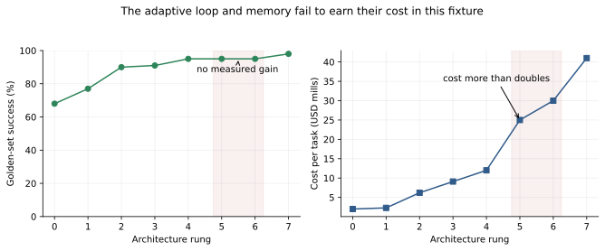

# Capstone: From One Model Call to a Defended Deployment [F] {#sec-ch32}

## What you need going in

> **Assumed:** the full Route A spine, or Route B through Chapter 31; production-backend fundamentals; and willingness to measure a system you expect to simplify.
>
> **From earlier chapters:** [Chapter 16](16-agent-anatomy.qmd#sec-ch16) supplied the adaptive loop, [Chapter 17](17-tool-harness-engineering.qmd#sec-ch17) the gated harness, [Chapter 18](18-memory-experiential-learning.qmd#sec-ch18) memory policy, [Chapter 22](22-evaluation.qmd#sec-ch22) the evaluation contract, [Chapter 24](24-agent-security.qmd#sec-ch24) threat modeling, and Chapters [26](26-production-platform.qmd#sec-ch26)–[28](28-products-people-organizations.qmd#sec-ch28) the production, operations, and organizational controls. This chapter assembles them; it does not teach replacements.
>
> **Not required:** adding every capability in the book. A justified rejection or a smaller defended system is a successful capstone outcome.

## Contents

- [Earn complexity with evidence](#sec-ch32-argument)
- [What you will build](#sec-ch32-artifact)
- [Write one contract and measure seven axes](#sec-ch32-scorecard)
- [Climb from one call to one read-only tool](#sec-ch32-lower-rungs)
- [Add workflow, adaptation, memory, and writes only when earned](#sec-ch32-upper-rungs)
- [Ablate before you celebrate](#sec-ch32-ablation)
- [Make the artifact packet part of the system](#sec-ch32-packet)
- [Three design studies expose different load-bearing controls](#sec-ch32-studies)
- [Inherit an unfamiliar system and run the failure game](#sec-ch32-failure-game)
- [Close with a postmortem and an oral defense](#sec-ch32-defense)
- [Build](#sec-ch32-build)
- [What endures, what changes](#sec-ch32-endures)
- [Exercises](#sec-ch32-exercises)
- [Notes and sources](#sec-ch32-sources)

## Earn complexity with evidence {#sec-ch32-argument}

A support team wants an assistant that classifies internal tickets and drafts a routing note. The first design review produces a maximal architecture: permission-aware retrieval, persistent memory, an adaptive agent loop, four tools, a planner/critic pair, ticket writes, human approvals, and a durable workflow engine. Six weeks later the team learns that a single schema-enforced model call classifies most tickets, retrieval fixes the product-name cases, and a three-step deterministic workflow handles the rest. Memory contributes no measurable success. The adaptive loop doubles cost and creates timeouts. The critic mostly agrees with the planner.

Nothing in the maximal stack was individually absurd. The failure was adding capabilities before defining evidence that could justify them.

The capstone's thesis is:

> Start with the smallest system that can be evaluated. Add one capability at a time. Keep it only when measured benefit exceeds its reliability, latency, cost, energy, security, and operator burden.

This is not minimalism as taste. It is experimental system design. Complex mechanisms can be exactly right for open-ended coding, research, or operations. The point is that the task—not the category “agent”—must earn them.

The chapter uses three assessment devices:

1. an **eight-rung complexity ladder** that moves from one call to human-gated writes;
2. a **failure game** in which another team inherits the system and injects ten realistic faults;
3. an **oral defense** that connects scope, arithmetic, controls, residual risk, and deliberate omissions.

The single reference artifact, [`readiness_ledger.py`](../code/ch32/readiness_ledger.py), measures architecture; it does not implement agent capabilities. Each rung imports or wires the artifact taught in its owning chapter. This prevents the capstone from becoming a zoo of inferior second implementations.

The default use case is an internal support agent. It receives a ticket, classifies intent and urgency, retrieves permission-filtered internal documentation, may look up service status, drafts a response, and—only after an exact approval—writes a note back to the ticket. The final success predicate includes correct classification, grounded response, policy compliance, exact write state, and absence of forbidden disclosure.

| Rung | Capability added | Artifact reused | Headline risk added |
|---:|---|---|---|
| 0 | one model call | Chapter 12 API client | unstructured, ungrounded output |
| 1 | schema-constrained output | Chapter 12 response contract | schema-valid can still be semantically wrong |
| 2 | retrieval | Chapter 14 RAG pipeline | indirect injection and cross-tenant leakage |
| 3 | one read-only tool | Chapter 17 harness | external dependency and credential boundary |
| 4 | deterministic workflow | Chapter 17 workflow wiring | more partial states and retries |
| 5 | adaptive loop | Chapter 16 loop | unbounded paths and denial of wallet |
| 6 | persistent memory | Chapter 18 store | poisoned state that crosses sessions |
| 7 | human-gated write | Chapters 17 and 26 gate/ledger | real-world effect and approval fatigue |

The ladder is not a maturity model. A rung is not “better” because its number is larger. Many products should stop at rung 1, 2, or 4. A rung may also be skipped or decomposed: a human-gated write can sit behind a deterministic workflow without persistent memory. The ordered experiment makes marginal changes legible; the final architecture follows evidence rather than the numbering.

The [Building Effective Agents](https://www.anthropic.com/engineering/building-effective-agents) engineering note similarly recommends starting with simple, composable patterns and distinguishing predetermined workflows from model-directed agents. The principle is durable even as frameworks change: complexity is a liability until a contract demonstrates its benefit.

## What you will build {#sec-ch32-artifact}

::: {.callout-tip}
### The capstone artifact

You will run an offline readiness review. [`readiness_ledger.py`](../code/ch32/readiness_ledger.py) records eight comparable rung reports across seven axes, flags capability additions that do not earn their marginal cost, and aggregates a ten-injection failure game. [`render_ladder.py`](../code/ch32/render_ladder.py) generates the decision plot from the same measurements. Seven focused tests turn the most important review claims into executable assertions.
:::

## Write one contract and measure seven axes {#sec-ch32-scorecard}

Measurement begins before rung 0. Otherwise each new capability changes both the system and the definition of success.

An **evaluation contract** fixes the unit of evaluation, population, golden examples, final-state predicate, policy predicate, budgets, slices, retry policy, judge calibration, and release rule. Chapter 22 owns the statistical details. Here, the contract's job is comparability: every rung sees the same tasks and is scored by the same rules.

For the support agent, one sample contains a tenant, user permissions, ticket text, immutable knowledge snapshot, dependency state, expected classification, permitted evidence, allowed action set, and final database state. A trial passes only when all required predicates pass. A polite answer with the wrong ticket write fails. A correct answer that cited a document the user could not access fails. A refusal on an ordinary supported task fails availability. This prevents one metric from laundering another.

The ledger measures seven axes.

**1. Task-and-policy success.** The numerator counts trials that reach the correct final state while satisfying every declared policy. Report slice-level confidence intervals in a real evaluation. The fixture uses 100 deterministic trials per rung to keep the chapter arithmetic transparent.

**2. Reliability across repetition.** A system with per-trial success probability $p$ has an independence-model probability $p^k$ of succeeding on all $k$ repeated attempts. This **pass-to-the-$k$** quantity, written $\operatorname{pass}^k$, is not a substitute for empirical repeated trials—the independence assumption may be false—but it makes inconsistency visible. At $p=0.95$, $\operatorname{pass}^4$ is

$$
0.95^4\approx0.8145.
$$

A seemingly strong 95 percent single-run result can imply only about 81 percent success across four required independent uses.

**3. Latency.** Measure task completion p50 and p95, plus user-visible time to first useful output when relevant. Do not compare a streaming first token at one rung with final-state completion at another.

**4. Cost per task.** Use the unsampled usage ledger from Chapter 26. Include model retries, retrieval, tools, judge calls, failed attempts, and human review allocation. Cost per API call is not cost per accepted task.

**5. Energy estimate.** The fixture carries an illustrative joules-per-task estimate so design discussions cannot pretend computation is free. It is explicitly an estimate, not metering. A production report records the estimation method, utilization assumptions, hardware boundary, uncertainty range, and whether network/storage are included. Chapter 28 owns organizational energy accounting.

**6. Attack surface.** Do not assign an intuition score such as “security: 7/10.” Enumerate edges: untrusted content to model instructions, model to external reads, orchestrator to credentials, model to loop budget, tool output to subsequent instructions, untrusted content to persistent state, memory to future sessions, and model to external effects. A checklist count is crude, but every increment names something threat modeling must address.

**7. Operator burden.** Count approvals and escalations per 100 tasks, queue wait, handle time, after-hours pages, and reversal work. The fixture's compact burden is approvals plus escalations. Production review keeps the components separate because an approval and an incident page cost people differently.

The artifact stores measurements with units and derives success, $\operatorname{pass}^4$, and operator burden:

```python
# artifact: readiness_ledger.py — §32.2 adds: comparable rung report
@dataclass(frozen=True)
class RungReport:
    rung: int
    capability: str
    trials: int
    successes: int
    p95_latency_ms: int
    cost_per_task_usd: float
    energy_joules_est: float
    attack_edges: int
    approvals_per_100: float
    escalations_per_100: float

    @property
    def task_success(self) -> float:
        return self.successes / self.trials

    def pass_pow_k(self, repeats: int = 4) -> float:
        return self.task_success**repeats

    @property
    def operator_burden(self) -> float:
        return self.approvals_per_100 + self.escalations_per_100
```

| Artifact state | New code shown | Invariant now verified |
|---|---:|---|
| `readiness_ledger.py` after the scorecard | 24 lines | every rung reports the same units and predicates |

The class rejects successes above trials and negative latency, cost, energy, edge counts, or operator burden. Validation cannot make the measurements true, but it stops malformed evidence from entering the review.

::: {.callout-note .landscape-2026}
### Landscape 2026: evaluation and security taxonomies

**Checked 2026-07-19. Verify live:** the [Inspect AI scoring documentation](https://inspect.aisi.org.uk/scoring.html), current release API, and [OWASP Agentic Security Initiative](https://genai.owasp.org/initiatives/agentic-security-initiative/) before wiring CI or copying threat labels. Inspect remains the taught evaluation harness for this book; its log, scorer, and aggregation interfaces can evolve. OWASP's current 2026 agentic taxonomy is useful review input, not a replacement for a system-specific data-flow and authority map. The seven-axis contract is tool-neutral.
:::

## Climb from one call to one read-only tool {#sec-ch32-lower-rungs}

The lower half of the ladder answers a practical question: how much value comes from constraining and grounding a model before granting adaptive control?

### Rung 0: one model call

Send the ticket and a concise behavior specification to one model. Ask for classification and a draft. This baseline is not a straw person. It establishes the model's direct capability, latency, and cost, and it often solves more of the workload than a design team expects.

The default fixture passes 68 of 100 trials at p95 latency 470 ms and variable cost \$0.0020 per task. Its main failures are inconsistent formatting, unsupported factual claims, and missing permission context. The point is not to ship it; it is to learn what the model can do without infrastructure.

### Rung 1: structured output

Add a schema with fields for intent, urgency, draft, cited source IDs, abstention reason, and proposed next action. Validate types and allowed enum values. Task success rises to 77 percent for a small latency/cost change, largely because downstream parsing stops failing and missing fields are explicit.

Schema validity is not semantic correctness. A model can place the wrong amount into a perfectly typed number field. The golden-set predicate still checks meaning and policy. Rung 1 earns its keep because the measured gain is nine percentage points and it creates an enforceable boundary for later stages.

### Rung 2: permission-aware retrieval

Retrieve tenant- and user-authorized documents before semantic ranking, then give the model small evidence passages with stable source identities. Success rises to 90 percent because product details and current procedures enter context.

The gain carries a security edge: untrusted document content now reaches the model. Retrieval is read-only with respect to the knowledge source, but it can influence later actions. Cross-tenant leakage and indirect prompt injection enter the threat model before any write tool exists. The readiness ledger increments attack surface even while quality improves.

### Rung 3: one read-only tool

Add a service-status lookup behind the Chapter 17 harness. The model proposes a typed call; deterministic code validates tenant, service ID, timeout, and response size. Success rises only from 90 to 91 percent, cost rises from \$0.0062 to \$0.0091, and another trust edge appears.

The ledger flags this rung for ablation because its one-point gain is below the predeclared 1.5-point marginal threshold. That is a candidate decision, not an automatic deletion. The status lookup may serve a rare high-severity slice that aggregate success understates. The review inspects slice value and task requirements, reruns without the tool, and either keeps it with evidence or writes a rejection record.

At every rung, record the change as wiring—not a copied implementation:

```python
# artifact: readiness_ledger.py — §32.3 adds: lower-rung evidence records
for capability, run_system in (
    ("model call", run_one_call),
    ("structured output", run_schema_call),
    ("retrieval", run_acl_retrieval),
    ("one read-only tool", run_status_workflow),
):
    outcomes = evaluator.run(run_system, golden_set)
    ledger.record(measure(capability, outcomes, usage_ledger))
```

These names describe companion-repository adapters. The executable chapter fixture directly supplies deterministic `RungReport` rows, so it needs no model key. In a real capstone, the evaluator owns test execution and the usage ledger owns cost. The readiness ledger only joins measurements.

The lower-rung result is already instructive: schema and retrieval deliver most of the gain. A tool whose demo looks impressive may not change the acceptance contract enough to justify a new dependency and authority edge.

## Add workflow, adaptation, memory, and writes only when earned {#sec-ch32-upper-rungs}

The upper half separates predetermined sequencing from model-selected sequencing, then tests whether persistence and external effects are load-bearing.

### Rung 4: deterministic workflow

Wire a fixed path: validate ticket → classify → retrieve → optionally query status under a code predicate → draft → policy check → abstain or return. The model fills bounded steps; application code chooses the graph. Success reaches 95 percent, p95 latency 930 ms, and cost \$0.012 per task. The four-point gain earns the workflow.

The mechanism adds partial states and retries, but their number is bounded. A failed retrieval cannot cause the model to invent a new tool. A fixed policy check always runs. For this support task, determinism buys reliability and inspectability without preventing model reasoning inside individual steps.

### Rung 5: adaptive loop

Replace code-selected branching with the Chapter 16 loop. The model may decide to retrieve again, call status, revise its plan, or stop. This helps open-ended tasks when the next useful observation cannot be enumerated cheaply.

In the fixture, success remains 95 percent. p95 rises to 1,410 ms, cost more than doubles to \$0.025, two attack edges appear, and operator burden doubles from 6 to 12 interventions per 100 tasks. The loop has failed to earn its place for this workload.

The negative result is not a claim that agent loops are bad. It means the fixed support workflow already covers the observed decision paths. A different use case—debugging an unfamiliar repository, for example—may show a large adaptive gain. Capability value is conditional on task distribution.

### Rung 6: persistent memory

Add cross-session user and case memory with write policy, deletion propagation, provenance, and retrieval. Success still remains 95 percent. Cost, latency, attack surface, and operator burden increase again.

The default tickets are independently resolvable from authorized records, so memory contributes no load-bearing information. It also creates a poisoned-state path across future sessions. The correct result is to cut persistent memory, not to invent personalization examples after seeing the measurement. If the product later adds a longitudinal task, memory must re-enter through a new contract and deletion test.

### Rung 7: human-gated ticket write

The product requirement now expands: an accepted draft may create an internal ticket note. A typed action proposal includes tenant, ticket ID, note hash, visibility, and idempotency key. A reviewer sees exactly those arguments. At execution time, the harness revalidates identity, permissions, resource version, policy, and approval hash; the durable ledger records one effect.

Success rises to 98 percent because the final-state predicate now includes completed write-back. Cost reaches \$0.041, p95 1,690 ms, and operator burden jumps to 35 interventions per 100 tasks. The write capability earns functional value, but the approval queue becomes the launch constraint. The design must reduce review demand through narrower action scopes, higher-confidence automatic reads, better batching, or a smaller rollout—not through a global “approve all” habit.

The gate between rungs is the heart of the method.

```{mermaid}
%%| label: fig-ch32-ladder
%%| fig-cap: "What gates each capability addition?"
%%| fig-alt: "An eight-rung ladder starts with one call and adds schema, retrieval, a read tool, deterministic workflow, adaptive loop, memory, and human-gated writes. Every transition passes through measure, compare, justify, and either keep or ablate."
flowchart LR
    R0["0 One call"] --> G1{"Measure<br/>compare<br/>justify"}
    G1 -->|"earned"| R1["1 Schema"]
    G1 -->|"not earned"| A1["Ablate / stop"]
    R1 --> G2{"Measure<br/>compare<br/>justify"}
    G2 -->|"earned"| R2["2 Retrieval"]
    G2 -->|"not earned"| A2["Ablate / stop"]
    R2 --> R3["3 Read tool"] --> R4["4 Workflow"]
    R4 --> G5{"Measure<br/>compare<br/>justify"}
    G5 -->|"earned"| R5["5 Adaptive loop"]
    G5 -->|"not earned"| CUT5["Cut loop"]
    R5 --> R6["6 Memory"] --> R7["7 Gated write"]
    R3 -. "same gate at every arrow" .-> G5
    R6 -. "final system may skip rungs" .-> R7
```

The final design is not rung 7 as drawn. It is schema + permission-aware retrieval + deterministic workflow + a narrowly scoped gated write. The adaptive loop and persistent memory are absent. The status tool remains conditional on a high-severity slice review. A successful capstone ends smaller than its maximal experiment.

## Ablate before you celebrate {#sec-ch32-ablation}

Marginal rung measurements can still mislead because capabilities interact. An **ablation** removes one layer from the selected system and reruns the unchanged contract. The question is not “does the code still execute?” It is “which scorecard axes move, by how much, on which slices?”

Perform ablations after reaching the maximal experimental stack:

1. remove one capability while holding model, prompts, data snapshot, evaluator, and budgets constant;
2. rerun enough trials for the expected effect size;
3. compare task/policy success, repeated reliability, latency, cost, energy estimate, attack edges, and operator burden;
4. inspect failure clusters instead of only aggregate deltas;
5. keep, modify, or cut the layer in a signed decision record.

The artifact computes comparable deltas:

```python
# artifact: readiness_ledger.py — §32.5 adds: ablation delta
def ablation_delta(full: RungReport, ablated: RungReport) -> dict[str, float]:
    return {
        "success_delta": round(full.task_success - ablated.task_success, 4),
        "cost_saved_usd": round(full.cost_per_task_usd - ablated.cost_per_task_usd, 6),
        "latency_saved_ms": float(full.p95_latency_ms - ablated.p95_latency_ms),
        "attack_edges_removed": float(full.attack_edges - ablated.attack_edges),
        "operator_burden_removed": round(
            full.operator_burden - ablated.operator_burden, 2
        ),
    }
```

| Artifact state | New code shown | Invariant now verified |
|---|---:|---|
| `readiness_ledger.py` after ablation | 11 lines | “remove it” means remeasure every declared axis |

The deterministic fixture shows a plateau at rungs 4–6. The adaptive loop adds no successes, more than doubles cost from the prior rung, raises p95 by 480 ms, adds two threat edges, and doubles operator burden. Memory adds more cost and exposure without changing success.

{#fig-ch32-ablation fig-cap="Which capability additions stop paying? Rungs 0–7 are call, schema, retrieval, read tool, deterministic workflow, adaptive loop, memory, and gated write. Deterministic fixture; costs are illustrative."}

The plot is a decision aid, not an automatic architecture optimizer. A small aggregate gain may be vital to one safety-critical slice. A flat observed result may reflect insufficient power or a flawed test. Conversely, a large capability benchmark gain may not matter to the product. The decision record states the contract, measurement uncertainty, slice effects, operational costs, residual risk, owner, and reevaluation trigger.

A **justified-rejection memo** is a first-class artifact. It names the proposed layer, the claim it was expected to improve, the experiment, the observed deltas, the rejected risks/costs, and the event that would reopen the decision. It prevents the same fashionable component from being reintroduced every quarter without new evidence.

## Make the artifact packet part of the system {#sec-ch32-packet}

Production readiness is not a slide deck created after implementation. The packet is a set of executable and reviewable contracts that the build generated along the way. If a new team cannot reconstruct the system from it, the system is not ready for ownership transfer.

Appendix B provides templates. The capstone fills each with evidence from an owning chapter:

| Artifact | Evidence it contains | Owning discipline | Capstone source |
|---|---|---|---|
| system card | scope, users, exclusions, data, autonomy by action | Chapters 1, 16, 28 | selected rungs and deliberate omissions |
| evaluation contract and report | golden set, predicates, slices, uncertainty, release rule | Chapter 22 | per-rung and ablation runs |
| data/lineage map | sources, tenant filters, transformations, retention, deletion | Chapters 14, 18, 27 | retrieval and memory decisions |
| threat model | assets, trust boundaries, attack paths, controls, residual risk | Chapter 24 | attack-edge enumeration and injections |
| SLO and capacity worksheet | SLIs, objectives, burn policy, concurrency, budgets | Chapters 26–27 | measured latency/cost and rollout size |
| runbook | symptom, detection, triage, safe degradation, recovery, owner | Chapter 27 | failure-game response |
| launch review | acceptance status, risks, owners, rollback, executive decision | Chapter 28 | scorecard and unresolved findings |
| AIMS risk entry | risk, impact, controls, evidence, review cadence | Chapter 28 | selected high-impact residual risk |
| postmortem | impact, timeline, contributing conditions, actions, regression test | Chapter 27 | worst-survived injection |

These artifacts constrain code. The evaluation report links to immutable logs and code versions. The threat model names actual tool and data boundaries. The runbook points to dashboards and reversible actions. The launch review names a person who accepts residual risk. The postmortem action becomes a test. A packet filled with generic adjectives is not evidence.

Treat packet validation as CI where possible. Check that links resolve, owners exist, referenced SLOs have telemetry, every high-severity threat has a disposition, every launch condition has a due date, and model/data/policy versions match the evaluated release. Human judgment remains necessary, but machines can prevent stale identities and missing fields.

The packet also answers the build-versus-buy question without repeating Chapter 26's analysis. A managed dependency still needs an owner, failure mode, data boundary, exit strategy, and verification date. “The provider handles it” is not a control unless a contract and test show exactly what “it” means.

## Three design studies expose different load-bearing controls {#sec-ch32-studies}

The same ladder yields different final systems because workload and authority differ. These compressed studies show how to apply the scorecard without importing a generic “agent architecture.”

### Enterprise support agent

The default system reads internal documentation and writes a ticket note. Its load-bearing mechanism is authorization-aware retrieval: tenant and user ACL filters execute before similarity search, and citations carry source identity. Retrieval delivers a large quality gain but creates the first indirect-injection edge.

Two red-team drills target different axes. A **denial-of-wallet** document tells the model to keep searching until “complete,” exposing loop budgets and cost. An **approval-fatigue** workload floods reviewers with low-value write proposals, exposing operator burden and rubber-stamping. A better model alone solves neither.

This domain earns schema, retrieval, deterministic workflow, and exact gated write-back. It rejects general adaptive looping and persistent memory for the evaluated population. The status tool survives only if the incident slice shows material benefit.

### Long-running coding agent

The coding agent inherits an unfamiliar repository, modifies files, runs tests, and may apply migrations. Here, adaptive observation is likely load-bearing because the next action depends on compiler output, tests, and repository state. The loop earns value that it did not earn in support.

The repository itself is untrusted input. Instructions in configuration, issue text, dependency scripts, generated logs, and tool descriptions can steer the model. Sandboxing the shell does not sandbox the repository's influence over the planner, and a sandbox with network credentials may still leak data.

The key evaluation is final-state grading: tests, security policy, repository diff, migration state, and absence of forbidden files. Transcript elegance is secondary. The [SWE-bench](https://www.swebench.com/SWE-bench/faq/) family illustrates execution-based repository tasks, while 2026 analyses of public benchmark contamination and task flaws reinforce a durable lesson: inspect benchmark construction and keep private product regressions. A leaderboard is not your release gate.

The failure game kills the worker after a schema migration changes one store but before a related code/config update completes. Recovery must detect the intermediate state, avoid replaying destructive work blindly, and either resume or reconcile. The loop's reasoning cannot replace a migration protocol.

### Transactional operations agent

The operations agent updates a payment exception after human approval. Its headline threat is not an incorrect sentence but a stale or duplicated action.

Consider this trace:

1. planner proposes `release_hold(account=A, amount=1500, version=8)` and hashes the normalized action;
2. reviewer approves that hash;
3. another process changes the account to version 9;
4. a queue delivers the approved message twice;
5. the executor revalidates version and approval hash at point of effect;
6. version mismatch blocks the stale proposal before either message causes a release;
7. after a new proposal and approval, both duplicate messages share one idempotency key;
8. the durable ledger records one external effect and returns the same receipt to the duplicate.

@fig-ch32-transaction answers how stale approval and duplicate delivery are contained by different controls.

```{mermaid}
%%| label: fig-ch32-transaction
%%| fig-cap: "Which controls stop stale approval and duplicate delivery?"
%%| fig-alt: "A planner proposes an action bound to resource version 8 and an action hash. A reviewer approves that hash. The resource changes to version 9, so execution revalidation blocks the stale action. A new approved action is delivered twice with one idempotency key, and the ledger permits one effect."
sequenceDiagram
    participant P as Planner
    participant H as Reviewer
    participant Q as Queue
    participant E as Executor
    participant L as Effect ledger
    P->>H: "proposal(version=8, action_hash=h1)"
    H-->>Q: "approve h1"
    Note over E: "resource advances to version 9"
    Q->>E: "h1, version 8"
    E-->>Q: "blocked: stale resource"
    P->>H: "proposal(version=9, action_hash=h2)"
    H-->>Q: "approve h2"
    Q->>E: "deliver h2, idempotency=k9"
    Q->>E: "duplicate h2, idempotency=k9"
    E->>L: "reserve k9"
    L-->>E: "one owner"
    E->>L: "record one effect receipt"
```

Approval binds an exact action in a state context. Idempotency binds retries to one effect. They address different races and both are necessary.

| Study | Headline threat | Deliberate drill | Load-bearing control | Canonical chapter |
|---|---|---|---|---|
| support | unauthorized/injected retrieval | poisoned doc + reviewer flood | ACL before similarity; bounded actions | 15, 24 |
| coding | malicious repo + partial migration | kill after first irreversible step | sandbox boundaries; reconciliation state | 21, 26 |
| operations | stale approval + duplicate message | mutate resource, deliver twice | action-hash/version binding; idempotency ledger | 17, 26 |

## Inherit an unfamiliar system and run the failure game {#sec-ch32-failure-game}

The system's authors know where the bodies are buried. A readiness assessment becomes stronger when another pair inherits only the repository, deployment manifests, dashboards, logs, and artifact packet.

The inheriting pair works in five stages:

1. **reconstruct:** draw components, data lineage, trust boundaries, action authority, state machines, SLOs, and evaluation contract without asking the authors for an architecture lecture;
2. **state steady behavior:** name the user-visible success and safety predicates expected during normal operation;
3. **inject:** introduce one bounded realistic failure at a time with an abort condition and minimized blast radius;
4. **observe:** record detection, containment, recovery, final state, telemetry, and operator steps;
5. **review:** decide launch, limited rollout, remediation hold, or rejection with named owners.

This follows the durable shape of [Chaos Engineering principles](https://principlesofchaos.org/): define measurable steady state, hypothesize it persists, inject a real-world variable, try to disprove the hypothesis, and minimize blast radius. Begin offline or in an isolated tenant. Production experiments require explicit authorization, abort controls, and customer-protection review.

The ten injections cover model, data, runtime, provider, evaluator, tenant, and human-control failures:

| Injection | Detection expected | Containment expected | Recovery evidence |
|---|---|---|---|
| crash after external effect, before receipt | orphan reservation/reconciliation signal | replay cannot create second effect | ledger resolves one receipt |
| stale approval | resource-version mismatch | no handler invocation | new proposal and approval |
| duplicate webhook/message | duplicate-delivery counter | idempotency reservation permits one owner | same receipt returned |
| indirect injection in retrieved document | provenance/policy trace | document text cannot select privileged tool | safe answer or abstention |
| memory-poisoning write | memory-policy rejection | no durable untrusted state | corrected source and deletion propagation |
| provider outage plus illegal fallback | availability and policy alarm | fallback cannot cross region/data/capability rule | approved degradation or queue |
| judge drift past release gate | anchor-set disagreement | release is blocked | recalibrated scorer and rescored logs |
| denial-of-wallet loop | step/token/cost budget signal | bounded termination | partial result or escalation |
| cross-tenant retrieval leak | canary/ACL assertion | unauthorized candidate never reaches ranker/model | index/filter correction and audit |
| half-applied migration | reconciliation invariant | effects remain fenced | resume or compensate to known state |

The executable fixture contains one intentionally weak outcome. Nine failures are detected, all ten are contained, and nine recover. The half-applied migration is contained but not detected or recovered by the inherited runbook. That becomes the postmortem subject and a named regression test.

@fig-ch32-failure-game answers what the assessor does and in what order.

```{mermaid}
%%| label: fig-ch32-failure-game
%%| fig-cap: "How does an unfamiliar team turn inherited artifacts into a launch verdict?"
%%| fig-alt: "The authoring team hands a system and evidence packet to an inheriting team. They reconstruct architecture and steady-state predicates, propose bounded injections and abort conditions, run failures, collect detection-containment-recovery evidence, and bring unresolved risk to a cross-functional launch review."
sequenceDiagram
    participant A as Authoring team
    participant I as Inheriting assessors
    participant S as Isolated system
    participant O as Operators
    participant R as Launch review
    A->>I: "repository + deployment + evidence packet"
    I->>I: "reconstruct lineage, authority, SLO, eval"
    I->>R: "injection plan + abort conditions"
    R-->>I: "authorized bounded scope"
    I->>S: "inject one real-world failure"
    S-->>O: "telemetry / alert / degraded behavior"
    O-->>I: "triage, containment, recovery record"
    I->>I: "grade final state + add regression"
    I->>R: "survival table + unresolved risk"
    R-->>A: "launch / limit / hold / reject"
```

Do not award points for a beautiful incident narrative if final state is unknown. For tool-using systems, state-based evaluation matters. [$\tau$-bench](https://arxiv.org/abs/2406.12045) compares database final state with an annotated goal and introduced $\operatorname{pass}^k$ for repeated reliability. Its specific domains can change; the general lesson is that the transcript is evidence, not the outcome.

Failure-game safety is itself reviewed. Never inject real cross-tenant leakage or financial effects into uncontrolled production. Use seeded canaries, isolated tenants, reversible fixtures, synthetic credentials, and hard abort thresholds. The goal is confidence through realistic bounded evidence, not drama.

## Close with a postmortem and an oral defense {#sec-ch32-defense}

The weakest outcome receives a blameless postmortem. “Blameless” does not mean consequence-free or vague. It means the analysis explains conditions and system incentives instead of stopping at individual error.

For the half-applied migration, the postmortem records:

- user and data impact, including how the containment fence limited it;
- an evidence-linked timeline from change start through discovery;
- the missing state signal and why dashboards did not expose it;
- why the runbook assumed a transaction boundary that did not exist;
- which review, test, or ownership gap allowed the assumption;
- immediate remediation, durable design change, owner, and due date;
- the regression `test_migration_resume_reconciles_state`;
- how the finding changes the launch verdict and packet.

Action items change systems. “Be more careful” and “retrain operators” are weak unless a specific human decision genuinely lacked knowledge. Prefer explicit migration state, resumable steps, reconciliation queries, alerting on age in intermediate states, and a tested recovery command.

The oral defense then asks the team to make the whole architecture legible. A useful review order is:

1. scope, users, non-goals, and autonomy per action;
2. simplest baseline and the evaluation contract;
3. selected architecture and evidence that each layer is load-bearing;
4. data lineage, identity, and authority boundaries;
5. latency, cost, capacity, and operator arithmetic;
6. top threats, failure-game outcomes, and residual risks;
7. rollout, SLOs, alerts, rollback, and ownership;
8. what was deliberately not built and what evidence would change that choice.

A compact tradeoff sentence keeps answers concrete:

> **Choice X costs Y, buys Z, creates risk W, and control V bounds that risk; evidence E decides whether we keep it.**

For example: “Permission-aware retrieval adds 200 ms p95 and about \$0.0039 per task, buys 13 points of golden-set success, creates an indirect-injection edge, and ACL-before-similarity plus tool isolation bounds that edge; poisoned-document tests and slice success justify keeping it.”

The reviewer should be able to interrupt at any layer and ask for evidence. Where is the query that proves one effect? Which metric pages on cross-tenant canary failure? Which test binds approval to action hash? What happens when the preferred model is unavailable in the allowed region? Who accepts the remaining risk? A defense is not a demo; it is a chain from claim to artifact.

The verdict has four honest outcomes: launch, limited rollout, hold for named remediation, or reject. A launch with hidden conditions is worse than a hold. A rejection supported by a clean experiment can save months of operational debt.

## Build {#sec-ch32-build}

The capstone is the integrated build. Use the included deterministic ledger first, then substitute measurements from a chosen system.

From the book root, run:

```bash
python code/ch32/readiness_ledger.py
python -m pytest tests/test_ch32_readiness.py -q
python code/ch32/render_ladder.py --plot assets/figures/ch32-complexity-ladder.svg
```

The fixture produces:

- eight rung reports with task success, $\operatorname{pass}^4$, p95 latency, cost per task, estimated energy, enumerated attack edges, and operator burden;
- candidate decisions that earn schema, retrieval, deterministic workflow, and gated write while flagging the weak read-tool increment, adaptive loop, and memory for ablation;
- a ten-injection survival report with 9 detected, 10 contained, 9 recovered, and one postmortem target;
- seven tests covering measurement validation, repeated reliability, named attack edges, evidence-led cuts, seven-axis ablation, survival aggregation, and incidents becoming regression tests.

For the real capstone:

1. choose one use case and write the contract before implementing beyond a one-call baseline;
2. create at least 100 representative trials plus safety and tenant canaries; use more when the required effect size demands it;
3. climb rungs 0–7 as experiments, importing the canonical chapter artifacts rather than rewriting them;
4. store immutable evaluation logs and unsampled usage records for each rung;
5. run ablations and produce at least one keep, cut, or justified-rejection record;
6. assemble every Appendix B artifact with resolvable evidence;
7. exchange systems with another pair and authorize the bounded failure game;
8. run the cross-functional review, write the worst-outcome postmortem, and defend the verdict.

Your selected system should be strictly smaller than the maximal experimental system. If every rung appears to help, challenge the contract, statistical power, overlapping capability definitions, and confirmation bias. It is possible that a demanding task earns every layer, but that claim requires unusually strong evidence.

Do not optimize the fixture numbers. Replace them. The fixture teaches ledger behavior and review shape; it makes no claim about a particular model or workload. A real report includes confidence, slices, sampled traces, versions, hardware/region, concurrency, and known measurement gaps.

The build is complete when another team can reproduce the measurements, explain the architecture from the packet, contain the injections, and reach a verdict without relying on oral folklore from the authors.

## What endures, what changes {#sec-ch32-endures}

The durable lessons are these:

- define final-state and policy success before choosing an agent architecture;
- compare every capability on benefit and liabilities, not task success alone;
- enumerate attack and authority edges rather than assigning vague security scores;
- measure cost per accepted task and human burden, not just model calls;
- ablate interactions after climbing the ladder;
- let the final system skip capabilities that the maximal experiment did not earn;
- treat system cards, evals, threat models, SLOs, runbooks, and postmortems as linked operational state;
- hand the system to unfamiliar assessors and grade detection, containment, recovery, and final state;
- turn the worst failure into a regression test and an ownership change;
- defend omissions as carefully as additions.

What changes are evaluation harness APIs, security taxonomies, model/provider rosters, prices, energy factors, benchmark health, and regulatory mappings. Their current locations belong in dated boxes and Appendix C. The evidence ladder survives those changes because it asks the same question of every new mechanism: what measurable property did this buy, and what new responsibility did it create?

## Exercises {#sec-ch32-exercises}

1. Add data-residency exposure as an eighth scorecard axis. Define a measurable unit rather than a high/medium/low label, then rerun the fixture decisions and explain which rung changes.

2. Sketch a deep-research variant. Identify the lowest useful rung, expected adaptive-loop value, token/cost budget, source-quality predicate, and stopping rule. Point to Chapters 10 and 26 for serving and build-versus-buy analysis without reproducing them.

3. Sketch a realtime multimodal variant using Chapter 30. Make first-audio p95 and critical-entity repair first-class axes. State which capability the sub-second budget forces you to remove or redesign.

4. Sketch a self-hosted platform variant. Assign each evidence-packet artifact and control to product, platform, security, SRE, and executive risk ownership. Defend every shared boundary with one accountable owner.

5. Take an unfamiliar repository and spend 90 minutes on reconstruction only. Submit component, lineage, authority, state, SLO, and threat maps. Then compare them with the maintainers' packet and log every ambiguity as a readiness defect.

6. Retrieval raises success by two percentage points, doubles cost, and adds an indirect-injection edge. In a design review, defend keep or cut using required effect size, slice value, confidence, threat controls, and an explicit reevaluation trigger.

7. Write a justified-rejection memo for a task where deterministic workflow meets the contract and adaptive loop, memory, and multi-agent coordination do not. Include the experiment that would reopen each decision.

8. Run one authorized failure injection on a local or isolated fixture. Write the blameless postmortem for the worst result, add a named regression test, and show how the result changes the launch packet and verdict.

## Notes and sources {#sec-ch32-sources}

The start-simple argument is grounded in [Building Effective Agents](https://www.anthropic.com/engineering/building-effective-agents). The final-state and repeated-reliability framing draws on [$\tau$-bench](https://arxiv.org/abs/2406.12045). The failure game follows the hypothesis-and-steady-state shape in the [Principles of Chaos Engineering](https://principlesofchaos.org/) and the production-readiness discipline in Google's [SRE launch guidance](https://sre.google/sre-book/reliable-product-launches/).

Use [Inspect AI's official documentation](https://inspect.aisi.org.uk/) for the current taught evaluation harness and the [OWASP Agentic Security Initiative](https://genai.owasp.org/initiatives/agentic-security-initiative/) as one current taxonomy input. Neither substitutes for the contract, system-specific threat model, or private regression set. Appendix B contains the reusable packet and review templates; Appendix C owns dated model, benchmark, protocol, security-taxonomy, and economics pins.
